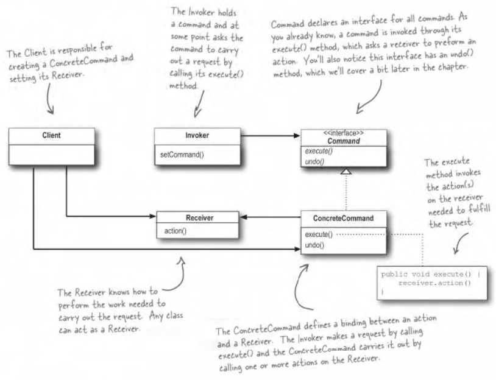

## head first design pattern - Command

老博客搬运计划

https://www.cnblogs.com/aquar/archive/2010/05/10/3451444.html

#### Command Pattern

客户在餐厅点单后，服务员把订单转给厨师，厨师按订单制作饭菜。其中服务员和厨师之间没有依赖关系，厨师根据订单就知道要做什么饭。

1. 客户创建一个命令对象 
2. 客户利用setCommand()将命令对象储存在调用者中 
3. 客户要求调用者执行命令。

**命令模式**：将请求封装成对象，以便使用不同的请求、队列或日志来参数化其他对象。命令模式也支持可撤销的操作。命令模式可以把请求一个行为的对象和执行行为的对象解耦开来。

一个命令对象通过在特定接收者上绑定一组动作来封装一个请求，将动作和接收者包进对象中，这个对象只暴露出一个`execute()`方法，当方法`execute()`调用的时候，接收者在`execute()`中处理对应的请求或动作，对于外部客户不知道里面具体的动作怎么实现。

例如一个遥控器有开和关，对于台灯和电视，都可以实现一个开关命令接口，来做对应的开灯或开电视行为。

命令对象可以将运算块打包(一个接收者和一组动作)，然后将它传来传去，就像是一般的对象一样。调用者可以接受命令当做参数，甚至在运行时动态的进行。

命令可以支持撤销，做法是实现一个`undo()`方法来回到`execute()`被执行前的状态。在命令的接收对象中缓存一个上一次执行的命令对象的拷贝，当需要执行回退时，只需要执行这个缓存命令对象的`undo()`

宏命令是命令的一种简单延伸，允许调用多个命令。可以创建一个命令对象时，将一组命令按顺序传入这个宏命令对象中，宏命令对象依次调用每一个子命令。

命令可以用来实现日志和事务系统。抛给一个线程的所有消息对象都可以看作是命令，他们有序的在消息队列中被执行。服务器的远程调用命令也是如此。

