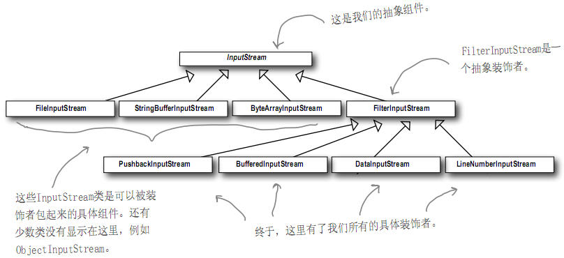

## head first design pattern - Decorator

老博客搬运计划

https://www.cnblogs.com/aquar/archive/2010/05/04/3451442.html

#### Decorator Pattern

利用继承设计子类的行为，是在编译时静态决定的，而且所有的子类都会继承到相同的行为。然而，如果能够利用组合的做法扩展对象的行为，就可以在运行时动态扩展。从而把新的方法，甚至是设计超类时还没有想到的方法加在对象上，同时又不修改原来的代码。

**设计原则**：类应该对扩展开放，对修改关闭。

如果顾客需要Mocha和奶泡深焙咖啡：

1. 取一个深焙咖啡(DarkRoast)对象

2. 以摩卡对象装饰它 

3. 以奶泡装饰它 
4. 调用cost()方法，并依赖委托(delegate)将调料的价钱加上去。

装饰者和被装饰对象有相同的超类型，因为装饰者必须能够取代被装饰者。可以用一个或者多个装饰者包装一个对象。装饰者可以在所委托被装饰者的行为前与/或之后，加上自己的行为，一达到特定的目的。对象可以在任何时候被装饰，因此可以在运行时动态地、不限量地用你喜欢的装饰者来装饰对象。

**装饰者(decorate)模式**：动态的将责任附加到对象上，若要扩展功能，装饰者提供了比集成更有弹性的替代方案。装饰者模式意味着一群装饰者类，这些类用来包装具体组件。

行为来自装饰者和基础组件，或与其他装饰者之间的组合关系。由于使用对象组合，可以把所有饮料(基础组件)和调料（装饰者）更加有弹性的组合与匹配。如果利用继承，那么类的行为只能在编译时静态决定，即不是来自超类就是子类覆盖后的版本，利用组合可以把装饰者在运行时混合着用。

装饰着模式在设计中引入大量的小类，导致别人不容易理解，造成程序的复杂。要求所有的类有一个基类型。

具体问题的实现UML：

Java IO中的类就是装饰者模式

如[LineNumberInputStream[BufferedInputStream[FileInputStream]]], FileInputStream是被装饰的组件，BufferedInputStream是一个具体的装饰者，它加入两种行为（利用缓冲输入来改进性能和一个readline()方法），LineNumberInputStream也是一个具体的装饰者，他加上了计算行数的功能。BufferedInputStream、LineNumberInputStream都扩展自FilterInputStream，它是一个抽象的装饰类。自己也可以扩展装饰类，对Javaio进行装饰。

