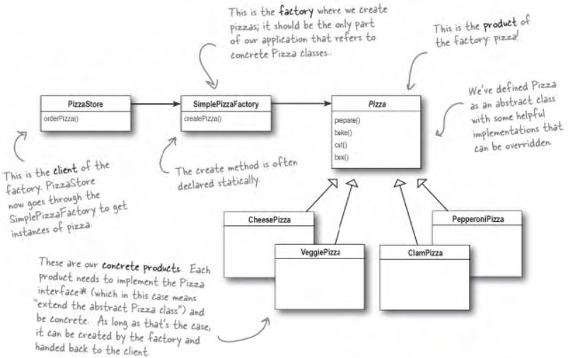
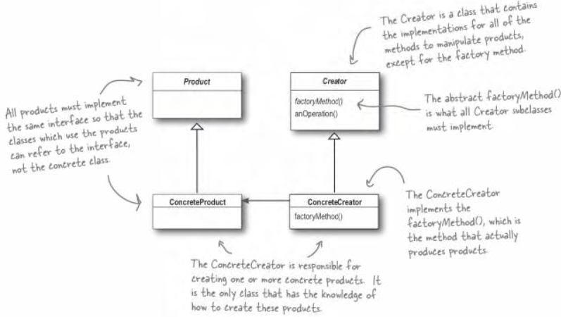
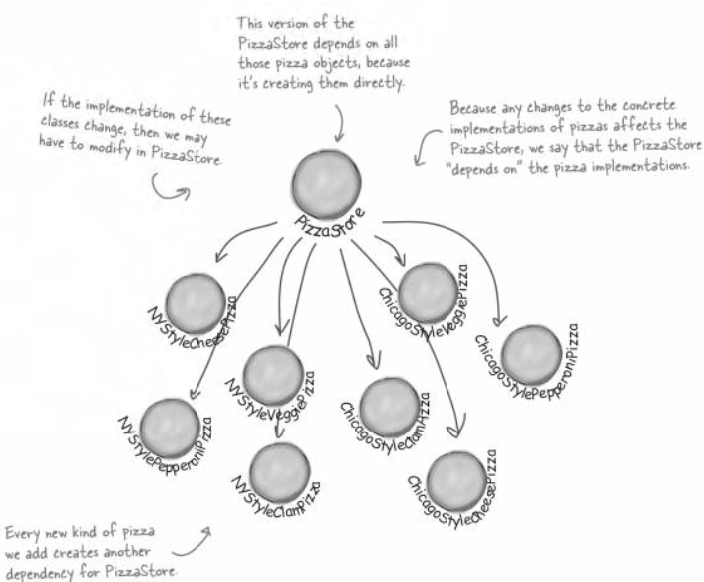
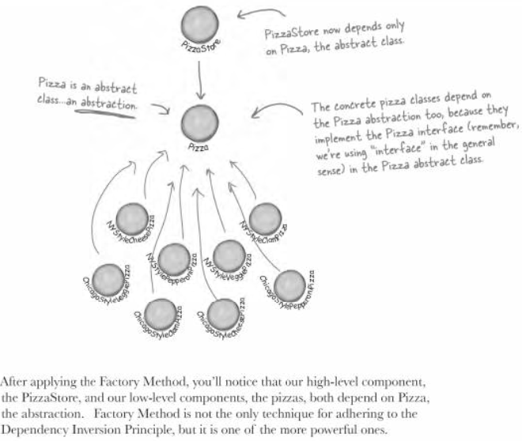
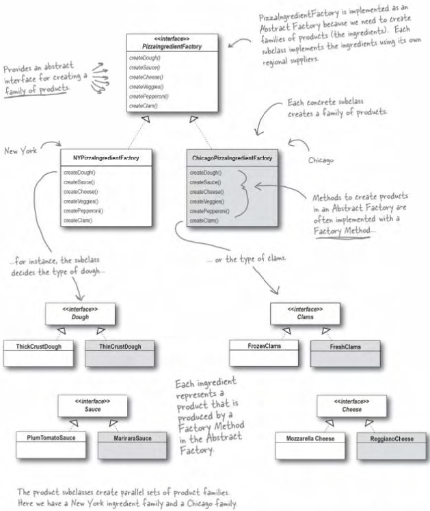

## head first design pattern - Factory

老博客搬运计划

https://www.cnblogs.com/aquar/archive/2010/05/05/3451443.html

#### Factory Pattern

当使用new时，就会想到“具体”，因为代码绑着具体的类，缺乏弹性。例如制作不同的Pizza，它包括先创建不同类型的Pizza对象，再进行烘烤、包装等一些方法，一旦某种Pizza不再需要或需要新类型的Pizza，就要对制作Pizza源代码中创建Pizza对象的部分进行修改，创建新的Pizza类型。

简单工厂模式就是另外建立一个Pizza工厂专门用来创建不同种类的Pizza，制作Pizza的方法中不用负责，他只接受一个创建好的Pizza对象，进行后续制作操作。这样无论以后什么类需要Pizza对象，都可以调用这个工厂来创建，即这个工厂有很多客户，如制作Pizza，Pizza订单，**从而把实例化的代码从客户代码中删除，客户代码中不再有new操作**。

##### 工厂方法模式

当有几个Pizza分店，每个店的制作过程不同，就需要在创建不同Pizza对象的同时，使用每个分店自己的特色。
PizzaStore这个父类中有个orderPizza()方法，在其中createPizza(),bake(),box(),而createPizza()是父类的一个抽象方法，子类来决定创建什么样的Pizza，抽象父类中的orderPizza()方法并不知道哪些实际的具体类参与进来，它由具体的子类的createPizza()来决定。

所有工厂模式用来封装对象的创建。工厂方法模式通过让子类决定该创建的对象是什么，来达到将对象创建的过程封装的目的。客户程序中关于超类的代码就和子类对象创建代码解耦了。
abstract Product factoryMethod(String type)工厂方法是抽象的，所以依赖子类来处理对象的创建，工厂方法必须返回一个产品，超类中定义的方法，通常使用到工厂方法的的返回值。工厂方法将客户(i.e.超类中的代码，如orderPizza())和实际创建具体产品的代码分隔开来。

**工厂方法模式**：定义了一个创建对象的接口，但由子类决定要实例化的类是哪一个。工厂方法让类把实例化推迟到子类。

工厂方法和创建者不一定总是抽象的，可以定义一个默认的工厂方法来产生某些具体的产品，这样，即使创建者没有任何子类，依然可以创建产品。

##### DIP (Dependency Inversion Principle)

**依赖倒置：要依赖抽象，而不能依赖具体类**。

上层组件使用了一些下层组件来定义自己的行为，例如PizzaStore使用了具体的Pizza对象，那么PizzaStore就是上层组件，而具体的Pizza组件对应就是下层组件。

当你直接实例化一个对象时，就是在依赖它的具体类。如果对于Pizza的具体实现的任何改变都会影响到PizzaStore，就说PizzaStore依赖于Pizza的实现。

**倒置**在这里指高层不依赖低层组件，而是依赖于抽象，其实是高层与低层模块都依赖中间的抽象。高层的PizzaStore依赖于Pizza抽象，而低层的具体Pizza类依赖于Pizza抽象。

**实施原则**：

* 变量不可以持有具体的类，
* 不要让类派生自具体的类，
* 不要覆盖基类中已实现的方法。

##### 抽象工厂模式

抽象工厂类提供一个抽象接口，用于创建相关或依赖的产品对象，但不需要明确指定具体产品类。抽象工厂的具体子类必须实现创建产品的接口，用来创建不同种类的产品。客户类在运行时判断自己需要使用那种具体的工厂类从而创建不同类型的产品。

##### 区别

**工厂方法使用继承**：把对象的创建委托给子类，子类实现工厂方法来创建对象。例如每个地区的商店知道自己需要制作什么样的产品，做法可能都不相同。主要用来创建一个产品。

![v [zhe]v](../../uploads/designpattern/factory_method_example.png)

**抽象工厂使用对象组合**：对象的创建被实现在工厂接口所暴露出来的方法中。用来创建一系列不同的产品，例如原材料工厂要创建一系列不同的原材料，而不只是一个原材料。

