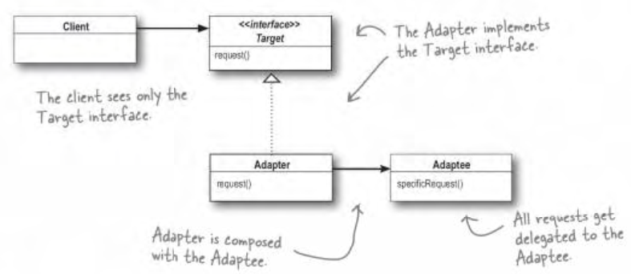
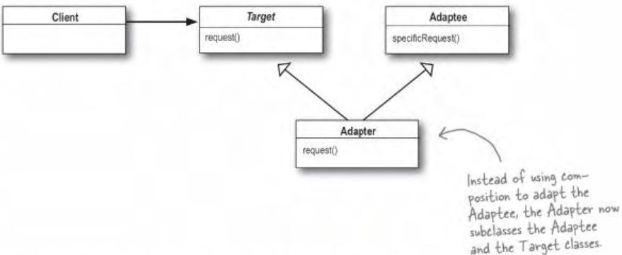
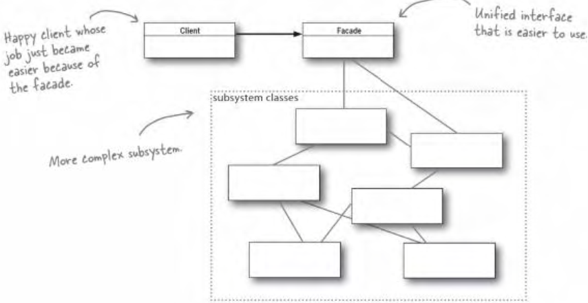

## head first design pattern - Adapter and Facade

老博客搬运计划

https://www.cnblogs.com/aquar/archive/2010/05/12/3451446.html

#### Adapter Pattern

**问题**：

一个信息系统需要获取医院医嘱数据，而不同医院使用的不同厂家医嘱系统，对于这个系统系统如果要获取一个病人今天的医嘱，就需要请求不同厂家的接口。为了让自己的实现统一，需要一个适配器把不同厂家的接口统一。类似日本的电器在中国使用，需要电源适配器。

**解决**：

1.客户通过目标接口调用适配器的方法对适配器发出请求。
2.适配器使用被适配者接口把请求转换成被适配者的一个或多个调用接口
3.客户接收到调用的结果，但并未察觉这一切是适配器在起转换作用。

**适配器模式：**将一个类的接口，转换成客户期望的另一个接口。适配器让原本接口不兼容的类可以合作无间。

* 对象适配器

  使用**组合**的方式，在适配器中再去调用被适配的接口；可以适配Adaptee的所有子类；更灵活；




```java
//实现想要转换成的目标类型接口
public class TurkeyAdapter implements Duck {

  Turkey turkey; //组合被适配者

  public TurkeyAdapter(Turkey turkey) {
    this.turkey = turkey;
  }

  public void quack() {
    turkey.gobble(); //把被适配者的方法进行适配，火鸡的叫声和鸭子相适配
  }

  public void fly() {
    for (int i = 0; i < 5; i++) {
      turkey.fly();
    }
  }
}
```


* 类适配器

  使用**继承**的方式来调用被适配的接口；可以覆盖Adaptee的一些行为，或增加一些功能。




#### Facade Pattern

/fəˈsɑːd/ 外观; (建筑物的)正面，立面; (虚假的)表面，外表;

如果一个做一件事需要调用一个系统中的多个接口，可以把这些接口的调用汇总到一个接口中，这样客户端使用时就使用那个汇总的接口，简化实现。

**外观模式(Facade-Pattern)**：提供一个统一的接口，用来访问子系统中的一群接口。外观定义了一个更高层接口，让子系统更容易被使用。它由子系统组合(has-a)而成，然后工作委托给子系统执行。他不封装接口，他简化客户端的接口调用，它可以解耦客户端和被访问的子系统的一众接口。

可以给一个子系统实现多个不同的facade。




适配器模式的意图是改变接口符合客户的期望，而外观模式的意图是提供子系统的一个简化接口。

```java
public class Facade {

  MallardDuck Mduck;
  WildTurkey Wturkey; //组合所有要用到的子系统

  public void Facade(MallardDuck Mduck, WildTurkey Wturkey) {
    this.Mduck = Mduck;
    this.Wturkey = Wturkey;
  }

  public void fly() {
    Mduck.fly(); //鸭子先飞
    Wturkey.fly(); //火鸡再飞，调用子系统的功能
  }
}
```


#### 设计原则

**最少知识**：减少对象之间的交互，只留下几个密友。不要让太多类耦合在一起。

一个对象中只调用以下方法：

* 对象自己的方法
* 作为参数传进来对象的方法
* 自己内部实例化对象的方法
* 成员对象的方法

不能级联调用获取某个对象的方法，再间接调用获取到的对象的方法，这样依赖的类就多了。例如

```java
public float getTemp() {
    station.getThermometer().getTemperature();
}
```


