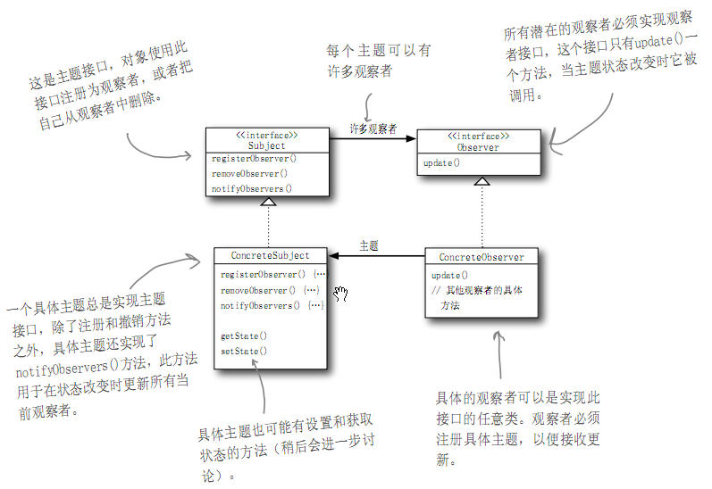
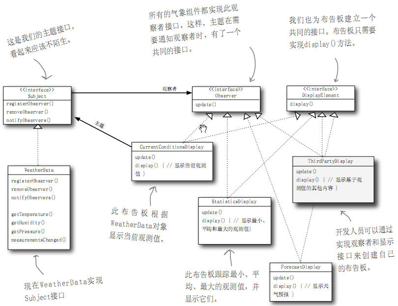
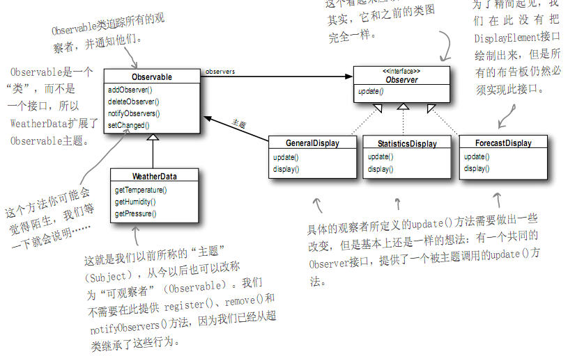

## head first design pattern - Observer

老博客搬运计划

https://www.cnblogs.com/aquar/archive/2010/05/03/3451441.html

#### Observer Pattern

有一些**观察者对象**依赖于**主题对象**，主题对象管理一些数据，并将数据发送给观察者对象，观察者可以添加或删除。就像订阅报纸，每个读者就是一个观察者，可以向报社(主题)订阅报纸，也可以取消订阅(报社就不在给该读者发送报纸)。

**观察者模式**：定义了对象之间的一对多依赖，当一个对象改变状态时，它的所有依赖者都会收到通知并自动更新。主题(可观察者)用一个共同的接口来更新观察者，观察者和可观察者之间用松耦合的方式结合，互不知道对方的具体细节，只是知道接口。这样其他开发者可以采用添加或删除自己另外定义的观察者。

采用“推”或“拉”的方式都可以，一般认为推更正确。

有多个观察者时，不可以依赖特定的通知次序，在JavaBean、RMI、GUI中都用到该模式。

**设计原则**：为了交互对象之间的松耦合设计而努力。一个对象的改变并不影响交互的对象。

当两个对象之间松耦合，它们依然可以交互，但是不太清楚彼此的细节。对于观察者的一切，主题只知道观察者实现了某个接口(observer interface)，主题不知道观察者的具体类是谁，做了些什么等细节。任何时候都可以增加新的观察者，因为主题依赖的是一个实现observer接口的对象的列表。

在Java中内置了观察者模式，只需要实现java.util.Observer观察者接口，然后调用任何Observable对象的addObserver()方法，不想当观察者时，deleteObserver(). 主题在此改称为可观察者，需要继承java.util.Observable类，先调用setChange()方法，标记状态已经改变的事实，通过该方法可以设置在什么条件下才发送数据进行后面的notifObservers()。然后调用notifObservers()or notifyObservers(Object arg). 

无参数的表明需要观察者从被观察者中拉数据，有参数的只是被观察者向观察者推数据。各有优缺点。观察者的update(Observable o, Object arg),第一个参数指明是哪个主题通知他的，第二个参数给出主题推出的数据对象。
java.util.Observable实现了它自己的notifyObservers()方法，**导致通知观察者的次序会不同于自己定义的次序，在通知时需要一次遍历观察者列表中的每个观察者，但是不同的实现，遍历的方式可能会不同**。如果次序很重要的话就会出现错误。可观察者是一个类，而不是一个接口，因此只能设计一个类继承他，如果这个类又想有另一个超类的行为就需要多重继承，但java中不支持多重继承。同时由于它不是一个接口也不能有自己的实现。

Java swing中的ActionListener也是一个观察者的实现，ActionListener倾听可能发生在按钮上的动作。

观察值模式UML：

具体问题的实现UML：

Java中内置的观察者模式：

