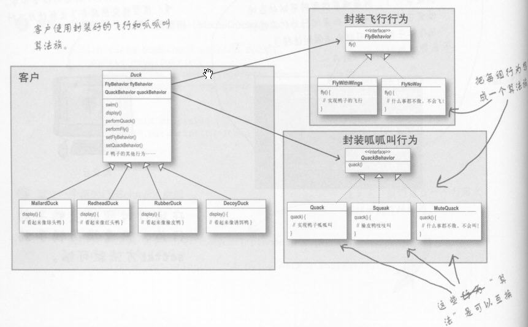

## head first design pattern -Strategy

老博客搬运计划

https://www.cnblogs.com/aquar/archive/2010/04/18/3451473.html

#### Writers

1. Elisabeth Freeman 提倡女性进行计算机工作 beth@wickedlysmart.com
2. Eric Freeman eric@wickedlysmart.com blog:www.ericfreeman.com
3. http://javeranch.com/wickedlysmart.com/headfirstdesignpatterns/code.html

#### 设计模式

OO是目标，设计模式是具体的做法。

Composition(组合)一个对象和另一个对象组合在一起，这里指has-a的关系。将两个类结合起来使用，就是组合，他和继承的不同在于，鸭子的行为不是继承来的，而是和适当的行为对象组合来的。如FlyBehavior 接口,在鸭子类中有一个该接口的变量。

#### Strategy Pattern

##### 定义

策略模式定义了算法族，并分别封装起来，让它们之间可以互相替换，此模式让算法的变化独立于使用算法的客户。这里的算法可以是行为或类方法。

##### 设计原则

1. 找出应用中可能需要变化之处，把他们独立出来进行封装，不要和那些不需要变化的代码混在一起，好让其他部分不会受到影响。设计模式都会提供一套方法让“系统中的某些部分改变不会影响其他部分”
2. 针对接口编程，而不是针对实现编程，针对超类型编程，变量的声明类型应该是超类型，通常是一个抽象类或者是一个接口，声明类时不用理会以后执行时的真正对象类型，而利用多态执行真正的行为。
3. 多用组合，少用继承。使用组合可以有很大的弹性，可将算法族封装成类，更可以在运行时动态的改变行为，只要组合的行为对象符合正确的接口标准即可。

##### 词汇

当你使用模式和他人沟通时，其实不只是和他人共享行话而已。还包括这个词后面的内容，你的相关想法，更好的沟通。

知道抽象、继承、多态这些概念，并不会马上让你变成好的面向对象设计者。设计大师关心的是建立弹性的设计，可以维护，可以应付变化。

##### 举例

**问题**：鸭子类是一个抽象基类，而不同的鸭子又不同的叫声和飞行方法，如果使用继承会导致所有的鸭子都能飞，可以使用子类中的同名方法覆盖掉(灵活性很差)，如果让子类实现飞行接口，这样会导致代码量的增加，因为要多写一个接口，而所有实现接口的子类中都要对相关方法进行实现，而且如果两种鸭子有相同的飞行方法，也要分别去实现，无法复用。

**方法**：因为飞行在不同的子类中会发生变化，因此可以把它独立出来成为一个接口，用不同的飞行类来实现这个接口，在基类中不再定义飞行方法，而是定义一个飞行的变量，从而在运行时动态调用相应的飞行实现类。在子类的构造函数中，只要对飞行变量调用需要的飞行接口构造函数就可以使用相应的飞行方法。在基类中，将以前的行为委托给行为类来执行。



```java
public abstract class Duck {//基类
  	FlyBehavior flyBehavior;  //行为接口类型声明的变量
    
	public Duck(){}
    
	public abstract void display();
    
	public void performFly() {//委托给行为类来进行以前的行为
		flyBehavior.fly();
	}
	public void setFlyBehavior(FlyBehavior fb) {//设置飞行行为
		flyBehavior = fb;
	}
}

public interface FlyBehavior {//所有飞行类的接口
	public void fly();    
}

public class FlyWithWings implements FlyBehavior{//行为的实现
	public void fly(){
		System.out.println("flying");
	}
}

public class FlyNoWay implements FlyBehavior {//行为的实现
	public void fly(){
		System.out.println("cant fly!");
	}
}

public class MallardDuck extends Duck{
	public MallardDuck(){
		flyBehavior = new FlyWithWings();//指定具体的实现类型，以实现多态，实现委托
	}
	public void display(){
		System.out.println("I'm a MallardDuck!");
	}
}

public class MiniDuck {
	public static void main(String[] args){
		Duck mallard = new MallardDuck();
		mallard.performFly();
		mallard.setFlyBehavior(new FlyNoWay());//修改飞行行为
		mallard.performFly();
	}
}
```

