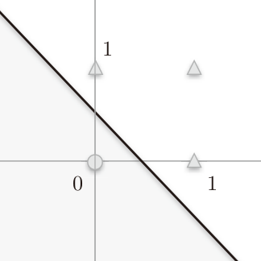
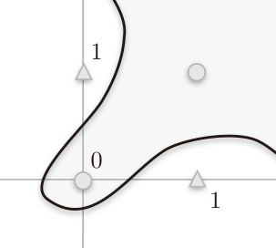
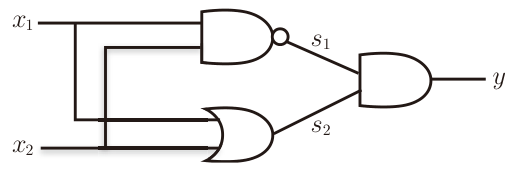
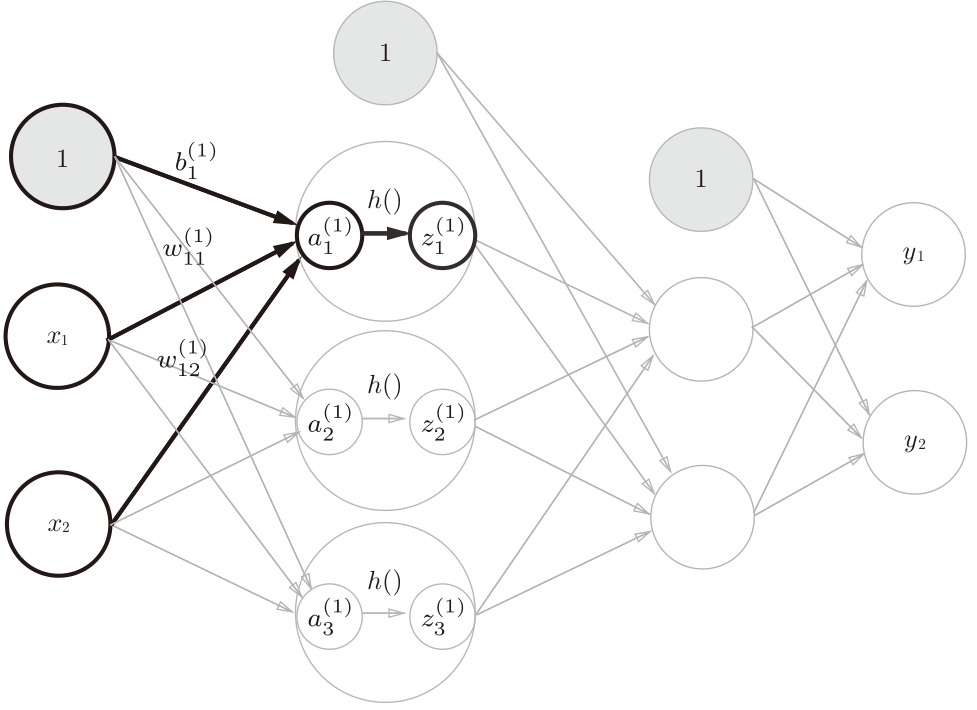
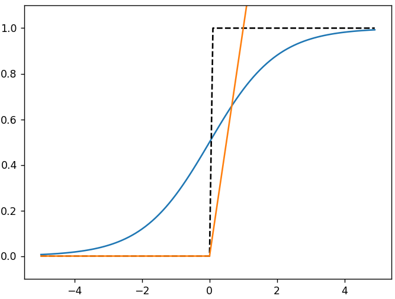
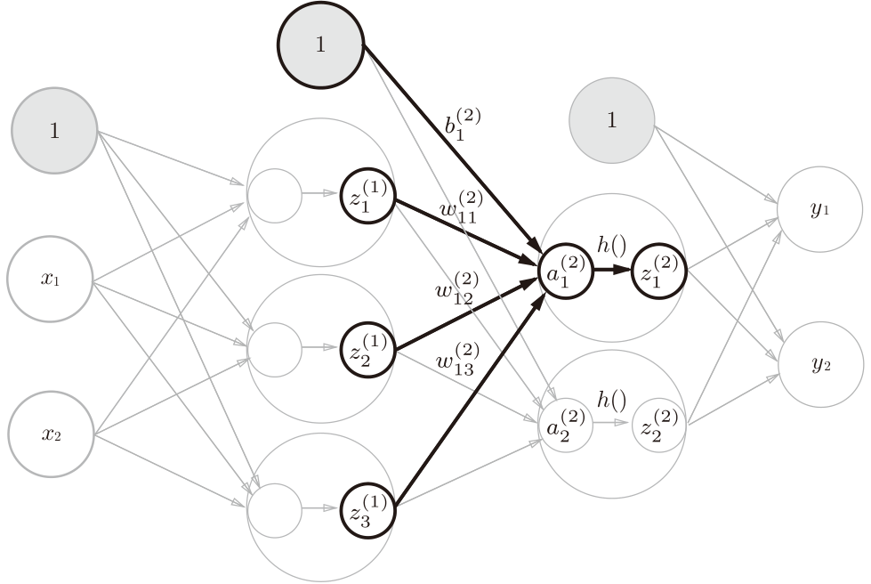
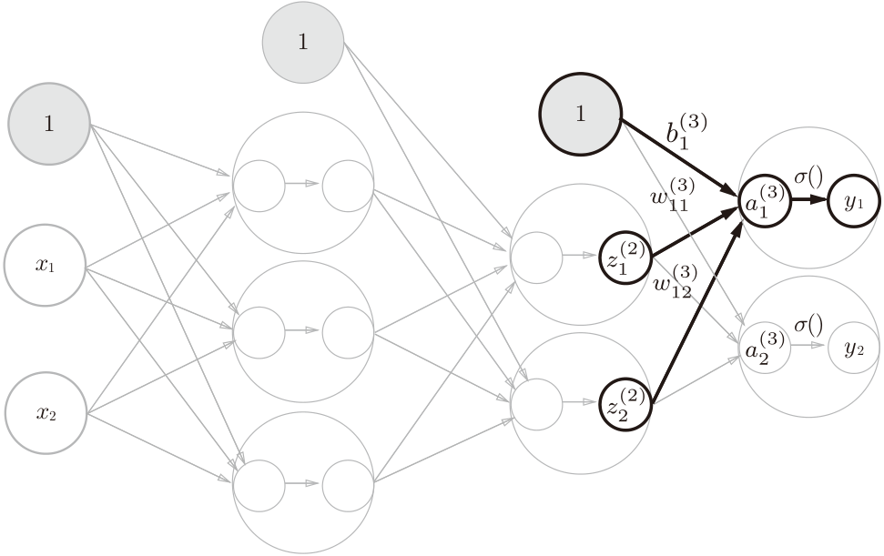

##  《深度学习入门：基于Python的理论与实现》1-3章

 [日]斋藤康毅

### 感知机

感知机是由美国学者Frank Rosenblatt在1957年提出来的。

感知机接收多个输入信号，输出一个信号。这里所说的“信号”可以想象成电流或河流那样具备“流动性”的东西。

感知机的信号只有“流/不流”(1/0)两种取值。在本书中，0对应“不传递信号”，1对应“传递信号”。

$x_{1}$和$x_{2}$ 是输入信号，y是输出信号，$w_{1}$和$w_{2}$是权重（w是weight的首字母）。图中的○称为“神经元”或者“节点”。输入信号被送往神经元时，会被分别乘以固定的权重($w_{1}x_{1}$、$w_{2}x_{2}$)。**神经元会计算传送过来的信号的总和，只有当这个总和超过了某个界限值时，才会输出1。这也称为“神经元被激活”。**这里将这个界限值称为阈值，用符号θ表示。

$$
y =
\begin{cases}
0, & (w_{1}x_{1}+w_{2}x_{2} \leq \theta) \\[4ex]
1, & (w_{1}x_{1}+w_{2}x_{2} \gt \theta)
\end{cases}
$$

感知机的多个输入信号都有各自固有的权重，这些权重发挥着控制各个信号的重要性的作用。也就是说，权重越大，对应该权重的信号的重要性就越高

**权重相当于电流里所说的电阻**。电阻是决定电流流动难度的参数，电阻越低，通过的电流就越大。而感知机的权重则是值越大，通过的信号就越大。不管是电阻还是权重，在控制信号流动难度（或者流动容易度）这一点上的作用都是一样的。

#### 感知机实现简单逻辑电路

相同构造的感知机，只需通过适当地调整参数的值，就可以像“变色龙演员”表演不同的角色一样，变身为与门、与非门、或门。下面以或门为例，x1和x2两个输入，y为输出，按照上面感知机公式当$(w_{1},w_{2},\theta)$ = (0.5, 0.5, -0.2)时满足条件。

|  x1  |  x2  |  y   |
| :--: | :--: | :--: |
|  0   |  0   |  0   |
|  0   |  1   |  1   |
|  1   |  0   |  1   |
|  1   |  1   |  1   |

这里决定感知机参数$w_{1},w_{2},\theta$的并不是计算机，而是我们人。我们看着真值表这种“训练数据”，人工考虑（想到）了参数的值。而机器学习的课题就是将这个决定参数值的工作交由计算机自动进行。学习是确定合适的参数的过程，而**人要做的是思考感知机的构造（模型），并把训练数据交给计算机**。

##### 感知机的实现

上面的感知机公式可以换一种方式表示：

$$
y =
\begin{cases}
0, & (b+w_{1}x_{1}+w_{2}x_{2} \leq 0) \\[4ex]
1, & (b+w_{1}x_{1}+w_{2}x_{2} \gt 0)
\end{cases}
$$

这个公式中b称为偏置，$w_{1}$和$w_{2}$称为权重。感知机会计算输入信号和权重的乘积，然后加上偏置，如果这个值大于0则输出1，否则输出0。

◆ 偏置和权重的作用是不一样的。**权重是控制输入信号的重要性的参数，而偏置是调整神经元被激活的容易程度（输出信号为1的程度）的参数。**

使用Numpy实现三个逻辑门，计算的逻辑是完全相同，只是权重参数不同，这里计算逻辑可以理解为模型，w和b是模型参数

```python
def AND(x1, x2):
    x = np.array([x1, x2])
    w = np.array([0.5, 0.5])
    b = -0.7
    tmp = np.sum(w*x) + b
    if tmp <= 0:
       return 0
    else:
       return 1

def NAND(x1, x2):
    x = np.array([x1, x2])
    w = np.array([-0.5, -0.5]) # 仅权重和偏置与AND不同！
    b = 0.7
    tmp = np.sum(w*x) + b
    if tmp <= 0:
        return 0
    else:
        return 1

def OR(x1, x2):
    x = np.array([x1, x2])
    w = np.array([0.5, 0.5]) # 仅权重和偏置与AND不同！
    b = -0.2
    tmp = np.sum(w*x) + b
    if tmp <= 0:
        return 0
    else:
        return 1
```

##### 感知机的局限性

* 感知机的局限性就在于它只能表示由一条直线分割的空间。
* 曲线分割而成的空间称为非线性空间，由直线分割而成的空间称为线性空间。

**对于或门**如果使用以下权重参数$w_{1} w_{2}$都为1，偏置为-0.5，对应公式为：
$$
y =
\begin{cases}
0, & (-0.5+x_{1}+x_{2} \leq 0) \\[4ex]
1, & (-0.5+x_{1}+x_{2} \gt 0)
\end{cases}
$$

感知机会生成一个 $-0.5+x_{1}+x_{2} = 0$的直线，即$x_{2} = 0.5-x_{1}$，这条直线用图形表示为




其中横轴为x1，纵轴为x2，○和△表示或门的输出，圆圈○表示输出0，三角△表示输出1，直线左下方灰色区域都为0

**异或门的非线性**

对于异或门，两个输入值x不同的时候才能输出1，“异或”是拒绝其他的意思。根据真值表，它的图形表示为：




当x1和x2都是1时为0，无法使用一条直线来分割0和1所在区域，只能使用曲线来把0和1分开，直线无法分割这种交叉的情况。

#### 多层感知机

* 感知机的绝妙之处在于它可以“叠加层”，可以通过叠加层使用与门，与非门和或门来表示异或门。

  通过真值表可以推出异或门的表示

  | x1   | x2   | s1(nand) | s2(or) | y(xor) |
  | ---- | ---- | -------- | ------ | ------ |
  | 0    | 0    | 1        | 0      | 0      |
  | 0    | 1    | 1        | 1      | 1      |
  | 1    | 0    | 1        | 1      | 1      |
  | 1    | 1    | 0        | 1      | 0      |

  与非门的输出s1和或门的输出s2，再作为输入通过一层**与门**的处理得到异或门的输出y (与非门前端的○表示反转输出)。可以把s1和s2看做神经网络的第1层，最后的与门看作输出层。




叠加了多层的感知机也称为多层感知机(multi-layered perceptron)。 单层感知机无法表示的东西，通过增加一层就可以解决”。也就是说，通过叠加层（加深层），感知机能进行更加灵活的表示。

#### 从与非门到计算机

使用多层感知机可以实现加法器，二进制转换为十进制的编码器等等，这些小的组件可以组合实现计算机，因此用感知机也可以表示计算机

《计算机系统要素：从零开始构建现代计算机》这本书以深入理解计算机为主题，论述了通过NAND构建可运行俄罗斯方块的计算机的过程。此书能让读者真实体会到，通过简单的NAND元件就可以实现计算机这样复杂的系统。

在用与非门等低层的元件构建计算机的情况下，分阶段地制作所需的零件（模块）会比较自然，即先实现与门和或门，然后实现半加器和全加器，接着实现算数逻辑单元(ALU)，然后实现CPU。

* 感知机通过叠加层能够进行非线性的表示，理论上还可以表示计算机进行的处理。

#### 小结

* 感知机是具有输入和输出的算法。给定一个输入后，将输出一个既定的值。

* 感知机将权重和偏置设定为参数。·使用感知机可以表示与门和或门等逻辑电路。

* 单层感知机只能表示线性空间，而多层感知机可以表示非线性空间。

* 多层感知机（在理论上）可以表示计算机。

### 神经网络

神经网络的一个重要性质是它可以自动地从数据中学习到合适的权重参数

#### 从感知机到神经网络

神经网络和感知机同样有偏置和权重，同时引入了激活函数的概念

$y = h(b+w_{1}x_{1}+w_{2}x_{2})$

上式中h(x)函数会将输入信号的总和转换为输出信号，这种函数一般称为**激活函数(activation function)**。如“激活”一词所示，**激活函数的作用在于决定如何来激活输入信号的总和**。




一个节点的计算过程为：先把上一层信号的所有求加权和$a_{1}$，在用激活函数h()转换为输出$z_{1}$

“朴素感知机”是指单层网络，激活函数使用了阶跃函数的模型。

“多层感知机”是指神经网络，使用sigmoid函数等平滑的激活函数的多层网络。

#### 激活函数

**阶跃函数**：激活函数以阈值为界，一旦输入超过阈值，就切换输出。因此可以说感知机中使用了阶跃函数作为激活函数。

##### sigmoid函数(sigmoid function)

公式如下
$$
h(x) = \frac{1}{1+e^{-x}}
$$
e是纳皮尔常数2.7182 ...。sigmoid函数看上去有些复杂，但它也仅仅是个函数而已。而函数就是给定某个输入后，会返回某个输出的转换器。比如，向sigmoid函数输入1.0或2.0后，就会有某个值被输出，类似h(1.0) = 0.731 ...、h(2.0) = 0.880 ...这样

视觉上确认函数的形状对理解函数而言很重要，下图中蓝色为sigmoid函数，黑色虚线为阶跃函数，橙色为ReLU函数。

不同点：sigmoid函数是一条平滑的曲线，输出随着输入发生连续性的变化。sigmoid函数的平滑性对神经网络的学习具有重要意义。而阶跃函数以0为界，输出发生急剧性的变化。感知机中神经元之间流动的是0或1的二元信号，而神经网络中流动的是连续的实数值信号。如果把这两个函数与水联系起来，则阶跃函数可以比作“竹筒敲石”，sigmoid函数可以比作“水车”。阶跃函数就像竹筒敲石一样，只做是否传送水（0或1）两个动作，而sigmoid函数就像水车一样，根据流过来的水量相应地调整传送出去的水量

相同点：

*  输入小时，输出接近0（为0）；随着输入增大，输出向1靠近（变成1）。也就是说，当输入信号为重要信息时，阶跃函数和sigmoid函数都会输出较大的值；当输入信号为不重要的信息时，两者都输出较小的值。
* 不管输入信号有多小，或者有多大，输出信号的值都在0到1之间。
* 都是非线性函数，向函数输入某个值后，输出值是输入值的常数倍的函数称为线性函数（用数学式表示为h(x) = cx，c为常数）。因此，线性函数是一条笔直的直线。而非线性函数，指的是不像线性函数那样呈现出一条直线的函数。




代码实现如下：

```python
def sigmoid(x):
    return 1/(1+np.exp(-x))

def relu(x):
    return np.maximum(0, x)

def step_function(x):
    '''input x is np.array'''
    return np.array(x > 0, dtype=int)

def sig_step_compare():
    x = np.arange(-5.0, 5.0, 0.1)
    sig = sigmoid(x)
    step = step_function(x)

    plt.plot(x, sig)
    plt.plot(x, step, 'k--')
    plt.ylim(-0.1, 1.1)
    plt.show()
```

在阶跃函数实现中，对NumPy数组进行不等号运算后，数组的各个元素都会进行不等号运算，生成一个布尔型数组。这里，数组x中大于0的元素被转换为True，小于等于0的元素被转换为False，从而生成一个新的数组y

在sigmoid函数实现中，根据NumPy的广播功能，如果在标量和NumPy数组之间进行运算，则标量会和NumPy数组的各个元素进行运算。 

神经网络中为什么要使用非线性函数？

线性函数的问题在于，不管如何加深层数，总是存在与之等效的“无隐藏层的神经网络”。

例如，把y(x) =h(h(h(x)))的运算对应3层神经网络，其中h(x)=cx是一个线性函数。这个运算会进行y(x) = c×c×c×x的乘法运算，但是同样的处理可以由y(x) =ax这一次乘法运算（即没有隐藏层的神经网络）来表示。

因此神经网络中为了发挥叠加层所带来的优势，激活函数必须使用非线性函数。

##### ReLU激活函数

最近则主要使用ReLU(Rectified Linear Unit)函数。ReLU函数在输入大于0时，直接输出该值；在输入小于等于0时，输出0。

#### 多层神经网络的实现

##### 中间层（隐层）




对于有两个中间层的网络，右上标数字表示层数，权重w右下角按照“后一层的索引号、前一层的索引号”的顺序排列。例如$w_{12}^{(2)}$表示第二层的第1个节点对应的前一层第2个节点的权重。

权重和计算 $a_{1}^{(2)} = z_{1}^{(1)}w_{11}^{(2)} + z_{2}^{(1)}w_{12}^{(2)} + z_{3}^{(1)}w_{13}^{(2)} + b_{1}^{(2)}$

使用矩阵乘法计算 $A^{(2)} = Z^{(1)}W^{(2)}+B^{(2)}$，其中$Z^{(1)}$的(1,3)，$W^{(2)}$为(3,2)大小，最后得到的$A^{(2)}$为(1,2)

##### 输出层的设计

输出层的激活函数用σ()表示，不同于隐藏层的激活函数h()（σ读作sigma）.

代码中实现用了`identity_function()`函数（也称为“恒等函数”），并将其作为输出层的激活函数。恒等函数会将输入按原样输出。

输出层所用的激活函数，要根据求解问题的性质决定。一般地，回归问题可以使用恒等函数，二元分类问题可以使用sigmoid函数，多元分类问题可以使用softmax函数。




完整网络代码

```python
def init_network():
    network = {} # 这里权重参数只是示例，没有意义
    network['W1'] = np.array([[0.1, 0.3, 0.5], [0.2, 0.4, 0.6]]) #(2, 3)
    network['b1'] = np.array([0.1, 0.2, 0.3])
    network['W2'] = np.array([[0.1, 0.4], [0.2, 0.5], [0.3, 0.6]]) #(3, 2)
    network['b2'] = np.array([0.1, 0.2])
    network['W3'] = np.array([[0.1, 0.3], [0.2, 0.4]]) # (2, 2)
    network['b3'] = np.array([0.1, 0.2])

    return network

def forward(network, x):
    W1, W2, W3 = network['W1'], network['W2'], network['W3']
    b1, b2, b3 = network['b1'], network['b2'], network['b3']

    a1 = np.dot(x, W1) + b1
    z1 = sigmoid(a1) # 第一层计算
    a2 = np.dot(z1, W2) + b2
    z2 = sigmoid(a2) # 第二层计算
    a3 = np.dot(z2, W3) + b3
    y = identity_function(a3) # 输出层

    return y

def identity_function(x):
    return x

def simple_network():
    network = init_network()
    x = np.array([1.0, 0.5])
    y = forward(network, x)
    print(y) # [ 0.31682708 0.69627909]

if __name__ == '__main__':
    simple_network()
```

 代码中forward（前向）一词，它表示的是从输入到输出方向的传递处理。后面在进行神经网络的训练时，我们将介绍后向（backward，从输出到输入方向）的处理。

###### softmax函数

神经网络可以用在分类问题和回归问题上，不过需要根据情况改变输出层的激活函数。一般而言，回归问题用恒等函数，分类问题用softmax函数。

分类问题是数据属于哪一个类别的问题。比如，区分图像中的人是男性还是女性的问题就是分类问题。而回归问题是根据某个输入预测一个（连续的）数值的问题。

softmax函数可以用下面的式表示。

 $$y_{k} = \frac {e^{a_k}}{\sum _{i=1}^n e^{a_i}}$$ 

e是纳皮尔常数2.7182 ...。假设输出层共有n个神经元，计算第k个神经元的输出。

softmax函数的分子是输入信号$a_k$的指数函数，分母是所有输入信号的指数函数的和。输出层的各个神经元都受到所有输入信号的影响.

softmax函数的输出是0.0到1.0之间的实数。并且，softmax函数的输出值的总和是1

计算机处理“数”时，数值必须在4字节或8字节的有限数据宽度内。这意味着数存在有效位数，也就是说，可以表示的数值范围是有限的。因此，会出现超大值无法表示的问题。这个问题称为溢出，在进行计算机的运算时必须（常常）注意。

$$
y_{k} = \frac {e^{a_k}}{\sum _{i=1}^n e^{a_i}} \\
      = \frac {C{e^{a_k}}}{C{\sum _{i=1}^n e^{a_i}}} \\
      = \frac {e^{({a_k}+logC)}}{\sum _{i=1}^n e^{({a_i}+logC)}} \\
      = \frac {e^{({a_k}+C')}}{\sum _{i=1}^n e^{({a_i}+C')}}
$$

在进行softmax的指数函数的运算时，加上（或者减去）某个常数并不会改变运算的结果。这里的C'可以使用任何值，但是为了防止溢出，一般会使用输入信号中的最大值。

```python
def softmax(a):
    c = np.max(a) # 所有值中的最大值
    exp_a = np.exp(a - c) # 每一个计算指数，并处理溢出对策
    sum_exp_a = np.sum(exp_a) # 所有指数求和
    y = exp_a / sum_exp_a

    return y

def softmax(x):
    if x.ndim == 2:
        x = x.T
        x = x - np.max(x, axis=0)
        y = np.exp(x) / np.sum(np.exp(x), axis=0)
        return y.T 

    x = x - np.max(x) # 溢出对策
    return np.exp(x) / np.sum(np.exp(x))
```

即便使用了softmax函数，各个元素之间的大小关系也不会改变。这是因为指数函数(y= exp(x))是单调递增函数

一般而言，神经网络只把输出值最大的神经元所对应的类别作为识别结果。并且，即便使用softmax函数，输出值最大的神经元的位置也不会变。因此，神经网络在进行分类时，输出层的softmax函数可以省略。在实际的问题中，由于指数函数的运算需要一定的计算机运算量，因此输出层的softmax函数一般会被省略。

求解机器学习问题的步骤可以分为**“学习”**和**“推理”**两个阶段。首先，在**学习阶段使用训练数据进行模型权重参数的学习**，然后，在**推理阶段，用学到的模型参数对未知的数据进行推理(分类)**。推理阶段一般会省略输出层的softmax函数。在输出层使用softmax函数是因为它和神经网络的学习有关系。

#### 手写数字识别

##### MNIST数据集

MNIST数据集是由0到9的数字图像构成的。训练图像有6万张，测试图像有1万张，这些图像可以用于学习和推理。MNIST数据集的一般使用方法是，先用训练图像进行学习，再用学习到的模型度量能在多大程度上对测试图像进行正确的分类

* MNIST的图像数据是28像素×28像素的灰度图像
* 图像数据格式：魔术数2051(4B)+图像数量(4B)+行数28(4B)+列数28(4B)+图像1像素数据(1B*28*28)+图像2像素数据(1B*28*28)  ，例如测试集图像 `t10k-images.idx3-ubyte` 文件大小为7840016 = 16+10000*28*28 
* 标签数据格式：魔术数2049(4B)+标签数量(4B)+标签数据(每个数据一个字节值为0-9) ，例如，测试集标签` t10k-labels.idx1-ubyte`文件大小为 10008 = 8+10000

##### 数据处理

dataset目录中存放4个数据集文件和加在数据集的程序文件mnist.py 

```python
import os.path
import gzip
import pickle
import os
import numpy as np

key_file = {
    'train_img':'train-images-idx3-ubyte.gz',
    'train_label':'train-labels-idx1-ubyte.gz',
    'test_img':'t10k-images-idx3-ubyte.gz',
    'test_label':'t10k-labels-idx1-ubyte.gz'
}

dataset_dir = os.path.dirname(os.path.abspath(__file__))
save_file = dataset_dir + "/mnist.pkl"

train_num = 60000
test_num = 10000
img_dim = (1, 28, 28)  # 灰度图像，大小为28*28
img_size = 784 # 28*28

def _load_label(file_name):
    '''
    数据格式为:魔术数2049(4B)+标签数量(4B)+标签数据(每个数据一个字节值为0-9)   
    t10k-labels.idx1-ubyte文件大小为 10008 = 8+10000 
    '''
    file_path = dataset_dir + "/" + file_name
    
    print("Converting " + file_name + " to NumPy Array ...")
    with gzip.open(file_path, 'rb') as f:
            labels = np.frombuffer(f.read(), np.uint8, offset=8)
    print("Done")
    
    return labels

def _load_img(file_name):
    '''
    数据格式为:魔术数2051(4B)+图像数量(4B)+行数28(4B)+列数28(4B)+图像1像素数据(1B*28*28)+图像2像素数据(1B*28*28)   
    t10k-images.idx3-ubyte 文件大小为7840016 = 16+10000*28*28   
    '''
    file_path = dataset_dir + "/" + file_name
    
    print("Converting " + file_name + " to NumPy Array ...")    
    with gzip.open(file_path, 'rb') as f:
            data = np.frombuffer(f.read(), np.uint8, offset=16)
    data = data.reshape(-1, img_size) 
    print("data shape:", data.shape) # 对于测试集: (10000, 784)
    print("Done")
    
    return data

def _convert_numpy():
    dataset = {}
    dataset['train_img'] =  _load_img(key_file['train_img'])
    dataset['train_label'] = _load_label(key_file['train_label'])    
    dataset['test_img'] = _load_img(key_file['test_img'])
    dataset['test_label'] = _load_label(key_file['test_label'])
    
    return dataset

def _change_one_hot_label(X):
    # 对于测试集X为10000个点，size为10000
    T = np.zeros((X.size, 10)) # shape (10000, 10)
    for idx, row in enumerate(T):
        # 每一行的10个值中，原来的X对应的值标记为1，其他都为0
        row[X[idx]] = 1
        
    return T

def init_mnist():
    dataset = _convert_numpy()
    print("Creating pickle file ...")
    with open(save_file, 'wb') as f:
        pickle.dump(dataset, f, -1)  # 54,950,267 字节
    print("Done!")

def load_mnist(normalize=True, flatten=True, one_hot_label=False):
    """读入MNIST数据集    
    Parameters
    ----------
    normalize : 将图像的像素值正规化为0.0~1.0
    one_hot_label : 
        one_hot_label为True的情况下，标签作为one-hot数组返回
        one-hot数组是指[0,0,1,0,0,0,0,0,0,0]这样的数组
    flatten : 是否将图像展开为一维数组    
    Returns
    -------
    (训练图像, 训练标签), (测试图像, 测试标签)
    """
    if not os.path.exists(save_file):
        init_mnist()
        
    with open(save_file, 'rb') as f:
        dataset = pickle.load(f)
    
    if normalize:
        for key in ('train_img', 'test_img'):
            dataset[key] = dataset[key].astype(np.float32)
            dataset[key] /= 255.0
            
    if one_hot_label:
        dataset['train_label'] = _change_one_hot_label(dataset['train_label'])
        dataset['test_label'] = _change_one_hot_label(dataset['test_label'])
    
    if not flatten:
         for key in ('train_img', 'test_img'):
            dataset[key] = dataset[key].reshape(-1, 1, 28, 28)

    return (dataset['train_img'], dataset['train_label']), (dataset['test_img'], dataset['test_label']) 

if __name__ == '__main__':
    init_mnist()
```

`_load_label()`和`_load_img()`用来把数据集中的标签数据转换为numpy的数组数据

`load_mnist()`返回训练集和测试集的图像和标签数据，它的参数：

* 参数normalize设置是否将输入图像正规化为0.0～1.0的值。如果将该参数设置为False，则输入图像的像素会保持原来的0～255
* 第2个参数flatten设置是否展开输入图像（变成一维数组）。如果将该参数设置为False，则输入图像为1×28×28的三维数组；若设置为True，则输入图像会保存为由784个元素构成的一维数组
* `one_hot_label`设置是否将标签保存为`one-hot`表示`(one-hot representation)`。`one-hot`表示是仅正确解标签为1，其余皆为0的数组，就像[0,0,1,0,0,0,0,0,0,0]这样。当one_hot_label为False时，只是像7、2这样简单保存正确解标签；当`one_hot_label`为True时，标签则保存为`one-hot`表示。

Python的pickle库可以将程序运行中的对象保存为文件。如果加载保存过的pickle文件，可以立刻复原之前程序运行中的对象

可以使用以下程序查看数据集中的图像

```python
from dataset.mnist import load_mnist
from PIL import Image

def show_mnist_image(idx, test=True):
    (x_train, t_train), (x_test, t_test) = load_mnist(flatten=True, normalize=False)
    if test:
        img = x_test[idx]
        label = t_test[idx]
    else:
        img = x_train[idx]
        label = t_train[idx]
    
    print(label)  # 5
    print(img.shape)  # (784,) # 数据中的图像为784个值
    img = img.reshape(28, 28)  # 把图像的形状变为原来的尺寸28*28
    print(img.shape)  # (28, 28)
    pil_img = Image.fromarray(np.uint8(img))
    pil_img.show()
```

##### 神经网络推理

推理一张图片是数字几时，输入的图片大小为28*28个像素，所以输入层有784个神经元，推断的结果是0-9中的任何一个数字，所以输出层有10个神经元。

举例的这个神经网络有2个隐藏层，第1个隐藏层有50个神经元，第2个隐藏层有100个神经元。这个50和100可以设置为任何值。示例程序使用了与训练好的权重参数，通过pickle读取`sample_weight.pkl`中的权重数据。数据以字典变量的形式保存了权重和偏置参数。

```python
def get_data():
    '''推理，所以只需返回测试集数据'''
    (x_train, t_train), (x_test, t_test) = load_mnist(normalize=True, flatten=True, one_hot_label=False)
    return x_test, t_test

def init_network():
    # 读取权重数据
    with open("sample_weight.pkl", 'rb') as f:
        network = pickle.load(f)
    return network

def predict(network, x):
    # 和前面的简单神经网络一样的逻辑流程，只是权重参数从文件中读取
    W1, W2, W3 = network['W1'], network['W2'], network['W3']
    b1, b2, b3 = network['b1'], network['b2'], network['b3']

    a1 = np.dot(x, W1) + b1 # 第一层
    z1 = sigmoid(a1)
    a2 = np.dot(z1, W2) + b2 # 第二层
    z2 = sigmoid(a2)
    a3 = np.dot(z2, W3) + b3 # 输出层
    y = softmax(a3)  # (1, 10)

    return y

def interfere():
    # 1. 准备数据
    x, t = get_data()
    # 2. 加载模型
    network = init_network()
    accuracy_cnt = 0
    for i in range(len(x)): # 遍历测试集中的每一个图像数据
        # 3. 执行推理，得到结果数字 
        y = predict(network, x[i])
        p= np.argmax(y) # 获取数组y中概率最高的元素的索引
        # 4. 和标签数据对比，计算正确率
        if p == t[i]:
            accuracy_cnt += 1

    print("Accuracy:" + str(float(accuracy_cnt) / len(x)))
```

将normalize设置成True后，函数内部会进行转换，将图像的各个像素值除以255，使得数据的值在0.0～1.0的范围内。像这样**把数据限定到某个范围内的处理称为正规化(normalization)**。此外，**对神经网络的输入数据进行某种既定的转换称为预处理(pre-processing)**。这里，作为对输入图像的一种预处理，我们进行了正规化。

实际上，很多预处理都会考虑到数据的整体分布。比如，利用数据整体的均值或标准差，移动数据，使数据整体以0为中心分布，或者进行正规化，把数据的延展控制在一定范围内。除此之外，还有将数据整体的分布形状均匀化的方法，即数据白化(whitening)等。

##### 批处理优化

上面的推理过程中，每次输入$X$由784个元素（原本是一个28×28的二维数组）构成的一维数组，输出是一个有10个元素的一维数组。这是只输入一张图像数据时的处理流程。使用矩阵乘法，可以一次处理多行输入数据。

例如可以一次性打包处理100张图像，把输入$X$的形状改为100×784，输出数据的形状为100×10，这表示输入的100张图像的结果被一次性输出了。即x[0]和y[0]中保存了第0张图像及其推理结果，x[1]和y[1]中保存了第1张图像及其推理结果。

```python
def batch_interfere():
    x, t = get_data()
    network = init_network()
    batch_size = 100
    accuracy_cnt = 0
    for i in range(0, len(x), batch_size): # 设置步长为batch_size，一批次处理100个输入
        x_batch = x[i:i+batch_size] # (100, 784)
        y_batch = predict(network, x_batch) # (100, 10)
        p= np.argmax(y_batch, axis=1) # 在第2维度获取概率最高的元素的索引，得到100个数字
        accuracy_cnt += np.sum(p == t[i:i+batch_size]) # 两个一维数组比较对应位置元素相同的个数

    print("Accuracy:" + str(float(accuracy_cnt) / len(x))) # Accuracy:0.9352
```

这种打包式的输入数据称为批(batch)。批有“捆”的意思，图像就如同纸币一样扎成一捆。

批处理对计算机的运算大有利处，可以大幅缩短每张图像的处理时间。那么为什么批处理可以缩短处理时间呢？这是因为大多数处理数值计算的库都进行了能够高效处理大型数组运算的最优化。并且，在神经网络的运算中，**当数据传送成为瓶颈时，批处理可以减轻数据总线的负荷（严格地讲，相对于数据读入，可以将更多的时间用在计算上）**。也就是说，批处理一次性计算大型数组要比分开逐步计算各个小型数组速度更快。

#### 小结

* 神经网络中使用的是平滑变化的sigmoid函数，而感知机中使用的是信号急剧变化的阶跃函数。

* 输入数据的集合称为批。通过以批为单位进行推理处理，能够实现高速的运算。

### nmpy库

NumPy中，主要的处理也都是通过C或C++实现的。因此，我们可以在不损失性能的情况下，使用Python便利的语法。

“对应元素的”的英文是element-wise，比如“对应元素的乘法”就是element-wise product。

多维数组就是“数字的集合”，数字排成一列的集合、排成长方形的集合、排成三维状或者（更加一般化的）N维状的集合都称为多维数组。数学上将一维数组称为向量，将二维数组称为矩阵。另外，可以将一般化之后的向量或矩阵等统称为张量(tensor)。本书基本上将二维数组称为“矩阵”，将三维数组及三维以上的数组称为“张量”或“多维数组”。

#### 广播

NumPy中，广播机制让形状不同的数组之间也可以进行运算。2×2的矩阵A和标量10之间进行了乘法运算。在这个过程中，**标量10被扩展成了2×2的形状**，然后再与矩阵A进行乘法运算。这个巧妙的功能称为**广播(broadcast)**。广播是numpy的一种计算规则，广播和线性代数中的矩阵乘法不同

```python
# 10 被扩展成了 [[10, 10], [10, 10]]
[ [1, 2], [3, 4]] * 10  = [ [1, 2], [3, 4]] * [[10, 10], [10, 10]] = [[10, 20], [30, 40]]

# [10, 20] 被扩展成了 [[10, 20], [10, 20]]，和前一个矩阵相同的形状
[ [1, 2], [3, 4]] * [10, 20]  = [ [1, 2], [3, 4]] * [[10, 20], [10, 20]] = [[10, 40], [30, 80]]
```

#### 基本方法

*  `X = X.flatten()` 把多维数据转换为一维数组，对于矩阵从上到下逐行拼接

* 数组的维数可以通过`np.ndim()`函数获得。

* 数组的形状可以通过实例变量`shape`获得

* 矩阵元素的数据类型可以通过`dtype`查看

* 对NumPy数组使用不等号运算符等（例如X是一个数组，对 `X > 15`，会对X中的每个元素进行`>15`比较），结果会得到一个布尔型的数组

  ```python
      x = np.array([10, 9, 5, 4, 1])
      y = x > 5
      print(y) # [ True  True False False False]
  ```
  
* 矩阵的乘积是通过左边矩阵的行（横向）和右边矩阵的列（纵向）以对应元素的方式相乘后再求和而得到的。并且，运算的结果保存为新的多维数组的元素

* 乘积可以通过NumPy的`np.dot()`函数计算（乘积也称为点积）。`np.dot()`接收两个NumPy数组作为参数，并返回数组的乘积。这里要注意的是，`np.dot(A, B)`和`np.dot(B, A)`的值可能不一样。和一般的运算（+或*等）不同，矩阵的乘积运算中，操作数(A、B)的顺序不同，结果也会不同

* `np.arange (batch_size)`会生成一个从0到`batch_size-1`的数组。比如当`batch_size`为5时，会生成一个NumPy数组`[0, 1, 2, 3, 4]`。

* 可以使用array[x, y]，其中x和y为两个数组，来筛出多维数组array中，x和y对应的行列的所有元素，构成一个新数组。

```python
    y = np.array([[1, np.e, np.e**2],
                  [np.e, 1, np.e]])    
    print("输入数组:", y)
    '''
     [[1.         2.71828183 7.3890561 ],
      [2.71828183 1.         2.71828183]]
    '''
    batch_size = y.shape[0]
    print(batch_size)
    t = np.array([2, 0])
    newarray = y[np.arange(batch_size), t] # 从数组Y的每一行,选t所在列的数字，构成一个数组
    # y中第一行的第2个元素，第二行的第0个元素
    print(newarray) # [7.3890561  2.71828183]
    print(np.log(newarray + 1e-7)) # [2.00000001 1.00000004] # 对数组每一个元素取对数
    print(np.sum(np.log(newarray + 1e-7)) / batch_size)
```

* NumPy中存在使用for语句后处理变慢的缺点（NumPy中，访问元素时最好不要用for语句）
