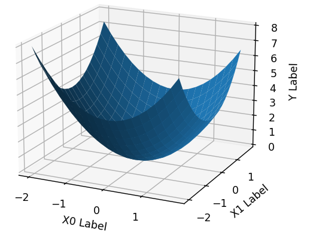
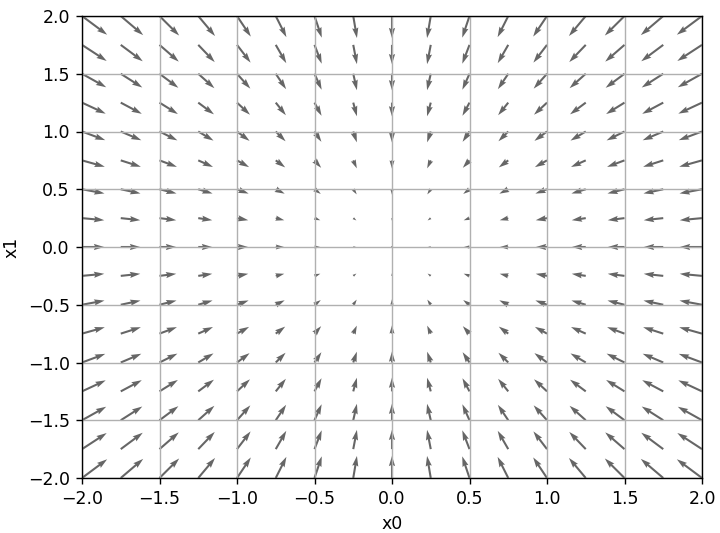
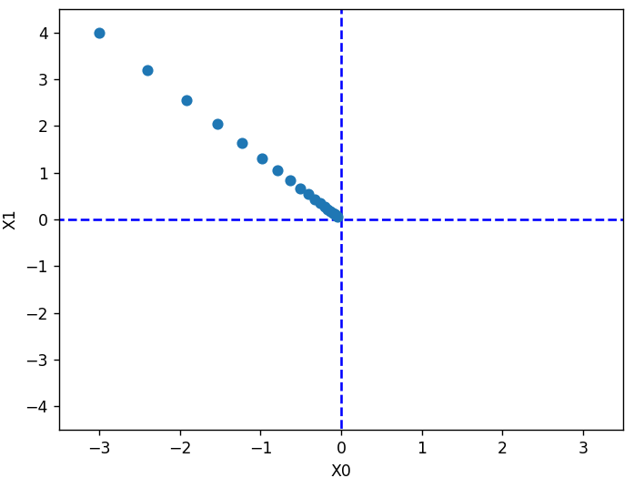
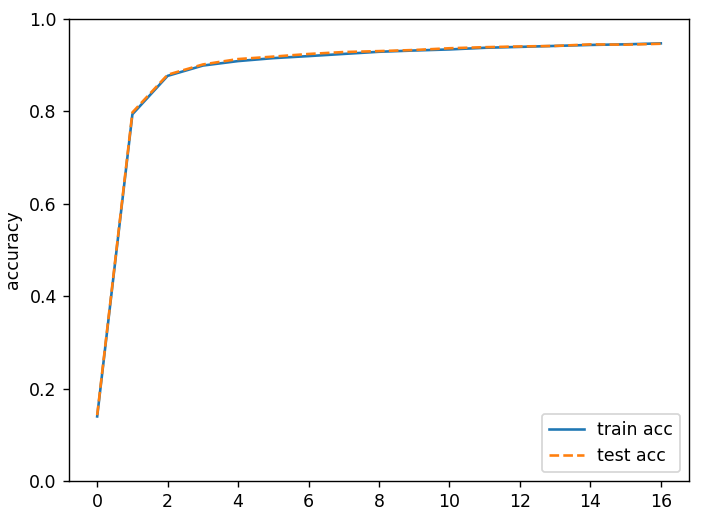

##  《深度学习入门：基于Python的理论与实现》 神经网络的学习

 [日]斋藤康毅

### 从数据中学习

深度“学习”是指从训练数据中自动获取最优权重参数的过程。学习的目的就是以损失函数为基准，找出能使它的值达到最小的权重参数。

数据是机器学习的命根子。从数据中寻找答案、从数据中发现模式、根据数据讲故事……这些机器学习所做的事情，如果没有数据的话，就无从谈起。因此，数据是机器学习的核心。

与其绞尽脑汁，从零开始想出一个可以识别图片中5的算法，不如考虑通过有效利用数据来解决这个问题。一种方案是，先从图像中提取特征量，再用机器学习技术学习这些特征量的模式。**“特征量”是指可以从输入数据（输入图像）中准确地提取本质数据（重要的数据）的转换器**。**图像的特征量通常表示为向量的形式**。在计算机视觉领域，常用的特征量包括SIFT、SURF和HOG等。使用这些特征量将图像数据转换为向量，然后对转换后的向量使用机器学习中的SVM、KNN等分类器进行学习。

神经网络的优点是对所有的问题都可以用同样的流程来解决。比如，不管要求解的问题是识别5，还是识别狗，抑或是识别人脸，神经网络都是通过不断地学习所提供的数据，尝试发现待求解的问题的模式。也就是说，与待处理的问题无关，神经网络可以将数据直接作为原始数据，进行“端对端”的学习，从原始数据（输入）中获得目标结果（输出）。

一般将数据分为**训练数据**和**测试数据**两部分来进行学习和实验等。首先，使用训练数据进行学习，寻找最优的参数；然后，使用测试数据评价训练得到的模型的实际能力。

**泛化能力**是指处理未被观察过的数据（不包含在训练数据中的数据）的能力。获得泛化能力是机器学习的最终目标。

只对某个数据集过度拟合的状态称为**过拟合(over fitting)**，避免过拟合也是机器学习的一个重要课题。

### 损失函数

神经网络以**某个指标**为线索**寻找最优权重参数**。神经网络的学习中所**用的指标称为损失函数(loss function)**。这个损失函数可以使用任意函数，但一般用**均方误差**和**交叉熵误差**等。

损失函数是表示神经网络性能的“恶劣程度”的指标，即当前的神经网络对监督数据在多大程度上不拟合，在多大程度上不一致。但是如果给损失函数乘上一个负值，就可以解释为“在多大程度上不坏”，即“性能有多好”。

#### 均方误差

均方误差(mean squared error)公式
$$
E=\frac{1}{2}\sum_k(y_k-t_k)^2
$$
$y_k$表示神经网络的输出，$t_k$表示监督数据，k表示数据的维数。在手写识别的例子中，

```python
y_k = [0.1, 0.05, 0.6, 0.0, 0.05, 0.1, 0.0, 0.1, 0.0, 0.0] # 2的概率为0.6，最大
t_k = [0, 0, 1, 0, 0, 0, 0, 0, 0, 0] # 预期结果为数字2

# 均方误差计算函数
def mean_squared_error(y, t):
    return 0.5 * np.sum((y-t)**2) # y中的每一个元素和t中的每一个元素对应相减后的值平方后，再求和。
# 误差值已经很小了
print(mean_squared_error(np.array(y_k), np.array(t_k))) # 0.09750000000000003
```

#### 交叉熵误差

交叉熵误差(cross entropy error)公式为：
$$
E=-\sum_k t_k\log_ey_k
$$
用上面的输出例子$t_k$只在正确的数字位置上为1，其他都为0，所以计算的交叉熵为$-(1*\log_e 0.6)=0.5108$

在这个例子中交叉熵误差的值只由正确解标签所对应的输出结果决定。

$y=log_e(x)$的函数曲线中x等于1时，y为0；随着x向0靠近，y逐渐变小。因此，正确解标签对应的输出越大，交叉熵的值越接近0。

```python
def cross_entropy_error(y, t):
    delta = 1e-7 # np.log(0)是负无限大-inf，导致无法计算，添加一个微小值，确保不会为0
    return -np.sum(t * np.log(y+delta))

y_k = [0.1, 0.05, 0.6, 0.0, 0.05, 0.1, 0.0, 0.1, 0.0, 0.0] # 2的概率为0.6，最大
t_k = [0, 0, 1, 0, 0, 0, 0, 0, 0, 0] # 预期结果为数字2
print(cross_entropy_error(np.array(y_k), np.array(t_k))) # 0.510825457099338
```

#### mini-batch学习

使用训练数据进行学习，严格来说，就是针对训练数据计算损失函数的值，找出使该值尽可能小的参数。

因此要计算所有训练数据的**损失函数的总和，最后还要除以N进行正规化**。通过除以N，可以求单个数据的“平均损失函数”。通过这样的平均化，可以获得和训练数据的数量无关的统一指标。比如，即便训练数据有1000个或10000个，也可以求得单个数据的平均损失函数。假设数据个数为N，以交叉熵误差为例公式如下：
$$
E=-\frac{1}{N}\sum_n\sum_k t_{nk}\log_ey_{nk}
$$
当训练数据很大时，神经网络的学习也是从训练数据中选出一批数据（称为mini-batch,小批量），然后对每个mini-batch进行学习。比如，从60000个训练数据中随机选择100笔，再用这100笔数据进行学习。这种学习方式称为mini-batch学习。

```python
def cross_entropy_error(y, t):
    if y.ndim == 1:
        t = t.reshape(1, t.size)
        y = y.reshape(1, y.size)

    batch_size = y.shape[0] # 批次中样本个数
    return -np.sum(t * np.log(y + 1e-7)) / batch_size
```

计算电视收视率时，并不会统计所有家庭的电视机，而是仅以那些被选中的家庭为统计对象。比如，通过从关东地区随机选择1000个家庭计算收视率，可以近似地求得关东地区整体的收视率。这1000个家庭的收视率，虽然严格上不等于整体的收视率，但可以作为整体的一个近似值。和收视率一样，mini-batch的损失函数也是利用一部分样本数据来近似地计算整体。

#### 为何要设定损失函数

既然我们的目标是获得使识别精度尽可能高的神经网络，那不是应该把识别精度作为指标吗？

在神经网络的学习中，寻找最优参数（权重和偏置）时，要寻找使损失函数的值尽可能小的参数。为了找到使损失函数的值尽可能小的地方，**需要计算参数的导数（确切地讲是梯度），然后以这个导数为指引，逐步更新参数的值**。**损失函数**针对**权重参数**求导，**表示的是“如果稍微改变这个权重参数的值，损失函数的值会如何变化”**。**如果导数的值为负，通过使该权重参数向正方向改变，可以减小损失函数的值；反过来，如果导数的值为正，则通过使该权重参数向负方向改变，可以减小损失函数的值**。当导数的值为0时，无论权重参数向哪个方向变化，损失函数的值都不会改变，此时该权重参数的更新会停在此处，因为此时切线斜率为0是个水平线。这就是导数的性质。

精度是正确样本数除以总样本数的统计值，如果以识别精度为指标，即使稍微改变权重参数的值，识别精度也仍将保持在32%，不会出现变化。也就是说，仅仅微调参数，是无法改善识别精度的。即便识别精度有所改善，它的值也不会像32.0123 ...%这样连续变化，而是变为33%、34%这样的不连续的、离散的值。而如果把损失函数作为指标，则当前损失函数的值可以表示为0.92543 ...这样的值。并且，如果稍微改变一下参数的值，对应的损失函数也会像0.93432 ...这样发生连续性的变化。

sigmoid函数的输出（竖轴的值）是连续变化的，曲线的斜率（导数）也是连续变化的。sigmoid函数的导数在任何地方都不为0。这对神经网络的学习非常重要。得益于这个斜率不会为0的性质，神经网络的学习得以正确进行。

### 数值微分

#### 导数

10分钟内跑了2千米，每分钟跑了200米，虽然计算了1分钟的变化量200米，但这个是平均值。

导数表示某个瞬间的变化量，用公式表示：
$$
\frac{df(x)}{dx}=\lim_{h \to 0} \frac{f(x+h)-f(x)}{h}
$$
$\frac{df(x)}{dx}$表示f(x)关于x的导数，即f(x)相对于x的变化程度。x的“微小变化”(h无限趋近0)将导致函数f(x)的值在多大程度上发生变化。

##### 实现导数计算

```python
# 不好的实现示例
def numerical_diff(f, x):
    h = 10e-50
    return (f(x+h) - f(x)) / h
```

`numerical_diff(f, x)`的名称来源于数值微分的英文numerical differentiation。这个函数有两个参数，即`函数f`和`传给函数f的参数x`，这个实现有两个问题：

1. 10e-50（有50个连续的0的“0.00 ... 1”）这个微小值会因python中的舍入误差变为0
2. “真的导数”对应函数在x处的斜率（称为切线），但上述实现中计算的导数对应的是(x+h)和x之间的斜率。因此，真的导数（真的切线）和上述实现中得到的导数的值在严格意义上并不一致。这个差异的出现是因为h不可能无限接近0。

对于问题1，可以将h的值设置为1e-4;

对于问题2，我们可以计算函数f在(x+h)和(x-h)之间的差分，因为这种计算方法以x为中心，计算它左右两边的差分，所以也称为中心差分（而(x+h)和x之间的差分称为前向差分）。

```python
def numerical_diff(f, x):
    h = 1e-4 # 0.0001
    return (f(x+h) - f(x-h)) / (2*h)
```

利用微小的差分求导数的过程称为**数值微分(numerical differentiation)**。而基于数学式的推导求导数的过程，则用“解析性”(analytic)一词，称为**“解析性求解”或者“解析性求导”**。比如$y=x^2$的导数，可以通过$\frac{dy}{dx}=2x$解析性地求解出来。因此，当x= 2时，y的导数为4。解析性求导得到的导数是不含误差的“真的导数"

对函数$f(x) = 0.01x^2+0.1x$ 计算x为5的导数，使用数学分析的方案$\frac{dy}{dx}=0.02x+0.1$，当x=5时，得到微分值为0.2，和使用数值微分计算出来0.19999是近似相同的

```python
import numpy as np
import matplotlib.pylab as plt

def numerical_diff(f, x):
    h = 1e-4
    return (f(x+h) - f(x-h)) / (2*h)

def test_func(x):
    return 0.01*x**2 + 0.1*x

def tangent_line(f, x):
    d = numerical_diff(f, x)
    print(d) # 0.1999999999990898
    y = f(x) - d*x 
    return lambda t: d*t + y # 使用计算的出来的导数值绘制斜率

def plot_test_func():
    x = np.arange(0.0, 20.0, 0.1) # 以0.1为单位，从0到20的数组x
    y = test_func(x)
    tf = tangent_line(test_func, 5)
    y2 = tf(x)
    plt.xlabel("x")
    plt.ylabel("f(x)")
    plt.plot(x, y)
    plt.plot(x, y2)
    plt.show()
```

##### 偏导数

 普通导数处理的是单变量函数 ，对有多个变量的函数的求导数称为偏导数。

函数 $f(x_1, x_2, ..., x_n)$ 对其某个变量$x_i$的偏导数记为 $\frac{\partial f}{\partial x_i}$。它表示函数$f$保持其他变量不变时，相对于变量 $x_i$的变化率。公式为
$$
\frac{\partial f}{\partial x_i} = \lim_{h\to 0} \frac {f(x_1, x_2,..,x_i+h,..,x_n)-f(x_1, x_2,..,x_i,..,x_n)} {h}
$$
本质上和一个变量的函数导数相同，只是其他变量都是某一个固定值。

对于一个二元函数
$$
f(x_0, x_1) = x_0^2 + x_1^2
$$

它的图形如下是个三维曲面，最低点在(0, 0)，由于它有两个变量，所以有必要区分对哪个变量求导数，即对$x_0$和$x_1$两个变量中的哪一个求导数。




当$x_1=4$时，函数变为$f(x_0) = x_0^2 + 4^2$，变成一个只有一个变量的函数，计算这个函数对$x_0$求导，当$x_0=3$时，导数值为6.00000000000378。

偏导数和单变量的导数一样，都是求某个地方的斜率。不过，**偏导数需要将多个变量中的某一个变量定为目标变量，并将其他变量固定为某个值**。

### 梯度

梯度指示的方向是各点处的函数值变化最多的方向。

一起计算$x_0$和$x_1$的偏导数，例如$x_0=3, x_1=4$时，$(x_0, x_1)$的偏导数$\big(\frac{\partial f}{\partial x_0},\frac{\partial f}{\partial x_1}\big)$。这种由全部变量的偏导数汇总而成的向量称为**梯度(gradient)**。可以把每一个变量看做一个维度，当其他维度固定值时，函数在这个维度上某一个点的最大变化量。所以对于所有维度整体而言，超梯度向量的方向，就是使函数变大的最快方向，因为每一个维度上都是最大变化量。例如对输入x=[3,4] 计算上面函数的梯度，得到的向量为[6, 8]，意味着在(3, 4)这个点，分别朝(3+6, 4+8)变化就是函数变大的最快方向。如果是向(3+6, 4+2)，也会让函数值变大，但不是最快的。

```python
def test_func_2(x):
   return np.sum(x**2) # 每个元素的平方和

def numerical_gradient(f, x):
    h = 1e-4 # 0.0001
    grad = np.zeros_like(x) # 生成和x形状相同的数组其中的值都为0
	# 分别对每一个元素计算导数，以idx = 0为例
    for idx in range(x.size):
        tmp_val = x[idx]        
        x[idx] = float(tmp_val) + h #x = [3.0001, 4]
        fxh1 = f(x) # f(x+h)的计算 # 3.0001**2+4**2 = 25.0006
        
        x[idx] = float(tmp_val) - h #x = [2.9999, 4]
        fxh2 = f(x) # f(x-h)的计算 # 2.9999**2 + 4**2 = 24.99940001  

        grad[idx] = (fxh1 - fxh2) / (2*h) # grad[0] = 5.99995
        x[idx] = tmp_val # 还原值

    return grad

if __name__ == '__main__':
    print(numerical_gradient(test_func_2, np.array([3.0, 4.0]))) #[6. 8.]
```

用图形表示元素值为负梯度的向量（导数值取负数），$f(x_0, x_1) = x_0^2 + x_1^2$的梯度呈现为有向向量（箭头）。梯度指向函数$f(x_0, x_1)$的“最低处”（最小值），就像指南针一样，所有的箭头都指向同一点。其次，我们发现离“最低处”(0, 0)越远，箭头越大。当$x_1=0$时，$f(x_0, x_1) = x_0^2$，是一个标准的一元二次函数，$x_0$的值越大，对应的导数越大，斜率值也越大，$x_0$变化一点后，y的变化也大。**对于梯度，更关心的是变化方向**，下图中的代码使用`-grad[0], -grad[1]`梯度的负值来绘图，所以是指向函数极小值。可以这样理解：对函数$f(x_0, x_1)$位于坐标(3, 4)时，它沿着梯度(6, 8)方向，变化最快。所以通过负梯度，就可以最快的找到函数的极小值。下图中，坐标为(2, -2)时，计算出的梯度值为(4, -4)，取反后的梯度值为(-4, 4)，所以从(2, -2)这个位置出发，向(2-4, -2+4)方向即x0-2，x1+2的方向，函数值向最小值方向变化最快，如图右下角的箭头向左上45度，就是它变小最快的方向。




对应代码

```python
def test_func_2(x):
    if x.ndim == 1:
        return np.sum(x**2)
    else:
        return np.sum(x**2, axis=1)

def _numerical_gradient_no_batch(f, x):
    h = 1e-4 # 0.0001
    grad = np.zeros_like(x) # 生成和x形状相同的数组其中的值都为0

    for idx in range(x.size):
        tmp_val = x[idx]        
        x[idx] = float(tmp_val) + h
        fxh1 = f(x) # f(x+h)的计算
        
        x[idx] = float(tmp_val) - h
        fxh2 = f(x) # f(x-h)的计算

        grad[idx] = (fxh1 - fxh2) / (2*h)
        x[idx] = tmp_val # 还原值

    return grad

def numerical_gradient(f, X):
    if X.ndim == 1:
        return _numerical_gradient_no_batch(f, X)
    else:
        grad = np.zeros_like(X)  
        print(grad.shape) # (2, 324)
        for idx, x in enumerate(X): # idx 为行号索引 0-1
            print("shape of x:", x.shape) #shape of x: (324,)
            grad[idx] = _numerical_gradient_no_batch(f, x)
        
        return grad
    
if __name__ == '__main__':
    # 两行数据，每一行18个数据
    x0 = np.arange(-2, 2.5, 0.25)
    x1 = np.arange(-2, 2.5, 0.25)
    # [X,Y] = meshgrid(x,y) 基于向量 x 和 y 中包含的坐标返回二维网格坐标。X 是一个矩阵，每一行是 x 的一个副本；Y 也是一个矩阵，每一列是 y 的一个副本。坐标 X 和 Y 表示的网格有 length(y) 个行和 length(x) 个列。
    X, Y = np.meshgrid(x0, x1)
    print(X.shape) #(18, 18)
    X = X.flatten() #(324,)
    Y = Y.flatten()
    # np.array([X, Y])的shape 为(2, 324)
    grad = numerical_gradient(test_func_2, np.array([X, Y]) )
    
    plt.figure()
    # quiver([X, Y], U, V, [C], **kwargs) X, Y定义箭头位置，U, V定义箭头方向， C可选择设置颜色
    # angles="xy"：数据坐标中的箭头方向，即箭头从（x，y）指向（x+u，y+v）。使用它，例如绘制梯度场。
    # 这里相当于绘制(x0, x1)构成的每一个点的指向这个点对应的导数（-grad[0], -grad[1])表示箭头方向   
    plt.quiver(X, Y, -grad[0], -grad[1],  angles="xy",color="#666666")
    plt.xlim([-2, 2])
    plt.ylim([-2, 2])
    plt.xlabel('x0')
    plt.ylabel('x1')
    plt.grid()
    plt.draw()
    plt.show()
```

#### 梯度法

一般而言，损失函数很复杂，参数空间庞大，我们不知道它在何处能取得最小值。而通过巧妙地使用梯度来寻找函数最小值（或者尽可能小的值）的方法就是梯度法。

梯度表示的是各点处的函数值减小最多的方向，无法保证梯度所指的方向就是函数的最小值或者真正应该前进的方向。实际上，在复杂的函数中，梯度指示的方向基本上都不是函数值最小处。

**函数的极小值、最小值以及被称为鞍点(saddle point)的地方，梯度为0。极小值是局部最小值**，也就是限定在某个范围内的最小值。**鞍点是从某个方向上看是极大值，从另一个方向上看则是极小值的点**。虽然梯度法是要寻找梯度为0的地方，但是那个地方不一定就是最小值（也有可能是极小值或者鞍点）。此外，当函数很复杂且呈扁平状时，学习可能会进入一个（几乎）平坦的地区，陷入被称为“学习高原”的无法前进的停滞期。

在梯度法中，函数的取值从当前位置沿着梯度方向前进一定距离，然后在新的地方重新求梯度，再沿着新梯度方向前进，如此反复，不断地沿梯度方向前进。像这样，通过不断地沿梯度方向前进，逐渐减小函数值的过程就是**梯度法(gradient method)。** 寻找最小值的梯度法称为**梯度下降法(gradient descent method)**，寻找最大值的梯度法称为**梯度上升法(gradient ascent method)**。
$$
x_0 = x_0 - \eta \frac{\partial y}{\partial x_0} \\
x_1 = x_1 - \eta \frac{\partial y}{\partial x_1}
$$
学习过程中每一步都按公式更新变量的值，通过反复执行此步骤，逐渐减小函数值。

公式中的η表示更新量，在神经网络的学习中，称为**学习率(learning rate)**。学习率决定在一次学习中，应该学习多少，以及在多大程度上更新参数。学习率需要事先确定为某个值，比如0.01或0.001。一般而言，这个值过大或过小，都无法抵达一个“好的位置”。在神经网络的学习中，一般会一边改变学习率的值，一边确认学习是否正确进行。

学习率这样的参数称为**超参数**。这是一种和神经网络的参数（权重和偏置）性质不同的参数。相对于神经网络的权重参数是通过训练数据和学习算法自动获得的，学习率这样的超参数则是人工设定的。一般来说，超参数需要尝试多个值，以便找到一种可以使学习顺利进行的设定。

```python
def test_func_2(x):
    if x.ndim == 1:
        return np.sum(x**2)
    else:
        return np.sum(x**2, axis=1) # y = x0**2+x1**2+...
    
def gradient_descent(f, init_x, lr=0.01, step_num=100):
    x = init_x # 变量初始值
    for i in range(step_num): # 学习次数
        grad = numerical_gradient(f, x) # 计算梯度值
        x -= lr * grad # 变量向梯度的方向变化，从而让函数值最小

    return x

def test_gradient_descent():
    init_x = np.array([-3.0, 4.0])
    last = gradient_descent(test_func_2, init_x=init_x, lr=0.1, step_num=100)
    print(last) # [-6.11110793e-10  8.14814391e-10]
```

进行了100次梯度下降法计算后，参数的值为`[-6.11110793e-10  8.14814391e-10]`，十分接近(0, 0)即函数的最小值$y(x_0, x_1)_{min} = y(0, 0) = 0$。如果把每一次计算的参数值绘制出来，可以看到参数值从(-3, 4) 逐渐趋向于(0, 0)




#### 神经网络的梯度

神经网络中的梯度是指**损失函数关于权重参数**的梯度
$$
W = \begin{pmatrix}  
w_{11} & w_{12} & w_{13} \\
w_{21} & w_{22} & w_{23}
\end{pmatrix}
\\ 损失函数L对矩阵W的导数为：
\frac{\partial L}{\partial W} = \begin{pmatrix}  
\frac{\partial L}{\partial w_{11}} & \frac{\partial L}{\partial w_{12}} & \frac{\partial L}{\partial w_{13}} \\
\frac{\partial L}{\partial w_{21}} & \frac{\partial L}{\partial w_{22}} & \frac{\partial L}{\partial w_{23}}
\end{pmatrix}
$$
$\frac{\partial L}{\partial W}$的元素由各个元素关于$W$的偏导数构成。比如，第1行第1列的元素$\frac{\partial L}{\partial w_{11}}$表示当$w_{11}$稍微变化时，损失函数$L$会发生多大变化。这里的重点是，$\frac{\partial L}{\partial W}$的形状和$W$相同

```python
from functions import sigmoid, softmax, numerical_gradient, cross_entropy_error

class simpleNet:
    def __init__(self) -> None:        
        self.W = np.random.randn(2, 3) # 随机2x3矩阵

    def predict(self, x):
        return np.dot(x, self.W)
    
    def loss(self, x, t):
        z = self.predict(x)
        y = softmax(z)
        loss = cross_entropy_error(y, t)
        return loss
def test_simpleNet():
    np.random.seed(123)
    net = simpleNet()
    print(net.W)
    '''
    [[-1.0856306   0.99734545  0.2829785 ]
    [-1.50629471 -0.57860025  1.65143654]]
    '''
    x = np.array([0.6, 0.9])
    p = net.predict(x)
    print("p", p) # p [-2.0070436   0.07766704  1.65607998]
    print(np.argmax(p)) # 2
    t = np.array([0, 0, 1]) # 正确标签
    print(net.loss(x, t)) # 0.20860181977469935
    f = lambda w: net.loss(x, t) # 定义一个函数作为参数
    # 计算梯度
    dW = numerical_gradient(f, net.W)
    print("dW", dW)
    '''
    dW [[ 0.01249344  0.10047557 -0.11296902]
        [ 0.01874017  0.15071336 -0.16945353]]
    '''
```

观察一下dW的内容，会发现$\frac{\partial L}{\partial W}$中的$\frac{\partial L}{\partial w_{11}}$的值大约是0.012，这表示如果将$w_{11}$增加h，那么损失函数的值会增加0.012h。$\frac{\partial L}{\partial w_{23}}$对应的值大约是-0.169，这表示如果将$w_{23}$增加h，损失函数的值将减小0.169h。从减小损失函数值的观点来看，$w_{23}$应向正方向更新，$w_{11}$应向负方向更新。至于更新的程度，$w_{23}$比$w_{11}$的贡献要大，导致结果值变化的更快。

### 神经网络学习实现

神经网络学习有四个基本步骤：

1. **mini-batch** ：从训练数据中随机选出一部分数据，这部分数据称为mini-batch。我们的目标是减小mini-batch的损失函数的值。
2. **计算梯度** ：为了减小mini-batch的损失函数的值，需要求出各个权重参数的梯度。梯度表示损失函数的值减小最多的方向。
3. **更新参数** ：将权重参数沿梯度方向进行微小更新
4. 重复步骤1、步骤2、步骤3

因为使用的数据是随机选择的mini-batch数据，所以又称为**随机梯度下降法(stochastic gradientdescent)**。深度学习的很多框架中，随机梯度下降法一般由一个名为SGD的函数来实现。SGD来源于随机梯度下降法的英文名称的首字母。

#### 构建一个简单的2层网络

实现一个只有一个隐藏层的网络，即`输入->1层网络->输出层`

```python
import numpy as np
import matplotlib.pyplot as plt
from dataset.mnist import load_mnist
from functions import sigmoid, softmax, numerical_gradient, cross_entropy_error, sigmoid_grad

class TwoLayerNet:
    def __init__(self, input_size, hidden_size, output_size, weight_init_std=0.01):
        '''input_size:输入层神经元个数，hidden_size: 隐藏层神经元个数, output_size:输出层神经元个数'''
        # 初始化权重参数
        self.params = {}
        # 第一层权重和偏置
        self.params['W1'] = weight_init_std * np.random.randn(input_size, hidden_size)
        self.params['b1'] = np.zeros(hidden_size)
        # 第二层（这里是输出层）权重和偏置
        self.params['W2'] = weight_init_std * np.random.randn(hidden_size, output_size)
        self.params['b2'] = np.zeros(output_size)

    def predict(self, x):
        '''推理函数，输入x为图像数据，输出0-9每个数字的概率'''
        W1, W2 = self.params['W1'], self.params['W2']
        b1, b2 = self.params['b1'], self.params['b2']
    
        a1 = np.dot(x, W1) + b1
        z1 = sigmoid(a1) # 第1层
        a2 = np.dot(z1, W2) + b2
        y = softmax(a2) # 输出层
        
        return y
        
    def loss(self, x, t):
        '''x:输入数据, t:监督数据'''
        y = self.predict(x)
        # 使用输出的0-10的概率和真实的标签数据计算损失
        return cross_entropy_error(y, t)
    
    def accuracy(self, x, t):
        y = self.predict(x)
        y = np.argmax(y, axis=1)
        t = np.argmax(t, axis=1)
        
        accuracy = np.sum(y == t) / float(x.shape[0])
        return accuracy
        
    def numerical_gradient(self, x, t):
        '''计算参数对损失函数的梯度，x:输入数据, t:监督数据'''
        loss_W = lambda W: self.loss(x, t) # 损失函数
        
        grads = {} # 保存对应层权重参数和偏置的梯度，一次把所有层的权重参数都计算了
        grads['W1'] = numerical_gradient(loss_W, self.params['W1'])
        grads['b1'] = numerical_gradient(loss_W, self.params['b1'])
        grads['W2'] = numerical_gradient(loss_W, self.params['W2'])
        grads['b2'] = numerical_gradient(loss_W, self.params['b2'])
        
        return grads
        
    def gradient(self, x, t):
        '''计算参数对损失函数的梯度，x:输入数据, t:监督数据（用误差反向传播法优化版本）'''
        W1, W2 = self.params['W1'], self.params['W2']
        b1, b2 = self.params['b1'], self.params['b2']
        grads = {}
        
        batch_num = x.shape[0]
        
        # forward
        a1 = np.dot(x, W1) + b1
        z1 = sigmoid(a1)
        a2 = np.dot(z1, W2) + b2
        y = softmax(a2)
        
        # backward
        dy = (y - t) / batch_num
        grads['W2'] = np.dot(z1.T, dy)
        grads['b2'] = np.sum(dy, axis=0)
        
        da1 = np.dot(dy, W2.T)
        dz1 = sigmoid_grad(a1) * da1
        grads['W1'] = np.dot(x.T, dz1)
        grads['b1'] = np.sum(dz1, axis=0)

        return grads
```

使用图像数据训练网络模型，这里一个批次100个图片

```python
def network_train():
    # 读入数据
    (x_train, t_train), (x_test, t_test) = load_mnist(normalize=True, one_hot_label=True)
    # 图像大小为28*28，所以输入大小为784，输出为10个数字的概率，所以大小为10，中间隐藏层这里定义为50个
    network = TwoLayerNet(input_size=784, hidden_size=50, output_size=10)
    import time
    start_time = time.time()

    iters_num = 10000  # 梯度下降法执行总的次数
    train_size = x_train.shape[0] # 60000
    batch_size = 100  # mini-batch大小为100个样本数据
    learning_rate = 0.1  # 梯度下降中用到的学习率

    train_loss_list = [] # 缓存每一轮次训练的损失函数值
    train_acc_list = []
    test_acc_list = []

    # 每一个epoch执行的次数，用来把所有的训练数据都过一遍
    iter_per_epoch = max(train_size / batch_size, 1)

    for i in range(iters_num):
        # 1. 获取mini-batch，挑选出batch_size个数字，利用矩阵计算一次处理batch_size个数据
        batch_mask = np.random.choice(train_size, batch_size)
        x_batch = x_train[batch_mask] # 选择batch_size个图像数据出来，这里是100行图像数据
        t_batch = t_train[batch_mask]
        #print("x_batch.shape:", x_batch.shape) # x_batch.shape: (100, 784)
        
        # 2. 计算梯度        
        #grad = network.numerical_gradient(x_batch, t_batch) 
        grad = network.gradient(x_batch, t_batch)
        
        # 3. 更新参数 根据每一个参数的梯度来更新参数， 新参数值 -= 学习率x梯度 
        for key in ('W1', 'b1', 'W2', 'b2'):
            network.params[key] -= learning_rate * grad[key]
        
        loss = network.loss(x_batch, t_batch)
        train_loss_list.append(loss)
        # 统计精度
        if i % iter_per_epoch == 0:
            train_acc = network.accuracy(x_train, t_train)
            test_acc = network.accuracy(x_test, t_test)
            train_acc_list.append(train_acc)
            test_acc_list.append(test_acc)
            print(f"{i} train acc {train_acc} test acc {test_acc} ")

    end_time = time.time()
    execution_time_minutes = (end_time - start_time) / 60
    print(f"Training completed in {execution_time_minutes:.2f} minutes.")
    
    # 绘制图形
    markers = {'train': 'o', 'test': 's'}
    x = np.arange(len(train_acc_list))
    plt.plot(x, train_acc_list, label='train acc')
    plt.plot(x, test_acc_list, label='test acc', linestyle='--')
    plt.xlabel("epochs")
    plt.ylabel("accuracy")
    plt.ylim(0, 1.0)
    plt.legend(loc='lower right')
    plt.show()
# 以下为使用反向传播的优化版本的梯度计算方法 iters_num= 10000    
0 train acc 0.13978333333333334 test acc 0.1425
600 train acc 0.7937666666666666 test acc 0.7978
1200 train acc 0.8769333333333333 test acc 0.8794
1800 train acc 0.8992166666666667 test acc 0.9016
2400 train acc 0.9089 test acc 0.9133
3000 train acc 0.9153 test acc 0.9186
3600 train acc 0.9196833333333333 test acc 0.9243
4200 train acc 0.9243833333333333 test acc 0.9285
4800 train acc 0.92905 test acc 0.9305
5400 train acc 0.9318 test acc 0.9329
6000 train acc 0.9341166666666667 test acc 0.9367
6600 train acc 0.9376666666666666 test acc 0.939
7200 train acc 0.9396333333333333 test acc 0.9406
7800 train acc 0.9417333333333333 test acc 0.9417
8400 train acc 0.94385 test acc 0.9451
9000 train acc 0.9451833333333334 test acc 0.9444
9600 train acc 0.9472666666666667 test acc 0.9464
Training completed in 0.55 minutes.
```

我的电脑还是10多年前的i3处理器，在训练中用误差反向传播法优化版本梯度函数`gradient()`执行10000次梯度下降的计算使用的时间是0.55分钟。而使用普通的`numerical_gradient()`计算梯度，我只执行了10次，总共使用了6.89分钟，同时由于只训练10次数据，精确率只有0.1左右。可见**误差反向传播法对算性能提升太明显**了。




通过反复学习可以使损失函数的值逐渐减小这一事实。不过这个损失函数的值，严格地讲是**“对训练数据的某个mini-batch的损失函数”**的值。

**过拟合**是指训练数据中的数字图像能被正确辨别，但是不在训练数据中的数字图像却无法被识别的现象。

在进行学习的过程中，会定期地对训练数据和测试数据记录识别精度。这里，每经过一个**epoch**，记录下训练数据和测试数据的识别精度。**epoch**是一个单位。**一个epoch表示学习中所有训练数据均被使用过一次时的更新次数**。比如，对于10000笔训练数据，用大小为100笔数据的mini-batch进行学习时，重复随机梯度下降法100次，所有的训练数据就都被“看过”了，这里的100次就是一个epoch。

随着epoch的前进（学习的进行），我们发现使用训练数据和测试数据评价的识别精度都提高了，并且，这两个识别精度基本上没有差异（两条线基本重叠在一起）。因此，可以说这次的学习中没有发生过拟合的现象。

### 小结

* 以损失函数为基准，找出使它的值达到最小的权重参数，就是神经网络学习的目标。为了找到尽可能小的损失函数值，我们使用函数斜率的梯度法
* 神经网络的学习以损失函数为指标，更新权重参数，以使损失函数的值减小
* 利用某个给定的微小值的差分求导数的过程，称为数值微分。
* 利用数值微分，可以计算权重参数的梯度，·数值微分虽然费时间，但是实现起来很简单