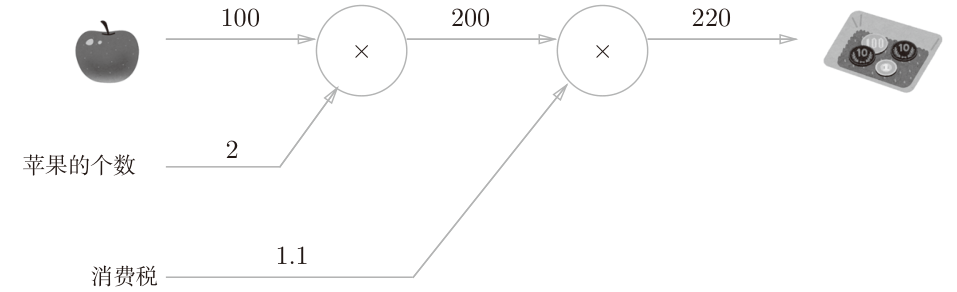
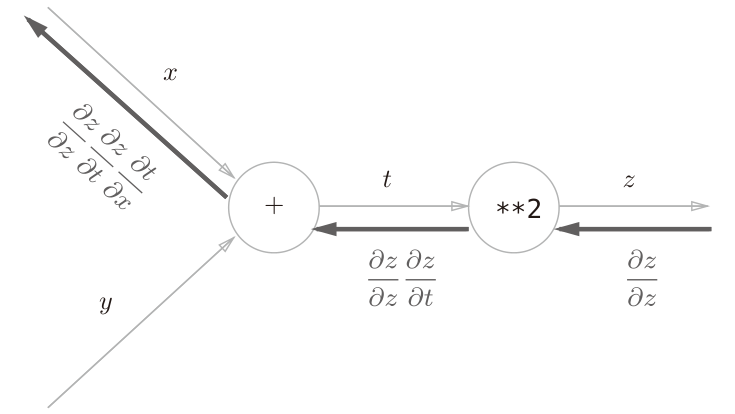
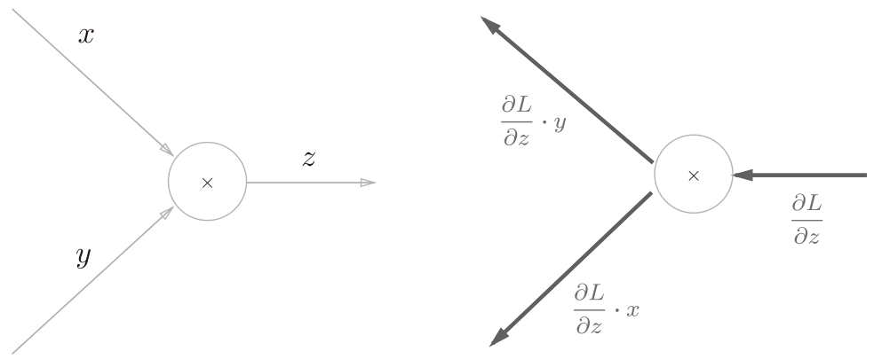
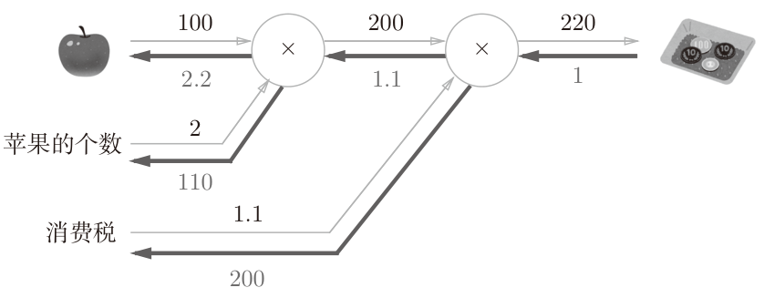
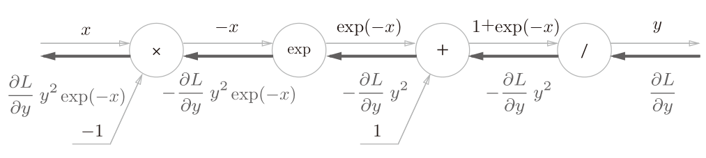
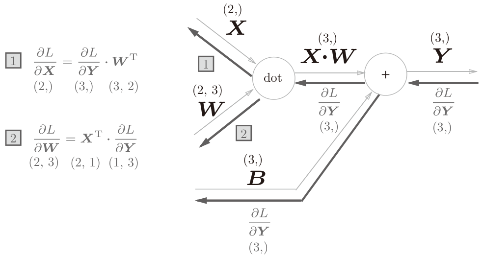
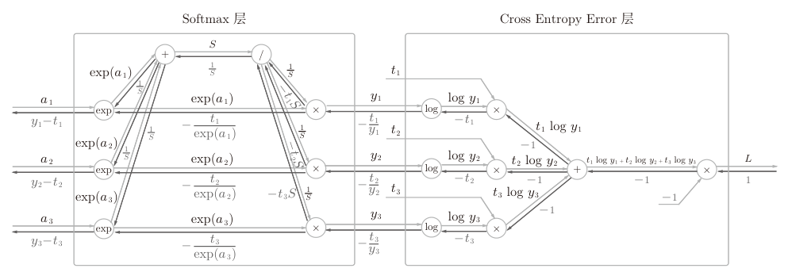

##  《深度学习入门：基于Python的理论与实现》 误差反向传播法

[日]斋藤康毅

### 误差反向传播法

有两种方法：一种是基于数学式；另一种是基于计算图(computational graph)。

### 计算图

计算图将计算过程用图形表示出来。这里说的图形是数据结构图，通过多个节点和边表示（连接节点的直线称为“边”）

计算图通过节点和箭头表示计算过程。节点用圆圈表示，节点中是计算方法，边线上是变量。将计算的中间结果写在箭头的上方，表示各个节点的计算结果从左向右传递。

计算图举例：太郎在超市买了2个100日元一个的苹果，消费税是10%，请计算支付金额。




上图从左到右，第一步先`100*2` 计算出总价为200，第二步 `200*1.1`额外加上消费税。这种 “从左向右进行计算”是一种正方向上的传播，简称为**正向传播(forward propagation)**。正向传播是从计算图出发点到结束点的传播。**反向传播(backward propagation)**就是从右向左的传播。

计算图的特征是可以通过传递**“局部计算”**获得最终结果。“局部”这个词的意思是“与自己相关的某个小范围”。局部计算是指，无论全局发生了什么，都能只根据与自己相关的信息输出接下来的结果，例如第一步`100*2`计算时不用考虑消费税的计算。

#### 计算图优点

* 局部计算一般都很简单，无论全局的计算有多么复杂，各个步骤只需要完成局部计算，通过传递它的计算结果，可以获得全局的复杂计算的结果，从而简化问题。
* 利用计算图可以将中间的计算结果全部保存起来（比如，计算进行到2个苹果时的金额是200日元、加上消费税之前的金额650日元等）。
* 使用计算图最大的原因是，可以**通过反向传播高效计算导数**

假设我们想知道苹果价格的上涨会在多大程度上影响最终的支付金额？

即求“支付金额关于苹果的价格的导数”。设苹果的价格为x，支付金额为L，则相当于求$\frac{\partial L}{\partial x}$，这个导数的值表示当苹果的价格稍微上涨时，支付金额会增加多少。计算中途求得的导数的结果（中间传递的导数）可以被共享，从而可以高效地计算多个导数。综上，计算图的优点是，**可以通过正向传播和反向传播高效地计算各个变量的导数值**。

### 链式法则(chain rule)

 **复合函数**是由多个函数构成的函数。比如，$z=(x+y)^2$是由$z=t^2$和$t = x + y$构成的。

链式法则是关于复合函数的导数的性质: **如果某个函数由复合函数表示，则该复合函数的导数可以用构成复合函数的各个函数的导数的乘积表示**。
$$
\frac{\partial z}{\partial x} = \frac{\partial z}{\partial t}\frac{\partial t}{\partial x}=2t \times 1 = 2(x+y)
$$
$z=(x+y)^2$的计算过程使用计算图表示，正向先进行了x+y后，再对第一步的结果t进行平方得到最终结果z




反向传播的计算顺序是，先将**节点的输入信号乘以节点的局部导数（偏导数），然后再传递给下一个节点**。上图以对x求偏导数:

1. 从右向左第一个节点而言，就是节点输入$\frac{\partial z}{\partial z}$乘以$z=t^2$的导数，即$\frac{\partial z}{\partial z}\frac{\partial z}{\partial t}$ 也就是$1\times 2t=2(x+y)$；
2. 下一个节点的输入$\frac{\partial z}{\partial z}\frac{\partial z}{\partial t}$ 乘以$t=x+y$对x的导数，即$\frac{\partial z}{\partial z}\frac{\partial z}{\partial t}\frac{\partial t}{\partial x}$ 也就是$2(x+y)\times 1= 2(x+y)$

根据链式法则，最左边的反向传播的结果$\frac{\partial z}{\partial z}\frac{\partial z}{\partial t}\frac{\partial t}{\partial x}=\frac{\partial z}{\partial z}\frac{\partial z}{\partial t} = \frac{\partial z}{\partial x}$ ，对应“z关于x的导数”。

计算图反向传播是基于链式法则的

### 反向传播

#### 加法的反向传播

加法反向传播将从上游传过来的输入导数乘以1(因为**加法局部计算的导数为1**，如上面例子最左侧节点x+y)，然后传向下游，所以输入的值会原封不动地流向下一个节点。

#### 乘法的反向传播

乘法的反向传播会将上游的值乘以正向传播时的输入信号的“翻转值”后传递给下游。因为对于乘法计算$z=xy$，如果对x求导数$\frac{\partial z}{\partial x}=y$，所以上游输入的值乘以导数y就是对x的输出。




翻转值表示一种翻转关系：正向传播时信号是x的话，反向传播时则是y；正向传播时信号是y的话，反向传播时则是x。实现乘法节点的反向传播时，要保存正向传播的输入信号。

以之前买苹果的例子，计算图是两个乘法运算，支付金额对苹果的价格的导数是2.2，苹果的个数的导数是110，消费税的导数是200。这可以解释为，如果消费税和苹果的价格增加相同的值，则消费税将对最终价格产生200倍大小的影响，苹果的价格将产生2.2倍大小的影响。不过，因为这个例子中消费税和苹果的价格的量纲不同，所以才形成了这样的结果（消费税的1是100%，苹果的价格的1是1日元）。




### 各个层的实现

我们将把构建神经网络的“层”实现为一个类。这里所说的“层”是神经网络中功能的单位。比如，负责sigmoid函数的Sigmoid、负责矩阵乘积的Affine等，都以层为单位进行实现。

层的实现中有两个共通的方法**forward()对应正向传播**，**backward()对应反向传播**。

#### 简单层的实现

计算图的乘法节点称为“乘法层”(MulLayer)，加法节点称为“加法层”(AddLayer)。

**首先，生成必要的层，以合适的顺序调用正向传播的forward()方法。然后，用与正向传播相反的顺序调用反向传播的backward()方法，就可以求出想要的导数。**计算图中层的实现非常简单，使用这些层可以进行复杂的导数计算

```python
class MulLayer:
    '''乘法层'''
    def __init__(self):
        self.x = None
        self.y = None

    def forward(self, x, y):
        self.x = x
        self.y = y
        out = x * y

        return out

    def backward(self, dout):
        dx = dout * self.y # 翻转x和y
        dy = dout * self.x

        return dx, dy
    
def test_mul_layer():
    apple = 100
    num = 2
    tax = 1.1

    mul_apple_layer = MulLayer()
    mul_tax_layer = MulLayer()
    #向前计算总额
    apple_price = mul_apple_layer.forward(apple, num)
    total_price = mul_tax_layer.forward(apple_price, tax)
    print(total_price) # 220.00000000000003

    #反向计算导数
    dtotal_price = 1
    dapple_price, dtax = mul_tax_layer.backward(dtotal_price)
    dapple, dnum = mul_apple_layer.backward(dapple_price)# 这里是dapple_price，不是apple_price
    print(f"dapple:{dapple}, dtax:{dtax}") # dapple:2.2, dtax:200
    
class AddLayer:
    def __init__(self):
        pass

    def forward(self, x, y):
        out = x + y
        return out

    def backward(self, dout):
        '''将上游传来的导数(dout)原封不动地传递给下游'''
        dx = dout * 1
        dy = dout * 1
        return dx, dy
```

`forward()`接收x和y两个参数，将它们相乘后输出。`backward()`将从上游传来的导数`dout`乘以正向传播的翻转值，然后传给下游。

要注意`backward()`的参数中需要输入**“关于正向传播时的输出变量的导数”**。

#### 激活函数层的实现

##### 激活函数ReLU(Rectified Linear Unit)

ReLU函数及其导数为
$$
y = \begin{cases}
x, & (x \gt 0) \\
0, & (x \leq 0)
\end{cases}, 

\frac{\partial y}{\partial x} = \begin{cases}
1, & (x \gt 0) \\
0, & (x \leq 0)
\end{cases}
$$
如果正向传播时的输入x大于0，则反向传播会将上游的值原封不动地传给下游$\frac{\partial L}{\partial y}\times 1 = \frac{\partial L}{\partial y}$。反过来，如果正向传播时的x小于等于0，则反向传播中传给下游的信号将停在此处($\frac{\partial L}{\partial y}\times 0 = 0$ )。

```python
class Relu:
    def __init__(self):
        self.mask = None

    def forward(self, x):
        self.mask = (x <= 0)
        out = x.copy()
        out[self.mask] = 0
        return out

    def backward(self, dout):
        dout[self.mask] = 0
        dx = dout
        return dx
```

Relu类有实例变量mask。这个变量mask是由True/False构成的NumPy数组，它会把正向传播时的输入x的元素中小于等于0的地方保存为True，其他地方（大于0的元素）保存为False。如果正向传播时的输入值小于等于0，则反向传播的值为0。因此，反向传播中会使用正向传播时保存的mask，将从上游传来的dout的mask中的元素为True的地方设为0。

##### sigmoid函数

$$
y(x) = \frac{1}{1+e^{-x}}
$$

计算图正向和反向流程如下




其中最右的节点$y = \frac{1}{x}$的导数为$\frac{\partial y}{\partial x}=-x^{(-1-1)}=-\frac{1}{x^2}=-y^2$

$y = e^x$的导数为$\frac{\partial y}{\partial x} = e^x$，正向的函数为$y = e^{-x}$所以它对x的导数为$e^{-x}$，这个节点反向计算使用上游的输入$-\frac{\partial L}{\partial y}y^2$乘以计算函数的导数$e^{-x}$为$-\frac{\partial L}{\partial y}y^2e^{-x}$

最后一个节点是乘法节点，把上游输入乘以反转的另一个输入，这里是-1，所以最终结果是$\frac{\partial L}{\partial y}y^2e^{-x}$。这个输出还可以进行公式简化得到
$$
\frac{\partial L}{\partial y}y^2e^{-x} = \frac{\partial L}{\partial y}\frac{1}{(1+e^{-x})^2}e^{-x} \\
= \frac{\partial L}{\partial y}\frac{1}{(1+e^{-x})}\frac {e^{-x}}{(1+e^{-x})} \\
= \frac{\partial L}{\partial y} y(1-y)
$$
从上式可以看出，Sigmoid层的反向传播，只根据正向传播的输出就能计算出来。

```python
class Sigmoid:
    def __init__(self):
        self.out = None

    def forward(self, x):
        out = sigmoid(x)
        # 将输出保存在了实例变量out中。反向传播时，使用该变量out进行计算
        self.out = out
        return out

    def backward(self, dout):
        dx = dout * (1.0 - self.out) * self.out

        return dx
```


#### Affine层的实现

神经网络的正向传播中进行的**矩阵的乘积运算在几何学领域被称为“仿射变换”**。因此，这里将进行仿射变换的处理实现为“Affine层”。

神经元的加权和可以用`Y = np.dot(X, W) + B`计算出来。然后，`Y`经过激活函数转换后，传递给下一层，这就是神经网络正向传播的流程。

矩阵的乘积与偏置的和的运算用计算图表示




矩阵的乘积（“dot”节点）的反向传播可以通过组建使矩阵对应维度的元素个数一致的乘积运算而推导出来。例如输入矩阵$X=(x_0,x_1,...x_n)$ ，损失函数L对X的偏导数$\frac{\partial L}{\partial X}=(\frac{\partial L}{\partial x_0}, \frac{\partial L}{\partial x_1}, .., \frac{\partial L}{\partial x_n})$ ，可以看出$X$和$\frac{\partial L}{\partial X}$形状相同

因为矩阵的乘积运算要求对应维度的元素个数保持一致，比如，$\frac{\partial L}{\partial Y}$的形状是(3,)，$W$的形状是(2, 3)时，可以让$\frac{\partial L}{\partial Y}$和$W^T$乘积，使得$\frac{\partial L}{\partial X}$的形状为(2,)，从而推出上图中的公式1。

正向传播时，偏置会被加到每一个数据（第1个、第2个……）上。因此反向传播时，各个数据的反向传播的值需要汇总为偏置的元素。

```python
class Affine:
    def __init__(self, W, b):
        self.W =W
        self.b = b
        
        self.x = None
        self.original_x_shape = None
        # 权重和偏置参数的导数
        self.dW = None
        self.db = None

    def forward(self, x):
        # 对应张量 假设为(N,M)
        self.original_x_shape = x.shape
        x = x.reshape(x.shape[0], -1)
        self.x = x
        # Y = XW+B
        out = np.dot(self.x, self.W) + self.b
        return out

    def backward(self, dout):
        # dX = dY * W^T
        dx = np.dot(dout, self.W.T)
        # dW = X^T * dY
        self.dW = np.dot(self.x.T, dout)
        # 偏置的反向传播会对这N行数据的导数按元素进行对应求和
        self.db = np.sum(dout, axis=0)
        
        dx = dx.reshape(*self.original_x_shape)  # 还原输入数据的形状（对应张量）
        return dx
```

#### Softmax层的实现

神经网络中未被正规化的输出结果（Softmax层前面的Affine层的输出）有时被称为“得分”。神经网络的**推理只需要给出一个答案的情况下，因为此时只对得分最大值感兴趣，所以不需要Softmax层。但是在神经网络的学习阶段则需要Softmax层。**




Softmax层的反向传播得到了$(y_1-t_1, y_2-t_2,...,y_n-t_n)$，即Softmax层的输出和监督标签的差分。**神经网络的反向传播会把这个差分表示的误差传递给前面的层，这是神经网络学习中的重要性质**。

神经网络学习的目的就是通过调整权重参数，使神经网络的输出（Softmax的输出）接近监督标签。因此，必须将神经网络的输出与监督标签的误差高效地传递给前面的层。$(y_1-t_1, y_2-t_2,...,y_n-t_n)$正是Softmax层的输出与监督标签的差，直截了当地表示了当前神经网络的输出与监督标签的误差

使用交叉熵误差作为softmax函数的损失函数后，反向传播得到$(y_1-t_1, y_2-t_2,...,y_n-t_n)$这样“漂亮”的结果。实际上，这样“漂亮”的结果并不是偶然的，而是为了得到这样的结果，特意设计了交叉熵误差函数。回归问题中输出层使用“恒等函数”，损失函数使用“平方和误差”，也是出于同样的理由。也就是说，使用“平方和误差”作为“恒等函数”的损失函数，反向传播才能得到$(y_1-t_1, y_2-t_2,...,y_n-t_n)$这样“漂亮”的结果。

```python
# 新的交叉熵损失函数
def cross_entropy_error(y, t):
    if y.ndim == 1:
        t = t.reshape(1, t.size)
        y = y.reshape(1, y.size)
        
    # 监督数据是one-hot-vector的情况下，转换为正确解标签的索引
    if t.size == y.size:
        t = t.argmax(axis=1)
             
    batch_size = y.shape[0]
    return -np.sum(np.log(y[np.arange(batch_size), t] + 1e-7)) / batch_size

class SoftmaxWithLoss:
    def __init__(self):
        self.loss = None
        self.y = None # softmax的输出
        self.t = None # 监督数据

    def forward(self, x, t):
        self.t = t
        self.y = softmax(x)
        self.loss = cross_entropy_error(self.y, self.t)
        
        return self.loss

    def backward(self, dout=1):
        batch_size = self.t.shape[0]
        if self.t.size == self.y.size: # 监督数据是one-hot-vector的情况
            # 将要传播的值除以批的大小(batch_size)后，传递给前面的层的是单个数据的误差
            dx = (self.y - self.t) / batch_size
        else:
            dx = self.y.copy()
            dx[np.arange(batch_size), self.t] -= 1
            # 将要传播的值除以批的大小(batch_size)后，传递给前面的层的是单个数据的误差
            dx = dx / batch_size
        
        return dx
```

### 误差反向传播法的实现

OrderedDict是有序字典，“有序”是指它可以记住向字典里添加元素的顺序。因此，神经网络的正向传播只需按照添加元素的顺序调用各层的forward()方法就可以完成处理，而反向传播只需要按照相反的顺序调用各层即可。因为Affine层和ReLU层的内部会正确处理正向传播和反向传播，所以这里要做的事情仅仅是以正确的顺序连接各层，再按顺序（或者逆序）调用各层。

新的两层网络实现

```python
from collections import OrderedDict
from layers import *    
class BackwardTwoLayerNet:
    def __init__(self, input_size, hidden_size, output_size, weight_init_std = 0.01):
        # 初始化权重
        self.params = {}
        self.params['W1'] = weight_init_std * np.random.randn(input_size, hidden_size)
        self.params['b1'] = np.zeros(hidden_size)
        self.params['W2'] = weight_init_std * np.random.randn(hidden_size, output_size) 
        self.params['b2'] = np.zeros(output_size)

        # 生成层，有序词典确保神经网络的正向传播只需按照添加元素的顺序调用各层的forward()方法
        # 而反向传播只需要按照相反的顺序调用各层即可
        self.layers = OrderedDict()
        self.layers['Affine1'] = Affine(self.params['W1'], self.params['b1']) 
        self.layers['Relu1'] = Relu() #第一层
        self.layers['Affine2'] = Affine(self.params['W2'], self.params['b2'])
        self.lastLayer = SoftmaxWithLoss() # 输出层
        
    def predict(self, x):
        for layer in self.layers.values():
            x = layer.forward(x)
        
        return x
        
    # x:输入数据, t:监督数据
    def loss(self, x, t):
        y = self.predict(x)
        return self.lastLayer.forward(y, t)
    
    def accuracy(self, x, t):
        y = self.predict(x)
        y = np.argmax(y, axis=1)
        if t.ndim != 1 : t = np.argmax(t, axis=1)
        
        accuracy = np.sum(y == t) / float(x.shape[0])
        return accuracy
        
    # x:输入数据, t:监督数据
    def numerical_gradient(self, x, t):
        loss_W = lambda W: self.loss(x, t)
        
        grads = {}
        grads['W1'] = numerical_gradient(loss_W, self.params['W1'])
        grads['b1'] = numerical_gradient(loss_W, self.params['b1'])
        grads['W2'] = numerical_gradient(loss_W, self.params['W2'])
        grads['b2'] = numerical_gradient(loss_W, self.params['b2'])
        
        return grads
    # 反向传播    
    def gradient(self, x, t):
        # forward
        self.loss(x, t)

        # backward
        dout = 1
        # softMax loss的反向传播
        dout = self.lastLayer.backward(dout)
        
        layers = list(self.layers.values())
        layers.reverse() # 层倒序
        for layer in layers:
            # 逐层反向传播
            dout = layer.backward(dout)

        grads = {}
        # 得到每层的权重和偏置的偏导数
        grads['W1'], grads['b1'] = self.layers['Affine1'].dW, self.layers['Affine1'].db
        grads['W2'], grads['b2'] = self.layers['Affine2'].dW, self.layers['Affine2'].db

        return grads
```

这里还保留了数值微分求梯度的方法`numerical_gradient()`，用来确认数值微分求出的梯度结果和误差反向传播法求出的结果是否一致（严格地讲，是非常相近），这个操作称为**梯度确认(gradient check)**。确认实现的误差反向传播算法是否正确。

```python
def gradient_check():
    # 读入数据
    (x_train, t_train), (x_test, t_test) = load_mnist(normalize=True, one_hot_label=True)

    network = BackwardTwoLayerNet(input_size=784, hidden_size=50, output_size=10)

    x_batch = x_train[:3]
    t_batch = t_train[:3]
    # 分别使用两种方法计算梯度
    grad_numerical = network.numerical_gradient(x_batch, t_batch)
    grad_backprop = network.gradient(x_batch, t_batch)

    for key in grad_numerical.keys():
        diff = np.average( np.abs(grad_backprop[key] - grad_numerical[key]) )
        print(key + ":" + str(diff))
# 最终输出的两个方法的误差可以忽略        
W1:3.350906623218549e-10
b1:2.0746353441701993e-09
W2:4.78867556806132e-09
b2:1.397927196625237e-07
```

使用新的网络训练MNIST数据，和上一章的程序只是使用的网络类名称不同，其他完全一样

```python
def network_train():
    # 读入数据
    (x_train, t_train), (x_test, t_test) = load_mnist(normalize=True, one_hot_label=True)
    # 图像大小为28*28，所以输入大小为784，输出为10个数字的概率，所以大小为10，中间隐藏层这里定义为50个
    network = BackwardTwoLayerNet(input_size=784, hidden_size=50, output_size=10)
    import time
    start_time = time.time()

    iters_num = 10000  # 梯度下降法执行总的次数
    train_size = x_train.shape[0] # 60000
    batch_size = 100  # mini-batch大小为100个样本数据
    learning_rate = 0.1  # 梯度下降中用到的学习率

    train_loss_list = [] # 缓存每一轮次训练的损失函数值
    train_acc_list = []
    test_acc_list = []

    # 每一个epoch执行的次数，用来把所有的训练数据都过一遍
    iter_per_epoch = max(train_size / batch_size, 1)

    for i in range(iters_num):
        # 1. 获取mini-batch，挑选出batch_size个数字，利用矩阵计算一次处理batch_size个数据
        batch_mask = np.random.choice(train_size, batch_size)
        x_batch = x_train[batch_mask] # 选择batch_size个图像数据出来，这里是100行图像数据
        t_batch = t_train[batch_mask]
        #print("x_batch.shape:", x_batch.shape) # x_batch.shape: (100, 784)
        
        # 2. 计算梯度        
        #grad = network.numerical_gradient(x_batch, t_batch)
        grad = network.gradient(x_batch, t_batch)
        
        # 3. 更新参数 根据每一个参数的梯度来更新参数， 新参数值 -= 学习率x梯度 
        for key in ('W1', 'b1', 'W2', 'b2'):
            network.params[key] -= learning_rate * grad[key]
        
        loss = network.loss(x_batch, t_batch)
        train_loss_list.append(loss)
        # 统计精度
        if i % iter_per_epoch == 0:
            train_acc = network.accuracy(x_train, t_train)
            test_acc = network.accuracy(x_test, t_test)
            train_acc_list.append(train_acc)
            test_acc_list.append(test_acc)
            print(f"{i} train acc {train_acc} test acc {test_acc} ")

    end_time = time.time()
    execution_time_minutes = (end_time - start_time) / 60
    print(f"Training completed in {execution_time_minutes:.2f} minutes.")

    # 绘制图形
    markers = {'train': 'o', 'test': 's'}
    x = np.arange(len(train_acc_list))
    plt.plot(x, train_acc_list, label='train acc')
    plt.plot(x, test_acc_list, label='test acc', linestyle='--')
    plt.xlabel("epochs")
    plt.ylabel("accuracy")
    plt.ylim(0, 1.0)
    plt.legend(loc='lower right')
    plt.show()
    
# 总时间比上一章使用优化版本的时间长了一点，第一组结果出现时间比之前的长，应该是初始化这些层增加了时间，但是准确率要高一点
0 train acc 0.08253333333333333 test acc 0.0814
600 train acc 0.90405 test acc 0.9069
1200 train acc 0.9243166666666667 test acc 0.9267
1800 train acc 0.9366666666666666 test acc 0.9374
2400 train acc 0.9470833333333334 test acc 0.9437
3000 train acc 0.9510166666666666 test acc 0.9453
3600 train acc 0.9593666666666667 test acc 0.9543
4200 train acc 0.9628833333333333 test acc 0.9569
4800 train acc 0.9667166666666667 test acc 0.9609
5400 train acc 0.9679 test acc 0.9609
6000 train acc 0.9722 test acc 0.965
6600 train acc 0.9724166666666667 test acc 0.9654
7200 train acc 0.9744833333333334 test acc 0.9658
7800 train acc 0.9746833333333333 test acc 0.9669
8400 train acc 0.9766 test acc 0.9677
9000 train acc 0.97815 test acc 0.9698
9600 train acc 0.97935 test acc 0.9698
Training completed in 0.87 minutes.
```


### 小结

通过使用计算图，可以直观地把握计算过程

计算图的节点是由局部计算构成的。局部计算构成全局计算

计算图的正向传播进行一般的计算。通过计算图的反向传播，可以计算各个节点的导数。