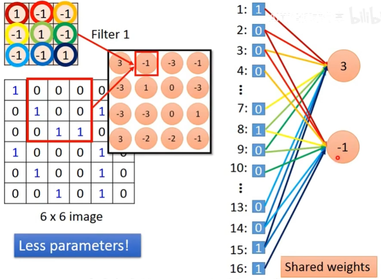
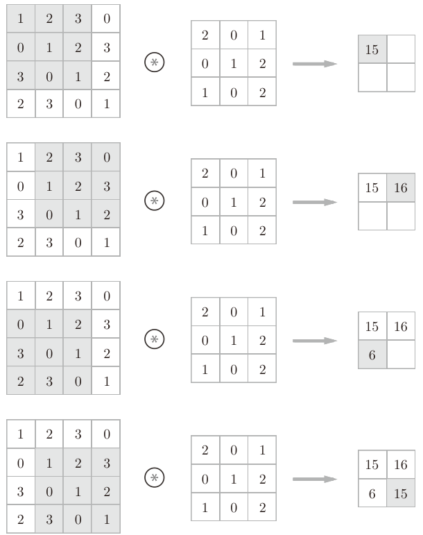
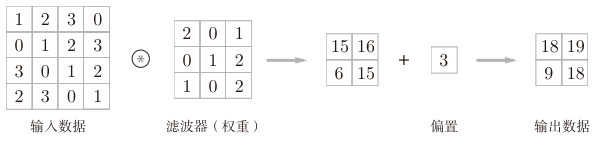
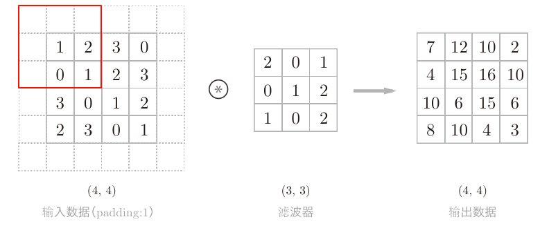
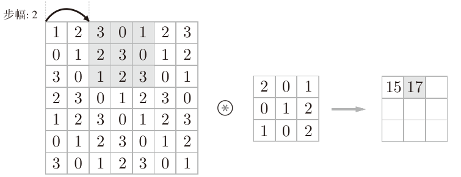
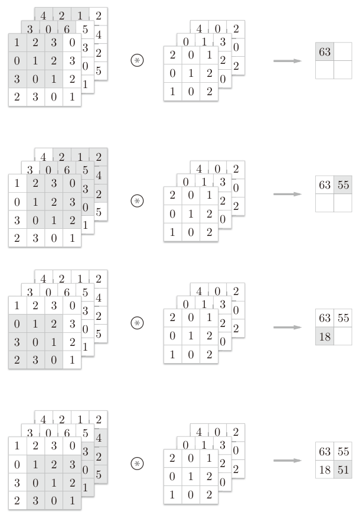
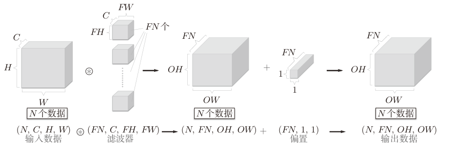
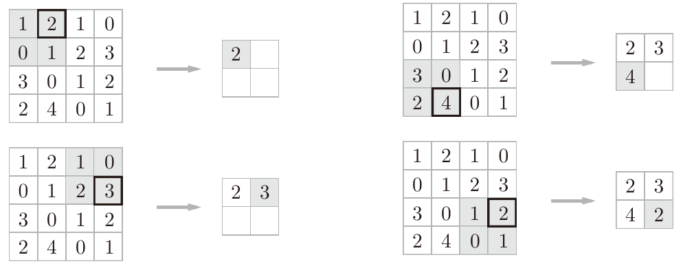
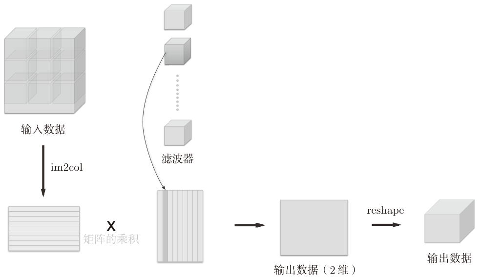
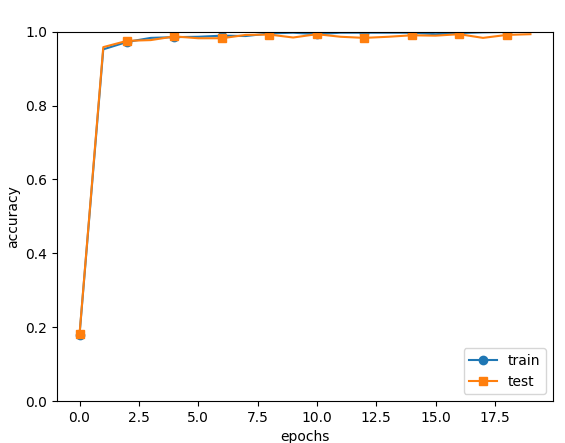

##  《深度学习入门：基于Python的理论与实现》 卷积神经网络

[日]斋藤康毅

卷积神经网络(Convolutional Neural Network，CNN)。CNN被用于图像识别、语音识别等各种场合，在图像识别的比赛中，基于深度学习的方法几乎都以CNN为基础。

### 卷积神经网络整体结构

全连接(fully-connected)：相邻层的所有神经元之间都有连接，例如第二层的第一个节点与第一层的所有神经元节点都有连接。

CNN的基本结构为`Convolution -> ReLU -> Pooling -> Convolution -> ReLU -> Pooling -> Affine -> ReLU -> Affine -> Softmax`

只在靠近输出的层中使用了之前的“Affine - ReLU”组合，最后的输出层中使用了之前的“Affine - Softmax”组合。

### 卷积层

全连接层存在什么问题呢？

那就是数据的形状被“忽视”了。比如，输入数据是图像时，图像通常是高、长、通道方向上的3维形状。但是，向全连接层输入时，需要将3维数据拉平为1维数据。实际上，前面提到的使用了MNIST数据集的例子中，输入图像就是1通道、高28像素、长28像素的(1, 28, 28)形状，但却被排成1列，以784个数据的形式输入到最开始的Affine层。

图像是3维形状，这个形状中应该含有重要的空间信息。比如，空间上邻近的像素为相似的值、RGB的各个通道之间分别有密切的关联性、相距较远的像素之间没有什么关联等，3维形状中可能隐藏有值得提取的本质模式。但是，因为全连接层会忽视形状，将全部的输入数据作为相同的神经元（同一维度的神经元）处理，所以无法利用与形状相关的信息。这也是注意力机制改进的地方，2017年google发布的attention is all you need，这本书是2016年出版的。

CNN中，有时将卷积层的输入输出数据称为**特征图(feature map)**。其中，卷积层的输入数据称为输入特征图(input feature map)，输出数据称为输出特征图(output feature map)。卷积上可以看作是删减了全连接中的一些连接线的网络。

 
  

#### 卷积运算

卷积运算相当于图像处理中的滤波器运算。输入数据是有高长方向的形状的数据，滤波器也一样，有高长方向上的维度。假设用(height, width)表示数据和滤波器的形状，则在本例中，输入大小是(4, 4)，滤波器大小是(3, 3)，输出大小是(2, 2)。另外，有的文献中也会用“卷积核”这个词来表示这里所说的“滤波器”。

 
  

对于输入数据，卷积运算以一定间隔**滑动滤波器的窗口**并应用，然后将**各个位置上滤波器的元素和输入的对应元素相乘**，然后**再求和**（有时将这个计算称为乘积累加运算）。然后，将这个结果保存到输出的对应位置。将这个过程在所有位置都进行一遍，就可以得到卷积运算的输出。

CNN中，滤波器的参数就是卷积层的参数，同时CNN中也存在偏置。

 
  

卷积运算的偏置只有1个，这个值会被加到应用了滤波器的所有元素上。

#### 填充(Padding)

在进行卷积层的处理之前，有时要向输入数据的周围填入固定的数据（比如0等），这称为填充(padding)，是卷积运算中经常会用到的处理。下图中，对大小为(4, 4)的输入数据应用了幅度为1的填充。“幅度为1的填充”是指用幅度为1像素的**0填充周围**。

 
  

通过填充，大小为(4, 4)的输入数据变成了(6, 6)的形状。然后，应用大小为(3, 3)的滤波器，生成了大小为(4, 4)的输出数据。填充的值也可以设置成2、3等任意的整数。如果将填充设为2，则输入数据的大小变为(8, 8)；如果将填充设为3，则大小变为(10, 10)

使用填充主要是为了调整输出的大小。比如，对大小为(4, 4)的输入数据应用(3, 3)的滤波器时，输出大小变为(2, 2)，相当于输出大小比输入大小缩小了2个元素。这在反复进行多次卷积运算的深度网络中会成为问题。为什么呢？**因为如果每次进行卷积运算都会缩小空间，那么在某个时刻输出大小就有可能变为1，导致无法再应用卷积运算。为了避免出现这样的情况，就要使用填充。**

#### 步幅(stride)

应用滤波器的位置间隔称为步幅(stride)。之前的例子中步幅都是1，如果将步幅设为2，应用滤波器的窗口的间隔变为2个元素。

 
  

增大步幅后，输出大小会变小。而增大填充后，输出大小会变大。

#### 输出大小计算

假设输入大小为(H,W)，滤波器大小为(FH,FW)，输出大小为(OH,OW)，填充为P，步幅为S。输出大小为：
$$
OH = \frac{H+2P-FH}{S} +1 \\
OW = \frac{W+2P-FW}{S} +1 
$$
当输出大小无法除尽时（结果是小数时），需要采取报错等对策。顺便说一下，根据深度学习的框架的不同，当值无法除尽时，有时会向最接近的整数四舍五入，不进行报错而继续运行。

#### 多维数据的卷积计算

对于彩色图像RGB三个颜色对应的三个通道，在进行卷积计算时，会按通道进行输入数据和滤波器的卷积运算，并将结果相加，从而得到输出。

通道方向上有多个特征图时，会按通道进行输入数据和滤波器的卷积运算，并将结果相加，从而得到输出。

 
  

输入数据和滤波器的通道数相同，每个通道的滤波器的值可以不同，但是每个通道的滤波器Shape要都相同。

把3维数据表示为多维数组时，书写顺序为(channel, height, width)。比如，通道数为C、高度为H、长度为W的数据的形状可以写成(C,H,W)。滤波器也一样，要按(channel, height, width)的顺序书写。比如，通道数为C、滤波器高度为FH(Filter Height)、长度为FW(Filter Width)时，可以写成(C,FH,FW)。

上图中3个通道的输入数据和三个通道的滤波器卷积计算后，数据输出是1张特征图，它的通道数为1。如果要在通道方向上也拥有多个卷积运算的输出，该怎么做呢？

为了可以让输出有多个通道，需要用到多个滤波器（权重）。通过应用FN个滤波器，输出特征图也生成了FN个。如果将这FN个特征图汇集在一起，就得到了形状为(FN,OH,OW)的方块，这个输出就可以作为下一层的输入了。

**对于灰度图像，这里特征图的通道使用滤波器的个数来表示，每个滤波器表示一个特征维度**，例如某一个滤波器表示是否是一个🍎的特征，而另一个滤波器表示是否是一只🐱的特征

所以滤波器是一个4维数据，它的权重数据要按(output_channel, input_channel, height, width)的顺序书写。

 
  

通过矩阵的批处理可以将N次的卷积滤波处理汇总成了1次进行。

### 池化层(Pooling)

池化是缩小高、长方向上的空间的运算。池化会吸收输入数据的偏差（根据数据的不同，结果有可能不一致）

 
  

上图的例子是按步幅2进行2×2的Max池化时的处理顺序。**“Max池化”**是获取最大值的运算，“2×2”表示目标区域的大小。Average池化则是计算目标区域的平均值，在图像识别领域，主要使用Max池化。

◆ 池化层和卷积层不同，没有要学习的参数。池化只是从目标区域中取最大值（或者平均值），所以不存在要学习的参数。

经过池化运算，输入数据和输出数据的通道数不会发生变化。池化计算是按通道独立进行的。

### 网络层实现

#### 卷积层实现

以之前图像识别为例，输入数据为`(批次大小，通道数量，图像高度，图像宽度)`，所以输入的数据是4维的。要对这个4维数据进行卷积运算，最直接的方法是通过for循环遍历每一个批次的每一个通道的数据，再进行实际的卷积计算，但这样的效率很低。

可以通过im2col(image to column)函数把多维的图像数据转换为2维的矩阵。对可以通过对一个批次中的一个3维的输入数据应用`im2col`后，数据转换为2维矩阵（正确地讲，是把包含批数量的4维数据转换成了2维数据）。

当滤波器的应用区域重叠的情况下，使用`im2col`展开后，展开后的元素个数会多于原方块的元素个数。因此，使用`im2col`的实现存在比普通的实现消耗更多内存的缺点。但是，汇总成一个大的矩阵进行计算，对计算机的计算颇有益处。比如，在矩阵计算的库（线性代数库）等中，矩阵计算的实现已被高度最优化，可以高速地进行大矩阵的乘法运算。

 
  

使用矩阵行列分解的和组合的方式更容易理解这个计算过程，例如输入数据为`(N, C, H, W)`，根据滤波器`(FN, C, FH, FW)`计算出的输出的大小为`(OH,OW)`。通过`im2col`计算后输出的矩阵为`(N*OH*OW, C*FH*FW)`，它的行是这个批次中数据数量个预期输出的大小的行，列是通道个数与滤波器大小的乘积，这个输出可以和`(C*FH*FW, FN)`即FN个滤波器进行矩阵乘法，最终得到`(N*OH*OW, FN)`，通过reshape重新展开，就得到`(N, FN, OH, OW)`最终的输出。

`im2col`的实现如下

```python 
def im2col(input_data, filter_h, filter_w, stride=1, pad=0):
    """
    input_data : 由(数据量, 通道, 高, 长)的4维数组构成的输入数据
    filter_h : 滤波器的高
    filter_w : 滤波器的长
    stride : 步幅
    pad : 填充
    -------
    col : 2维数组
    """
    N, C, H, W = input_data.shape
    out_h = (H + 2*pad - filter_h)//stride + 1
    out_w = (W + 2*pad - filter_w)//stride + 1

    # 只在在高度和宽度维度上进行对称填充，不填充批量维度和通道维度
    img = np.pad(input_data, [(0,0), (0,0), (pad, pad), (pad, pad)], 'constant')
    # 输出数据，需要把每个数据的每个通道的和每个滤波器的重叠位置都展开成一行
    col = np.zeros((N, C, filter_h, filter_w, out_h, out_w))
    # 对于滤波器的每个位置 (y, x)
    for y in range(filter_h): # 假设滤波器维3*3
        y_max = y + stride*out_h # 输出高度为2，步长为1，则y_max = 0 + 1*2 = 2
        for x in range(filter_w):
            x_max = x + stride*out_w
            # 从索引 y 开始，到索引 y_max（不包括）结束，步长为 stride
            col[:, :, y, x, :, :] = img[:, :, y:y_max:stride, x:x_max:stride]
    #(N, out_h, out_w, C, filter_h, filter_w)
    col = col.transpose(0, 4, 5, 1, 2, 3).reshape(N*out_h*out_w, -1)
    return col
def test_img2col():
    x1 = np.random.rand(1, 3, 7, 7)
    col1 = im2col(x1, 5, 5, stride=1, pad=0)
    # 第1维：out_h:3, out_w:3，1*3*3 = 9
    # 第2维的元素个数均为75。这是滤波器（通道为3、大小为5×5）的元素个数的总和
    print(col1.shape) # (9, 75) 输出数据的第2维是C*filter_h*filter_w

    x2 = np.random.rand(10, 3, 7, 7) # 10个数据
    col2 = im2col(x2, 5, 5, stride=1, pad=0)
    print(col2.shape) # (90, 75)
```

卷积层代码

```python
class Convolution:
    def __init__(self, W, b, stride=1, pad=0):
        self.W = W
        self.b = b
        self.stride = stride
        self.pad = pad
        
        # 中间数据（backward时使用）
        self.x = None   
        self.col = None
        self.col_W = None
        
        # 权重和偏置参数的梯度
        self.dW = None
        self.db = None

    def forward(self, x):
        FN, C, FH, FW = self.W.shape
        N, C, H, W = x.shape
        out_h = 1 + int((H + 2*self.pad - FH) / self.stride)
        out_w = 1 + int((W + 2*self.pad - FW) / self.stride)
	    # 输出为(FN*out_h*out_w, C*FH*FW)
        col = im2col(x, FH, FW, self.stride, self.pad)
        # 滤波器原始数据维度为(FN, C, FH, FW), 第一个FN为滤波器的个数，即最终输出的通道数
        col_W = self.W.reshape(FN, -1).T # (C*FH*FW, FN)
	    # 乘权重加偏置 
        out = np.dot(col, col_W) + self.b # (FN*out_h*out_w, FN)
        # 输出为(FN, FN, out_h, out_w)，第二个FN为滤波器的个数，即输出的通道数
        out = out.reshape(N, out_h, out_w, -1).transpose(0, 3, 1, 2) 

        self.x = x
        self.col = col
        self.col_W = col_W
        return out

    def backward(self, dout):
        FN, C, FH, FW = self.W.shape
        dout = dout.transpose(0,2,3,1).reshape(-1, FN)

        self.db = np.sum(dout, axis=0)
        self.dW = np.dot(self.col.T, dout)
        self.dW = self.dW.transpose(1, 0).reshape(FN, C, FH, FW)

        dcol = np.dot(dout, self.col_W.T)
        dx = col2im(dcol, self.x.shape, FH, FW, self.stride, self.pad)

        return dx
```

`reshape(FN,-1)`将参数指定为-1，这是reshape的一个便利的功能。通过在reshape时指定为-1，reshape函数会自动计算-1维度上的元素个数，以使多维数组的元素个数前后一致。比如，(10, 3, 5, 5)形状的数组的元素个数共有750个，指定reshape(10,-1)后，就会转换成(10, 75)形状的数组。

在进行卷积层的反向传播时，必须进行im2col的逆处理col2im函数来进行

#### 池化层实现

池化的应用区域按通道单独展开。 然后，只需对展开的矩阵求各行的最大值，并转换为合适的形状即可

```python
class Pooling:
    def __init__(self, pool_h, pool_w, stride=1, pad=0):
        self.pool_h = pool_h
        self.pool_w = pool_w
        self.stride = stride
        self.pad = pad
        
        self.x = None
        self.arg_max = None

    def forward(self, x):
        N, C, H, W = x.shape
        out_h = int(1 + (H - self.pool_h) / self.stride)
        out_w = int(1 + (W - self.pool_w) / self.stride)
		# 输入x为卷积层的输出(FN, C, out_h, out_w)，输出为(FN*out_h*out_w, C*pool_h*pool_w)
        col = im2col(x, self.pool_h, self.pool_w, self.stride, self.pad)
        # 把通道数据转移到第一个维度，让第2维只有需要池化的数据(FN*out_h*out_w*C, pool_h*pool_w)
        col = col.reshape(-1, self.pool_h*self.pool_w)
		# 求出第2维数据的最大值，即每行的最大值，每个池化窗口中的最大值
        arg_max = np.argmax(col, axis=1) # 给反向传播使用
        out = np.max(col, axis=1) 
        # 先分解为(N, out_h, out_w, C)，再换回标准的4维(N, C, out_h, out_w)，从而给下一层使用
        out = out.reshape(N, out_h, out_w, C).transpose(0, 3, 1, 2)

        self.x = x
        self.arg_max = arg_max

        return out

    def backward(self, dout):
        dout = dout.transpose(0, 2, 3, 1)
        
        pool_size = self.pool_h * self.pool_w
        dmax = np.zeros((dout.size, pool_size))
        dmax[np.arange(self.arg_max.size), self.arg_max.flatten()] = dout.flatten()
        dmax = dmax.reshape(dout.shape + (pool_size,)) 
        
        dcol = dmax.reshape(dmax.shape[0] * dmax.shape[1] * dmax.shape[2], -1)
        dx = col2im(dcol, self.x.shape, self.pool_h, self.pool_w, self.stride, self.pad)
        
        return dx
```

### CNN的实现

CNN的流程如下：

`Convolution -> ReLU -> Pooling -> Convolution -> ReLU -> Pooling -> Affine -> ReLU -> Affine -> Softmax`

```python
class SimpleConvNet:
    """简单的ConvNet
    conv - relu - pool - affine - relu - affine - softmax    
    Parameters
    ----------
    input_size : 输入大小（MNIST的情况下为784）
    hidden_size_list : 隐藏层的神经元数量的列表（e.g. [100, 100, 100]）
    output_size : 输出大小（MNIST的情况下为10）
    activation : 'relu' or 'sigmoid'
    weight_init_std : 指定权重的标准差（e.g. 0.01）
        指定'relu'或'he'的情况下设定“He的初始值”
        指定'sigmoid'或'xavier'的情况下设定“Xavier的初始值”
    """
    def __init__(self, input_dim=(1, 28, 28), 
                 conv_param={'filter_num':30, 'filter_size':5, 'pad':0, 'stride':1},
                 hidden_size=100, output_size=10, weight_init_std=0.01):
        filter_num = conv_param['filter_num']
        filter_size = conv_param['filter_size']
        filter_pad = conv_param['pad']
        filter_stride = conv_param['stride']
        input_size = input_dim[1]
        conv_output_size = (input_size - filter_size + 2*filter_pad) / filter_stride + 1
        pool_output_size = int(filter_num * (conv_output_size/2) * (conv_output_size/2))

        # 初始化权重
        self.params = {}
        self.params['W1'] = weight_init_std * \
                            np.random.randn(filter_num, input_dim[0], filter_size, filter_size)
        self.params['b1'] = np.zeros(filter_num)
        self.params['W2'] = weight_init_std * \
                            np.random.randn(pool_output_size, hidden_size)
        self.params['b2'] = np.zeros(hidden_size)
        self.params['W3'] = weight_init_std * \
                            np.random.randn(hidden_size, output_size)
        self.params['b3'] = np.zeros(output_size)

        # 生成层
        self.layers = OrderedDict()
        self.layers['Conv1'] = Convolution(self.params['W1'], self.params['b1'],
                                           conv_param['stride'], conv_param['pad'])
        self.layers['Relu1'] = Relu()
        self.layers['Pool1'] = Pooling(pool_h=2, pool_w=2, stride=2)
        self.layers['Affine1'] = Affine(self.params['W2'], self.params['b2'])
        self.layers['Relu2'] = Relu()
        self.layers['Affine2'] = Affine(self.params['W3'], self.params['b3'])

        self.last_layer = SoftmaxWithLoss()

    def predict(self, x):
        for layer in self.layers.values():
            x = layer.forward(x)

        return x

    def loss(self, x, t):
        """求损失函数
        参数x是输入数据、t是标签
        """
        y = self.predict(x)
        return self.last_layer.forward(y, t)

    def accuracy(self, x, t, batch_size=100):
        if t.ndim != 1 : t = np.argmax(t, axis=1)
        
        acc = 0.0
        
        for i in range(int(x.shape[0] / batch_size)):
            tx = x[i*batch_size:(i+1)*batch_size]
            tt = t[i*batch_size:(i+1)*batch_size]
            y = self.predict(tx)
            y = np.argmax(y, axis=1)
            acc += np.sum(y == tt) 
        
        return acc / x.shape[0]

    def numerical_gradient(self, x, t):
        """求梯度（数值微分）
        Parameters
        ----------
        x : 输入数据
        t : 教师标签

        Returns
        -------
        具有各层的梯度的字典变量
            grads['W1']、grads['W2']、...是各层的权重
            grads['b1']、grads['b2']、...是各层的偏置
        """
        loss_w = lambda w: self.loss(x, t)

        grads = {}
        for idx in (1, 2, 3):
            grads['W' + str(idx)] = numerical_gradient(loss_w, self.params['W' + str(idx)])
            grads['b' + str(idx)] = numerical_gradient(loss_w, self.params['b' + str(idx)])

        return grads

    def gradient(self, x, t):
        """求梯度（误差反向传播法）
        Parameters
        ----------
        x : 输入数据
        t : 教师标签

        Returns
        -------
        具有各层的梯度的字典变量
            grads['W1']、grads['W2']、...是各层的权重
            grads['b1']、grads['b2']、...是各层的偏置
        """
        # forward
        self.loss(x, t)

        # backward
        dout = 1
        dout = self.last_layer.backward(dout)

        layers = list(self.layers.values())
        layers.reverse()
        for layer in layers:
            dout = layer.backward(dout)

        # 设定
        grads = {}
        grads['W1'], grads['b1'] = self.layers['Conv1'].dW, self.layers['Conv1'].db
        grads['W2'], grads['b2'] = self.layers['Affine1'].dW, self.layers['Affine1'].db
        grads['W3'], grads['b3'] = self.layers['Affine2'].dW, self.layers['Affine2'].db

        return grads
    # 保存权重参数    
    def save_params(self, file_name="params.pkl"):
        params = {}
        for key, val in self.params.items():
            params[key] = val
        with open(file_name, 'wb') as f:
            pickle.dump(params, f)

    def load_params(self, file_name="params.pkl"):
        with open(file_name, 'rb') as f:
            params = pickle.load(f)
        for key, val in params.items():
            self.params[key] = val

        for i, key in enumerate(['Conv1', 'Affine1', 'Affine2']):
            self.layers[key].W = self.params['W' + str(i+1)]
            self.layers[key].b = self.params['b' + str(i+1)]
            
def test_SimpleConvNet():
    # 读入数据
    (x_train, t_train), (x_test, t_test) = load_mnist(flatten=False)

    # 处理花费时间较长的情况下减少数据 
    #x_train, t_train = x_train[:5000], t_train[:5000]
    #x_test, t_test = x_test[:1000], t_test[:1000]
    max_epochs = 20
    network = SimpleConvNet(input_dim=(1,28,28), 
                            conv_param = {'filter_num': 30, 'filter_size': 5, 'pad': 0, 'stride': 1},
                            hidden_size=100, output_size=10, weight_init_std=0.01)
                            
    trainer = Trainer(network, x_train, t_train, x_test, t_test,
                    epochs=max_epochs, mini_batch_size=100,
                    optimizer='Adam', optimizer_param={'lr': 0.001},
                    evaluate_sample_num_per_epoch=1000)
    trainer.train()
    # 保存参数
    network.save_params("params.pkl")
    print("Saved Network Parameters!")

    # 绘制图形
    markers = {'train': 'o', 'test': 's'}
    x = np.arange(max_epochs)
    plt.plot(x, trainer.train_acc_list, marker='o', label='train', markevery=2)
    plt.plot(x, trainer.test_acc_list, marker='s', label='test', markevery=2)
    plt.xlabel("epochs")
    plt.ylabel("accuracy")
    plt.ylim(0, 1.0)
    plt.legend(loc='lower right')
    plt.show()
    '''
    =============== Final Test Accuracy ===============
    test acc:0.9894
    Saved Network Parameters!
    '''
```

这次模型训练需要半个小时左右时间，20个批次最终输出测试集准确率为0.989，比之前非卷积网络的高上一些。保存的权重参数文件`params.pkl`大小为3.31 MB (3,471,485 bytes)

 
  

### CNN的可视化

学习前的滤波器是随机进行初始化的，所以在黑白的浓淡上没有规律可循，但学习后的滤波器变成了有规律的图像。通过学习，滤波器被更新成了有规律的滤波器，比如从白到黑渐变的滤波器、含有块状区域（称为blob）的滤波器等。

最开始的第一层中滤波器在“观察”边缘（颜色变化的分界线）和斑块（局部的块状区域）等。

CNN通过卷积层中提取的信息。第1层的神经元对边缘或斑块有响应，第3层对纹理有响应，第5层对物体部件有响应，最后的全连接层对物体的类别（狗或车）有响应。

**随着层次加深，提取的信息也愈加复杂、抽象，这是深度学习中很有意思的一个地方。最开始的层对简单的边缘有响应，接下来的层对纹理有响应，再后面的层对更加复杂的物体部件有响应。也就是说，随着层次加深，神经元从简单的形状向“高级”信息变化。**

### 具有代表性的CNN

 `AlexNet`叠有多个卷积层和池化层，最后经由全连接层输出结果.

### 第6章网络优化的相关代码

optimizer.py 权重参数更新优化

```python
import numpy as np

class SGD:
    """随机梯度下降法（Stochastic Gradient Descent）"""
    def __init__(self, lr=0.01):
        self.lr = lr
        
    def update(self, params, grads):
        for key in params.keys():
            params[key] -= self.lr * grads[key] 

class Momentum:
    """Momentum SGD"""
    def __init__(self, lr=0.01, momentum=0.9):
        self.lr = lr
        self.momentum = momentum
        self.v = None
        
    def update(self, params, grads):
        if self.v is None:
            self.v = {}
            for key, val in params.items():                                
                self.v[key] = np.zeros_like(val)
                
        for key in params.keys():
            # v对应物理上的速度,表示了物体在梯度方向上受力，在这个力的作用下，物体的速度增加这一物理法则
            self.v[key] = self.momentum*self.v[key] - self.lr*grads[key] 
            params[key] += self.v[key]

class Nesterov:
    """Nesterov's Accelerated Gradient (http://arxiv.org/abs/1212.0901)"""
    def __init__(self, lr=0.01, momentum=0.9):
        self.lr = lr
        self.momentum = momentum
        self.v = None
        
    def update(self, params, grads):
        if self.v is None:
            self.v = {}
            for key, val in params.items():
                self.v[key] = np.zeros_like(val)
            
        for key in params.keys():
            self.v[key] *= self.momentum
            self.v[key] -= self.lr * grads[key]
            params[key] += self.momentum * self.momentum * self.v[key]
            params[key] -= (1 + self.momentum) * self.lr * grads[key]


class AdaGrad:
    """AdaGrad"""
    def __init__(self, lr=0.01):
        self.lr = lr
        self.h = None
       
    def update(self, params, grads):
        if self.h is None:
            self.h = {}
            for key, val in params.items():
                self.h[key] = np.zeros_like(val)
            
        for key in params.keys():
            self.h[key] += grads[key] * grads[key] 
            # 参数的元素中变动较大（被大幅更新）的元素的学习率将变小。也就是说，可以按参数的元素进行学习率衰减，使变动大的参数的学习率逐渐减小。
            params[key] -= self.lr * grads[key] / (np.sqrt(self.h[key]) + 1e-7)


class RMSprop:
    """RMSprop"""
    def __init__(self, lr=0.01, decay_rate = 0.99):
        self.lr = lr
        self.decay_rate = decay_rate
        self.h = None
        
    def update(self, params, grads):
        if self.h is None:
            self.h = {}
            for key, val in params.items():
                self.h[key] = np.zeros_like(val)
            
        for key in params.keys():
            # RMSProp方法逐渐地遗忘过去的梯度，在做加法运算时将新梯度的信息更多地反映出来。
            # 这种操作从专业上讲，称为“指数移动平均”​，呈指数函数式地减小过去的梯度的尺度。
            self.h[key] *= self.decay_rate
            self.h[key] += (1 - self.decay_rate) * grads[key] * grads[key]
            params[key] -= self.lr * grads[key] / (np.sqrt(self.h[key]) + 1e-7)

class Adam:
    """Adam (http://arxiv.org/abs/1412.6980v8)"""
    def __init__(self, lr=0.001, beta1=0.9, beta2=0.999):
        self.lr = lr
        self.beta1 = beta1
        self.beta2 = beta2
        self.iter = 0
        self.m = None
        self.v = None
        
    def update(self, params, grads):
        if self.m is None:
            self.m, self.v = {}, {}
            for key, val in params.items():
                self.m[key] = np.zeros_like(val)
                self.v[key] = np.zeros_like(val)
        
        self.iter += 1
        lr_t  = self.lr * np.sqrt(1.0 - self.beta2**self.iter) / (1.0 - self.beta1**self.iter)         
        
        for key in params.keys():
            #self.m[key] = self.beta1*self.m[key] + (1-self.beta1)*grads[key]
            #self.v[key] = self.beta2*self.v[key] + (1-self.beta2)*(grads[key]**2)
            self.m[key] += (1 - self.beta1) * (grads[key] - self.m[key])
            self.v[key] += (1 - self.beta2) * (grads[key]**2 - self.v[key])            
            params[key] -= lr_t * self.m[key] / (np.sqrt(self.v[key]) + 1e-7)            
            #unbias_m += (1 - self.beta1) * (grads[key] - self.m[key]) # correct bias
            #unbisa_b += (1 - self.beta2) * (grads[key]*grads[key] - self.v[key]) # correct bias
            #params[key] += self.lr * unbias_m / (np.sqrt(unbisa_b) + 1e-7)

```

trainer.py

```python
class Trainer:
    """进行神经网络的训练的类
    """
    def __init__(self, network, x_train, t_train, x_test, t_test,
                 epochs=20, mini_batch_size=100,
                 optimizer='SGD', optimizer_param={'lr':0.01}, 
                 evaluate_sample_num_per_epoch=None, verbose=True):
        self.network = network
        self.verbose = verbose
        self.x_train = x_train
        self.t_train = t_train
        self.x_test = x_test
        self.t_test = t_test
        self.epochs = epochs
        self.batch_size = mini_batch_size
        self.evaluate_sample_num_per_epoch = evaluate_sample_num_per_epoch

        # optimzer
        optimizer_class_dict = {'sgd':SGD, 'momentum':Momentum, 'nesterov':Nesterov,
                                'adagrad':AdaGrad, 'rmsprpo':RMSprop, 'adam':Adam}
        self.optimizer = optimizer_class_dict[optimizer.lower()](**optimizer_param)
        
        self.train_size = x_train.shape[0]
        self.iter_per_epoch = max(self.train_size / mini_batch_size, 1)
        self.max_iter = int(epochs * self.iter_per_epoch)
        self.current_iter = 0
        self.current_epoch = 0
        
        self.train_loss_list = []
        self.train_acc_list = []
        self.test_acc_list = []

    def train_step(self):
        batch_mask = np.random.choice(self.train_size, self.batch_size)
        x_batch = self.x_train[batch_mask]
        t_batch = self.t_train[batch_mask]
        
        grads = self.network.gradient(x_batch, t_batch)
        self.optimizer.update(self.network.params, grads)
        
        loss = self.network.loss(x_batch, t_batch)
        self.train_loss_list.append(loss)
        if self.verbose: print("train loss:" + str(loss))
        
        if self.current_iter % self.iter_per_epoch == 0:
            self.current_epoch += 1
            
            x_train_sample, t_train_sample = self.x_train, self.t_train
            x_test_sample, t_test_sample = self.x_test, self.t_test
            if not self.evaluate_sample_num_per_epoch is None:
                t = self.evaluate_sample_num_per_epoch
                x_train_sample, t_train_sample = self.x_train[:t], self.t_train[:t]
                x_test_sample, t_test_sample = self.x_test[:t], self.t_test[:t]
                
            train_acc = self.network.accuracy(x_train_sample, t_train_sample)
            test_acc = self.network.accuracy(x_test_sample, t_test_sample)
            self.train_acc_list.append(train_acc)
            self.test_acc_list.append(test_acc)

            if self.verbose: print("=== epoch:" + str(self.current_epoch) + ", train acc:" + str(train_acc) + ", test acc:" + str(test_acc) + " ===")
        self.current_iter += 1

    def train(self):
        for i in range(self.max_iter):
            self.train_step()

        test_acc = self.network.accuracy(self.x_test, self.t_test)

        if self.verbose:
            print("=============== Final Test Accuracy ===============")
            print("test acc:" + str(test_acc))
```