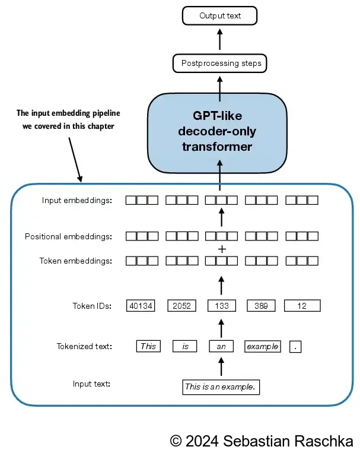

##  《从零构建大模型》

 [美]塞巴斯蒂安·拉施卡

书中资料 https://github.com/rasbt/LLMs-from-scratch

###  **第1章  理解大语言模型**

- 深度学习(deep learning)是机器学习(machine learning)和人工智能(artificial intelligence, AI)领域的一个重要分支，主要聚焦于神经网络的研究

- 大语言模型是一种用于理解、生成和响应类似人类语言文本的神经网络。这类模型属于深度神经网络(deep neural network)，通过大规模文本数据训练而成，其训练资料甚至可能涵盖了互联网上大部分公开的文本。
- 这类模型通常拥有数百亿甚至数千亿个参数(parameter)。这些参数是神经网络中的可调整权重，在训练过程中不断被优化，以预测文本序列中的下一个词。下一单词预测(next-word prediction)任务合理地利用了语言本身具有顺序这一特性来训练模型，使得模型能够理解文本中的上下文、结构和各种关系
- Transformer的架构架构允许模型在进行预测时有选择地关注输入文本的不同部分，从而使得它们特别擅长应对人类语言的细微差别和复杂性
- 大语言模型是深度学习技术的具体应用，能够处理和生成类似人类语言的文本；深度学习是机器学习的一个分支，主要使用多层神经网络；机器学习和深度学习致力于开发算法，使计算机能够从数据中学习，并执行需要人类智能水平的任务

####  构建和使用大语言模型的两个阶段

- 针对特定领域或任务量身打造的大语言模型在性能上往往优于ChatGPT等为多种应用场景而设计的通用大语言模型
- 大语言模型的构建通常包括预训练(pre-training)和微调(fine-tuning)两个阶段。
- 大语言模型的预训练目标是在大量无标注的文本语料库（原始文本）上进行下一单词预测。预训练完成后，可以使用较小的带标注的数据集对大语言模型进行微调
- 大语言模型使用自监督学习，模型从输入数据中生成自己的标签。
- 通过在无标注数据集上训练获得预训练的大语言模型后，我们可以在带标注的数据集上进一步训练这个模型，这一步称为微调。
- 微调大语言模型最流行的两种方法是指令微调和分类任务微调。在指令微调(instruction fine-tuning)中，标注数据集由“指令−答案”对（比如翻译任务中的“原文−正确翻译文本”）组成。在分类任务微调(classification fine-tuning)中，标注数据集由文本及其类别标签（比如已被标记为“垃圾邮件”或“非垃圾邮件”的电子邮件文本）组成
- 预训练的大语言模型是开源模型，可以作为通用工具，用于写作、摘要和编辑那些未包含在训练数据中的文本
- 首先，在海量的无标注文本上进行预训练，将预测的句子中的下一个词作为“标签”。 随后，在更小规模且经过标注的目标数据集上进行微调，以遵循指令和执行分类任务。

####  Transformer架构介绍

- Transformer架构，这是一种深度神经网络架构，该架构是在谷歌于2017年发表的论文“Attention Is All You Need”中首次提出的
- Transformer架构由两个子模块构成：编码器和解码器。编码器(encoder)模块负责处理输入文本，将其编码为一系列数值表示或向量，以捕捉输入的上下文信息。然后，解码器(decoder)模块接收这些编码向量，并据此生成输出文本
- 自注意力机制(self-attention mechanism)，它允许模型衡量序列中不同单词或词元之间的相对重要性。这一机制使得模型能够捕捉到输入数据中长距离的依赖和上下文关系，从而提升其生成连贯且上下文相关的输出的能力
- Transformer的后续变体，如BERT（Bidirectional Encoder Representations from Transformer，双向编码预训练Transformer）和各种GPT（Generative Pretrained Transformer，生成式预训练Transformer）模型，都基于这一理念构建。
- BERT及其变体专注于掩码预测(masked word prediction)，即预测给定句子中被掩码的词。这种独特的训练策略使BERT在情感预测、文档分类等文本分类任务中具有优势
- GPT模型主要被设计和训练用于文本补全(text completion)任务，但它们表现出了出色的可扩展性。这些模型擅长执行零样本学习任务和少样本学习任务。零样本学习(zero-shot learning)是指在没有任何特定示例的情况下，泛化到从未见过的任务，而少样本学习(few-shot learning)是指从用户提供的少量示例中进行学习
- 除了文本补全，类GPT大语言模型还可以根据输入执行各种任务，而无须重新训练、微调或针对特定任务更改模型架构。有时，在输入中提供目标示例会很有帮助，这被称为“少样本设置”。然而，类GPT大语言模型也能够在没有特定示例的情况下执行任务，这被称为“零样本设置”

#### 深入剖析GPT架构

- GPT最初是由OpenAI的Radford等人在论文“Improving Language Understanding by Generative Pre-Training”中提出的。GPT-3是该模型的扩展版本，它拥有更多的参数，并在更大的数据集上进行了训练
- ChatGPT中提供的原始模型是通过使用OpenAI的InstructGPT论文中的方法，在一个大型指令数据集上微调GPT-3而创建的
- GPT这样的解码器模型是通过逐词预测生成文本，因此它们被认为是一种自回归模型(autoregressive model)。自回归模型将之前的输出作为未来预测的输入。因此，在GPT中，每个新单词都是根据它之前的序列来选择的，这提高了最终文本的一致性
- 模型能够完成未经明确训练的任务的能力称为涌现(emergence)

####  关键概念

- 词元(token)是模型读取文本的基本单位。数据集中的词元数量大致等同于文本中的单词和标点符号的数量

- 文本嵌入：一种能够在不同维度中捕获许多不同因素的数值表示，就是把文本序列转换为有不同权重的数值序列

- Dolma：这是一个用于大语言模型预训练的3万亿兆词元大小的开放语料库。然而，该数据集可能包含受版权保护的内容，具体使用条款可能取决于预期的使用情境和国家。


### 构建大模型

构建一个大模型应用分三个阶段：

1. 数据预处理，包括数据准备，注意力机制以及LLM的架构
2. 预训练基础模型
3. 模型微调，实现文本分类或执行指令

 
  

书中第2、3、4章对应第一个阶段，第5章对应第二阶段

### 第2章  处理文本数据

由于大语言模型无法直接处理原始文本，因此我们必须将文本数据转换为名为“嵌入”的数值向量。嵌入将离散的数据（如词语或图像）映射到连续的向量空间，**使其能够用于神经网络的训练**

#### **2.1 理解词嵌入**

- 数据转换为向量格式的过程通常称为嵌入(embedding)
- 不同的数据格式需要使用不同的嵌入模型
- 嵌入的本质是将离散对象（如单词、图像甚至整个文档）映射到连续向量空间中的点，其主要目的是将非数值的数据转换为神经网络可以处理的格式。
- word2vec的核心思想是，出现在相似上下文中的词往往具有相似的含义。因此，当这些词嵌入被投影到二维空间并进行可视化时，我们可以看到意义相似的词聚集在一起
- 词嵌入的维度(dimension)可以从一维到数千维不等。更高的维度有助于捕捉到更细微的关系，但这通常以牺牲计算效率为代价
- 最小的GPT-2模型（参数量为1.17亿）使用的嵌入维度为768，而最大的GPT-3模型（参数量为1750亿）使用的嵌入维度为12 288

####  **2.2 文本分词**

- 词元既可以是单个单词，也可以是包括标点符号在内的特殊字符
- 如果训练的模型需要对文本的精确结构保持敏感，那么保留空白字符就显得尤为重要（例如，Python代码对缩进和空格具有高敏感性）

####  **2.3 将词元转换为词元ID**

- 将先前生成的词元映射到词元ID，首先需要构建一张词汇表。这张词汇表定义了如何将每个唯一的单词和特殊字符映射到一个唯一的整数
- 为了将大语言模型的输出从数值形式转换回文本，还需要一种将词元ID转换为文本的方法。为此，可以创建逆向词汇表，将词元ID映射回它们对应的文本词元。
- 分词器通常包含两个常见的方法：encode方法和decode方法。encode方法接收文本样本，将其分词为单独的词元，然后再利用词汇表将词元转换为词元ID。而decode方法接收一组词元ID，将其转换回文本词元，并将文本词元连接起来，形成自然语言文本

####  **2.4 特殊上下文词元**

- 为了处理特定的上下文，我们向词汇表中引入了特殊词元。例如，我们引入了<|unk|>词元来表示那些未出现在训练数据中，因而没有被包含在现有词汇表中的新词和未知词。我们还引入了<|endoftext|>词元来分隔两个不相关的文本来源
- 如果使用多个独立的文档或图书作为训练材料，那么通常会在每个文档或图书的开头插入一个词元，以区分前一个文本源
- [BOS]（序列开始）：标记文本的起点，告知大语言模型一段内容的开始
- [EOS]（序列结束）：位于文本的末尾，类似<|endoftext|>，特别适用于连接多个不相关的文本。例如，在合并两篇不同的维基百科文章（或两本不同的图书）时，[EOS]词元指示一篇文章的结束和下一篇文章的开始
- [PAD]（填充）：当使用批次大小(batch size)大于1的批量数据训练大语言模型时，数据中的文本长度可能不同。为了使所有文本具有相同的长度，较短的文本会通过添加[PAD]词元进行扩展或“填充”，以匹配批量数据中的最长文本的长度。

####  **2.5 BPE([Byte Pair Encoding ](https://github.com/rasbt/LLMs-from-scratch/blob/main/ch02/05_bpe-from-scratch/bpe-from-scratch.ipynb))**

- BPE通过将频繁出现的字符合并为子词，再将频繁出现的子词合并为单词，来迭代地构建词汇表。具体来说，BPE首先将所有单个字符（如“a”“b”等）添加到词汇表中。然后，它会将频繁同时出现的字符组合合并为子词。例如，“d”和“e”可以合并为子词“de”，这是“define”“depend”“made”“hidden”等许多英语单词中的常见组合。字符和子词的合并由一个频率阈值来决定

- BPE算法的原理是将不在预定义词汇表中的单词分解为更小的子词单元甚至单个字符，从而能够处理词汇表之外的单词

- <|endoftext|>词元被分配了一个较大的词元ID，即50256。事实上，用于训练GPT-2、GPT-3和ChatGPT中使用的原始模型的BPE分词器的词汇总量为50 257，这意味着<|endoftext|>被分配了最大的词元ID。

  ```python
  import tiktoken
  # tiktoken 是OpenAI的BPE分词器
  def tokernizer_test():
      # 需要科学联网下载库文件
      tokenizer = tiktoken.get_encoding("gpt2")
      text = (
      "Hello, do you like tea? <|endoftext|> In the sunlit terraces"
       "of someunknownPlace."
      )
  
      integers = tokenizer.encode(text, allowed_special={"<|endoftext|>"})
      print(integers) 
      #[15496, 11, 466, 345, 588, 8887, 30, 220, 50256, 554, 262, 4252, 18250, 8812, 2114, 1659, 617, 34680, 27271, 13]
  
      strings = tokenizer.decode(integers)
      print(strings)
      #Hello, do you like tea? <|endoftext|> In the sunlit terracesof someunknownPlace.
  ```

  

####  **2.6 使用滑动窗口进行数据采样**

- 使用BPE分词器对短篇小说The Verdict的全文进行分词

- 使用窗口宽度和步长平滑移动来创建创建下一单词预测任务的输入-目标对

  ```python
  def tokernizer_test():
      # 需要科学联网下载库文件
      tokenizer = tiktoken.get_encoding("gpt2")
      with open("the-verdict.txt", "r", encoding="utf-8") as f:
          raw_text = f.read()
      # 分词
      enc_text = tokenizer.encode(raw_text)
      print(len(enc_text)) # token个数为5145
      enc_sample = enc_text[50:]
      context_size = 4 #假设上下文大小为4
      
      for i in range(1, context_size+1):
          context = enc_sample[:i] # 输入
          desired = enc_sample[i] # 目标，现在的目标是输入的下一个词元
          print(tokenizer.decode(context), "---->", tokenizer.decode([desired]))
   '''
   输出如下
   and ---->  established
   and established ---->  himself
   and established himself ---->  in
   and established himself in ---->  a
   '''
  ```

  

- 一个高效的数据加载器(data loader)会遍历输入数据集，并将输入和目标以PyTorch张量的形式返回，这些PyTorch张量可以被视为多维数组。具体来说，我们的目标是返回两个张量：一个是包含大语言模型所见的文本输入的输入张量，另一个是包含大语言模型需要预测的目标词元的目标张量

- 为了实现高效的数据加载器，我们将输入收集到张量x中，其中每行代表一个输入上下文。第二个张量y包含相应的预测目标（下一个词），它们是通过将输入移动一个位置创建的

- 每行数据包含多个词元ID（数量由max_length参数决定），这些词元ID被分配给input_chunk张量，而target_chunk张量包含相应的目标词元ID

- 步幅(stride)决定了批次之间输入的位移量，来模拟了滑动窗口方法

- 批次大小会减少训练过程中的内存占用，但同时会导致在模型更新时产生更多的噪声

- 通过在文本上滑动输入窗口来从输入数据集中生成多个批次的数据。如果步幅设置为1，那么在创建下一个批次时，输入窗口向前移动一个位置。如果步幅与输入窗口大小相等，则可以避免批次之间的重叠

```python
import torch
from torch.utils.data import Dataset, DataLoader

class GPTDatasetV1(Dataset):
    def __init__(self, txt, tokenizer, max_length, stride):
        self.input_ids = [] # 输入上下文，一行表示一个上下文
        self.target_ids = [] # 预测目标

        # Tokenize the entire text 对文本进行分词得到词元id
        token_ids = tokenizer.encode(txt, allowed_special={"<|endoftext|>"})
        assert len(token_ids) > max_length, "Number of tokenized inputs must at least be equal to max_length+1"

        # Use a sliding window to chunk the book into overlapping sequences of max_length
        # 对词元id按上下文长度max_length进行采样，窗口移动步长为stride
        for i in range(0, len(token_ids) - max_length, stride):
            input_chunk = token_ids[i:i + max_length] # 输入是一个长度为max_length的词元id序列
            target_chunk = token_ids[i + 1: i + max_length + 1] # 目标是输入的下一个词元
            self.input_ids.append(torch.tensor(input_chunk)) # 转为张量
            self.target_ids.append(torch.tensor(target_chunk))

    def __len__(self):
        return len(self.input_ids)

    def __getitem__(self, idx):
        return self.input_ids[idx], self.target_ids[idx]

def create_dataloader_v1(txt, batch_size=4, max_length=256, 
                         stride=128, shuffle=True, drop_last=True,
                         num_workers=0):

    # Initialize the tokenizer 需要科学联网下载库文件
    tokenizer = tiktoken.get_encoding("gpt2")

    # Create dataset
    dataset = GPTDatasetV1(txt, tokenizer, max_length, stride)

    # Create dataloader 加载数据
    dataloader = DataLoader(
        dataset,
        batch_size=batch_size, 
        shuffle=shuffle,
        drop_last=drop_last,
        num_workers=num_workers
    )
    return dataloader

def data_sampling():
    with open("the-verdict.txt", "r", encoding="utf-8") as f:
        raw_text = f.read()
    # 8个批次，每个批次最大长度4，步长4，步长和窗口大小相同，数据不重叠
    dataloader = create_dataloader_v1(raw_text, batch_size=8, max_length=4, stride=4, shuffle=False)

    data_iter = iter(dataloader)
    inputs, targets = next(data_iter)
    print("Inputs:\n", inputs)
    print("\nTargets:\n", targets)
```

8个批次，输入张量有8行，每一行都是一个上下文长度为4的词元id，因为步长也是4，所以输入没有重叠，如果文本被分割为100个词元，那就有25个输入

预测目标词元id与输入一一对应，只是向后偏移一个词元，例如第一个批次的输入的后三个词元就是目标的开始

```bash
[   40,   367,  2885,  1464] # 输入
---->  [  367,  2885,  1464,  1807] # 预测目标
```

实际输出

```cmd
(venv) E:\dev\python\LLMs-from-scratch>zluda -- python main.py
Inputs:
 tensor([[   40,   367,  2885,  1464],
        [ 1807,  3619,   402,   271],
        [10899,  2138,   257,  7026],
        [15632,   438,  2016,   257],
        [  922,  5891,  1576,   438],
        [  568,   340,   373,   645],
        [ 1049,  5975,   284,   502],
        [  284,  3285,   326,    11]])
Targets:
 tensor([[  367,  2885,  1464,  1807],
        [ 3619,   402,   271, 10899],
        [ 2138,   257,  7026, 15632],
        [  438,  2016,   257,   922],
        [ 5891,  1576,   438,   568],
        [  340,   373,   645,  1049],
        [ 5975,   284,   502,   284],
        [ 3285,   326,    11,   287]])
```

####  **2.7 创建词元嵌入**

- 把文本分词后，每个分词对应字典中的一个数字ID，词元ID就是分割的一段话（上下文）中所有分词(词元)对应的ID的列表

- 大语言模型的输入文本的准备工作包括文本分词、将词元转换为词元ID，以及将词元ID转换为连续的嵌入向量

- 由于类GPT大语言模型是使用反向传播算法(backpropagation algorithm)训练的深度神经网络，因此需要连续的向量表示或嵌入

- 嵌入层主要做的是查找操作，PyTorch中的嵌入层用来检索与词元ID对应的向量，所得的嵌入向量为词元提供了连续的表示形式

  ```python
  def embedding_data():
      # 有一个词元id的张量[2, 3, 5, 1]
      input_ids = torch.tensor([2, 3, 5, 1])
      vocab_size = 6 # 词汇表大小为6，字典中的数字为0-6，分别对应一个词元
      output_dim = 3 # 嵌入层维数为3，权重个数为3个
      # 随机
      torch.manual_seed(123)
      # 创建一个6x3的权重矩阵，每一行对应一个词元ID
      embedding_layer = torch.nn.Embedding(vocab_size, output_dim)
      print(embedding_layer.weight) # 打印权重矩阵
      # 张量中的每一个词元在权重矩阵中找到，例如3对应的是权重矩阵的第4行权重向量
      print(embedding_layer(input_ids))    
  '''
  tensor([[ 0.3374, -0.1778, -0.1690],
          [ 0.9178,  1.5810,  1.3010],
          [ 1.2753, -0.2010, -0.1606],
          [-0.4015,  0.9666, -1.1481],
          [-1.1589,  0.3255, -0.6315],
          [-2.8400, -0.7849, -1.4096]], requires_grad=True)
  tensor([[ 1.2753, -0.2010, -0.1606],
          [-0.4015,  0.9666, -1.1481],
          [-2.8400, -0.7849, -1.4096],
          [ 0.9178,  1.5810,  1.3010]], grad_fn=<EmbeddingBackward0>)
  '''
  ```

  

- 嵌入层的权重矩阵由小的随机值构成。作为模型优化工作的一部分，这些值将在大语言模型训练过程中被优化。上面例子中权重矩阵具有6行3列的结构，其中每一行对应词汇表中的一个词元，每一列则对应一个嵌入维度。

- 嵌入层执行查找操作，即从它的权重矩阵中检索与特定词元ID对应的嵌入向量。最后输出的嵌入向量中，词元ID为5的嵌入向量位于嵌入层权重矩阵的第6行（因为Python的索引从0开始，所以它位于第6行而非第5行)。

- 独热编码(one-hot encoding)，本质上可以将嵌入层方法视为一种更有效的实现独热编码的方法。它先进行独热编码，然后在全连接层中进行矩阵乘法，这在本书的补充代码中有所说明。由于嵌入层只是独热编码和矩阵乘法方法的一种更高效的实现，因此它可以被视为一个能够通过反向传播进行优化的神经网络层。

####  **2.8 编码单词位置信息**

- 嵌入层的工作机制是，无论词元ID在输入序列中的位置如何，相同的词元ID始终被映射到相同的向量表示

- 由于大语言模型的自注意力机制本质上与位置无关，因此向模型中注入额外的位置信息是有帮助的。例如同一个单词在句子开头和结尾含义就有不同。

- 绝对位置嵌入(absolute positional embedding)直接与序列中的特定位置相关联。对于输入序列的每个位置，该方法都会向对应词元的嵌入向量中添加一个独特的位置嵌入，以明确指示其在序列中的确切位置

- 相对位置嵌入(relative positional embedding)关注的是词元之间的相对位置或距离，而非它们的绝对位置。这意味着模型学习的是词元之间的“距离”关系，而不是它们在序列中的“具体位置”。这种方法使得模型能够更好地适应不同长度（包括在训练过程中从未见过的长度）的序列。

- `pos_embeddings`的输入通常是一个占位符向量`torch.arange(context_length)`，它包含一个从0开始递增，直至最大输入长度减1的数值序列`tensor([0, 1, 2, 3])`。`context_length`是一个变量，表示模型支持的输入块的最大长度。我们将其设置为与输入文本的最大长度一致。在实际情况中，输入文本的长度可能会超出模型支持的块大小，这时需要截断文本。

  ```python
  def embedding_data():
      with open("the-verdict.txt", "r", encoding="utf-8") as f:
          raw_text = f.read()
      max_length = 4
      # 8个批次，每个批次最大长度4，步长4，步长和窗口大小相同，数据不重叠
      dataloader = create_dataloader_v1(raw_text, batch_size=8, max_length=max_length, stride=max_length, shuffle=False)
  
      data_iter = iter(dataloader)
      # 输入和目标张量都是8x4, 8个批次，每个批次长度为4
      inputs, targets = next(data_iter)
  
      vocab_size = 50257 # 词汇表大小为50257，BPE gpt2的词汇表大小
      output_dim = 256 # 一般至少是256维度
  
      token_embedding_layer = torch.nn.Embedding(vocab_size, output_dim)
      # 随机
      torch.manual_seed(123)
      # 创建一个50257x256的权重矩阵，每一行对应一个词元ID
      embedding_layer = torch.nn.Embedding(vocab_size, output_dim)
      token_embeddings = token_embedding_layer(inputs)
  
      # 该张量的维度为8×4×256，这意味着每个词元ID都已被嵌入一个256维的权重向量中
      print(token_embeddings.shape) # torch.Size([8, 4, 256])
      print(token_embeddings)
      '''
      tensor([[[ 8.8303e-01,  1.4569e+00, -1.0931e+00,  ...,  4.3424e-01,
             1.6195e-01,  1.2421e-01],
           [ 1.8858e-01,  7.1597e-01, -8.2455e-01,  ...,  1.6711e-01,
            -1.2259e+00,  2.3124e-01],
           [-1.3258e+00,  1.4445e+00, -1.2105e-01,  ...,  1.4018e+00,
            -3.4044e-01, -5.6992e-01],
           [-1.0548e+00,  2.3219e-01,  7.1587e-01,  ..., -1.8256e+00,
             8.0098e-01, -2.4824e-01]],
          # 一行上下文结束, 它是4*256 张量,4个词元, 每一个词元256个权重值
          
          ...,
          # 一共有8行, 这是最后一行
          [[-3.5978e-01,  8.1442e-01,  5.6329e-01,  ...,  3.5991e-01,
            -5.2747e-01,  1.9643e+00],
           [-2.7328e-01, -5.5024e-01,  5.0522e-01,  ...,  5.4813e-02,
             1.4486e+00, -9.0181e-01],
           [-2.4447e-01,  6.1497e-01,  9.7812e-01,  ...,  1.4584e+00,
             8.5265e-01, -7.7689e-01],
           [-6.9772e-01,  1.2874e-01,  5.5329e-01,  ...,  7.1362e-01,
            -1.5636e-01,  6.4708e-01]]], grad_fn=<EmbeddingBackward0>)
      '''
      # 为了获取GPT模型所采用的绝对位置嵌入，只需创建一个维度与token_embedding_layer相同的嵌入层即可
      # 创建一个绝对位置的嵌入层，它给输入向量的每一行的每一个词元提供位置信息，所以是4*256
      context_length = max_length
      pos_embedding_layer = torch.nn.Embedding(context_length, output_dim)
      print(pos_embedding_layer.weight)
      '''
      tensor([[ 0.5423, -0.1224, -1.4150,  ...,  0.2515, -2.3067,  0.8155],
          [-0.3973, -1.2575, -1.9800,  ..., -0.1207,  0.3075, -0.6422],
          [ 0.1840,  1.1128,  1.0052,  ...,  0.2081,  0.5531, -1.1619],
          [ 1.4155,  0.6599,  0.3760,  ...,  0.7034, -0.6108,  0.1080]],
         requires_grad=True)
      '''
      # 位置嵌入层向量
      print(torch.arange(4)) # tensor([0, 1, 2, 3])
      pos_embeddings = pos_embedding_layer(torch.arange(max_length))
      print(pos_embeddings.shape) #torch.Size([4, 256])
      print(pos_embeddings)
      '''
      tensor([[ 0.5423, -0.1224, -1.4150,  ...,  0.2515, -2.3067,  0.8155],
          [-0.3973, -1.2575, -1.9800,  ..., -0.1207,  0.3075, -0.6422],
          [ 0.1840,  1.1128,  1.0052,  ...,  0.2081,  0.5531, -1.1619],
          [ 1.4155,  0.6599,  0.3760,  ...,  0.7034, -0.6108,  0.1080]],
         grad_fn=<EmbeddingBackward0>)
      '''
  
      # 词元嵌入向量和位置嵌入向量相加 
      input_embeddings = token_embeddings + pos_embeddings
      print(input_embeddings.shape) #torch.Size([8, 4, 256])
      print(input_embeddings)
      '''
      tensor([[[ 1.0786e-01,  5.0489e-01,  8.6421e-01,  ..., -5.3458e-01,
            -6.7288e-01,  7.0609e-01],
           [-3.2591e-01, -1.2066e+00, -7.3996e-01,  ...,  5.9744e-01,
            -3.5608e-01, -2.4003e+00],
           [-8.9014e-01,  3.0788e+00,  1.8252e+00,  ..., -1.5054e+00,
             1.3327e+00, -1.2928e+00],
           [ 2.9184e+00,  6.6268e-01,  1.4512e+00,  ...,  1.0498e+00,
            -7.9775e-01, -1.6035e-01]],
          ...,    
  
          [[ 3.2105e-01,  9.1799e-01, -1.0180e+00,  ...,  5.6784e-01,
            -2.1125e+00, -2.3354e-01],
           [ 4.3489e-01, -1.9066e+00, -1.4548e+00,  ...,  4.5453e-01,
             8.4789e-01, -6.8846e-01],
           [ 1.7390e-01,  4.8946e-02,  2.7168e+00,  ..., -1.9539e-01,
            -6.5049e-03, -3.7297e-01],
           [ 9.2925e-01,  1.0026e+00,  3.8520e-01,  ...,  1.4394e+00,
            -3.3247e-01,  8.0520e-01]]], grad_fn=<AddBackward0>)
      '''
  ```

  

#### 文本嵌入的步骤

1. 原始文本被分解为词元，这些词元可能是单词或字符。
2. 根据词元字典将这些词元被转换为整数表示，即词元ID
3. 通过使用滑动窗口方法对已经分词的数据进行采样，生成大语言模型训练所需的输入-目标对，其中窗口大小就是分割的文本长度，也可以理解为上下文长度
4. 构建一个嵌入层，嵌入层把词元ID转换为嵌入层向量
5. 使用位置嵌入增加词元间的位置信息

 
  


