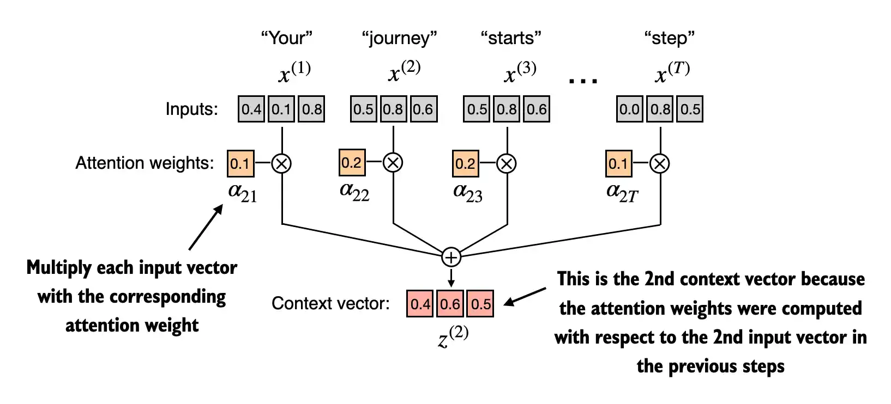
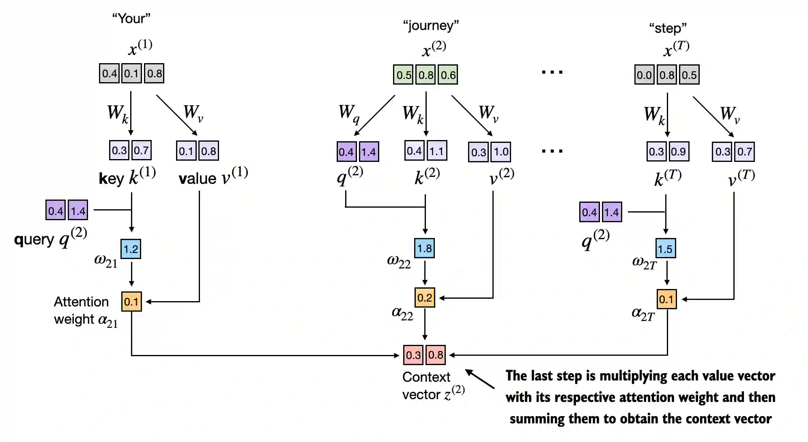
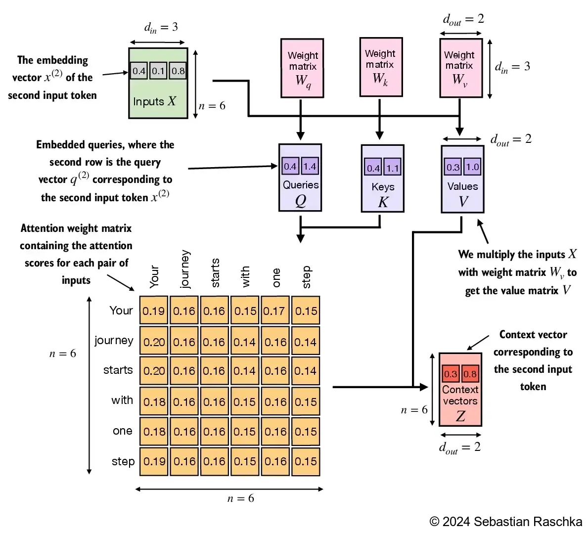
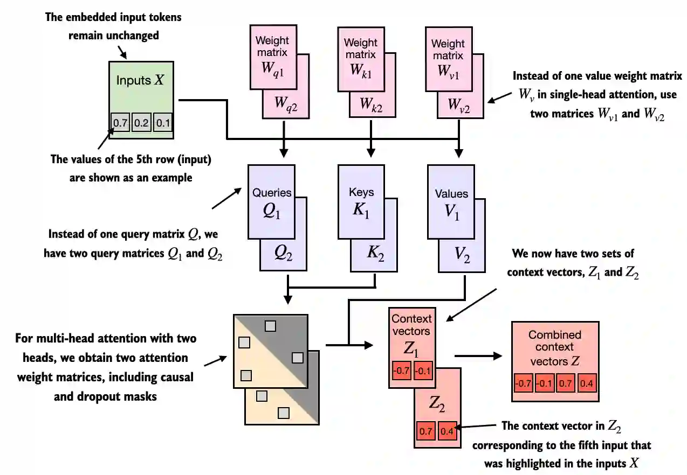

##  《从零构建大模型》

 [美]塞巴斯蒂安·拉施卡

书中资料 https://github.com/rasbt/LLMs-from-scratch

### 第三章 注意力机制

#### 3.1 长序列建模中的问题

* Transformer出现之前，循环神经网络(recurrent neural network, RNN)是语言翻译中最流行的编码器-解码器架构。RNN是一种将前一步骤的输出作为当前步骤的输入的神经网络，它非常适合处理像文本这样的序列数据

* 编码器-解码器RNN中，输入文本被传递给编码器以逐步处理。编码器在每一步都会更新其隐藏状态（隐藏层的内部值），试图在最终的隐藏状态中捕捉输入句子的全部含义。然后，解码器使用这个最终的隐藏状态开始逐字生成翻译后的句子。解码器同样在每一步更新其隐藏状态，该状态应包含为下一单词预测所需的上下文信息

* 编码器部分会将整个输入文本处理成一个隐藏状态（记忆单元）。然后解码器会使用这个隐藏状态来生成输出。你可以将这个隐藏状态视为一种嵌入向量
* 问题：在解码阶段，RNN无法直接访问编码器中早期隐藏状态，它只能依赖当前的隐藏状态，这会导致上下文丢失，特别是复杂的句子，依赖关系跨越很长的距离。对于较长的文本，它无法直接访问输入中靠前的单词。
* 研究人员在2014年为RNN开发了Bahdanau注意力机制（以该研究论文的第一作者命名，更多信息请参见附录B），该机制对编码器-解码器RNN进行了修改，使得解码器在每个解码步骤中可以选择性地访问输入序列的不同部分

#### 3.2 使用注意力机制捕捉数据依赖关系

自注意力是Transformer模型中的一种机制，它通过允许一个序列中的每个位置与同一序列中的其他所有位置进行交互并权衡其重要性，来计算出更高效的输入表示。

#### 3.3 通过自注意力机制关注输入的不同部分

*  自注意力机制中，“自”指的是该机制通过关联单个输入序列中的不同位置来计算注意力权重的能力。它可以评估并学习输入本身各个部分之间的关系和依赖，比如句子中的单词或图像中的像素。

* 传统的注意力机制关注的是两个不同序列元素之间的关系，比如在序列到序列模型中，注意力可能在输入序列和输出序列之间

* 自注意力机制的目标是为每个输入元素计算一个**上下文向量(context vector)**，该向量结合了其他所有输入元素信息的嵌入向量
* **上下文向量**在自注意力机制中起着关键作用。它们的目的是通过结合序列中其他所有元素的信息，为输入序列（如一个句子）中的每个元素创建丰富表示，因为这些模型需要理解句子中单词之间的关系和相关性。
* 类似我们做阅读理解，要理解一个单词在一句话中的含义，需要看这个单词和句子中其他单词的关系，例如Apple is a good food. 通过food，我们可以知道这里的Apple是苹果水果，而不是苹果公司。

##### 简单的自注意力机制(没有可训练权重)

 
  

对于一句文本输入序列"Your journey starts with one step"，它有6个词元，且按照前一章节的方法计算出来了它的嵌入向量$x^{(1)}$ to $x^{(T)}$ ，它的嵌入向量维度为3。现在以第二个词元“journey”为例计算它的上下文向量。

1. 计算注意力分数 $\omega$，把第二个输入作为查询$q^{(2)} = x^{(2)}$，让它依次与输入中所有词元向量进行**点积**计算得到对应的注意力分数。**点积本质上是将两个向量逐个元素相乘然后对乘积求和的简洁方法**

   点积不仅被视为一种将两个向量转化为标量值的数学工具，而且也是度量相似度的一种方式，因为它可以量化两个向量之间的对齐程度：点积越大，向量之间的对齐程度或相似度就越高，角度也越接近。在自注意机制中，点积决定了序列中每个元素对其他元素的关注程度：点积越大，两个元素之间的相似度和注意力分数就越高。

   - $\omega_{21} = x^{(1)} q^{(2)\top}$ 表示第二个输入与第一个元素的点积计算得到注意力分数
   - $\omega_{22} = x^{(2)} q^{(2)\top}$
   - ...
   - $\omega_{2T} = x^{(T)} q^{(2)\top}$
   
2. 计算注意力权重，将得到的注意力分数进行归一化得到注意力权重，归一化的主要目的是获得总和为1的注意力权重。这种归一化是一个惯例，有助于解释结果，并能维持大语言模型的训练稳定性
   
      在实际应用中，使用softmax函数进行归一化更为常见，而且是一种更可取的做法。这种方法更好地处理了极值，并在训练期间提供了更有利的梯度特性
   
3. 计算上下文向量$z^{(2)}$，通过将嵌入的输入词元与相应的注意力权重相乘，再将得到的向量求和来计算上下文向量

```python
def simple_attention():
    # 6个词元，每个词元3维向量表示
    inputs = torch.tensor(
        [[0.43, 0.15, 0.89], # Your    (x^1)
        [0.55, 0.87, 0.66], # journey  (x^2)
        [0.57, 0.85, 0.64], # starts   (x^3)
        [0.22, 0.58, 0.33], # with     (x^4)
        [0.77, 0.25, 0.10], # one      (x^5)
        [0.05, 0.80, 0.55]] # step     (x^6)
    )

    query = inputs[1]  # 2nd input token is the query
    # 1. 注意力分数计算，它维数与输入的词元个数相同
    attn_scores_2 = torch.empty(inputs.shape[0])
    for i, x_i in enumerate(inputs):
        attn_scores_2[i] = torch.dot(x_i, query) # dot product (transpose not necessary here since they are 1-dim vectors)

    print(attn_scores_2) #tensor([0.9544, 1.4950, 1.4754, 0.8434, 0.7070, 1.0865])
    
    # 2. 归一化，计算注意力权重
    attn_weights_2 = torch.softmax(attn_scores_2, dim=0)
    print("Attention weights:", attn_weights_2) #tensor([0.1385, 0.2379, 0.2333, 0.1240, 0.1082, 0.1581])
    print("Sum:", attn_weights_2.sum()) #Sum: tensor(1.)
    
    # 3. 计算上下文向量
    context_vec_2 = torch.zeros(query.shape)
    for i,x_i in enumerate(inputs):
        context_vec_2 += attn_weights_2[i]*x_i

    print(context_vec_2) #tensor([0.4419, 0.6515, 0.5683])
```

##### 计算所有输入词元的上下文向量

* 最终计算出来上下文向量的维数和输入是完全相同的

* 在计算前面的注意力分数张量时，使用for循环通常较慢，因此可以使用矩阵乘法来得到相同的结果

* `torch.softmax`这样的函数中的dim参数用于指定输入张量的计算维度。将dim设置为-1表示让`softmax`函数在`attn_scores`张量的最后一个维度上进行归一化。如果`attn_scores`是一个二维张量（比如形状为［行, 列］），那么它将对列进行归一化，使得每行的值（在列维度上的总和）为1。

```python
def simple_attention():
    # 6个词元，每个词元3维向量表示 torch.Size([6, 3])
    inputs = torch.tensor(
        [[0.43, 0.15, 0.89], # Your    (x^1)
        [0.55, 0.87, 0.66], # journey  (x^2)
        [0.57, 0.85, 0.64], # starts   (x^3)
        [0.22, 0.58, 0.33], # with     (x^4)
        [0.77, 0.25, 0.10], # one      (x^5)
        [0.05, 0.80, 0.55]] # step     (x^6)
    )

    # 1. 注意力分数计算，它维数与输入的词元个数相同 torch.Size([6, 6])
    attn_scores = inputs @ inputs.T
    print(attn_scores)
    '''
    tensor([[0.9995, 0.9544, 0.9422, 0.4753, 0.4576, 0.6310],
        [0.9544, 1.4950, 1.4754, 0.8434, 0.7070, 1.0865],
        [0.9422, 1.4754, 1.4570, 0.8296, 0.7154, 1.0605],
        [0.4753, 0.8434, 0.8296, 0.4937, 0.3474, 0.6565],
        [0.4576, 0.7070, 0.7154, 0.3474, 0.6654, 0.2935],
        [0.6310, 1.0865, 1.0605, 0.6565, 0.2935, 0.9450]])
    ''' 
    # 2. 归一化，计算注意力权重
    attn_weights = torch.softmax(attn_scores, dim=-1)
    print(attn_weights)    
    '''
    tensor([[0.2098, 0.2006, 0.1981, 0.1242, 0.1220, 0.1452],
        [0.1385, 0.2379, 0.2333, 0.1240, 0.1082, 0.1581],
        [0.1390, 0.2369, 0.2326, 0.1242, 0.1108, 0.1565],
        [0.1435, 0.2074, 0.2046, 0.1462, 0.1263, 0.1720],
        [0.1526, 0.1958, 0.1975, 0.1367, 0.1879, 0.1295],
        [0.1385, 0.2184, 0.2128, 0.1420, 0.0988, 0.1896]])
    '''    
    # 3. 计算上下文向量 torch.Size([6, 3])
    all_context_vecs = attn_weights @ inputs
    print(all_context_vecs)
    '''
    tensor([[0.4421, 0.5931, 0.5790],
        [0.4419, 0.6515, 0.5683],
        [0.4431, 0.6496, 0.5671],
        [0.4304, 0.6298, 0.5510],
        [0.4671, 0.5910, 0.5266],
    '''
```


#### 3.4 实现带可训练权重的自注意力机制

和之前简单自注意力机制差别在于，这里引入了在模型训练过程中会更新的权重矩阵，这些**可训练的权重矩阵**可以让模型学习生成很好的**上下文向量**。

* 三个权重矩阵$W_q$, $W_k$, and $W_v$用于将嵌入的输入词元$x^{(i)}$分别映射为$Q$查询向量、$K$键向量和$V$值向量

   \- Query vector: $q^{(i)} = x^{(i)}\,W_q $

   \- Key vector: $k^{(i)} = x^{(i)}\,W_k $

   \- Value vector: $v^{(i)} = x^{(i)}\,W_v $

* 在权重矩阵$W$中，“权重”是“权重参数”的简称，表示在训练过程中优化的神经网络参数，随着模型在训练中接触更多数据，它会调整这些可训练的权重。这与前面的注意力权重是不同的。正如我们已经看到的，注意力权重决定了上下文向量对输入的不同部分的依赖程度（网络对输入的不同部分的关注程度）。权重参数是定义网络连接的基本**学习系数**，而注意力权重是动态且**特定于上下文的值**。

* **缩放点积注意力(scaled dot-product attention)** 是实际在GPT-2模型中使用的自注意力机制。核心公式如下：

$$
\text{Attention}(Q, K, V) = \text{softmax}\left( \frac{QK^T}{\sqrt{d_k}} \right) V
$$


##### 基本流程


 
  

1. 生成3个权重矩阵

   输入的嵌入向量维度和查询向量的嵌入维度可以相同也可以不同。在类GPT模型中，输入和输出的维度通常是相同的，但为了便于理解计算过程，这里使用不同的输入维度`(d_in=3)`和输出维度`(d_out=2)`

2. 计算每一个输入元素的权重向量，将输入与权重进行矩阵乘法，这里将词元从3维空间映射到了2维空间

3. 计算注意力分数，使用输入元素的查询向量Q和每一个元素的键向量K点积计算

4. 计算注意力权重（归一化），通过缩放注意力分数并应用`softmax`函数来计算注意力权重。不过，此时是通过将注意力分数除以键向量的嵌入维度的平方根来进行缩放（取平方根在数学上等同于以0.5为指数进行幂运算）

   对嵌入维度进行归一化是为了避免梯度过小，从而提升训练性能。例如，在类GPT大语言模型中，嵌入维度通常大于1000，这可能导致点积非常大，从而在反向传播时由于`softmax`函数的作用导致梯度非常小。当点积增大时，`softmax`函数会表现得更像阶跃函数，导致梯度接近零。这些小梯度可能会显著减慢学习速度或使训练停滞。 因此，通过嵌入维度的平方根进行缩放解释了为什么这种自注意力机制也被称为缩放点积注意力机制。

5. 计算上下文向量，通过对值向量进行加权求和。注意力权重作为加权因子，用于权衡每个值向量的重要性。和之前一样，可以使用矩阵乘法一步获得输出结果

```python
def weight_attention():
    # 6个词元，每个词元3维向量表示
    inputs = torch.tensor(
        [[0.43, 0.15, 0.89], # Your    (x^1)
        [0.55, 0.87, 0.66], # journey  (x^2)
        [0.57, 0.85, 0.64], # starts   (x^3)
        [0.22, 0.58, 0.33], # with     (x^4)
        [0.77, 0.25, 0.10], # one      (x^5)
        [0.05, 0.80, 0.55]] # step     (x^6)
    )
    print(inputs.shape) #torch.Size([6, 3])

    # 1. 生成3个权重矩阵
    d_in = inputs.shape[1] # 输入嵌入维度, d=3
    d_out = 2 # 查询嵌入维度, d=2
    torch.manual_seed(123)
    # 设置requires_grad=False以减少输出中的其他项，但如果要在模型训练中使用这些权重矩阵，就需要设置requires_grad=True，以便在训练中更新这些矩阵
    W_query = torch.nn.Parameter(torch.rand(d_in, d_out), requires_grad=False)
    W_key   = torch.nn.Parameter(torch.rand(d_in, d_out), requires_grad=False)
    W_value = torch.nn.Parameter(torch.rand(d_in, d_out), requires_grad=False)
    
    # 2. 计算查询，键和值权重向量
    querys = inputs @ W_query 
    keys = inputs @ W_key 
    values = inputs @ W_value
    print("querys.shape:", querys.shape) # querys.shape: torch.Size([6, 2])
    print("keys.shape:", keys.shape)     # keys.shape: torch.Size([6, 2])
    print("values.shape:", values.shape) # values.shape: torch.Size([6, 2])

    # 3. 计算注意力分数，以计算第2个词元的上下文向量为例
    attn_scores_2 = querys[1] @ keys.T # All attention scores for given query
    # 每一个输入元素和查询都会计算出一个注意力分数
    print(attn_scores_2) # tensor([1.2705, 1.8524, 1.8111, 1.0795, 0.5577, 1.5440])

    # 4. 计算注意力权重
    d_k = keys.shape[1]
    attn_weights_2 = torch.softmax(attn_scores_2 / d_k**0.5, dim=-1)
    print(attn_weights_2) # tensor([0.1500, 0.2264, 0.2199, 0.1311, 0.0906, 0.1820])

    # 5. 计算上下文向量
    context_vec_2 = attn_weights_2 @ values
    print(context_vec_2) # tensor([0.3061, 0.8210])
```

##### 为什么要用查询、键和值

* 查询类似于数据库中的搜索查询。它代表了模型当前关注或试图理解的项（比如句子中的一个单词或词元）。查询用于探测输入序列中的其他部分，以确定对它们的关注程度。

*  键类似于用于数据库索引和搜索的键。在注意力机制中，输入序列中的每个项（比如句子中的每个单词）都有一个对应的键。这些键用于与查询进行匹配

* 值类似于数据库中键-值对中的值。它表示输入项的实际内容或表示。一旦模型确定哪些键以及哪些输入部分与查询（当前关注的项）最相关，它就会检索相应的值。

##### 自注意类实现

在自注意力机制中，我们用3个权重矩阵$W_q$, $W_k$, and $W_v$来变换输入矩阵$X$中的输入向量。根据所得查询矩阵($Q$)和键矩阵($K$)计算注意力权重矩阵。然后，使用注意力权重矩阵和值矩阵($V$)计算上下文向量($Z$)。为了视觉清晰，我们关注具有$n$个词元的单个输入文本，而不是一批多个输入。因此，在这种情况下，三维输入张量被简化为二维矩阵，方便更直观地可视化和理解所涉及的过程。

1. 输入6个词元，每个词元嵌入向量维度为3，对应矩阵为[6, 3]，假设输出嵌入维度为2，权重矩阵就是[3, 2]，因为要把输入映射到权重矩阵上，左矩阵的列数就是右矩阵的行数，二者相乘得到权重向量的维度为[6,2]
2. 以输入的第二个词元为例，它的查询向量Q为[6,2]依次与第一个词元的键K向量[6, 2]**点积**后，得到标量值如图中的0.2，由于查询要和每一个词元的键都进行点积，所以对第二个词元最终会得到一个[1, 6]的向量，即下图6*6矩阵的第二行。所有的词元都作为查询计算权重矩阵的结果就是[6, 6]即[n,n]的矩阵
3. 还以第二个词元为例，它对每一个其他词元(包括它自己)用上一步算出来的权重标量和对应词元的值向量V矩阵乘法计算得到中间向量[1,2]，再把6(n)个中间向量相加得到[1,2]的第二个词元最终的上下文向量。

无论输入词元的嵌入向量维度是多少，最终每个词元的上下文向量的维度都是输出的维度，一般这个维度和字典的个数相同，表示每个词出现的可能性。

 
 

```python
# 从nn.Module派生出来的类。nn.Module是PyTorch模型的一个基本构建块，它为模型层的创建和管理提供了必要的功能
class SelfAttention_v2(nn.Module):
    def __init__(self, d_in, d_out, qkv_bias=False):
        super().__init__()
        # 每个矩阵用来将输入维度d_in转换为输出维度d_out
        # 当偏置单元被禁用时，nn.Linear层可以有效地执行矩阵乘法。
        # 相比手动实现nn.Parameter(torch.rand(...))，使用nn.Linear的一个重要优势
        # 是它提供了优化的权重初始化方案，从而有助于模型训练的稳定性和有效性
        self.W_query = nn.Linear(d_in, d_out, bias=qkv_bias)
        self.W_key   = nn.Linear(d_in, d_out, bias=qkv_bias)
        self.W_value = nn.Linear(d_in, d_out, bias=qkv_bias)

    def forward(self, x):
        '''
        将查询向量和键向量相乘来计算注意力分数(attn_scores),然后使用softmax对这些分数进行归一化。
        最后，我们通过使用这些归一化的注意力分数对值向量进行加权来创建上下文向量。
        '''
        keys = self.W_key(x)
        queries = self.W_query(x)
        values = self.W_value(x)
        
        attn_scores = queries @ keys.T
        attn_weights = torch.softmax(attn_scores / keys.shape[-1]**0.5, dim=-1)

        context_vec = attn_weights @ values
        return context_vec

def use_SelfAttention_v2():
    inputs = torch.tensor(
        [[0.43, 0.15, 0.89], # Your    (x^1)
        [0.55, 0.87, 0.66], # journey  (x^2)
        [0.57, 0.85, 0.64], # starts   (x^3)
        [0.22, 0.58, 0.33], # with     (x^4)
        [0.77, 0.25, 0.10], # one      (x^5)
        [0.05, 0.80, 0.55]] # step     (x^6)
    )

    d_in = inputs.shape[1] # 输入嵌入维度, d=3
    d_out = 2 # 查询嵌入维度, d=2
    torch.manual_seed(789)
    sa_v2 = SelfAttention_v2(d_in, d_out)
    print(sa_v2(inputs))    
    '''
    tensor([[-0.0739,  0.0713],
        [-0.0748,  0.0703],
        [-0.0749,  0.0702],
        [-0.0760,  0.0685],
        [-0.0763,  0.0679],
        [-0.0754,  0.0693]], grad_fn=<MmBackward0>)
    '''
```


#### 3.5 利用因果注意力隐藏未来词汇

* 对于许多大语言模型任务，你希望自注意力机制在预测序列中的下一个词元时仅考虑当前位置之前的词元

* 因果注意力（也称为掩码注意力）是一种特殊的自注意力形式。它限制模型在处理任何给定词元时，只能基于序列中的先前和当前输入来计算注意力分数，而标准的自注意力机制可以一次性访问整个输入序列。

* 在因果注意力机制中，我们掩码了对角线以上的注意力权重，并归一化未掩码的注意力权重，使得每一行的权重之和为1，以确保在计算上下文向量时，大语言模型无法访问未来的词元。例如，对于第2行的单词“journey”，仅保留当前词(“journey”)和之前词(“Your”)的注意力权

* 在因果注意力中，获得掩码后的注意力权重矩阵的一种方法是对注意力分数应用`softmax`函数，将对角线以上的元素清零，并对所得矩阵进行归一化

##### 简单掩码处理流程

1. 按照之前的方法，通过`softmax`函数计算出注意力权重

   ```python
   inputs = torch.tensor(
           [[0.43, 0.15, 0.89], # Your    (x^1)
           [0.55, 0.87, 0.66], # journey  (x^2)
           [0.57, 0.85, 0.64], # starts   (x^3)
           [0.22, 0.58, 0.33], # with     (x^4)
           [0.77, 0.25, 0.10], # one      (x^5)
           [0.05, 0.80, 0.55]] # step     (x^6)
       )
       d_in = inputs.shape[1] # 输入嵌入维度, d=3
       d_out = 2 # 查询嵌入维度, d=2
       torch.manual_seed(789)
       sa_v2 = SelfAttention_v2(d_in, d_out)
   
       queries = sa_v2.W_query(inputs)
       keys = sa_v2.W_key(inputs) 
       attn_scores = queries @ keys.T
       attn_weights = torch.softmax(attn_scores / keys.shape[-1]**0.5, dim=-1)
   ```

2. 创建一个对角线以上元素为0的掩码矩阵，矩阵维数为词元个数

   ```python
       # 输入的词元个数
       context_length = attn_scores.shape[0]
       # 生成一个下三角矩阵
       mask_simple = torch.tril(torch.ones(context_length, context_length))
       print(mask_simple)
       '''
       tensor([[1., 0., 0., 0., 0., 0.],
           [1., 1., 0., 0., 0., 0.],
           [1., 1., 1., 0., 0., 0.],
           [1., 1., 1., 1., 0., 0.],
           [1., 1., 1., 1., 1., 0.],
           [1., 1., 1., 1., 1., 1.]])
       '''
   ```

3. 把这个掩码矩阵和注意力权重矩阵相乘，使权重矩阵对角线上方的值变为0

   ```python
       # 只保留下三角矩阵部分的权重
       masked_simple = attn_weights*mask_simple
       print(masked_simple)
       '''
       tensor([[0.1921, 0.0000, 0.0000, 0.0000, 0.0000, 0.0000],
           [0.2041, 0.1659, 0.0000, 0.0000, 0.0000, 0.0000],
           [0.2036, 0.1659, 0.1662, 0.0000, 0.0000, 0.0000],
           [0.1869, 0.1667, 0.1668, 0.1571, 0.0000, 0.0000],
           [0.1830, 0.1669, 0.1670, 0.1588, 0.1658, 0.0000],
           [0.1935, 0.1663, 0.1666, 0.1542, 0.1666, 0.1529]],
          grad_fn=<MulBackward0>)
       '''
   ```

4. 重新归一化注意力权重，使每一行的总和再次为1。可以通过将每行中的每个元素除以每行中的和来实现这一点

   ```python
       # 对每一行重新归一化
       row_sums = masked_simple.sum(dim=-1, keepdim=True)
       masked_simple_norm = masked_simple / row_sums
       print(masked_simple_norm)
       '''
       tensor([[1.0000, 0.0000, 0.0000, 0.0000, 0.0000, 0.0000],
           [0.5517, 0.4483, 0.0000, 0.0000, 0.0000, 0.0000],
           [0.3800, 0.3097, 0.3103, 0.0000, 0.0000, 0.0000],
           [0.2758, 0.2460, 0.2462, 0.2319, 0.0000, 0.0000],
           [0.2175, 0.1983, 0.1984, 0.1888, 0.1971, 0.0000],
           [0.1935, 0.1663, 0.1666, 0.1542, 0.1666, 0.1529]],
          grad_fn=<DivBackward0>)
       '''
   ```

##### 信息泄露

* 当我们应用掩码并重新归一化注意力权重时，初看起来，未来的词元（打算掩码的）可能仍然会影响当前的词元，因为它们的值会参与`softmax`计算。然而，关键的见解是，在掩码后重新归一化时，我们实际上是在对一个较小的子集重新计算`softmax`（因为被掩码的位置不参与`softmax`计算）

* `softmax`函数在数学上的优雅之处在于，尽管最初所有位置都在分母中，但掩码和重新归一化之后，被掩码的位置的效果被消除——它们不会以任何实际的方式影响`softmax`分数。注意力权重的分布就像最初仅在未掩码的位置计算一样，这保证了不会有来自未来或其他被掩码的词元的信息泄露

##### 改进掩码方法

`softmax`函数会将其输入转换为一个概率分布。当输入中出现负无穷大$-\infty $值时，`softmax`函数会将这些值视为零概率。（从数学角度来看，这是因为 $ e^{-\infty}  $无限接近于0），所以通过优化以下步骤，相对之前的方法减少一次归一化。

1. 对未归一化的注意力分数对角线以上部分用负无穷进行掩码
2. 再用`softmax`函数进行归一化

```python
def causal_attention():
    inputs = torch.tensor(
        [[0.43, 0.15, 0.89], # Your    (x^1)
        [0.55, 0.87, 0.66], # journey  (x^2)
        [0.57, 0.85, 0.64], # starts   (x^3)
        [0.22, 0.58, 0.33], # with     (x^4)
        [0.77, 0.25, 0.10], # one      (x^5)
        [0.05, 0.80, 0.55]] # step     (x^6)
    )

    d_in = inputs.shape[1] # 输入嵌入维度, d=3
    d_out = 2 # 查询嵌入维度, d=2
    torch.manual_seed(789)
    sa_v2 = SelfAttention_v2(d_in, d_out)

    queries = sa_v2.W_query(inputs)
    keys = sa_v2.W_key(inputs) 
    attn_scores = queries @ keys.T
    # 先对注意力分数使用-inf掩码
    context_length = attn_scores.shape[0]
    mask = torch.triu(torch.ones(context_length, context_length), diagonal=1)
    masked = attn_scores.masked_fill(mask.bool(), -torch.inf)
    print(masked)
    '''
    tensor([[0.2899,   -inf,   -inf,   -inf,   -inf,   -inf],
        [0.4656, 0.1723,   -inf,   -inf,   -inf,   -inf],
        [0.4594, 0.1703, 0.1731,   -inf,   -inf,   -inf],
        [0.2642, 0.1024, 0.1036, 0.0186,   -inf,   -inf],
        [0.2183, 0.0874, 0.0882, 0.0177, 0.0786,   -inf],
        [0.3408, 0.1270, 0.1290, 0.0198, 0.1290, 0.0078]],
       grad_fn=<MaskedFillBackward0>)
    '''
	# 和原来一样进行归一化
    attn_weights = torch.softmax(masked / keys.shape[-1]**0.5, dim=-1)
    print(attn_weights)    
    '''
    tensor([[1.0000, 0.0000, 0.0000, 0.0000, 0.0000, 0.0000],
        [0.5517, 0.4483, 0.0000, 0.0000, 0.0000, 0.0000],
        [0.3800, 0.3097, 0.3103, 0.0000, 0.0000, 0.0000],
        [0.2758, 0.2460, 0.2462, 0.2319, 0.0000, 0.0000],
        [0.2175, 0.1983, 0.1984, 0.1888, 0.1971, 0.0000],
        [0.1935, 0.1663, 0.1666, 0.1542, 0.1666, 0.1529]],
       grad_fn=<SoftmaxBackward0>)
    '''
```

##### 利用dropout掩码额外的注意力权重

dropout是深度学习中的一种技术，通过在训练过程中随机忽略一些隐藏层单元来有效地“丢弃”它们。这种方法有助于减少模型对特定隐藏层单元的依赖，从而避免过拟合。需要强调的是，dropout仅在训练期间使用，训练结束后会被取消。

* GPT在内的模型通常会在两个特定时间点使用注意力机制中的dropout：
  	- 计算注意力权重之后，一般都在这时使用dropout
  	- 注意力权重与值向量相乘之后

代码示例中使用了50%的dropout率，这意味着掩码一半的注意力权重。（当我们在接下来的章节中训练GPT模型时，将使用较低的dropout率，比如10%或20%。）

```python
torch.manual_seed(123)
dropout = torch.nn.Dropout(0.5) # dropout rate of 50%
example = torch.ones(6, 6) # 6*6的矩阵，每个值都为1
print(dropout(example)) # dropout函数会随机将50%的元素设置为0，并对剩下的值进行放大，即1/0.5 = 2
tensor([[2., 2., 0., 2., 2., 0.],
        [0., 0., 0., 2., 0., 2.],
        [2., 2., 2., 2., 0., 2.],
        [0., 2., 2., 0., 0., 2.],
        [0., 2., 0., 2., 0., 2.],
        [0., 2., 2., 2., 2., 0.]])
# 对注意力权重使用dropout
print(dropout(attn_weights))
```

*  对注意力权重矩阵应用50%的dropout率时，矩阵中有一半的元素会随机被置为0。为了补偿减少的活跃元素，矩阵中剩余元素的值会按1/0.5=2的比例进行放大。放大比例系数计算规则为 `1 / (1 - dropout_rate)`这种放大对于维持注意力权重的整体平衡非常重要，可以确保在训练和推理过程中，注意力机制的平均影响保持一致。

##### 因果注意力类实现

相对之前增加了多个批次处理，因果掩码和dropout掩码

```python
class CausalAttention(nn.Module):
    '''
    支持多个输入的因果注意力类
    '''
    def __init__(self, d_in, d_out, context_length,
                 dropout, qkv_bias=False):
        super().__init__()
        self.d_out = d_out
        self.W_query = nn.Linear(d_in, d_out, bias=qkv_bias)
        self.W_key   = nn.Linear(d_in, d_out, bias=qkv_bias)
        self.W_value = nn.Linear(d_in, d_out, bias=qkv_bias)
        self.dropout = nn.Dropout(dropout) # dropout比例
        # PyTorch中使用register_buffer缓冲区会与模型一起自动移动到适当的设备（CPU或GPU）
        # 这在训练大语言模型时非常重要。这意味着我们无须手动确保这些张量与模型参数在同一设备上，从而避免了设备不匹配的错误
        self.register_buffer('mask', torch.triu(torch.ones(context_length, context_length), diagonal=1)) # New

    def forward(self, x):
        b, num_tokens, d_in = x.shape # 批次数量 b
        # For inputs where `num_tokens` exceeds `context_length`, this will result in errors
        # in the mask creation further below.
        # In practice, this is not a problem since the LLM (chapters 4-7) ensures that inputs  
        # do not exceed `context_length` before reaching this forward method. 
        keys = self.W_key(x)
        print("keys shape:", keys.shape) # torch.Size([2, 6, 2])   
        print(keys)
        '''
        tensor([[[-0.5740,  0.2727],
         [-0.8709,  0.1008],
         [-0.8628,  0.1060],
         [-0.4789,  0.0051],
         [-0.4744,  0.1696],
         [-0.5888, -0.0388]],

        [[-0.5740,  0.2727],
         [-0.8709,  0.1008],
         [-0.8628,  0.1060],
         [-0.4789,  0.0051],
         [-0.4744,  0.1696],
         [-0.5888, -0.0388]]], grad_fn=<UnsafeViewBackward0>)
        '''
        queries = self.W_query(x)
        values = self.W_value(x)

        print("keys transpose:", keys.transpose(1, 2)) # torch.Size([2, 2, 6]) 
        '''
        tensor([[[-0.5740, -0.8709, -0.8628, -0.4789, -0.4744, -0.5888],
         [ 0.2727,  0.1008,  0.1060,  0.0051,  0.1696, -0.0388]],

        [[-0.5740, -0.8709, -0.8628, -0.4789, -0.4744, -0.5888],
         [ 0.2727,  0.1008,  0.1060,  0.0051,  0.1696, -0.0388]]],  grad_fn=<TransposeBackward0>)
        '''
	    # 以前的代码为 query向量与key向量的转置的点积 attn_scores = queries @ keys.T
        attn_scores = queries @ keys.transpose(1, 2) # 保持批次不变，将维度1和维度2转置        
        attn_scores.masked_fill_(  # 方法末尾_表示原地操作，节省不必要的内存拷贝
            # `:num_tokens` to account for cases where the number of tokens in the batch is smaller than the supported context_size
            self.mask.bool()[:num_tokens, :num_tokens], -torch.inf)  
        attn_weights = torch.softmax(
            attn_scores / keys.shape[-1]**0.5, dim=-1
        )
        attn_weights = self.dropout(attn_weights) # dropout掩码

        context_vec = attn_weights @ values
        return context_vec
```

* 类的使用

  ```python
  def test_CausalAttention():
      inputs = torch.tensor(
          [[0.43, 0.15, 0.89], # Your    (x^1)
          [0.55, 0.87, 0.66], # journey  (x^2)
          [0.57, 0.85, 0.64], # starts   (x^3)
          [0.22, 0.58, 0.33], # with     (x^4)
          [0.77, 0.25, 0.10], # one      (x^5)
          [0.05, 0.80, 0.55]] # step     (x^6)
      )
      # 把输入重复两遍，模拟两个批次
      batch = torch.stack((inputs, inputs), dim=0)
      # 2行输入，每个输入6个词元，每个词元的嵌入维度为3
      print(batch.shape) # torch.Size([2, 6, 3]) 
  
      d_in = inputs.shape[1] # 输入嵌入维度, d=3
      d_out = 2 # 查询嵌入维度, d=2
      torch.manual_seed(123)
      context_length = batch.shape[1] # 上下文长度为6，每一个输入6个词元
      ca = CausalAttention(d_in, d_out, context_length, 0.0)
  
      context_vecs = ca(batch)    
      # 输出为2个批次，每个批次6个词元，每个词元2维向量表示
      print("context_vecs.shape:", context_vecs.shape) # torch.Size([2, 6, 2])
      print(context_vecs)
      '''
      tensor([[[-0.4519,  0.2216],
           [-0.5874,  0.0058],
           [-0.6300, -0.0632],
           [-0.5675, -0.0843],
           [-0.5526, -0.0981],
           [-0.5299, -0.1081]],
  
          [[-0.4519,  0.2216],
           [-0.5874,  0.0058],
           [-0.6300, -0.0632],
           [-0.5675, -0.0843],
           [-0.5526, -0.0981],
           [-0.5299, -0.1081]]], grad_fn=<UnsafeViewBackward0>)    
      '''
  ```

  


#### 3.6 将单头注意力扩展到多头注意力

* **“多头”**这一术语指的是将注意力机制分成多个“头”，每个“头”独立工作。在这种情况下，单个因果注意力模块可以被看作单头注意力，因为它只有一组注意力权重按顺序处理输入。
* 实现多头注意力需要构建多个自注意力机制的实例（参见3.4 自注意类实现中的图），每个实例都有其独立的权重，然后将这些输出进行合成。虽然这种方法的计算量可能会非常大，但它对诸如基于Transformer的大语言模型之类的模型的复杂模式识别是非常重要的。
* 多头注意力的主要思想是多次（并行）运行注意力机制，每次使用学到的不同的线性投影——这些投影是通过将输入数据（比如注意力机制中的查询向量、键向量和值向量）乘以权重矩阵得到的。通过多个不同的、经过学习得到的线性投影，多次（并行地）运行注意力机制，这样可以使模型能够共同关注来自不同位置、不同表示子空间的信息。

 
  

##### 简单的叠加多个单头注意力层

```python
class MultiHeadAttentionWrapper(nn.Module):

    def __init__(self, d_in, d_out, context_length, dropout, num_heads, qkv_bias=False):
        super().__init__()
        # 创建num_heads个CausalAttention的列表
        self.heads = nn.ModuleList(
            [CausalAttention(d_in, d_out, context_length, dropout, qkv_bias) 
             for _ in range(num_heads)]
        )
    # 每个注意力机制都对输入进行处理，然后将它们的输出在最后一个维度上连接起来
    def forward(self, x):
        return torch.cat([head(x) for head in self.heads], dim=-1)
```

测试

 结果中的`context_vecs`张量的第一维是2，因为我们有两个批次的输入文本（输入文本是重复的，所以这些上下文向量完全相同）。第二维表示每个输入中的6个词元。第三维表示每个词元的四维嵌入。

因为通过d_out=2指定了Q，K，V和上下文向量的嵌入维度为2，我们沿着列维度连接这些上下文向量向量得到最终的矩阵。由于我们有2个注意力头并且嵌入维度为2，因此最终的嵌入维度是2×2=4。

```python
def test_MultiHeadAttentionWrapper():
    inputs = torch.tensor(
        [[0.43, 0.15, 0.89], # Your    (x^1)
        [0.55, 0.87, 0.66], # journey  (x^2)
        [0.57, 0.85, 0.64], # starts   (x^3)
        [0.22, 0.58, 0.33], # with     (x^4)
        [0.77, 0.25, 0.10], # one      (x^5)
        [0.05, 0.80, 0.55]] # step     (x^6)
    )
    # 把输入重复两遍，模拟两个批次
    batch = torch.stack((inputs, inputs), dim=0)
    # 2行输入，每个输入6个词元，每个词元的嵌入维度为3
    print(batch.shape) # torch.Size([2, 6, 3]) 

    d_in = inputs.shape[1] # 输入嵌入维度, d=3
    d_out = 2 # 查询嵌入维度, d=2
    torch.manual_seed(123)

    context_length = batch.shape[1] # This is the number of tokens
    mha = MultiHeadAttentionWrapper(
        d_in, d_out, context_length, 0.0, num_heads=2
    )

    context_vecs = mha(batch)
    print(context_vecs)
    print("context_vecs.shape:", context_vecs.shape) # torch.Size([2, 6, 4])
    '''
    tensor([[[-0.4519,  0.2216,  0.4772,  0.1063],
         [-0.5874,  0.0058,  0.5891,  0.3257],
         [-0.6300, -0.0632,  0.6202,  0.3860],
         [-0.5675, -0.0843,  0.5478,  0.3589],
         [-0.5526, -0.0981,  0.5321,  0.3428],
         [-0.5299, -0.1081,  0.5077,  0.3493]],

        [[-0.4519,  0.2216,  0.4772,  0.1063],
         [-0.5874,  0.0058,  0.5891,  0.3257],
         [-0.6300, -0.0632,  0.6202,  0.3860],
         [-0.5675, -0.0843,  0.5478,  0.3589],
         [-0.5526, -0.0981,  0.5321,  0.3428],
         [-0.5299, -0.1081,  0.5077,  0.3493]]], grad_fn=<CatBackward0>)
    '''
```

##### 改进的多头注意力类

主要思想是把多个头的向量矩阵放在一个大的矩阵向量中计算，从而减少计算过程中矩阵乘法的次数。

不同于之前的方法创建每个头创建一个权重矩阵$W_{q1}$和$W_{q2}$，新方法初始化了一个更大的权重矩阵$W_q$，并只与输入矩阵进行一次矩阵乘法操作，得到一个查询矩阵$Q$。

根据输出维度`d_out`按头数`num_heads`除后得到每个头的输出维度`head_dim`，这里测试代码例子中`head_dim`就是`2/2 = 1`，公式为`head_dim = d_out / num_heads`

通过增加一个`head_dim`维度隐式的将一个形状为`(b, num_tokens, d_out)`的张量通过`view`函数重塑形状为`(b, num_tokens, num_heads, head_dim)`，这里`num_heads`为2，所以隐含的就有两个查询矩阵$Q_1$和$Q_2$。其他矩阵处理类似。

然后转置张量，使`num_heads`维度置于`num_tokens`维度之前，从而形成一个`(b, num_heads, num_tokens, head_dim)`的形状。这种转置对于正确对齐不同头的查询矩阵、键矩阵和值矩阵，以及有效地执行批处理矩阵乘法至关重要。接着就可以使用批处理矩阵乘法，`queries @ keys.transpose(2, 3) `来计算注意力分数。

最后对计算得到的上下文向量`(b, num_tokens, num_heads, head_dim)`接着重塑（展平）为`(b, num_tokens, d_out)`的形状，从而有效地整合所有头的输出。

使用**批量矩阵乘法**的效率更高。原因是我们只需进行一次矩阵乘法来计算键矩阵，例如，`keys = self.W_key(x)`（查询矩阵和值矩阵也是如此）。在`MultiHeadAttentionWrapper`中，我们需要对每个注意力头重复进行这种矩阵乘法，而矩阵乘法是计算资源消耗较大的操作之一。

```python
class MultiHeadAttention(nn.Module):
    def __init__(self, d_in, d_out, context_length, dropout, num_heads, qkv_bias=False):
        super().__init__()
        # 输出维度一定是num_heads的整数倍
        assert (d_out % num_heads == 0), \
            "d_out must be divisible by num_heads"

        self.d_out = d_out
        self.num_heads = num_heads # 头数
        self.head_dim = d_out // num_heads # 向下取整除法，例如2//2 = 1，即每一个头的输出维度为2

        self.W_query = nn.Linear(d_in, d_out, bias=qkv_bias) # 3*2
        self.W_key = nn.Linear(d_in, d_out, bias=qkv_bias)
        self.W_value = nn.Linear(d_in, d_out, bias=qkv_bias)
        self.out_proj = nn.Linear(d_out, d_out)  # 线性层组合所有头的输出 2*2
        self.dropout = nn.Dropout(dropout)
        self.register_buffer(
            "mask",
            torch.triu(torch.ones(context_length, context_length),
                       diagonal=1)
        )

    def forward(self, x):
        b, num_tokens, d_in = x.shape
        # As in `CausalAttention`, for inputs where `num_tokens` exceeds `context_length`, 
        # this will result in errors in the mask creation further below. 
        # In practice, this is not a problem since the LLM (chapters 4-7) ensures that inputs  
        # do not exceed `context_length` before reaching this forwar

        keys = self.W_key(x) # Shape: (b, num_tokens, d_out) 2*6*2
        print("keys.shape", keys.shape)  # torch.Size([2, 6, 2])
        queries = self.W_query(x)
        values = self.W_value(x)

        # We implicitly split the matrix by adding a `num_heads` dimension
        # 把大矩阵通过增加`num_heads`维度分割成隐含的`num_heads`个子矩阵，虽然它们都在一个大矩阵中
        # Unroll last dim: (b, num_tokens, d_out) -> (b, num_tokens, num_heads, head_dim)
        keys = keys.view(b, num_tokens, self.num_heads, self.head_dim) 
        print("keys.view:", keys.shape)  # torch.Size([2, 6, 2, 1])
        values = values.view(b, num_tokens, self.num_heads, self.head_dim)
        queries = queries.view(b, num_tokens, self.num_heads, self.head_dim)
	
    	# 再把矩阵中 num_tokens和num_heads这两个维度转置，从而把头数维放到前面，方便后续计算注意力权重
        # Transpose: (b, num_tokens, num_heads, head_dim) -> (b, num_heads, num_tokens, head_dim)
        keys = keys.transpose(1, 2)
        print("keys.transpose:", keys.shape)  # torch.Size([2, 2, 6, 1])
        queries = queries.transpose(1, 2)
        values = values.transpose(1, 2)
	   
        # 和以前一样 查询向量与每一个头的键向量点积得到权重分数
        # Compute scaled dot-product attention (aka self-attention) with a causal mask
        print("keys transpose(2, 3) shape:", keys.transpose(2, 3).shape)  # torch.Size([2, 2, 1, 6])
        attn_scores = queries @ keys.transpose(2, 3)  # Dot product for each head
        print("attn_scores shape:", attn_scores.shape)  # torch.Size([2, 2, 6, 6])

        # Original mask truncated to the number of tokens and converted to boolean
        mask_bool = self.mask.bool()[:num_tokens, :num_tokens]
        print("mask_bool:", mask_bool)
        '''
        tensor([[False,  True,  True,  True,  True,  True],
        [False, False,  True,  True,  True,  True],
        [False, False, False,  True,  True,  True],
        [False, False, False, False,  True,  True],
        [False, False, False, False, False,  True],
        [False, False, False, False, False, False]])
        '''
        # 因果掩码
        # Use the mask to fill attention scores
        attn_scores.masked_fill_(mask_bool, -torch.inf)
        print("attn_scores after masked_fill_:", attn_scores) # torch.Size([2, 2, 6, 6])
        '''
        attn_scores after masked_fill_: tensor([[[[ 0.2029,    -inf,    -inf,    -inf,    -inf,    -inf],
          [ 0.1734,  0.2631,    -inf,    -inf,    -inf,    -inf],
          [ 0.1730,  0.2625,  0.2601,    -inf,    -inf,    -inf],
          [ 0.0777,  0.1179,  0.1168,  0.0648,    -inf,    -inf],
          [ 0.1178,  0.1787,  0.1770,  0.0983,  0.0973,    -inf],
          [ 0.0885,  0.1343,  0.1330,  0.0738,  0.0731,  0.0908]],

         [[ 0.1081,    -inf,    -inf,    -inf,    -inf,    -inf],
          [-0.0079, -0.0029,    -inf,    -inf,    -inf,    -inf],
          [-0.0063, -0.0023, -0.0025,    -inf,    -inf,    -inf],
          [-0.0267, -0.0099, -0.0104, -0.0005,    -inf,    -inf],
          [ 0.0237,  0.0088,  0.0092,  0.0004,  0.0148,    -inf],
          [-0.0409, -0.0151, -0.0159, -0.0008, -0.0254,  0.0058]]],


        [[[ 0.2029,    -inf,    -inf,    -inf,    -inf,    -inf],
          [ 0.1734,  0.2631,    -inf,    -inf,    -inf,    -inf],
          [ 0.1730,  0.2625,  0.2601,    -inf,    -inf,    -inf],
          [ 0.0777,  0.1179,  0.1168,  0.0648,    -inf,    -inf],
          [ 0.1178,  0.1787,  0.1770,  0.0983,  0.0973,    -inf],
          [ 0.0885,  0.1343,  0.1330,  0.0738,  0.0731,  0.0908]],

         [[ 0.1081,    -inf,    -inf,    -inf,    -inf,    -inf],
          [-0.0079, -0.0029,    -inf,    -inf,    -inf,    -inf],
          [-0.0063, -0.0023, -0.0025,    -inf,    -inf,    -inf],
          [-0.0267, -0.0099, -0.0104, -0.0005,    -inf,    -inf],
          [ 0.0237,  0.0088,  0.0092,  0.0004,  0.0148,    -inf],
          [-0.0409, -0.0151, -0.0159, -0.0008, -0.0254,  0.0058]]]],
       grad_fn=<MaskedFillBackward0>)
        '''
        # 归一化
        attn_weights = torch.softmax(attn_scores / keys.shape[-1]**0.5, dim=-1)
        # dropout掩码
        attn_weights = self.dropout(attn_weights)
	    # 权重与值向量相乘得到上下文向量，再把上下文向量的num_heads,num_tokens再转置回来
        print("attn_weights shape:", attn_weights.shape) # torch.Size([2, 2, 6, 6])
        print("values shape:", values.shape) # torch.Size([2, 2, 6, 1])
        context_vec = attn_weights @ values
        print("attn_weights @ values shape:", context_vec.shape) # torch.Size([2, 2, 6, 1])
        # Shape: (b, num_tokens, num_heads, head_dim)       
        context_vec = (attn_weights @ values).transpose(1, 2) 
        print(context_vec.shape)  # torch.Size([2, 6, 2, 1])
        
        # 把临时添加的头数维合并掉，即最后两维合并 
        # Combine heads, where self.d_out = self.num_heads * self.head_dim
        context_vec = context_vec.contiguous().view(b, num_tokens, self.d_out) # torch.Size([2, 6, 2])
        context_vec = self.out_proj(context_vec) # optional projection
        return context_vec
```

* 测试函数，这里总输出维数为2，即每个头的输出维数为1

```python
def test_MultiHeadAttention():
    inputs = torch.tensor(
        [[0.43, 0.15, 0.89], # Your    (x^1)
        [0.55, 0.87, 0.66], # journey  (x^2)
        [0.57, 0.85, 0.64], # starts   (x^3)
        [0.22, 0.58, 0.33], # with     (x^4)
        [0.77, 0.25, 0.10], # one      (x^5)
        [0.05, 0.80, 0.55]] # step     (x^6)
    )
    # 把输入重复两遍，模拟两个批次
    batch = torch.stack((inputs, inputs), dim=0)
    # 2行输入，每个输入6个词元，每个词元的嵌入维度为3
    print(batch.shape) # torch.Size([2, 6, 3]) 

    batch_size, context_length, d_in = batch.shape
    d_out = 2
    mha = MultiHeadAttention(d_in, d_out, context_length, 0.0, num_heads=2)

    context_vecs = mha(batch)
    print("context_vecs.shape:", context_vecs.shape) # torch.Size([2, 6, 2])
    print(context_vecs)
    '''
    tensor([[[-0.7597,  0.7665],
         [-0.8282,  0.7976],
         [-0.8486,  0.8060],
         [-0.7999,  0.7565],
         [-0.7728,  0.7315],
         [-0.7641,  0.7203]],

        [[-0.7597,  0.7665],
         [-0.8282,  0.7976],
         [-0.8486,  0.8060],
         [-0.7999,  0.7565],
         [-0.7728,  0.7315],
         [-0.7641,  0.7203]]], grad_fn=<ViewBackward0>)
    '''
    
```


* pytorch中也有多头注意力的实现 [torch.nn.MultiheadAttention](https://docs.pytorch.org/docs/stable/generated/torch.nn.MultiheadAttention.html)

* 最小的GPT-2模型（参数量为1.17亿）有12个注意力头，上下文向量嵌入维度为768，而最大的GPT-2模型（参数量为15亿）有25个注意力头，上下文向量嵌入维度为1600。请注意，在GPT模型中，词元输入和上下文嵌入的嵌入维度是相同的(d_in = d_out)

##### 批处理矩阵乘法

`PyTorch`的矩阵乘法实现处理了四维输入张量，使得矩阵乘法在最后两个维度（`num_tokens`和`head_dim`）之间进行，并对每个头重复这一操作

```python
def batch_matrix_mul():
    # (b, num_heads, num_tokens, head_dim) = (1, 2, 3, 4)
    a = torch.tensor([[[[0.2745, 0.6584, 0.2775, 0.8573],
                        [0.8993, 0.0390, 0.9268, 0.7388],
                        [0.7179, 0.7058, 0.9156, 0.4340]],

                    [[0.0772, 0.3565, 0.1479, 0.5331],
                        [0.4066, 0.2318, 0.4545, 0.9737],
                        [0.4606, 0.5159, 0.4220, 0.5786]]]])

    print(a @ a.transpose(2, 3))
    '''
    tensor([[[[1.3208, 1.1631, 1.2879],
          [1.1631, 2.2150, 1.8424],
          [1.2879, 1.8424, 2.0402]],

         [[0.4391, 0.7003, 0.5903],
          [0.7003, 1.3737, 1.0620],
          [0.5903, 1.0620, 0.9912]]]])
    '''

    first_head = a[0, 0, :, :]
    print(first_head)
    '''
    tensor([[0.2745, 0.6584, 0.2775, 0.8573], 
        [0.8993, 0.0390, 0.9268, 0.7388], 
        [0.7179, 0.7058, 0.9156, 0.4340]])
    '''
    first_res = first_head @ first_head.T
    print("First head:\n", first_res)
    '''
    First head:
    tensor([[1.3208, 1.1631, 1.2879],
            [1.1631, 2.2150, 1.8424],
            [1.2879, 1.8424, 2.0402]])
    '''

    second_head = a[0, 1, :, :]
    second_res = second_head @ second_head.T
    print("\nSecond head:\n", second_res)
    '''
    Second head:
    tensor([[0.4391, 0.7003, 0.5903],
        [0.7003, 1.3737, 1.0620],
        [0.5903, 1.0620, 0.9912]])
    '''
```


