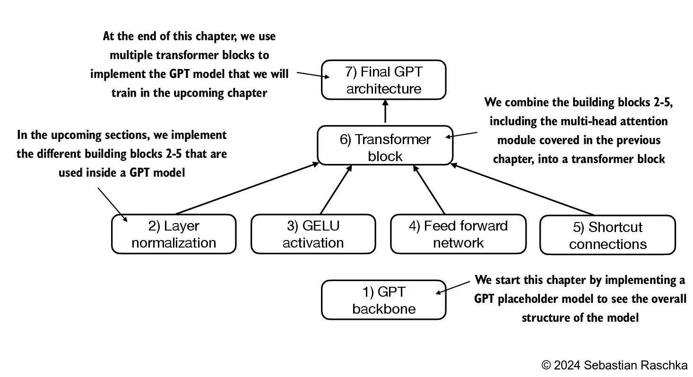
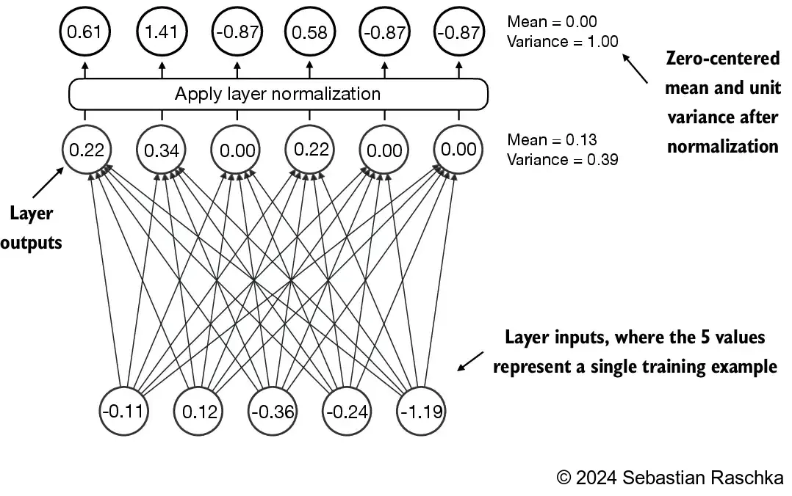
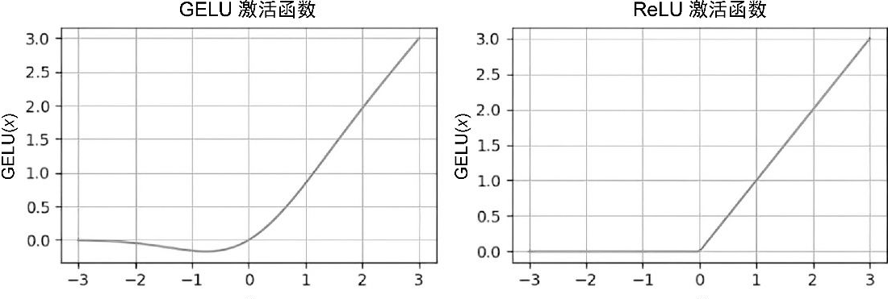
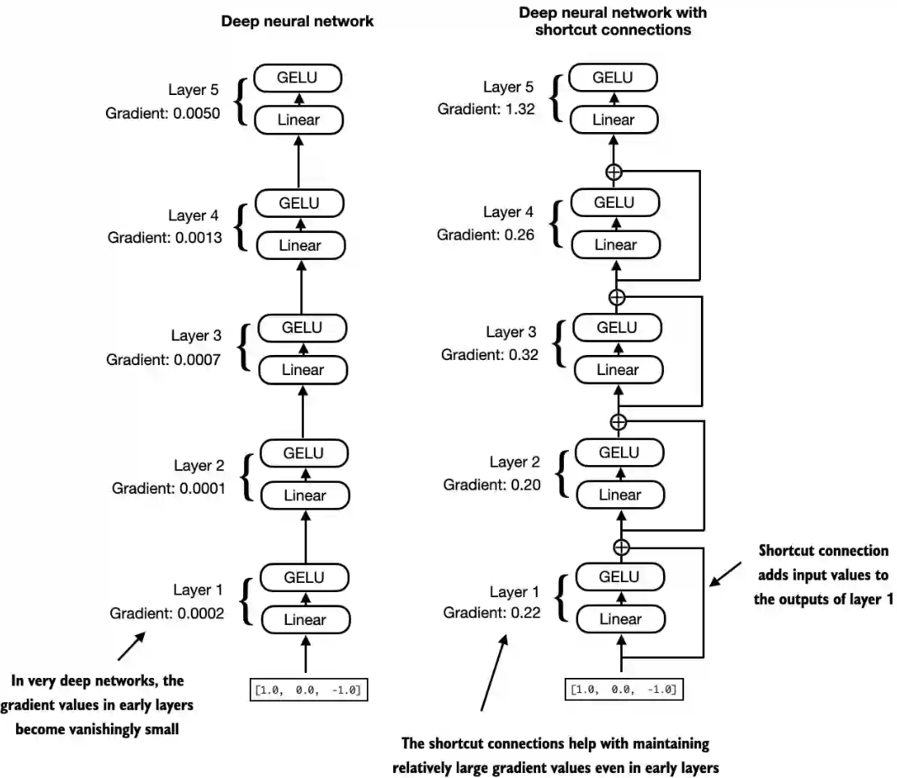
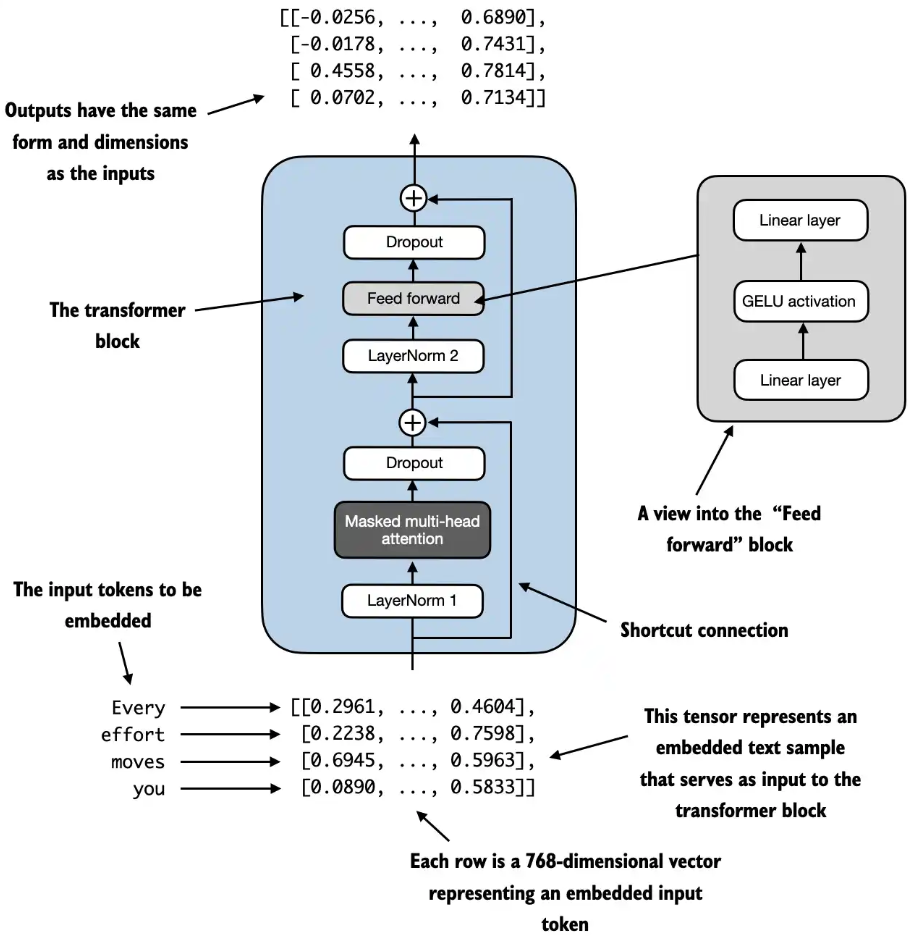
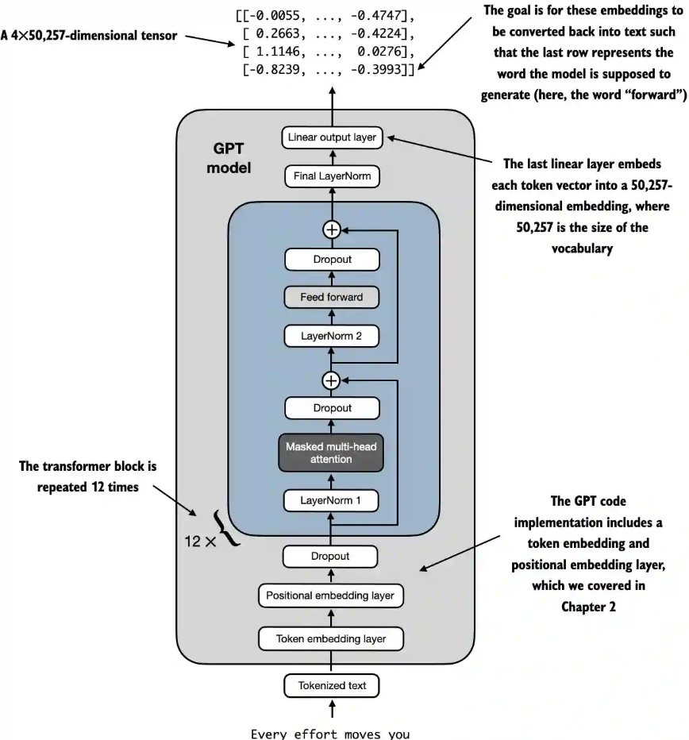
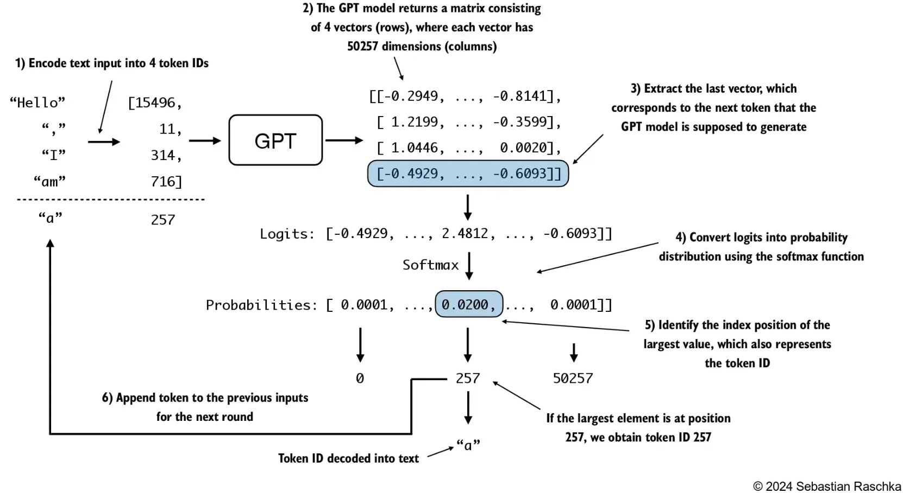

##  《从零构建大模型》

 [美]塞巴斯蒂安·拉施卡

书中资料 https://github.com/rasbt/LLMs-from-scratch

### 第四章  模型架构

#### 4.1 构建一个大语言模型架构

* 大语言模型，比如GPT（生成式预训练Transformer），是旨在一次生成一个词（或词元）的大型深度神经网络架构。
* GPT模型。除了嵌入层，它还包含一个或多个Transformer块，这些块中包括我们之前实现的掩码多头注意力模块
* 在深度学习和像GPT这样的大语言模型中，“**参数**”指的是模型的可训练权重。这些权重本质上是模型的内部变量，在训练过程中通过调整和优化来最小化特定的损失函数。这种优化使模型能够从训练数据中学习。
* 例如，在一个由2048维×2048维的权重矩阵（或张量）表示的神经网络层中，矩阵中的每个元素都是一个参数。由于矩阵有2048行和2048列，因此该层的参数总数为2048×2048，即4 194 304。

GPT-2 124M参数的模型配置如下：

```python
GPT_CONFIG_124M = {
    "vocab_size": 50257,     # 词汇表大小
    "context_length": 1024,  # 上下文长度
    "emb_dim": 768,          # 嵌入维度
    "n_heads": 12,           # 注意力头的数量
    "n_layers": 12,          # 层数
    "drop_rate": 0.1,        # dropout率
    "qkv_bias": False        # 查询-键-值偏置
}
```

* vocab_size表示会被BPE分词器使用的由50 257个单词组成的词汇表（参见第2章）

* context_length指的是模型通过位置嵌入能够处理的最大输入词元数量（参见第2章）。

* emb_dim表示嵌入维度大小，可以将每个词元转化为768维的向量

* n_heads表示多头注意力机制中注意力头的数量
* n_layers表示模型中的Transformer块数量
* drop_rate表示dropout机制的强度（0.1表示有10%的隐藏单元被随机丢弃），以防止过拟合
* qkv_bias指的是是否在多头注意力机制的线性层中添加一个偏置向量，用于查询、键和值的计算

模型的架构由图中几个步骤构成: 
  

#### 4.2 GPT模型的骨架

一个简化版的类GPT模型架构包括词元和位置嵌入、dropout、一系列Transformer块(DummyTransformerBlock)、最终层归一化(DummyLayerNorm)和线性输出层(out_head)。配置信息通过一个Python字典（GPT_CONFIG_124M）传入

```python
import torch
import torch.nn as nn

class DummyGPTModel(nn.Module):
    def __init__(self, cfg):
        super().__init__()
        self.tok_emb = nn.Embedding(cfg["vocab_size"], cfg["emb_dim"])
        self.pos_emb = nn.Embedding(cfg["context_length"], cfg["emb_dim"])
        self.drop_emb = nn.Dropout(cfg["drop_rate"])
        
        # Use a placeholder for TransformerBlock
        self.trf_blocks = nn.Sequential(
            *[DummyTransformerBlock(cfg) for _ in range(cfg["n_layers"])])
        
        # Use a placeholder for LayerNorm
        self.final_norm = DummyLayerNorm(cfg["emb_dim"])
        self.out_head = nn.Linear(
            cfg["emb_dim"], cfg["vocab_size"], bias=False
        )

    def forward(self, in_idx):
        batch_size, seq_len = in_idx.shape  #in_idx is batch
        print("shape of in_idx", in_idx.shape) #torch.Size([2, 4])
        tok_embeds = self.tok_emb(in_idx)
        pos_embeds = self.pos_emb(torch.arange(seq_len, device=in_idx.device))
        x = tok_embeds + pos_embeds # 词元和位置嵌入
        x = self.drop_emb(x)
        x = self.trf_blocks(x) #Transformer块
        x = self.final_norm(x) # 用归一化
        logits = self.out_head(x) # 线性输出层
        return logits
```

forward方法描述了数据在模型中的处理流程：它首先计算输入索引的词元和位置嵌入，然后应用dropout，接着通过Transformer块处理数据，再应用归一化，最后使用线性输出层生成logits

测试函数如下

```python
def test_model():
    tokenizer = tiktoken.get_encoding("gpt2")
    batch = []
    txt1 = "Every effort moves you"
    txt2 = "Every day holds a"

    batch.append(torch.tensor(tokenizer.encode(txt1)))
    batch.append(torch.tensor(tokenizer.encode(txt2)))
    batch = torch.stack(batch, dim=0)
    print(batch)
    '''
    tensor([[6109, 3626, 6100,  345], 
        [6109, 1110, 6622,  257]])
    '''

    torch.manual_seed(123)
    model = DummyGPTModel(GPT_CONFIG_124M)

    logits = model(batch)
    print("Output shape:", logits.shape) # torch.Size([2, 4, 50257])
    print(logits)
    '''
    tensor([[[-1.2034,  0.3201, -0.7130,  ..., -1.5548, -0.2390, -0.4667],
         [-0.1192,  0.4539, -0.4432,  ...,  0.2392,  1.3469,  1.2430],
         [ 0.5307,  1.6720, -0.4695,  ...,  1.1966,  0.0111,  0.5835],
         [ 0.0139,  1.6754, -0.3388,  ...,  1.1586, -0.0435, -1.0400]],

        [[-1.0908,  0.1798, -0.9484,  ..., -1.6047,  0.2439, -0.4530],
         [-0.7860,  0.5581, -0.0610,  ...,  0.4835, -0.0077,  1.6621],
         [ 0.3567,  1.2698, -0.6398,  ..., -0.0162, -0.1296,  0.3717],
         [-0.2407, -0.7349, -0.5102,  ...,  2.0057, -0.3694,  0.1814]]],
       grad_fn=<UnsafeViewBackward0>)
    '''
```

* 在大语言模型中，输入词元的嵌入维度通常与输出维度相匹配。这里的输出嵌入代表上下文向量，还不是最终的模型输出。模型的输出（通常称为logits)
* 在GPT-2中输入的词元嵌入向量（维度为 768）会经过多层 Transformer 的自注意力（Self-Attention）和前馈神经网络（Feed-Forward Network）处理。在这些层中，所有的中间表示（包括注意力机制的上下文向量）都会保持维度为 768，以确保模型内部计算的一致性。从测试代码可以看到模型的输出最终的维度为`2*4*50257`，两行文本，每个文本4个词元，每个词元对应词汇表中50257个词出现的概率。
* GPT-2 是一个自回归语言模型，其目标是预测下一个词元（token）。为了实现这一点，模型的输出需要表示词汇表中每个词元的概率分布。因此，模型的最后一层会将 Transformer 的输出（维度为 768）通过一个**线性变换层（通常称为输出投影层或语言模型头）**映射到词汇表大小的维度（即词元字典的大小，例如 GPT-2 的词汇表大小为 50,257）
* **线性变换层**的作用是将每个词元的语义表示（768 维）转化为词汇表中每个词元的得分（logits），然后通过 `softmax`函数转换为概率分布，用于预测下一个词元。

#### 4.3 使用层归一化进行归一化激活

* 由于梯度消失或梯度爆炸等问题，训练深层神经网络有时会变得具有挑战性。这些问题会导致训练过程不稳定，使网络难以有效地调整权重，从而使学习过程难以找到一组最小化损失函数的参数（权重）。换句话说，网络难以学习数据中的潜在模式，从而无法进行准确预测或决策。

* 实现层归一化，以提高神经网络训练的稳定性和效率。层归一化的主要思想是调整神经网络层的激活（输出），使其均值为0且方差（单位方差）为1。这种调整有助于加速权重的有效收敛，并确保训练过程的一致性和可靠性。
* 层归一化可以确保每个层的输出具有一致的均值和方差，从而稳定训练过程
* 在GPT-2和当前的Transformer架构中，层归一化通常在多头注意力模块的前后进行，
* 层归一化还应用于最终输出层之前

##### 简单举例

一个输入值的维度5，经过网络层后输出维度为6，这6个值经过归一化后平均值为0，方差为1


 

以上图为例的代码实现

```python
def test_norm():
    torch.manual_seed(123)
    # 两个输入，每个输入的维度为5
    batch_example = torch.randn(2, 5) 
    # 创建一个神经网络，它包括一个输入维度为5，输出维度为6的线性层和一个Relu非线性激活函数层
    layer = nn.Sequential(nn.Linear(5, 6), nn.ReLU())
    out = layer(batch_example)
    print(out)
    '''
    tensor([[0.2260, 0.3470, 0.0000, 0.2216, 0.0000, 0.0000],
        [0.2133, 0.2394, 0.0000, 0.5198, 0.3297, 0.0000]],
       grad_fn=<ReluBackward0>)
    '''
    # 按最后一维计算平均值，输入2*5，即5所在的那一个维度
    # dim参数指定了在张量中计算统计量（如均值或方差）时应该沿着哪个维度进行
    # -1表示张量的最后一个维度，这在二维张量中对应的是列
    mean = out.mean(dim=-1, keepdim=True)
    # 按最后一维计算方差
    var = out.var(dim=-1, keepdim=True)
    # 使用keepdim=True可以确保输出张量与输入张量具有相同的维度，尽管这类运算是沿指定的维度dim减少张量的。
    # 如果没有keepdim=True，那么返回的均值张量将是一个二维向量[0.1324, 0.2170]，而不是2×1维的矩阵[​[0.1324], [0.2170]​]
    print("Mean:\n", mean) # tensor([[0.1324],  [0.2170]], grad_fn=<MeanBackward1>)
    print("Variance:\n", var) #tensor([[0.0231],  [0.0398]], grad_fn=<VarBackward0>)

    # 归一化操作：输出减去均值除以方差的平方根
    out_norm = (out - mean) / torch.sqrt(var)
    print("Normalized layer outputs:\n", out_norm)
    '''
    tensor([[ 0.6159,  1.4126, -0.8719,  0.5872, -0.8719, -0.8719],
        [-0.0189,  0.1121, -1.0876,  1.5173,  0.5647, -1.0876]],
       grad_fn=<DivBackward0>)
    '''
    # 归一化后的层输出现在也包含负值，其均值为0，方差为1
    mean = out_norm.mean(dim=-1, keepdim=True)
    var = out_norm.var(dim=-1, keepdim=True)
    print("Mean:\n", mean) #  tensor([[9.9341e-09],   [5.9605e-08]], grad_fn=<MeanBackward1>)
    print("Variance:\n", var) # tensor([[1.0000],   [1.0000]], grad_fn=<VarBackward0>)
    # 将sci_mode设置为False来关闭科学记数法
    torch.set_printoptions(sci_mode=False)
    print("Mean:\n", mean) # tensor([[    0.0000],  [    0.0000]], grad_fn=<MeanBackward1>)
    print("Variance:\n", var)
```

* 非线性激活函数ReLU（修正线性单元），ReLU是神经网络中的一种标准激活函数。它只是简单地将负输入值设为0，从而确保层的输出值都是正值，这也解释了为什么结果层的输出中不包含负值
* 一开始网络的输出是2*5和输入相同，且所有的值都是大于0的，经过层归一化后输出值包含负值，其均值为0，方差为1

##### 层归一化类实现

```python
class LayerNorm(nn.Module):
    def __init__(self, emb_dim):
        super().__init__()
        self.eps = 1e-5
        self.scale = nn.Parameter(torch.ones(emb_dim))
        self.shift = nn.Parameter(torch.zeros(emb_dim))

    def forward(self, x):
        # 最后一个维度上计算平均值和方差
        mean = x.mean(dim=-1, keepdim=True)
        # 设置unbiased=False，使用样本数量作为方差公式的除数
        var = x.var(dim=-1, keepdim=True, unbiased=False)
        # + self.eps 为例防止除0异常
        norm_x = (x - mean) / torch.sqrt(var + self.eps)
        return self.scale * norm_x + self.shift
    
def test_norm():
    torch.manual_seed(123)
    # 两个输入，每个输入的维度为5
    batch_example = torch.randn(2, 5) 
    ln = LayerNorm(emb_dim=5)
    out_ln = ln(batch_example)

    mean = out_ln.mean(dim=-1, keepdim=True)
    var = out_ln.var(dim=-1, unbiased=False, keepdim=True)
    print("Mean:\n", mean) # tensor([[-2.9802e-08],        [ 0.0000e+00]], grad_fn=<MeanBackward1>)
    print("Variance:\n", var) # tensor([[1.0000],        [1.0000]], grad_fn=<VarBackward0>)
```

*  这个层归一化的具体实现作用在输入张量x的最后一个维度上，该维度对应于嵌入维度(emb_dim)。变量eps是一个小常数(epsilon)，在归一化过程中会被加到方差上以防止除零错误。**scale**和**shift**是两个可训练的参数（与输入维度相同），如果在训练过程中发现调整它们可以改善模型的训练任务表现，那么大语言模型会自动进行调整。这使得模型能够学习适合其数据处理的最佳缩放和偏移。

* 在批次维度上进行归一化的批归一化不同，层归一化是在特征维度上进行归一化。由于层归一化是对每个输入独立进行归一化，不受批次大小的限制，因此在这些场景中它提供了更多的灵活性和稳定性。这在分布式训练或在资源受限的环境中部署模型时尤为重要

#### 4.4 实现具有GELU激活函数的前馈神经网络

在大语言模型中，除了传统的**ReLU**，还有其他几种激活函数，其中两个值得注意的例子是**GELU(Gaussian Error Linear Unit)**和**SwiGLU(Swish-gated Linear Unit)**。**GELU**和**SwiGLU**是更为复杂且平滑的激活函数，分别结合了**高斯分布**和**sigmoid**门控线性单元。与较为简单的**ReLU**激活函数相比，它们能够提升深度学习模型的性能。

##### GELU激活函数

* GELU激活函数可以通过多种方式实现，其精确的定义为 `GELU(x)=x⋅Φ(x)`, 其中`Φ(x)` 是标准高斯分布的累积分布函数

* 实际中通常使用以下近似计算公式：

​	$\text{GELU}(x) \approx 0.5 \cdot x \cdot \left(1 + \tanh\left[\sqrt{\frac{2}{\pi}} \cdot \left(x + 0.044715 \cdot x^3\right)\right]\right)$

* **ReLU**是一个分段线性函数，当输入为正数时直接输出输入值，否则输出0。**GELU**则是一个平滑的非线性函数，它近似**ReLU**，但在几乎所有负值（除了在x约等于-0.75的位置外）上都有非零梯度。

  
   

* **GELU**的平滑特性可以在训练过程中带来更好的优化效果，因为它允许模型参数进行更细微的调整。相比之下，**ReLU**在零点处有一个尖锐的拐角（参见图4-8的右图），有时会使得优化过程更加困难，特别是在深度或复杂的网络结构中 ReLU对负输入的输出为0，而GELU对负输入会输出一个小的非零值。这意味着在训练过程中，接收到负输入的神经元仍然可以参与学习，只是贡献程度不如正输入大。

##### 前馈神经网络模块

```python
class GELU(nn.Module):
    '''
    GELU激活函数实现
    '''
    def __init__(self):
        super().__init__()

    def forward(self, x):
        return 0.5 * x * (1 + torch.tanh(
            torch.sqrt(torch.tensor(2.0 / torch.pi)) * 
            (x + 0.044715 * torch.pow(x, 3))
        ))

# 前馈神经网络模块    
class FeedForward(nn.Module):
    def __init__(self, cfg):
        super().__init__()
        self.layers = nn.Sequential(
            nn.Linear(cfg["emb_dim"], 4 * cfg["emb_dim"]),
            GELU(),
            nn.Linear(4 * cfg["emb_dim"], cfg["emb_dim"]),
        )

    def forward(self, x):
        return self.layers(x)

def test_feedForward():
    ffn = FeedForward(GPT_CONFIG_124M)
    # input shape: [batch_size, num_token, emb_size]
    x = torch.rand(2, 3, 768) 
    out = ffn(x)
    print(out.shape) #torch.Size([2, 3, 768])
```

`FeedForward`模块是一个小型神经网络，由两个**线性层**和一个**GELU**激活函数组成。在参数量为1.24亿的GPT模型中，该模块通过`GPT_CONFIG_124M`字典接收输入批次，其中每个词元的嵌入维度为768，即`GPT_CONFIG_124M["emb_dim"] =768`

`FeedForward`模块在提升模型学习和泛化能力方面非常关键。虽然该模块的输入和输出维度保持一致，但它通过**第一个线性层将嵌入维度扩展到了更高的维度**，这里是从768维扩展到3072维。扩展之后，**应用非线性GELU激活函数**，然后通过**第二个线性变换将维度缩回原始大小**，即将3072维压缩回768维。这种设计允许模型探索更丰富的表示空间

#### 4.5 快捷连接

* 快捷连接（也称为“跳跃连接”或“残差连接”），最初用于计算机视觉中的深度网络（特别是残差网络），目的是缓解梯度消失问题。梯度消失问题指的是在训练过程中，梯度在反向传播时逐渐变小，导致早期网络层难以有效训练。
* 快捷连接通过跳过一个或多个层，为梯度在网络中的流动提供了一条可替代且更短的路径。这是通过**将一层的输出添加到后续层的输出中**实现的。这也是为什么这种连接被称为跳跃连接。在反向传播训练中，它们在维持梯度流动方面扮演着至关重要的角色
* 快捷连接是通过将一层的输出直接传递到更深层来跳过一个或多个层的连接，它能帮助缓解在训练深度神经网络（如大语言模型）时遇到的梯度消失问题

简单举例

一个具有5层的深度神经网络，每层由一个线性层和一个GELU激活函数组成。在前向传播过程中，我们通过各层迭代地传递输入。快捷连接将某一层的输入添加到其输出中，有效地创建了一条绕过某些层的替代路径。图中的**梯度表示每层的平均绝对梯度，有快捷连接的梯度值明显要大**。


 

* 示例代码和输出

```python
class ExampleDeepNeuralNetwork(nn.Module):
    def __init__(self, layer_sizes, use_shortcut):
        super().__init__()
        self.use_shortcut = use_shortcut
        # 5层的深度神经网络
        self.layers = nn.ModuleList([
            nn.Sequential(nn.Linear(layer_sizes[0], layer_sizes[1]), GELU()),
            nn.Sequential(nn.Linear(layer_sizes[1], layer_sizes[2]), GELU()),
            nn.Sequential(nn.Linear(layer_sizes[2], layer_sizes[3]), GELU()),
            nn.Sequential(nn.Linear(layer_sizes[3], layer_sizes[4]), GELU()),
            nn.Sequential(nn.Linear(layer_sizes[4], layer_sizes[5]), GELU())
        ])

    def forward(self, x):
        for layer in self.layers:
            # Compute the output of the current layer
            layer_output = layer(x)
            # Check if shortcut can be applied
            if self.use_shortcut and x.shape == layer_output.shape:
                x = x + layer_output
            else:
                x = layer_output
        return x


def print_gradients(model, x):
    # Forward pass 前向传播
    output = model(x)
    target = torch.tensor([[0.]])

    # Calculate loss based on how close the target and output are
    # 定义了一个损失函数, 用于计算模型输出与用户指定目标（为简化处理，这里设为0）的接近程度
    loss = nn.MSELoss()    
    loss = loss(output, target)
    
    # Backward pass to calculate the gradients
    # 当调用loss.backward()时，PyTorch会计算模型中每一层的损失梯度
    loss.backward()

    #通过model.named_parameters()迭代权重参数
    for name, param in model.named_parameters():
        if 'weight' in name:
            # Print the mean absolute gradient of the weights 梯度值的平均绝对值
            print(f"{name} has gradient mean of {param.grad.abs().mean().item()}")

def test_shortcut():
    # 每一层输入3个值，输出3个值，最后一层输出1个值
    layer_sizes = [3, 3, 3, 3, 3, 1]  
    sample_input = torch.tensor([[1., 0., -1.]])

    torch.manual_seed(123)
    # 一个无快捷连接的
    model_without_shortcut = ExampleDeepNeuralNetwork(layer_sizes, use_shortcut=False)
    print_gradients(model_without_shortcut, sample_input)
    '''
    layers.0.0.weight has gradient mean of 0.00020173590746708214
    layers.1.0.weight has gradient mean of 0.0001201116101583466
    layers.2.0.weight has gradient mean of 0.0007152042235247791
    layers.3.0.weight has gradient mean of 0.0013988739810883999
    layers.4.0.weight has gradient mean of 0.00504964729771018
    '''
    torch.manual_seed(123)
    model_with_shortcut = ExampleDeepNeuralNetwork(layer_sizes, use_shortcut=True)
    print_gradients(model_with_shortcut, sample_input)
    '''
    layers.0.0.weight has gradient mean of 0.22169791162014008
    layers.1.0.weight has gradient mean of 0.20694102346897125
    layers.2.0.weight has gradient mean of 0.32896995544433594
    layers.3.0.weight has gradient mean of 0.2665732204914093
    layers.4.0.weight has gradient mean of 1.3258541822433472
    '''
```

* 定义了一个损失函数`loss = nn.MSELoss()`，用于计算模型输出与用户指定目标（为简化处理，这里设为0）的接近程度。然后，当调用`loss.backward()`时，PyTorch会计算模型中每一层的损失梯度
* 通过`model.named_parameters()`迭代权重参数，如果某一层有一个3×3的权重参数矩阵，那么该层将有3×3的梯度值。我们打印这3×3的梯度值的平均绝对值，以得到每一层的单一梯度值，从而可以比较层与层之间的梯度变化。
* 从第一段无快捷连接的输出看到，梯度在从最后一层(layers.4)到第1层(layers.0)的过程中逐渐变小，最后变成一个非常小的值，这种现象称为**梯度消失**问题
* 对有快捷连接的输出结果，梯度值在逐渐接近第1层(layers.0)时趋于稳定，并且没有缩小到几乎消失的程度。

#### 4.6 Transformer块

Transformer块，是GPT和其他大语言模型架构的基本构建块。它结合了多个组件，包括掩码多头注意力模块、之前实现的`FeedForward`模块。当Transformer块处理输入序列时，序列中的每个元素（如单词或子词）都被表示为一个固定大小的向量（此处为768维）。Transformer块内的操作，包括多头注意力和前馈层，旨在以保持这些向量维度的方式来转换它们。

自注意力机制在多头注意力块中用于识别和分析输入序列中元素之间的关系。前馈神经网络则在每个位置上对数据进行单独的修改。这种组合不仅提供了对输入更细致的理解和处理，而且提升了模型处理复杂数据模式的整体能力。

  
   

图中输入的词元(Every，effort等)被嵌入到768维的向量中。每一行对应一个词元的向量表示。Transformer块的输出是与输入具有相同维度的向量，这些向量可以传递到大语言模型的后续层中，这里是4x768。

前层归一化(Pre-LayerNorm)：在多**头注意力机制**(MultiHeadAttention)和**前馈神经网络**(FeedForward)之前都有一个**层归一化**(LayerNorm)，而在它们两个之后也都有一个dropout，以便对模型进行正则化并防止过拟合。

后层归一化(Post-LayerNorm)：在多**头注意力机制**(MultiHeadAttention)和**前馈神经网络**(FeedForward)之后进行层归一化，早期的Transformer模型采用这种架构，会导致较差的训练结果

代码中实现的前向传播中每个组件后面都跟着一个快捷连接，将块的输入加到其输出上。这个关键特性有助于在训练过程中使梯度在网络中流动，并改善深度模型的学习效果

```python
class TransformerBlock(nn.Module):
    def __init__(self, cfg):
        super().__init__()
        self.att = MultiHeadAttention(  # 多头注意力
            d_in=cfg["emb_dim"],
            d_out=cfg["emb_dim"],
            context_length=cfg["context_length"],
            num_heads=cfg["n_heads"], 
            dropout=cfg["drop_rate"],
            qkv_bias=cfg["qkv_bias"])
        self.ff = FeedForward(cfg)  # 前反馈模块，里面有GELU激活函数
        self.norm1 = LayerNorm(cfg["emb_dim"])  # 层归一化
        self.norm2 = LayerNorm(cfg["emb_dim"])
        self.drop_shortcut = nn.Dropout(cfg["drop_rate"]) # dropout

    def forward(self, x):
        # Shortcut connection for attention block
        # 多头注意力的快捷连接
        shortcut = x
        x = self.norm1(x) # 层归一化
        x = self.att(x)  # 多头注意力 Shape [batch_size, num_tokens, emb_size]
        x = self.drop_shortcut(x)
        x = x + shortcut  # Add the original input back

        # Shortcut connection for feed forward block
        # 前反馈网络的快捷连接
        shortcut = x
        x = self.norm2(x) # 层归一化
        x = self.ff(x)    # 前反馈模块
        x = self.drop_shortcut(x)
        x = x + shortcut  # Add the original input back

        return x
    
def test_TransformerBlock():
    torch.manual_seed(123)
    x = torch.rand(2, 4, 768)  # Shape: [batch_size, num_tokens, emb_dim]
    block = TransformerBlock(GPT_CONFIG_124M)
    output = block(x)
    print("Input shape:", x.shape) # torch.Size([2, 4, 768])
    print("Output shape:", output.shape) # torch.Size([2, 4, 768])
```


#### 4.7 实现GPT模型

* 从底部开始，词元化文本首先被转换成词元嵌入，然后用位置嵌入进行增强。这些组合信息形成一个张量，然后通过中间所示的一系列Transformer块（每个块都包含多头注意力和前馈神经网络层，并带有dropout和层归一化功能），这些块相互堆叠并重复12次
* 最终Transformer块的输出会经过最后一步的层归一化处理，以稳定学习过程，然后传递到线性输出层。这个层会将Transformer的输出映射到一个高维空间（在本例中为50 257维，对应模型的词汇表大小），为词汇中的每个词元生成分数(logits)，以预测序列中的下一个词元。


 

**实现代码**

* 通过`numel()`（“number of elements”的缩写）方法可以统计模型参数张量的总参数量

```python
class GPTModel(nn.Module):
    def __init__(self, cfg):
        super().__init__()
        self.tok_emb = nn.Embedding(cfg["vocab_size"], cfg["emb_dim"])
        self.pos_emb = nn.Embedding(cfg["context_length"], cfg["emb_dim"])
        self.drop_emb = nn.Dropout(cfg["drop_rate"])
        # 12个TransformerBlock堆叠
        self.trf_blocks = nn.Sequential(
            *[TransformerBlock(cfg) for _ in range(cfg["n_layers"])])
        # 最后的层归一化
        self.final_norm = LayerNorm(cfg["emb_dim"])
        self.out_head = nn.Linear(
            cfg["emb_dim"], cfg["vocab_size"], bias=False
        )

    def forward(self, in_idx):
        batch_size, seq_len = in_idx.shape
        # 词元嵌入
        tok_embeds = self.tok_emb(in_idx)
        # 位置嵌入
        pos_embeds = self.pos_emb(torch.arange(seq_len, device=in_idx.device))
        # 位置嵌入添加到词元嵌入上
        x = tok_embeds + pos_embeds  # Shape [batch_size, num_tokens, emb_size]
        x = self.drop_emb(x)   # Dropout on embeddings
        x = self.trf_blocks(x) # Transformer blocks
        x = self.final_norm(x) # Final layer norm
        logits = self.out_head(x) # Output layer to vocab size
        return logits

def test_GPTModel():
    tokenizer = tiktoken.get_encoding("gpt2")
    batch = []
    txt1 = "Every effort moves you"
    txt2 = "Every day holds a"

    batch.append(torch.tensor(tokenizer.encode(txt1)))
    batch.append(torch.tensor(tokenizer.encode(txt2)))
    batch = torch.stack(batch, dim=0)

    torch.manual_seed(123)
    model = GPTModel(GPT_CONFIG_124M)
    out = model(batch)
    print("Input batch:\n", batch)
    '''
     tensor([[6109, 3626, 6100,  345],
        [6109, 1110, 6622,  257]])
    '''
    print("\nOutput shape:", out.shape) # torch.Size([2, 4, 50257])
    print(out)
    '''
    tensor([[[ 0.3613,  0.4222, -0.0711,  ...,  0.3483,  0.4661, -0.2838],
         [-0.1792, -0.5660, -0.9485,  ...,  0.0477,  0.5181, -0.3168],
         [ 0.7120,  0.0332,  0.1085,  ...,  0.1018, -0.4327, -0.2553],
         [-1.0076,  0.3418, -0.1190,  ...,  0.7195,  0.4023,  0.0532]],

        [[-0.2564,  0.0900,  0.0335,  ...,  0.2659,  0.4454, -0.6806],
         [ 0.1230,  0.3653, -0.2074,  ...,  0.7705,  0.2710,  0.2246],
         [ 1.0558,  1.0318, -0.2800,  ...,  0.6936,  0.3205, -0.3178],
         [-0.1565,  0.3926,  0.3288,  ...,  1.2630, -0.1858,  0.0388]]],
       grad_fn=<UnsafeViewBackward0>)
    '''
    total_params = sum(p.numel() for p in model.parameters())
    print(f"Total number of parameters: {total_params:,}") # 163,009,536
    print("Token embedding layer shape:", model.tok_emb.weight.shape) # torch.Size([50257, 768])
    print("Output layer shape:", model.out_head.weight.shape)  # torch.Size([50257, 768])
	# 总的GPT-2模型参数计数中减去输出层的参数量
    total_params_gpt2 =  total_params - sum(p.numel() for p in model.out_head.parameters())
    print(f"Number of trainable parameters considering weight tying: {total_params_gpt2:,}") # 124,412,160
```

* 原始GPT-2架构中使用了一个叫作**权重共享(weight tying)**的概念。也就是说，原始GPT-2架构是将词元嵌入层作为输出层重复使用的
* 总的GPT-2模型参数计数中减去输出层的参数量得到参数数量为124,412,160，就是1.24亿了。
* 示例代码`GPTModel`对象中1.63亿个参数，并假设每个参数是占用4字节的32位浮点数，模型参数使用的内存总大小为621.83 MB，这表明即使是相对较小的大语言模型也需要相对较大的存储容量。
* 权重共享可以减少模型的总体内存占用和计算复杂度。不过，根据我的经验，使用单独的词元嵌入层和输出层可以获得更好的训练效果和模型性能

#### 4.8 生成文本

在生成下一个词的迭代的每一步中，模型输出一个矩阵，其中的向量表示有可能的下一个词元。将与下一个词元对应的向量提取出来，并通过`softmax`函数转换为概率分布。在包含这些概率分数的向量中，找到最高值的索引，这个索引对应于词元ID。然后将这个词元ID解码为文本，生成序列中的下一个词元。最后，将这个词元附加到之前的输入中，形成新的输入序列，供下一次迭代使用。这个逐步的过程使得模型能够按顺序生成文本，从最初的输入上下文中构建连贯的短语和句子

生成下一个词的过程


 

**相关代码**

输入文本"Hello, I am"共4个词元，经过GPT模型预测后，计算出下一个词的词元ID是27018，把这个词加入输入，一共5个词元输入给GPT模型，再去预测下一个词，直到6次预测完成，一共输出了10个词元，再把这10个词元ID转换回字串。

```python
def generate_text_simple(model, idx, max_new_tokens, context_size):
    # idx is (batch, n_tokens) array of indices in the current context
    for _ in range(max_new_tokens):        
        # Crop current context if it exceeds the supported context size
        # E.g., if LLM supports only 5 tokens, and the context size is 10
        # then only the last 5 tokens are used as context
        # 如果输入的文本长度大于模型上下文长度，截断处理
        idx_cond = idx[:, -context_size:]
        
        # Get the predictions
        with torch.no_grad():
            logits = model(idx_cond)
        
        # Focus only on the last time step
        # (batch, n_tokens, vocab_size) becomes (batch, vocab_size)
        # 只关注最后一个输出的内容
        logits = logits[:, -1, :]  

        # Apply softmax to get probabilities
        # 将logits转换为概率分布，softmax函数是单调的，这意味着它在转换为输出时保持了输入的顺序
        probas = torch.softmax(logits, dim=-1)  # (batch, vocab_size)

        # Get the idx of the vocab entry with the highest probability value
        # 找到最大值的位置
        idx_next = torch.argmax(probas, dim=-1, keepdim=True)  # (batch, 1)

        # Append sampled index to the running sequence
        # 下一次迭代输入的词元个数增加了一个
        idx = torch.cat((idx, idx_next), dim=1)  # (batch, n_tokens+1)

    return idx

def test_generate_text_simple():
    start_context = "Hello, I am"
    tokenizer = tiktoken.get_encoding("gpt2")
    encoded = tokenizer.encode(start_context)
    print("encoded:", encoded) # encoded: [15496, 11, 314, 716]

    encoded_tensor = torch.tensor(encoded).unsqueeze(0)
    print("encoded_tensor.shape:", encoded_tensor.shape) #encoded_tensor.shape: torch.Size([1, 4])

    torch.manual_seed(123)
    model = GPTModel(GPT_CONFIG_124M)
    # 将模型设置为.eval()模式，这将禁用诸如dropout等只在训练期间使用的随机组件
    model.eval() # disable dropout

    out = generate_text_simple(
        model=model,
        idx=encoded_tensor,  # 输入的句子的嵌入向量
        max_new_tokens=6, # 预测下一个词的次数
        context_size=GPT_CONFIG_124M["context_length"] # 支持的上下文长度
    )
	# 输入4个词元，预测了6次下一个次，所以共10个词
    print("Output:", out) # tensor([[15496,    11,   314,   716, 27018, 24086, 47843, 30961, 42348,  7267]])
    print("Output length:", len(out[0])) #10
	# 把词汇表的id转换回文本
    decoded_text = tokenizer.decode(out.squeeze(0).tolist())
    print(decoded_text) # Hello, I am Featureiman Byeswickattribute argue
```

