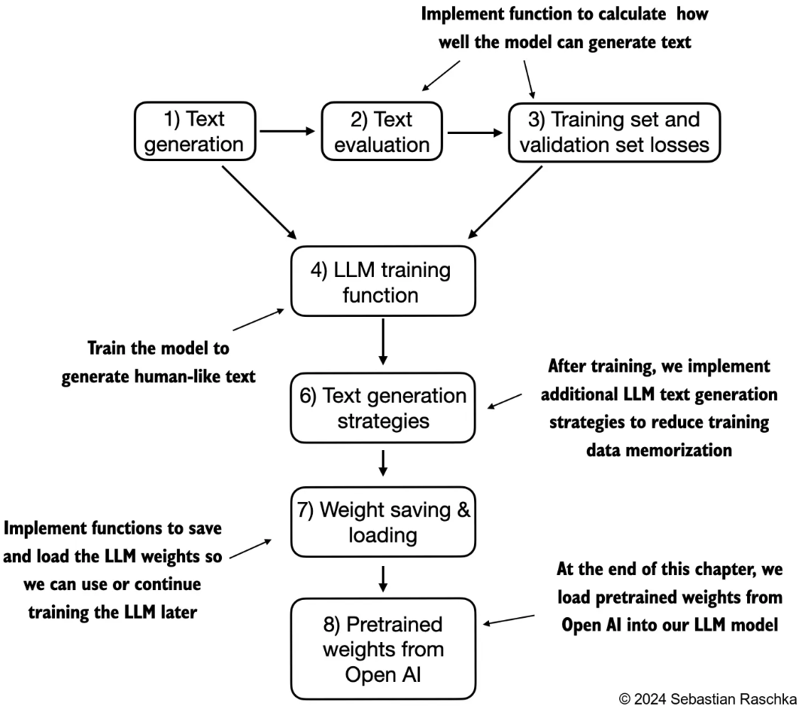
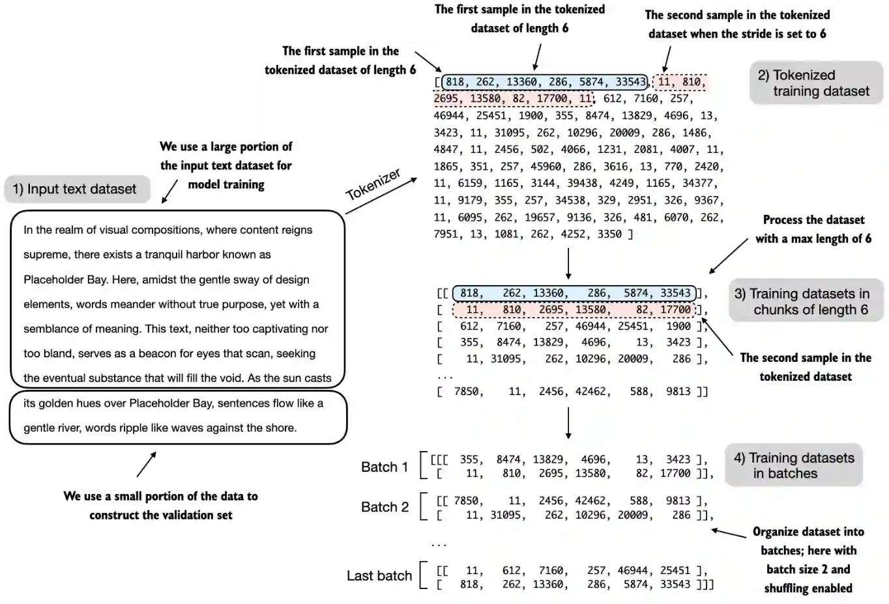
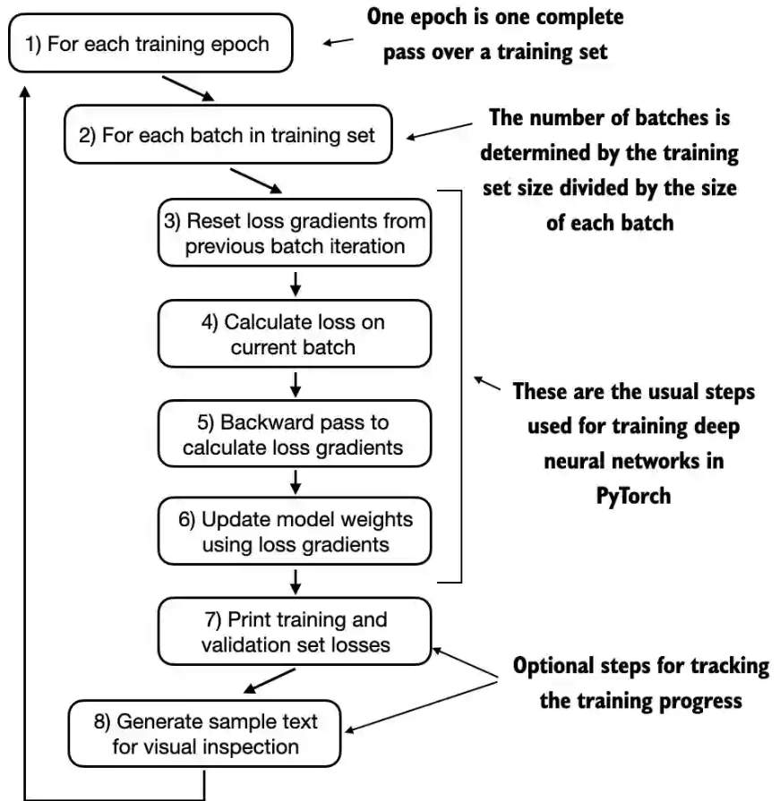
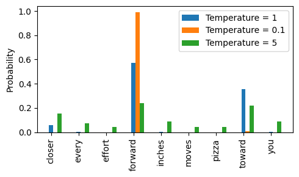

##  《从零构建大模型》

 [美]塞巴斯蒂安·拉施卡

书中资料 https://github.com/rasbt/LLMs-from-scratch

### 第五章  训练模型(无标签数据)

模型训练过程就是调整模型中的权重参数，大语言模型以及其他深度学习模型的背景下，权重一般指的是学习过程调整的可训练参数。这些权重也被称为权重参数或简单地称为参数。

`PyTorch`框架中，这些权重存储在线性层中。初始化一个线性层`(new_layer = torch.nn.Linear(...))`之后，可以通过`.weight`属性`(new_layer.weight)`访问其权重。`PyTorch`允许通过`model.parameters()`方法直接访问模型的所有可训练参数（包括`Weights`和`Biases`）


 

#### 5.1 评估文本生成模型

* 通过计算文本生成损失来对生成的文本质量进行数值评估。
* 文本评估过程的一部分是衡量生成词元与正确预测（目标）之间的偏差程度。目标是对输入数据的复制，但向前移动了一个位置
* 模型训练的目的是增大与正确目标词元ID对应的索引位置的`softmax`概率。在训练之前，模型会生成随机的下一个词元的概率向量。模型训练的目标是确保目标词元ID对应的概率值被最大化。

##### 基本评估方法

通过更新模型权重，以便模型为我们想要生成的相应词元ID输出更高的值。权重更新是通过一种称为反向传播的过程完成的，这是训练深度神经网络的标准技术

反向传播需要一个损失函数，它会计算模型的预测输出（在这里是与目标词元ID对应的概率）与实际期望输出之间的差异。这个损失函数衡量的是模型的预测与目标值之间的偏差

1. 使用模型得到模型输出logits
2. 对logits使用softmax计算词汇表中每个词的概率
3. 找出目标词元的对应的概率(也可以称为概率分数，分数越高，越需要被选中)
4. 对每一个目标词元的概率进行对数计算，因为数学优化中，使用概率分数的对数比直接处理分数更容易操作
5. 通过计算所有概率值的平均值将这些对数概率组合成一个单一分数
6. 计算负平均对数概率，我们的目标是通过在训练过程中更新模型的权重，使平均对数概率尽可能接近0。然而，在深度学习中，通常的做法是将负平均对数概率降至0。负平均对数概率就是平均对数概率乘以-1

```python
GPT_CONFIG_124M_TRAIN = {
    "vocab_size": 50257,   # Vocabulary size
    "context_length": 256, # 为了能更快训练，把上下文长度改小了一点
    "emb_dim": 768,        # Embedding dimension
    "n_heads": 12,         # Number of attention heads
    "n_layers": 12,        # Number of layers
    "drop_rate": 0.1,      # Dropout rate
    "qkv_bias": False      # Query-key-value bias
}

def test_target():
    tokenizer = tiktoken.get_encoding("gpt2")
    inputs = torch.tensor([[16833, 3626, 6100],   # ["every effort moves",
                       [40,    1107, 588]])   #  "I really like"]

    targets = torch.tensor([[3626, 6100, 345  ],  # [" effort moves you",
                            [1107,  588, 11311]]) #  " really like chocolate"]
    torch.manual_seed(123)
    model = GPTModel(GPT_CONFIG_124M_TRAIN)
    model.eval()
    # 1. 现在还不训练，所以屏蔽模型参数的梯度跟踪
    with torch.no_grad():
        logits = model(inputs) # 2*3*50257

    # 2. 词汇表中每一个词的概率
    probas = torch.softmax(logits, dim=-1) # Probability of each token in vocabulary
    print(probas.shape) # Shape: (batch_size, num_tokens, vocab_size) 2*3*50257

    # 使用概率最大的词元ID
    token_ids = torch.argmax(probas, dim=-1, keepdim=True)
    print("token_ids shape:", token_ids.shape) # torch.Size([2, 3, 1])
    print("Token IDs:\n", token_ids)
    '''
    tensor([[[16657],
         [  339],
         [42826]],

        [[49906],
         [29669],
         [41751]]])
    '''

    print(f"Targets batch 1: {token_ids_to_text(targets[0], tokenizer)}") # effort moves you
    print(f"Outputs batch 1: {token_ids_to_text(token_ids[0].flatten(), tokenizer)}") # Armed heNetflix

    # 3. 3个目标词元对应在模型库输出中的softmax概率分数
    text_idx = 0
    # 取第一个批次(行)的，三个目标词元对应的概率向量中，目标词元的概率分数 
    target_probas_1 = probas[text_idx, [0, 1, 2], targets[text_idx]]
    print("Text 1:", target_probas_1) #tensor([7.4540e-05, 3.1061e-05, 1.1563e-05])
    print("effort probas:", probas[0, 0, 3626]) # tensor(7.4540e-05)
    print("you probas:", probas[0, 2, 345]) # tensor(1.1563e-05)

    text_idx = 1
    target_probas_2 = probas[text_idx, [0, 1, 2], targets[text_idx]]
    print("Text 2:", target_probas_2) #tensor([1.0337e-05, 5.6776e-05, 4.7559e-06])

    # 4. 对所有的目标词元的概率取对数
    print("cat: ", torch.cat((target_probas_1, target_probas_2))) 
    #tensor([7.4540e-05, 3.1061e-05, 1.1563e-05, 1.0337e-05, 5.6776e-05, 4.7559e-06])
    log_probas = torch.log(torch.cat((target_probas_1, target_probas_2)))
    print(log_probas)
    #tensor([ -9.5042, -10.3796, -11.3677, -11.4798,  -9.7764, -12.2561])

    # 5. 计算对数的平均值，得到一个单一的分数
    avg_log_probas = torch.mean(log_probas)
    print(avg_log_probas) # tensor(-10.7940)

    # 6. 负平均对数概率就是平均对数概率乘以-1
    neg_avg_log_probas = avg_log_probas * -1
    print(neg_avg_log_probas) # tensor(10.7940)
    
```

##### 交叉熵

在深度学习中，将-10.7940这个负值转换为10.7940的术语称为交叉熵损失。交叉熵损失是一种常用的度量方式，用于衡量两个概率分布之间的差异——通常是标签（在这里是数据集中的词元）的真实分布和模型生成的预测分布（例如，由大语言模型生成的词元概率）之间的差异。

交叉熵函数可以对离散的结果进行度量，类似于给定模型生成的词元概率时目标词元的负平均对数概率。因此，在实践中，“交叉熵”和“负平均对数概率”这两个术语是相关的，且经常可以互换使用。

使用`PyTorch`内置的`cross_entropy`函数实现以上3到6的步骤。其参数`targets`是我们希望大语言模型生成的词元ID，而`logits`是在进入`softmax`函数以获取概率分数之前的未经缩放的模型输出。

```python
    # 把logits的前两维组合在一起，展平张量
    # (batch_size, num_tokens, vocab_size) => (batch_size*num_tokens, vocab_size)
    logits_flat = logits.flatten(0, 1)
    print(logits_flat.shape) # torch.Size([6, 50257])
    # 把目标张量展平 (batch_size, num_tokens) => (batch_size*num_tokens)
    targets_flat = targets.flatten()
    print(targets_flat.shape) # torch.Size([6])

    loss = torch.nn.functional.cross_entropy(logits_flat, targets_flat)
    print(loss)  # tensor(10.7940)
```

##### 困惑度

困惑度通常与交叉熵损失一起用来评估模型在诸如语言建模等任务中的性能。它可以提供一种更易解释的方式来理解模型在预测序列中的下一个词元时的不确定性

困惑度可以衡量模型预测的概率分布与数据集中实际词汇分布的匹配程度。与损失类似，较低的困惑度表明模型的预测更接近实际分布。

困惑度可以通过`perplexity = torch.exp(loss)`计算得出

```python
    perplexity = torch.exp(loss)
    print(perplexity) # tensor(48725.8203)
```

困惑度通常被认为比原始损失值更易于解释，因为它表示模型在每一步中对于有效词汇量的不确定性。在给定的示例中，这意味着模型不确定在词汇表的48 725个词元中应该生成哪个来作为下一个词元。

##### 训练数据集和验证数据集

这里使用Edith Wharton的短篇小说The Verdict作为数据集。通过选择来自公共领域的文本，我们规避知识产权问题。

作者还提供了补充代码来准备一个由60 000多本来自古腾堡计划的公共领域图书组成的更大规模的数据集，并在此基础上训练一个大语言模型（附录D）

**数据集准备流程**


 

1. 为了实现数据拆分和加载，首先定义一个train_ratio，使用90%的数据进行训练，剩余的10%作为验证数据，以便在训练过程中对模型进行评估
2. 对文本进行分词（为了简化操作，这里仅显示了训练集）
3. 将分词后的文本分成用户指定长度的块（这里是6）在实践中，使用不同长度的输入来训练大语言模型，有助于大语言模型在使用中更好地概括不同类型的输入
4. 对行进行重排，并将分块后的文本组织成批次（这里批次大小为2），这些批次可用于进行模型训练。在实践中，更常见的是使用1024或更大的批次大小来训练大语言模型。
5. 计算通过训练集加载器和验证集加载器返回的给定批次的交叉熵损失 

**相关代码实现**

从输出可以看到由于没有训练，损失值都很大10.98，最终目标是让损失值为0

```python
def test_data_loss():
    tokenizer = tiktoken.get_encoding("gpt2")
    with open("the-verdict.txt", "r", encoding="utf-8") as f:
        text_data = f.read()
    
    total_characters = len(text_data)
    total_tokens = len(tokenizer.encode(text_data))

    print("Characters:", total_characters) # Characters: 20479
    print("Tokens:", total_tokens) #Tokens: 5145

    # 训练集和验证集的比例
    train_ratio = 0.90
    split_idx = int(train_ratio * len(text_data))
    train_data = text_data[:split_idx] # 训练集
    val_data = text_data[split_idx:]  # 验证集

    torch.manual_seed(123)
    train_loader = create_dataloader_v1(
        train_data,
        batch_size=2, # 2个批次
        max_length=GPT_CONFIG_124M_TRAIN["context_length"], # 每个批次的词元为256个
        stride=GPT_CONFIG_124M_TRAIN["context_length"], # 步长和窗口宽度相同256
        drop_last=True,  # 训练时需要
        shuffle=True,
        num_workers=0
    )

    val_loader = create_dataloader_v1(
        val_data,
        batch_size=2,
        max_length=GPT_CONFIG_124M_TRAIN["context_length"],
        stride=GPT_CONFIG_124M_TRAIN["context_length"],
        drop_last=False, # 预测时不需要
        shuffle=False,
        num_workers=0
    )
    # 数据集长度至少大于上下文长度
    if total_tokens * (train_ratio) < GPT_CONFIG_124M_TRAIN["context_length"]:
        print("Not enough tokens for the training loader. " "Try to lower the `GPT_CONFIG_124M['context_length']` or "
            "increase the `training_ratio`")

    if total_tokens * (1-train_ratio) < GPT_CONFIG_124M_TRAIN["context_length"]:
        print("Not enough tokens for the validation loader. " "Try to lower the `GPT_CONFIG_124M['context_length']` or "
            "decrease the `training_ratio`")
    # 输入数据(x)和目标数据(y)具有相同的形状（批次大小×每个批次中的词元数)
    # 9个训练集的批次，每个训练集批次中有2个批次输入数据，每个输入数据256个词元
    print("Train loader:")
    for x, y in train_loader:
        print(x.shape, y.shape)
    '''
    torch.Size([2, 256]) torch.Size([2, 256])
    torch.Size([2, 256]) torch.Size([2, 256])
    torch.Size([2, 256]) torch.Size([2, 256])
    torch.Size([2, 256]) torch.Size([2, 256])
    torch.Size([2, 256]) torch.Size([2, 256])
    torch.Size([2, 256]) torch.Size([2, 256])
    torch.Size([2, 256]) torch.Size([2, 256])
    torch.Size([2, 256]) torch.Size([2, 256])
    torch.Size([2, 256]) torch.Size([2, 256])
    '''
	
    print("\nValidation loader:")
    for x, y in val_loader:
        print(x.shape, y.shape) # torch.Size([2, 256]) torch.Size([2, 256])

    #device = torch.device("cuda" if torch.cuda.is_available() else "cpu")
    # amd gpu运行有错误，直接使用cpu
    device = torch.device("cpu")
    
    torch.manual_seed(123) # For reproducibility due to the shuffling in the data loader
    model = GPTModel(GPT_CONFIG_124M_TRAIN)
    model.to(device) # no assignment model = model.to(device) necessary for nn.Module classes
    model.eval()
	
    # Disable gradient tracking for efficiency because we are not training, yet
    with torch.no_grad(): 
        train_loss = calc_loss_loader(train_loader, model, device)
        val_loss = calc_loss_loader(val_loader, model, device)

    print("Training loss:", train_loss) # 10.987583690219456
    print("Validation loss:", val_loss) # 10.98110580444336

def calc_loss_batch(input_batch, target_batch, model, device):
    input_batch, target_batch = input_batch.to(device), target_batch.to(device)
    logits = model(input_batch) # 模型输出
    # 计算交叉熵损失
    loss = torch.nn.functional.cross_entropy(logits.flatten(0, 1), target_batch.flatten())
    return loss
# 函数会遍历给定数据加载器中的所有批次，将损失累积在`total_loss`变量中，然后计算所有批次的损失的平均值
def calc_loss_loader(data_loader, model, device, num_batches=None):
    total_loss = 0.
    if len(data_loader) == 0:
        return float("nan")
    elif num_batches is None:
        num_batches = len(data_loader) # 遍历数据加载器的所有批次
    else:
        # 判断使用num_batches指定较小的批次数，以加快模型训练期间的评估速度
        num_batches = min(num_batches, len(data_loader))
    for i, (input_batch, target_batch) in enumerate(data_loader):
        if i < num_batches:
            # 依次计算每个输入和目标
            loss = calc_loss_batch(input_batch, target_batch, model, device)
            total_loss += loss.item()
        else:
            break
    return total_loss / num_batches
```

#### 5.2 训练大语言模型

* 附录D中了解更高级的技术，包括学习率预热、余弦衰减和梯度裁剪

训练的每一个轮次过程有8个步骤，从遍历每个训练轮次开始，处理批次，重置梯度，计算损失和新梯度，更新权重，最后以监控步骤（包括打印损失、生成文本样本等操作）结束


 

以下`train_model_simple`函数实现了训练过程：

1. 设置模型为训练模式
2. 遍历训练集的输入和目标批次依次执行：
   1. 复位损失梯度
   2. 计算输入和目标的损失值
   3. 计算损失梯度
   4. 使用损失梯度更新权重参数

在训练过程中，训练集损失和验证集损失可用于衡量大语言模型生成的文本质量。代码中的`evaluate_model`函数在计算训练集和验证集的损失时会确保模型处于评估模式`model.eval()`，同时会禁用梯度跟踪和Dropout

* `Adam`优化器是训练深度神经网络的一种常见选择。测试程序训练循环中选择了`AdamW`优化器。`AdamW`是`Adam`的一个变体，它改进了权重衰减方法，旨在通过对较大的权重进行惩罚来最小化模型复杂性并防止过拟合
* `AdamW`能够实现更有效的正则化和更好的泛化能力。因此，在大语言模型的训练中经常使用`AdamW`。

```python
def train_model_simple(model, train_loader, val_loader, optimizer, device, num_epochs,
                       eval_freq, eval_iter, start_context, tokenizer):
    # 跟踪训练集和验证集损失值的列表
    train_losses, val_losses, track_tokens_seen = [], [], []
    tokens_seen, global_step = 0, -1

    # 一个训练轮次，测试函数中输入为10
    for epoch in range(num_epochs):
        model.train()  # Set model to training mode
        
        for input_batch, target_batch in train_loader:
            # 重置上一轮中的损失梯度
            optimizer.zero_grad() # Reset loss gradients from previous batch iteration
            loss = calc_loss_batch(input_batch, target_batch, model, device)
            loss.backward() # 计算损失梯度
            optimizer.step() # 使用损失梯度更新模型权重参数
            tokens_seen += input_batch.numel() # 统计处理的词元总个数
            global_step += 1

            # Optional evaluation step
            if global_step % eval_freq == 0:
                train_loss, val_loss = evaluate_model(
                    model, train_loader, val_loader, device, eval_iter)
                train_losses.append(train_loss)
                val_losses.append(val_loss)
                track_tokens_seen.append(tokens_seen)
                print(f"Ep {epoch+1} (Step {global_step:06d}): "
                      f"Train loss {train_loss:.3f}, Val loss {val_loss:.3f}")

        # 使用文本测试输出效果
        generate_and_print_sample(
            model, tokenizer, device, start_context
        )

    return train_losses, val_losses, track_tokens_seen

# 每一次训练后输出训练集和验证集的损失值
def evaluate_model(model, train_loader, val_loader, device, eval_iter):
    model.eval()
    with torch.no_grad():
        train_loss = calc_loss_loader(train_loader, model, device, num_batches=eval_iter)
        val_loss = calc_loss_loader(val_loader, model, device, num_batches=eval_iter)
    model.train()
    return train_loss, val_loss

# 生成一段测试文本看每一轮的效果
def generate_and_print_sample(model, tokenizer, device, start_context):
    model.eval()
    context_size = model.pos_emb.weight.shape[0]
    encoded = text_to_token_ids(start_context, tokenizer).to(device)
    with torch.no_grad():
        token_ids = generate_text_simple(
            model=model, idx=encoded,
            max_new_tokens=50, context_size=context_size
        )
    decoded_text = token_ids_to_text(token_ids, tokenizer)
    print(decoded_text.replace("\n", " "))  # Compact print format
    model.train()

def test_train_process():
    import time
    start_time = time.time()

    tokenizer = tiktoken.get_encoding("gpt2")
    with open("the-verdict.txt", "r", encoding="utf-8") as f:
        text_data = f.read()

    # 训练集和验证集的比例
    train_ratio = 0.90
    split_idx = int(train_ratio * len(text_data))
    train_data = text_data[:split_idx] # 训练集
    val_data = text_data[split_idx:]  # 验证集

    train_loader = create_dataloader_v1(
        train_data,
        batch_size=2,
        max_length=GPT_CONFIG_124M_TRAIN["context_length"],
        stride=GPT_CONFIG_124M_TRAIN["context_length"],
        drop_last=True,  # 训练时需要
        shuffle=True,
        num_workers=0
    )

    val_loader = create_dataloader_v1(
        val_data,
        batch_size=2,
        max_length=GPT_CONFIG_124M_TRAIN["context_length"],
        stride=GPT_CONFIG_124M_TRAIN["context_length"],
        drop_last=False, # 预测时不需要
        shuffle=False,
        num_workers=0
    )
    device = torch.device("cpu")
    torch.manual_seed(123)
    model = GPTModel(GPT_CONFIG_124M_TRAIN)
    model.to(device)
    # AdamW对model.parameters() 模型的所有权重参数优化
    optimizer = torch.optim.AdamW(model.parameters(), lr=0.0004, weight_decay=0.1)

    # 训练10个轮次
    num_epochs = 10
    train_losses, val_losses, tokens_seen = train_model_simple(
        model, train_loader, val_loader, optimizer, device,
        num_epochs=num_epochs, eval_freq=5, eval_iter=5,
        start_context="Every effort moves you", tokenizer=tokenizer
    )

    end_time = time.time()
    execution_time_minutes = (end_time - start_time) / 60
    print(f"Training completed in {execution_time_minutes:.2f} minutes.")
```

```bash
Ep 1 (Step 000000): Train loss 9.781, Val loss 9.933
Ep 1 (Step 000005): Train loss 8.111, Val loss 8.339
Every effort moves you,,,,,,,,,,,,.
Ep 2 (Step 000010): Train loss 6.661, Val loss 7.048
Ep 2 (Step 000015): Train loss 5.961, Val loss 6.616
Every effort moves you, and, and, and, and, and, and, and, and, and, and, and, and, and, and, and, and, and, and, and, and, and, and,, and, and,
Ep 3 (Step 000020): Train loss 5.726, Val loss 6.600
Ep 3 (Step 000025): Train loss 5.201, Val loss 6.348
Every effort moves you, and I had been.
Ep 4 (Step 000030): Train loss 4.417, Val loss 6.278
Ep 4 (Step 000035): Train loss 4.069, Val loss 6.226
Every effort moves you know the                          "I he had the donkey and I had the and I had the donkey and down the room, I had
Ep 5 (Step 000040): Train loss 3.732, Val loss 6.160
Every effort moves you know it was not that the picture--I had the fact by the last I had been--his, and in the            "Oh, and he said, and down the room, and in
Ep 6 (Step 000045): Train loss 2.850, Val loss 6.179
Ep 6 (Step 000050): Train loss 2.427, Val loss 6.141
Every effort moves you know," was one of the picture. The--I had a little of a little: "Yes, and in fact, and in the picture was, and I had been at my elbow and as his pictures, and down the room, I had
Ep 7 (Step 000055): Train loss 2.104, Val loss 6.134
Ep 7 (Step 000060): Train loss 1.882, Val loss 6.233
Every effort moves you know," was one of the picture for nothing--I told Mrs.  "I was no--as! The women had been, in the moment--as Jack himself, as once one had been the donkey, and were, and in his
Ep 8 (Step 000065): Train loss 1.320, Val loss 6.238
Ep 8 (Step 000070): Train loss 0.985, Val loss 6.242
Every effort moves you know," was one of the axioms he had been the tips of a self-confident moustache, I felt to see a smile behind his close grayish beard--as if he had the donkey. "strongest," as his
Ep 9 (Step 000075): Train loss 0.717, Val loss 6.293
Ep 9 (Step 000080): Train loss 0.541, Val loss 6.393
Every effort moves you?"  "Yes--quite insensible to the irony. She wanted him vindicated--and by me!"  He laughed again, and threw back the window-curtains, I had the donkey. "There were days when I
Ep 10 (Step 000085): Train loss 0.391, Val loss 6.452
Every effort moves you know," was one of the axioms he laid down across the Sevres and silver of an exquisitely appointed luncheon-table, when, on a later day, I had again run over from Monte Carlo; and Mrs. Gis
Training completed in 4.80 minutes.
```

从输出的结果看训练集损失有了显著的改善，从9.781的初始值收敛到了0.391。模型的语言能力得到了相当大的提升。在开始阶段，模型只能在起始上下文后添加逗号(Every effort moves you,,,,,,,,,,,,)或重复单词and。在训练结束时，它已经可以生成语法正确的文本

验证集损失在训练过程中从较高值(9.933)开始逐渐降低。然而，它永远不会像训练集损失那样变得很小，在第10轮之后其值为6.452

训练集损失和验证集损失在第一轮开始改善。然而，损失在第二轮后开始发散。这种发散以及验证集损失远大于训练集损失的事实表明模型对训练数据过拟合。在训练开始阶段，训练集损失和验证集损失急剧下降，这表明模型正在学习。然而，在第二轮之后，训练集损失继续下降，验证集损失则停滞不前。这表明模型仍在学习，但在第二轮之后开始对训练集过拟合

通常，在更大的数据集上训练模型时，只训练一轮是很常见的做法。

#### 5.3 使用PyTorch加载和保存模型权重

保存大语言模型的参数非常重要，这样就不必每次使用它时都重新运行训练。

像AdamW这样的自适应优化器可以为每个模型权重存储额外的参数。AdamW可以使用历史数据动态地调整每个模型参数的学习率。如果没有它，那么优化器就会重置，模型可能学习效果不佳，甚至无法正确收敛，这意味着模型将失去生成连贯文本的能力。

使用`torch.save`函数保存模型的`state_dict`，即将每个层映射到其参数的字典和`AdamW`自适应优化器参数。

```python
torch.save({
    "model_state_dict": model.state_dict(), # 将每个层映射到其参数的字典
    "optimizer_state_dict": optimizer.state_dict(), # 优化器的state_dict内容
    },  
    "model_and_optimizer.pth"
)
```

生成的文件`model_and_optimizer.pth`大小为1.81 GB (1,952,382,887 bytes)

加载保存的模型参数

```python
def load_model_generate():
    tokenizer = tiktoken.get_encoding("gpt2")

    checkpoint = torch.load("model_and_optimizer.pth", weights_only=True)

    device = torch.device("cpu")
    model = GPTModel(GPT_CONFIG_124M_TRAIN)
    model.to(device)
    model.load_state_dict(checkpoint["model_state_dict"])

    optimizer = torch.optim.AdamW(model.parameters(), lr=0.0005, weight_decay=0.1)
    optimizer.load_state_dict(checkpoint["optimizer_state_dict"])
    model.train()
    
    generate_and_print_sample(model, tokenizer, device, start_context="Every effort moves you")
```

输出的内容和之前训练最后一步输出的内容完全相同：

```bash
Every effort moves you know," was one of the axioms he laid down across the Sevres and silver of an exquisitely appointed luncheon-table, when, on a later day, I had again run over from Monte Carlo; and Mrs. Gis
```

#### 5.4 控制随机性的解码策略

文本生成策略（也称为“解码策略”）以生成更具原创性的文本。

在相同的起始上下文(Every effort moves you)中多次运行前面的`generate_text_simple`函数，输出的文本都是相同的，因为选择下一个词时简单使用了输出的张量中概率最大的词元即`torch.argmax()`方法的作用，这种方式也叫贪婪解码。

为了生成更多样化的文本，可以用一个从概率分布（这里是大语言模型在每个词元生成步骤为每个词汇条目生成的概率分数）中采样的函数来取代`argmax`。

假设有一个词汇表为

```python
vocab = { 
    "closer": 0,
    "every": 1, 
    "effort": 2, 
    "forward": 3,
    "inches": 4,
    "moves": 5, 
    "pizza": 6,
    "toward": 7,
    "you": 8,
} 
```

模型输出下一个词的logits为

```python
next_token_logits = torch.tensor(
    [4.51, 0.89, -1.90, 6.75, 1.63, -1.62, -1.89, 6.28, 1.79]
)
```

根据`argmax`使用概率最大的词，显然词汇表中第4个词Forward的概率最大，因此会选择Forward作为下一个词。

通过对输出的概率向量采样来选择下一个词，而不是直接用概率最大的值。这样每次采样选择的值会有所变化，对于概率大的词元，它被采样选中的概率更大。这个采样可以使用`multinomial`函数替换`argmax`函数，multinomial函数按照其概率分数采样下一个词元。换句话说，forward仍然是最可能的词元，大多数时间（但不是每次）都会被multinomial选中，从而实现让每次输出的文本结果可以有所变化。

* 温度缩放，可以进一步控制分布和选择过程。温度缩放指的是将logits除以一个大于0的数。温度大于1会导致词元概率更加均匀分布，而小于1的温度将导致更加自信（更尖锐或更陡峭）的分布

```python
def softmax_with_temperature(logits, temperature):
    scaled_logits = logits / temperature
    return torch.softmax(scaled_logits, dim=0)

# Temperature values
temperatures = [1, 0.1, 5]  # Original, higher confidence, and lower confidence
# Calculate scaled probabilities
scaled_probas = [softmax_with_temperature(next_token_logits, T) for T in temperatures]
```

从图中可以看到温度值越小例如0.1，分布更集中Forward被选中的概率越大。温度值大于1时，所有词元的概率相对更平均一些，也更容易出现无意义的文本。


 


* `Top-k`采样可以改善文本生成结果。在`Top-k`采样中，可以将采样的词元限制在前k个最可能的词元上，并通过掩码概率分数的方式来排除其他词元，从而避免出现无意义的预测。
* `Top-k`方法用负无穷值`-inf`替换所有未选择的`logits`，因此在计算`softmax`值时，非前k词元的概率分数为0，剩余的概率总和为1

**修改后更具多样性的文本生成函数**

在对模型输出`logits`经过**Top-k**处理后，再使用**温度缩放**和**multinomial**函数进行概率采样

```python
def generate(model, idx, max_new_tokens, context_size, temperature=0.0, top_k=None, eos_id=None):
    model.eval()
    # 生成15个词, and only focus on last time step
    for _ in range(max_new_tokens):
        # 输入的词元，一开始只有4个
        idx_cond = idx[:, -context_size:]
        # 预测，不需要梯度计算
        with torch.no_grad():
            logits = model(idx_cond) # 第一轮时大小为 1*4*50257
        # 只保留最后一个词元即预测的下一个词元，保留第二个维度的最后一个词元的输出，前三个都是以前的
        logits = logits[:, -1, :] # 大小为1*50257

        # Top K采样
        if top_k is not None:
            # 筛选出最大的K元素
            top_logits, _ = torch.topk(logits, top_k)
            min_val = top_logits[:, -1] # 这个K元素中最小的一个值
            # 输出中所有值小于K个元素中最小值的都设置为-inf
            logits = torch.where(logits < min_val, torch.tensor(float("-inf")).to(logits.device), logits)

        # 温度缩放
        if temperature > 0.0:
            # 温度缩放
            logits = logits / temperature
            # 使用 softmax 计算概率
            probs = torch.softmax(logits, dim=-1)  # (batch_size, context_len)
            # 从概率分别中采样下一个词
            idx_next = torch.multinomial(probs, num_samples=1)  # (batch_size, 1)
        # 取概率最大的词作为下一个词
        else:
            idx_next = torch.argmax(logits, dim=-1, keepdim=True)  # (batch_size, 1)
        if idx_next == eos_id:  # Stop generating early if end-of-sequence token is encountered and eos_id is specified
            break
        # 把生成的下一个词加入到输入序列中，下一轮的输入上下文长度就是4+1=5，这里batch_size为1
        idx = torch.cat((idx, idx_next), dim=1)  # (batch_size, num_tokens+1)

    return idx

def test_new_generate():
    # 加载训练过的模型
    tokenizer = tiktoken.get_encoding("gpt2")
    checkpoint = torch.load("model_and_optimizer.pth", weights_only=True)
    device = torch.device("cpu")
    model = GPTModel(GPT_CONFIG_124M_TRAIN)
    model.to(device)
    model.load_state_dict(checkpoint["model_state_dict"])
    optimizer = torch.optim.AdamW(model.parameters(), lr=0.0005, weight_decay=0.1)
    optimizer.load_state_dict(checkpoint["optimizer_state_dict"])

    # 使用训练过的模型预测输出
    torch.manual_seed(123)
    token_ids = generate(
        model=model,
        idx=text_to_token_ids("Every effort moves you", tokenizer),
        max_new_tokens=15,
        context_size=GPT_CONFIG_124M_TRAIN["context_length"],
        top_k=25,
        temperature=1.4
    )

    print("Output text:\n", token_ids_to_text(token_ids, tokenizer))
    # Every effort moves you stand to work on surprise, a one of us had gone with random-
```


#### 5.5 从OpenAI加载预训练权重

* 权重指的是存储在PyTorch的Linear层和Embedding层的`.weight`属性中的权重参数
* OpenAI最初通过TensorFlow保存了GPT-2的权重，我们需要在Python中安装TensorFlow才能加载这些权重 `pip install tensorflow`
* 可以从https://huggingface.co/rasbt/gpt2-from-scratch-pytorch 下载转换为pytorch的模型数据文件gpt2-small-124M.pth 

https://github.com/rasbt/LLMs-from-scratch/discussions/273

open AI的地址为 `https://openaipublic.blob.core.windows.net/gpt-2/models/124M/+文件名`，例如`https://openaipublic.blob.core.windows.net/gpt-2/models/124M/encoder.json`。下载需要科学。

可以从作者GDrive分享的124M GPT-2模型文件下载 https://drive.google.com/drive/folders/1nnI9Bv5KMFXYn7xMC8NT9V6mE2bCS3Dv

一共有7个文件"checkpoint", "encoder.json", "hparams.json", "model.ckpt.data-00000-of-00001", "model.ckpt.index",    "model.ckpt.meta", "vocab.bpe"，总大小为476 MB (499,748,864 bytes)。下载的文件放在`项目目录\gpt2\124M`目录中，根据参数建立不同的目录方便以后切换不同的模型数据。

```python
def load_gpt_models(model_size, models_dir):
    # Load settings and params
    model_dir = os.path.join(models_dir, model_size)
    tf_ckpt_path = tf.train.latest_checkpoint(model_dir)
    print("tf_ckpt_path", tf_ckpt_path) # tf_ckpt_path gpt2\124M\model.ckpt
    settings = json.load(open(os.path.join(model_dir, "hparams.json"), "r", encoding="utf-8"))
    params = load_gpt2_params_from_tf_ckpt(tf_ckpt_path, settings)

    return settings, params

def load_gpt2_params_from_tf_ckpt(ckpt_path, settings):
    # Initialize parameters dictionary with empty blocks for each layer
    # 为每一层创建一个空的字典，它key为blocks
    params = {"blocks": [{} for _ in range(settings["n_layer"])]}

    # Iterate over each variable in the checkpoint
    for name, _ in tf.train.list_variables(ckpt_path):
        # Load the variable and remove singleton dimensions
        print("name", name) # name model/h0/attn/c_attn/b
        '''对于一个层有以下名字
        name model/h0/attn/c_attn/b
        name model/h0/attn/c_attn/w
        name model/h0/attn/c_proj/b
        name model/h0/attn/c_proj/w
        name model/h0/ln_1/b
        name model/h0/ln_1/g
        name model/h0/ln_2/b
        name model/h0/ln_2/g
        name model/h0/mlp/c_fc/b
        name model/h0/mlp/c_fc/w
        name model/h0/mlp/c_proj/b
        name model/h0/mlp/c_proj/w
        '''
        variable_array = np.squeeze(tf.train.load_variable(ckpt_path, name))
        #print("variable_array.shape", variable_array.shape) # (2304,)
        #print("variable_array:", variable_array) # [ 0.48033914 -0.5254326  -0.42926455 ...  0.01257301 -0.04987717  0.00324764]

        # Process the variable name to extract relevant parts
        variable_name_parts = name.split("/")[1:]  # Skip the 'model/' prefix
        #print("variable_name_parts", variable_name_parts) # variable_name_parts ['h0', 'attn', 'c_attn', 'b']
        # Identify the target dictionary for the variable
        target_dict = params
        if variable_name_parts[0].startswith("h"):
            layer_number = int(variable_name_parts[0][1:]) # h0中 0表示层数
            target_dict = params["blocks"][layer_number] # 层的字典为target_dict

        # Recursively access or create nested dictionaries
        # 把字典中的key先创建出来，内容为空
        for key in variable_name_parts[1:-1]:
            target_dict = target_dict.setdefault(key, {})

        # Assign the variable array to the last key
        last_key = variable_name_parts[-1]
        #print("last_key",  last_key) # b
        target_dict[last_key] = variable_array
        #print("target_dict:", target_dict) 
        # target_dict: {'b': array([ 0.48033914, -0.5254326 , -0.42926455, ...,  0.01257301, -0.04987717,  0.00324764], dtype=float32)}

    return params

def test_gpt2_model():
    settings, params = load_gpt_models(model_size="124M", models_dir="gpt2")
    print("Settings:", settings) # Settings: {'n_vocab': 50257, 'n_ctx': 1024, 'n_embd': 768, 'n_head': 12, 'n_layer': 12}
    print("Parameter dictionary keys:", params.keys()) # dict_keys(['blocks', 'b', 'g', 'wpe', 'wte'])
```

`settings`和`params`都是Python字典。settings字典存储了大语言模型架构的设置，类似于我们手动定义的`GPT_CONFIG_124M`。`params`字典包含实际的权重张量

OpenAI在多头注意力模块的线性层中使用了偏置向量来实现查询矩阵、键矩阵和值矩阵的计算。偏置向量在当前的大语言模型中不常用，因为它们并不提升建模性能，因此不是必要的。然而，由于我们正在使用预训练权重，因此需要匹配相应的设置以保持一致性，并启用这些偏置向量

OpenAI将第一个Transformer块的输出投影层的权重张量存储为`params["blocks"][0]["attn"]["c_proj"]["w"]`。在我们的实现中，该权重张量对应于`gpt.trf_blocks[b].att.out_proj.weight`，其中gpt是一个GPTModel实例

```python
# assign函数会在我们尝试匹配两个具有不同维度的张量时提醒我们。此外，
# 如果在这个函数中犯了错误，我们会注意到这一点，因为生成的GPT模型将无法产生连贯的文本
def assign(left, right):
    if left.shape != right.shape:
        raise ValueError(f"Shape mismatch. Left: {left.shape}, Right: {right.shape}")
    return torch.nn.Parameter(torch.tensor(right))

# 将预训练的参数加载到模型对象中
def load_weights_into_gpt(gpt, params):
    # 位置信息和词元的嵌入权重使用训练好的参数
    print("gpt.pos_emb.weight shape:", gpt.pos_emb.weight.shape) # torch.Size([1024, 768])
    print("params['wpe'] shape:", params['wpe'].shape) # shape: (1024, 768)
    gpt.pos_emb.weight = assign(gpt.pos_emb.weight, params['wpe'])     
    gpt.tok_emb.weight = assign(gpt.tok_emb.weight, params['wte'])
    # 遍历模型的每一个块，这里有12个
    for b in range(len(params["blocks"])):
        # 权重参数
        q_w, k_w, v_w = np.split(
            (params["blocks"][b]["attn"]["c_attn"])["w"], 3, axis=-1)
        gpt.trf_blocks[b].att.W_query.weight = assign(
            gpt.trf_blocks[b].att.W_query.weight, q_w.T)
        gpt.trf_blocks[b].att.W_key.weight = assign(
            gpt.trf_blocks[b].att.W_key.weight, k_w.T)
        gpt.trf_blocks[b].att.W_value.weight = assign(
            gpt.trf_blocks[b].att.W_value.weight, v_w.T)

        # 偏置Bias
        q_b, k_b, v_b = np.split(
            (params["blocks"][b]["attn"]["c_attn"])["b"], 3, axis=-1)
        gpt.trf_blocks[b].att.W_query.bias = assign(
            gpt.trf_blocks[b].att.W_query.bias, q_b)
        gpt.trf_blocks[b].att.W_key.bias = assign(
            gpt.trf_blocks[b].att.W_key.bias, k_b)
        gpt.trf_blocks[b].att.W_value.bias = assign(
            gpt.trf_blocks[b].att.W_value.bias, v_b)

        # 多头的线性层组合所有头的输出
        gpt.trf_blocks[b].att.out_proj.weight = assign(
            gpt.trf_blocks[b].att.out_proj.weight, 
            params["blocks"][b]["attn"]["c_proj"]["w"].T)
        gpt.trf_blocks[b].att.out_proj.bias = assign(
            gpt.trf_blocks[b].att.out_proj.bias, 
            params["blocks"][b]["attn"]["c_proj"]["b"])

        # FeedForward 前反馈模块，里面有GELU激活函数
        gpt.trf_blocks[b].ff.layers[0].weight = assign(
            gpt.trf_blocks[b].ff.layers[0].weight, 
            params["blocks"][b]["mlp"]["c_fc"]["w"].T)
        gpt.trf_blocks[b].ff.layers[0].bias = assign(
            gpt.trf_blocks[b].ff.layers[0].bias, 
            params["blocks"][b]["mlp"]["c_fc"]["b"])
        gpt.trf_blocks[b].ff.layers[2].weight = assign(
            gpt.trf_blocks[b].ff.layers[2].weight, 
            params["blocks"][b]["mlp"]["c_proj"]["w"].T)
        gpt.trf_blocks[b].ff.layers[2].bias = assign(
            gpt.trf_blocks[b].ff.layers[2].bias, 
            params["blocks"][b]["mlp"]["c_proj"]["b"])

        # 层归一化 2 个
        gpt.trf_blocks[b].norm1.scale = assign(
            gpt.trf_blocks[b].norm1.scale, 
            params["blocks"][b]["ln_1"]["g"])
        gpt.trf_blocks[b].norm1.shift = assign(
            gpt.trf_blocks[b].norm1.shift, 
            params["blocks"][b]["ln_1"]["b"])
        gpt.trf_blocks[b].norm2.scale = assign(
            gpt.trf_blocks[b].norm2.scale, 
            params["blocks"][b]["ln_2"]["g"])
        gpt.trf_blocks[b].norm2.shift = assign(
            gpt.trf_blocks[b].norm2.shift, 
            params["blocks"][b]["ln_2"]["b"])

    # 最后的输出层归一化
    gpt.final_norm.scale = assign(gpt.final_norm.scale, params["g"])
    gpt.final_norm.shift = assign(gpt.final_norm.shift, params["b"])
    gpt.out_head.weight = assign(gpt.out_head.weight, params["wte"])
```

使用预训练好的权重参数

```python
def test_gpt2_model():
    settings, params = load_gpt_models(model_size="124M", models_dir="gpt2")
    # Define model configurations in a dictionary for compactness
    model_configs = {
        "gpt2-small (124M)": {"emb_dim": 768, "n_layers": 12, "n_heads": 12},
        "gpt2-medium (355M)": {"emb_dim": 1024, "n_layers": 24, "n_heads": 16},
        "gpt2-large (774M)": {"emb_dim": 1280, "n_layers": 36, "n_heads": 20},
        "gpt2-xl (1558M)": {"emb_dim": 1600, "n_layers": 48, "n_heads": 25},
    }

    device = torch.device("cpu")
    # Copy the base configuration and update with specific model settings
    model_name = "gpt2-small (124M)"  # Example model name
    NEW_CONFIG = GPT_CONFIG_124M.copy()
    NEW_CONFIG.update(model_configs[model_name])
    # 修改为和GPT-2 124M相同的参数
    NEW_CONFIG.update({"context_length": 1024, "qkv_bias": True})
	# 创建模型对象
    gpt = GPTModel(NEW_CONFIG)
    gpt.eval()
	# 把训练好的权重参数加载到模型中
    load_weights_into_gpt(gpt, params)
    gpt.to(device)

    tokenizer = tiktoken.get_encoding("gpt2")
    torch.manual_seed(123)
    # 生成文本
    token_ids = generate(
        model=gpt,
        idx=text_to_token_ids("Every effort moves you", tokenizer).to(device),
        max_new_tokens=25,
        context_size=NEW_CONFIG["context_length"],
        top_k=50,
        temperature=1.5
    )

    print("Output text:\n", token_ids_to_text(token_ids, tokenizer))
    '''
    Every effort moves you toward finding an ideal new way to practice something!

    What makes us want to be on top of that?
    '''
```

