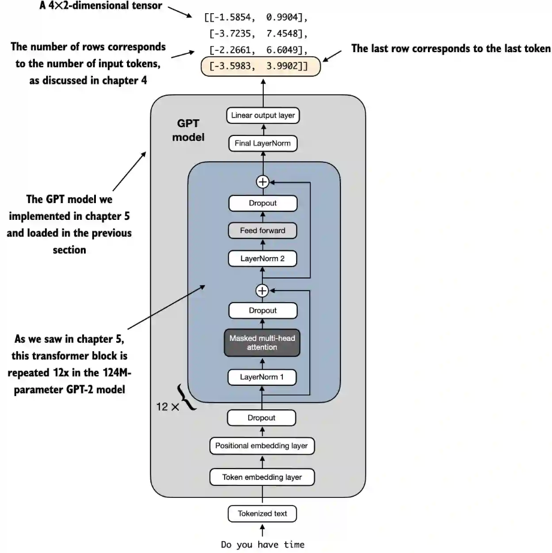
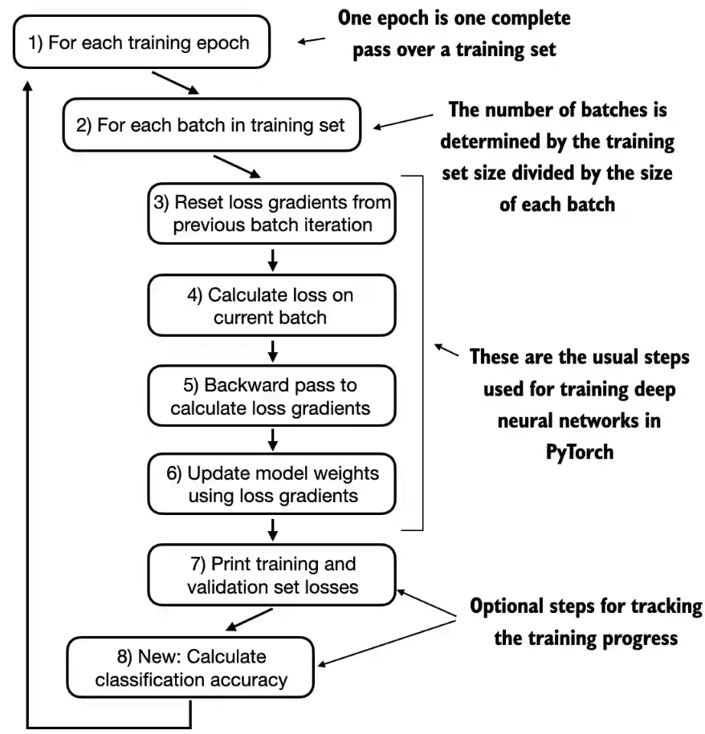
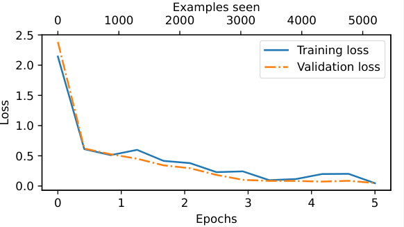

##  《从零构建大模型》

 [美]塞巴斯蒂安·拉施卡

书中资料 https://github.com/rasbt/LLMs-from-scratch

### 第六章  针对分类微调

#### 6.1 微调分类

微调语言模型最常见的方法是**指令微调**和**分类微调**

指令微调涉及使用特定的指令数据对一组任务进行训练，以提高语言模型理解和执行自然语言提示词中描述的任务的能力。指令微调提升了模型基于特定用户指令理解和生成响应的能力。指令微调最适合处理需要应对多种任务的模型，这些任务依赖于复杂的用户指令。通过指令微调，可以提升模型的灵活性和交互质量。

分类微调指模型被训练来识别一组特定的类别标签，比如在消息中过滤“垃圾消息”和“非垃圾消息”。这类任务的例子不仅限于大语言模型和电子邮件过滤，还包括从图像中识别不同的植物种类，将新闻文章分类为体育、政治、科技等主题，以及在医学影像中区分良性肿瘤和恶性肿瘤

经过分类微调的模型只能预测它在训练过程中遇到的类别，即训练过程中的目标值。例如，它可以判断某条内容是“垃圾消息”还是“非垃圾消息”，但它不能对输入文本进行其他分析或说明。分类微调更适合需要将数据精确分类为预定义类别的任务，比如情感分析或垃圾消息检测。分类微调所需的数据和计算资源较少，但它的应用范围局限于模型所训练的特定类别

* 对大语言模型进行分类微调的三阶段过程：
  	1. 准备数据集
  	1. 模型设置
  	1. 模型的微调和应用

#### 6.2 准备数据集

##### 数据预处理

数据集来源https://archive.ics.uci.edu/static/public/228/sms+spam+collection.zip 下载的数据集文件名为`SMSSpamCollection`，文件中内容每一行为一个样本，spam表示垃圾短信，后面跟4个空格长度的tab和短信内容；ham表示正常短信，后面跟1个空格长度的tab和短信内容，整个文件有5574行

```txt
spam	SMS. ac Sptv: The New Jersey Devils and the Detroit Red Wings play Ice Hockey. Correct or Incorrect? End? Reply END SPTV
ham	Do you know what Mallika Sherawat did yesterday? Find out now @  &lt;URL&gt;
```

原始文件中正常短信有4827条，垃圾短信有747条，为简单起见，使用一个较小的数据集（这将有助于更快地微调大语言模型）​，并对数据集进行下采样，使得每个类别包含747个实例，这样两个分类数据输入数量相同。处理类别不平衡的方法有很多，但这些内容超出了本书的范畴。如果你对处理不平衡数据的方法感兴趣，可以在附录B中找到更多信息

将数据集分成3部分：70%用于训练，10%用于验证，20%用于测试。这些比例在机器学习中很常见，用于训练、调整和评估模型。

```python
import pandas as pd

def create_balanced_dataset():
    # 需要删除原始文件中5082行内容开头的"，这一行只有一个"会导致直到下一个"行的内容都被当作一条短信
    df = pd.read_csv(".\\sms\\SMSSpamCollection.tsv", sep="\t", header=None, names=["Label", "Text"])
    print(df)   # [5574 rows x 2 columns] 
    print(df["Label"].value_counts())  # ham 4827 spam 747
    # 统计垃圾信息的条数 747
    num_spam = df[df["Label"] == "spam"].shape[0]
    
    # 对正常信息数据随机采样，使它的条数和垃圾信息的条数相同
    ham_subset = df[df["Label"] == "ham"].sample(num_spam, random_state=123)
    
    # 把两个数据集合并
    balanced_df = pd.concat([ham_subset, df[df["Label"] == "spam"]])
    # 把标签映射成数字0和1
    balanced_df["Label"] = balanced_df["Label"].map({"ham": 0, "spam": 1})

    train_frac = 0.7 # 训练集的比例为0.7
    validation_frac = 0.1 # 验证集的比例为0.1
    # 先打乱所有的数据集 两个标签各747条，一共1494条数据
    balanced_df = balanced_df.sample(frac=1, random_state=123).reset_index(drop=True)

    # 按训练集和验证集的比例把数据分组
    train_end = int(len(balanced_df) * train_frac)
    validation_end = train_end + int(len(balanced_df) * validation_frac)

    # Split the DataFrame
    train_df = balanced_df[:train_end]
    validation_df = balanced_df[train_end:validation_end]
    test_df = balanced_df[validation_end:]
    # 保存数据，不用每次都准备
    train_df.to_csv("train.csv", index=None)
    validation_df.to_csv("validation.csv", index=None)
    test_df.to_csv("test.csv", index=None)
```

三个数据集分别存储到一个文件中，以后可以复用。保存后的"train.csv"文件内容前3行如下：

```csv
Label,Text
0,Dude how do you like the buff wind.
0,Ü mean it's confirmed... I tot they juz say oni... Ok then... 
```

##### 创建数据加载器

训练输入的短信数据每一行的长度都不相同，这里将所有消息填充到数据集中最长消息的长度或批次长度。确保每个输入张量的大小相同对于接下来实现数据批处理是必要的。

在把输入的单词转换为词元ID的过程中，如果一个输入长度小于最长消息长度，可以将"<|endoftext|>"对应的词元ID(50256)填充到到编码的文本消息中，使所有的输入长度相同。

可以像处理文本数据那样来实例化数据加载器。只是这里的目标是类别标签，而不是文本中的下一个词元。如果我们选择批次大小为8，则每个批次将包含8个长度为120的训练样本以及每个样本对应的类别标签。即8行短信内容为一个批次，每行输入为短信文本内容，训练目标数据为数据标签label 0或1

数据集总的数量为747*2 = 1494，按0.7比例做为训练集，则有1045条训练集数据，每个批次大小为8，对应的批次数量为1045/8 = 130

```python
from torch.utils.data import Dataset

class SpamDataset(Dataset):
    def __init__(self, csv_file, tokenizer, max_length=None, pad_token_id=50256):
        self.data = pd.read_csv(csv_file)

        # 处理每一行短信内容数据为词元id，这也是输入数据
        self.encoded_texts = [
            tokenizer.encode(text) for text in self.data["Text"]
        ]

        if max_length is None:
            self.max_length = self._longest_encoded_length()
        else:
            self.max_length = max_length
            # 如果文版长度大于输入参数的长度，把文本长度截断到最大长度
            self.encoded_texts = [
                encoded_text[:self.max_length]
                for encoded_text in self.encoded_texts
            ]

        # 长度不够的文本使用pad_token_id进行填充
        self.encoded_texts = [
            encoded_text + [pad_token_id] * (self.max_length - len(encoded_text))
            for encoded_text in self.encoded_texts
        ]

    def __getitem__(self, index):
        encoded = self.encoded_texts[index]
        # 目标数据是每一行对应的标签0或1
        label = self.data.iloc[index]["Label"]
        return (
            torch.tensor(encoded, dtype=torch.long),
            torch.tensor(label, dtype=torch.long)
        )

    def __len__(self):
        return len(self.data)
    
    # 找出数据集中最长的文本长度
    def _longest_encoded_length(self):
        return max(len(encoded_text) for encoded_text in self.encoded_texts)
    
def create_sms_data_loaders():
    tokenizer = tiktoken.get_encoding("gpt2")
    print(tokenizer.encode("<|endoftext|>", allowed_special={"<|endoftext|>"})) # [50256]

    num_workers = 0
    batch_size = 8

    torch.manual_seed(123)

    train_dataset = SpamDataset(
        csv_file="train.csv",
        max_length=None,
        tokenizer=tokenizer
    )
    print(train_dataset.max_length) # 120
    print(len(train_dataset)) # 1045

    val_dataset = SpamDataset(
        csv_file="validation.csv",
        max_length=train_dataset.max_length, # 验证集和测试集的长度和训练集一样
        tokenizer=tokenizer
    )

    test_dataset = SpamDataset(
        csv_file="test.csv",
        max_length=train_dataset.max_length, # 验证集和测试集的长度和训练集一样
        tokenizer=tokenizer
    )

    train_loader = DataLoader(
        dataset=train_dataset,
        batch_size=batch_size,
        shuffle=True,
        num_workers=num_workers,
        drop_last=True,
    )

    val_loader = DataLoader(
        dataset=val_dataset,
        batch_size=batch_size,
        num_workers=num_workers,
        drop_last=False,
    )

    test_loader = DataLoader(
        dataset=test_dataset,
        batch_size=batch_size,
        num_workers=num_workers,
        drop_last=False,
    )

    print("Train loader:")
    for input_batch, target_batch in train_loader:
        pass

    print("Input batch dimensions:", input_batch.shape) # torch.Size([8, 120]) 一个批次8行输入，每个输入120个词元
    print("Label batch dimensions:", target_batch.shape) # torch.Size([8]) 目标是分类的结果0或1，所以只有一个结果，每一行对应一个结果
    # 总数据集条数 747*2 = 1494， 训练集1045条，验证集149条，测试集300条，分成8条一批
    print(f"{len(train_loader)} training batches") # 130 training batches 1045/8 = 130.625
    print(f"{len(val_loader)} validation batches") # 19 validation batches 149/8 = 18.625
    print(f"{len(test_loader)} test batches") # 38 test batches 300/8 = 37.5
```


#### 6.3 模型设置

##### 初始化带有预训练权重的模型

和第5章一样加载预训练好的GPT2模型，使用之前的测试文本输出模型的结果，确认模型加载成功

```python
def init_model_for_spam():
    BASE_CONFIG_SPAM = {
        "vocab_size": 50257,     # Vocabulary size
        "context_length": 1024,  # Context length
        "drop_rate": 0.0,        # Dropout rate
        "qkv_bias": True         # Query-key-value bias
    }
    model_configs = {
        "gpt2-small (124M)": {"emb_dim": 768, "n_layers": 12, "n_heads": 12},
        "gpt2-medium (355M)": {"emb_dim": 1024, "n_layers": 24, "n_heads": 16},
        "gpt2-large (774M)": {"emb_dim": 1280, "n_layers": 36, "n_heads": 20},
        "gpt2-xl (1558M)": {"emb_dim": 1600, "n_layers": 48, "n_heads": 25},
    }

    CHOOSE_MODEL = "gpt2-small (124M)"
    BASE_CONFIG_SPAM.update(model_configs[CHOOSE_MODEL])
    model_size = CHOOSE_MODEL.split(" ")[-1].lstrip("(").rstrip(")")
    settings, params = load_gpt_models(model_size, models_dir="gpt2")

    # set DISABLE_ADDMM_CUDA_LT=1
    device = torch.device("cuda" if torch.cuda.is_available() else "cpu")
    model = GPTModel(BASE_CONFIG_SPAM)
    load_weights_into_gpt(model, params)
    model.to(device)
    model.eval()

    tokenizer = tiktoken.get_encoding("gpt2")
    torch.manual_seed(123)

    text_1 = "Every effort moves you"
    token_ids = generate(model,
        idx=text_to_token_ids(text_1, tokenizer).to(device),
        max_new_tokens=15,
        context_size=BASE_CONFIG_SPAM["context_length"],
    )

    print(token_ids_to_text(token_ids, tokenizer))
    '''
    Every effort moves you forward.
    The first step is to understand the importance of your work
    '''
```


##### 添加分类头

我们将GPT2模型的最后的线性输出层（该输出层会将768个隐藏单元输出映射到一张包含50 257个词汇的词汇表中）替换为一个较小的输出层，该输出层会映射到两个类别：0（“非垃圾消息”）和1（“垃圾消息”）

通常令输出节点的数量与类别数量相匹配。例如，对于一个三分类问题（比如将新闻文章分类为“科技”“体育”或“政治”），我们将使用3个输出节点，以此类推

由于模型已经经过了预训练，因此不需要微调所有的模型层。在基于神经网络的语言模型中，较低层通常捕捉基本的语言结构和语义，适用于广泛的任务和数据集，最后几层（靠近输出的层）更侧重于捕捉细微的语言模式和特定任务的特征。因此，只微调最后几层通常就足以将模型适应到新任务。同时，仅微调少量层在计算上也更加高效。

GPT模型包含12个重复的Transformer块。除了**输出层**，我们还将**最终层归一化**和**最后一个Transformer块**设置为可训练。其余11个Transformer块和嵌入层则保持为不可训练

1. 为了使模型准备好进行分类微调，我们首先冻结模型，即将所有层设为不可训练
2. 替换输出层`(model.out_head)` 这个新`的model.out_head`输出层的`requires_grad`属性默认设置为True，这意味着它是模型中唯一在训练过程中会被更新的层
3. 在实验中发现，微调额外的层可以显著提升模型的预测性能。（有关详细信息，请参见附录B。）所以将最后一个Transformer块和连接该块到输出层的最终层归一化模块设置为可训练

对于每一个输入词元，都会有一个输出向量与之对应，输入节点个数和输出的节点个数相同，例如`[1, 4]`的输入`Do you have time`，它的输出为`[1, 4, 2]`


 

* 为什么只需要关注最后一个输入词元的结果？

根据因果注意力掩码的概念，每个词元只能关注当前及之前的位置，从而确保每个词元只受自己和之前词元的影响。只有输入序列中的最后一个词元累积了最多的信息，因为它是唯一一个可以访问之前所有数据的词元。因此，在垃圾消息分类任务中，我们在微调过程中会关注这个最后的词元。因此将最后的词元转换为类别标签进行预测，并计算模型的初始预测准确率。在下面代码输出中，我们只需关注最后一个输出词元的结果`[-3.5983,  3.9902]`

```python
def init_model_for_spam():
    BASE_CONFIG_SPAM = {
        "vocab_size": 50257,     # Vocabulary size
        "context_length": 1024,  # Context length
        "drop_rate": 0.0,        # Dropout rate
        "qkv_bias": True         # Query-key-value bias
    }
    model_configs = {
        "gpt2-small (124M)": {"emb_dim": 768, "n_layers": 12, "n_heads": 12},
        "gpt2-medium (355M)": {"emb_dim": 1024, "n_layers": 24, "n_heads": 16},
        "gpt2-large (774M)": {"emb_dim": 1280, "n_layers": 36, "n_heads": 20},
        "gpt2-xl (1558M)": {"emb_dim": 1600, "n_layers": 48, "n_heads": 25},
    }

    CHOOSE_MODEL = "gpt2-small (124M)"
    BASE_CONFIG_SPAM.update(model_configs[CHOOSE_MODEL])
    model_size = CHOOSE_MODEL.split(" ")[-1].lstrip("(").rstrip(")")
    settings, params = load_gpt_models(model_size, models_dir="gpt2")

    # set DISABLE_ADDMM_CUDA_LT=1
    device = torch.device("cuda" if torch.cuda.is_available() else "cpu")
    model = GPTModel(BASE_CONFIG_SPAM)
    load_weights_into_gpt(model, params)
    model.to(device)
    model.eval()

    tokenizer = tiktoken.get_encoding("gpt2")

    # 1. 设置模型所有参数都是不训练的
    for param in model.parameters():
        param.requires_grad = False

    torch.manual_seed(123)
    num_classes = 2
    # 2. 新的输出维度为2，因为只有0和1两个选项
    model.out_head = torch.nn.Linear(in_features=BASE_CONFIG_SPAM["emb_dim"], out_features=num_classes).to(device)

    # 3. 最后一个transformer层参数是需要训练的
    for param in model.trf_blocks[-1].parameters():
        param.requires_grad = True
    # 最后的归一化层的参数是需要训练的
    for param in model.final_norm.parameters():
        param.requires_grad = True
    
    inputs = tokenizer.encode("Do you have time")
    inputs = torch.tensor(inputs).unsqueeze(0)
    print("Inputs:", inputs) # ([[5211,  345,  423,  640]])
    print("Inputs dimensions:", inputs.shape) # shape: (batch_size, num_tokens) torch.Size([1, 4])
    inputs = inputs.to(device)
    with torch.no_grad():
        outputs = model(inputs)

    print("Outputs:\n", outputs)
    '''
    tensor([[[-1.5854,  0.9904],
         [-3.7235,  7.4548],
         [-2.2661,  6.6049],
         [-3.5983,  3.9902]]], device='cuda:0')
    '''
    print("Outputs dimensions:", outputs.shape) # shape: (batch_size, num_tokens, num_classes) torch.Size([1, 4, 2])
```

##### 计算分类损失和准确率

之前我们通过将50257个输出转换为概率（利用softmax函数），然后返回最高概率的位置（利用argmax函数），来计算大语言模型生成的下一个词元的词元ID。

新的分类场景下，对应于最后一个词元的模型输出被转换为每个输入文本的概率分数。例如最后一个词元的结果`[-3.5983,  3.9902]`中两个值分别表示垃圾短信和正常短信的概率。

使用`calc_accuracy_loader`函数来确定各个数据集的分类准确率。我们用10个批次的数据进行估计以提高效率。

```python
# 计算每一个数据集的准确率
def calc_accuracy_loader(data_loader, model, device, num_batches=None):
    model.eval()
    correct_predictions, num_examples = 0, 0

    if num_batches is None:
        num_batches = len(data_loader)
    else:
        num_batches = min(num_batches, len(data_loader))
    # 遍历数据集中每一个批次，每个批次有120个词元
    for i, (input_batch, target_batch) in enumerate(data_loader):
        if i < num_batches:
            input_batch, target_batch = input_batch.to(device), target_batch.to(device)
            # 先不训练看模型预测结果
            with torch.no_grad():
                logits = model(input_batch) 
            print("logits shape", logits.shape) # torch.Size([8, 120, 2])
            logits = logits[:, -1, :]  # [:, -1, :] 用来取输出的结果中最后一个词元的结果 [1]
            print("logits:", logits)
            '''
            这里只是第一个训练集的第一个批次的数据
            logits: tensor([[-2.3470,  2.7103], # 第一行的最后一个词元的两个输出
                    [-2.3967,  2.7040],
                    [-2.3161,  2.7413],
                    [-2.3640,  2.6571],
                    [-2.3471,  2.7348],
                    [-2.4621,  2.7977],
                    [-2.4104,  2.8182],
                    [-2.4334,  2.7510]], device='cuda:0')
            '''
            # 取每一行中最大值的索引作为预测的标签，0不是垃圾短信，1是垃圾短信
            predicted_labels = torch.argmax(logits, dim=-1)
            # 由于第一列都是负数小于第二列，所以取的索引都是1
            print("predicted_labels:", predicted_labels) # predicted_labels: tensor([1, 1, 1, 1, 1, 1, 1, 1], device='cuda:0')
            num_examples += predicted_labels.shape[0]
            #print(predicted_labels.shape[0]) # 每个批次有8个输入行    
            # 训练集第一个批次的目标数据
            print("target_batch:", target_batch) # target_batch: tensor([0, 0, 1, 0, 0, 0, 1, 0], device='cuda:0')
            # 统计预测正确的个数
            correct_predictions += (predicted_labels == target_batch).sum().item()
        else:
            break
    return correct_predictions / num_examples

def test_model_class_output():
    BASE_CONFIG_SPAM = {
        "vocab_size": 50257,     # Vocabulary size
        "emb_dim": 768, 
        "n_layers": 12,
        "n_heads": 12,
        "context_length": 1024,  # Context length
        "drop_rate": 0.0,        # Dropout rate
        "qkv_bias": True         # Query-key-value bias
    }
    settings, params = load_gpt_models(model_size="124M", models_dir="gpt2")

    # set DISABLE_ADDMM_CUDA_LT=1
    device = torch.device("cuda" if torch.cuda.is_available() else "cpu")
    model = GPTModel(BASE_CONFIG_SPAM)
    load_weights_into_gpt(model, params)
    model.to(device)
    model.eval()

    # 1. 设置模型所有参数都是不训练的
    for param in model.parameters():
        param.requires_grad = False

    torch.manual_seed(123)
    num_classes = 2
    # 2. 新的输出维度为2，因为只有0和1两个选项
    model.out_head = torch.nn.Linear(in_features=BASE_CONFIG_SPAM["emb_dim"], out_features=num_classes).to(device)

    # 3. 最后一个transformer层参数是需要训练的
    for param in model.trf_blocks[-1].parameters():
        param.requires_grad = True
    # 最后的归一化层的参数是需要训练的
    for param in model.final_norm.parameters():
        param.requires_grad = True    
        
    train_loader, val_loader, test_loader = create_sms_data_loaders()
    # 每个数据集只跑10个批次的数据
    train_accuracy = calc_accuracy_loader(train_loader, model, device, num_batches=10)
    val_accuracy = calc_accuracy_loader(val_loader, model, device, num_batches=10)
    test_accuracy = calc_accuracy_loader(test_loader, model, device, num_batches=10)

    print(f"Training accuracy: {train_accuracy*100:.2f}%") # 46.25%
    print(f"Validation accuracy: {val_accuracy*100:.2f}%") # 45.00%
    print(f"Test accuracy: {test_accuracy*100:.2f}%") # 48.75%
```

由于还没任何训练，所以对所有数据集的每个批次的8行短信输入(每行输入120个词元)，每个批次的输出为`[8, 120, 2]`，取每行输出的最后一个词元的输出为`[8, 2]`，每一行的结果中第一列都是负数小于第二列，所以`torch.argmax`输出的索引都是1，`predicted_labels`的值为[1, 1, 1, 1, 1, 1, 1, 1]，即每一行选中的都是索引1，把它与`target_batch`的每一个值比较是否相同计算正确率。

由于分类准确率不是一个可微分的函数，这里我们使用交叉熵损失作为替代来最大化准确率。因此，第五章的`calc_loss_batch`函数保持不变，唯一的调整是专注于优化最后一个词元`(model(input_batch)[:, -1, :])`而不是所有词元`(model(input_batch))`。使用`calc_loss_batch`函数来计算从之前定义的数据加载器中获得的单个批次的损失。为了计算数据加载器中所有批次的损失，可以像之前一样定义`calc_loss_loader`函数。

训练的目标是最小化训练集损失，提高分类准确率。

```python
# calc_loss_batch函数名中增加了class，避免混淆
def calc_class_loss_batch(input_batch, target_batch, model, device):
    input_batch, target_batch = input_batch.to(device), target_batch.to(device)
    logits = model(input_batch)[:, -1, :]  # 关注的输出为每一行数据的最后一个词元的输出
    loss = torch.nn.functional.cross_entropy(logits, target_batch)
    return loss

# 和第五章的calc_loss_loader完全相同，这里只是改了函数名字
def calc_class_loss_loader(data_loader, model, device, num_batches=None):
    total_loss = 0.
    if len(data_loader) == 0:
        return float("nan")
    elif num_batches is None:
        num_batches = len(data_loader)
    else:
        # Reduce the number of batches to match the total number of batches in the data loader
        # if num_batches exceeds the number of batches in the data loader
        # 可以通过num_batches指定较小的批次数，以加快模型训练期间的评估速度
        num_batches = min(num_batches, len(data_loader))
    for i, (input_batch, target_batch) in enumerate(data_loader):
        if i < num_batches:
            loss = calc_class_loss_batch(input_batch, target_batch, model, device)
            total_loss += loss.item()
        else:
            break
    return total_loss / num_batches

def test_model_class_output():
    BASE_CONFIG_SPAM = {
        "vocab_size": 50257,     # Vocabulary size
        "emb_dim": 768, 
        "n_layers": 12,
        "n_heads": 12,
        "context_length": 1024,  # Context length
        "drop_rate": 0.0,        # Dropout rate
        "qkv_bias": True         # Query-key-value bias
    }
    settings, params = load_gpt_models(model_size="124M", models_dir="gpt2")

    # set DISABLE_ADDMM_CUDA_LT=1
    device = torch.device("cuda" if torch.cuda.is_available() else "cpu")
    model = GPTModel(BASE_CONFIG_SPAM)
    load_weights_into_gpt(model, params)
    model.to(device)
    model.eval()

    # 1. 设置模型所有参数都是不训练的
    for param in model.parameters():
        param.requires_grad = False

    torch.manual_seed(123)
    num_classes = 2
    # 2. 新的输出维度为2，因为只有0和1两个选项
    model.out_head = torch.nn.Linear(in_features=BASE_CONFIG_SPAM["emb_dim"], out_features=num_classes).to(device)

    # 3. 最后一个transformer层参数是需要训练的
    for param in model.trf_blocks[-1].parameters():
        param.requires_grad = True
    # 最后的归一化层的参数是需要训练的
    for param in model.final_norm.parameters():
        param.requires_grad = True    

    train_loader, val_loader, test_loader = create_sms_data_loaders()
    # 计算每个数据集的损失
    with torch.no_grad(): # Disable gradient tracking for efficiency because we are not training, yet
        train_loss = calc_class_loss_loader(train_loader, model, device, num_batches=5)
        val_loss = calc_class_loss_loader(val_loader, model, device, num_batches=5)
        test_loss = calc_class_loss_loader(test_loader, model, device, num_batches=5)

    print(f"Training loss: {train_loss:.3f}") # 3.083
    print(f"Validation loss: {val_loss:.3f}") # 2.575
    print(f"Test loss: {test_loss:.3f}") # 2.312
```


#### 6.4 模型微调和应用

##### 在有监督数据上微调模型

训练循环与之前章节中预训练的整体训练循环相同，唯一的区别是要计算分类准确率，而不是生成文本样本来评估模型。

一轮就是完整的遍历依次训练集，批次的数量=训练集大小/每个批次大小


 

我们现在跟踪的是已经看到的训练样本数量(examples_seen)，而不是词元数量，并且我们在每轮后会计算准确率，而不是打印一个文本样本。

* 训练函数`train_classifier_simple`

```python
def train_classifier_simple(model, train_loader, val_loader, optimizer, device, num_epochs,
                            eval_freq, eval_iter):
    # 初始化存放中间统计数据的列表
    train_losses, val_losses, train_accs, val_accs = [], [], [], []
    examples_seen, global_step = 0, -1

    # 主循环轮次
    for epoch in range(num_epochs):
        model.train()  # Set model to training mode

        for input_batch, target_batch in train_loader:
            optimizer.zero_grad() # Reset loss gradients from previous batch iteration
            loss = calc_class_loss_batch(input_batch, target_batch, model, device)
            loss.backward() # Calculate loss gradients
            optimizer.step() # Update model weights using loss gradients
            examples_seen += input_batch.shape[0] # New: track examples instead of tokens
            global_step += 1

            # Optional evaluation step
            if global_step % eval_freq == 0:
                train_loss, val_loss = evaluate_class_model(
                    model, train_loader, val_loader, device, eval_iter)
                train_losses.append(train_loss)
                val_losses.append(val_loss)
                print(f"Ep {epoch+1} (Step {global_step:06d}): "
                      f"Train loss {train_loss:.3f}, Val loss {val_loss:.3f}")

        # Calculate accuracy after each epoch
        train_accuracy = calc_accuracy_loader(train_loader, model, device, num_batches=eval_iter)
        val_accuracy = calc_accuracy_loader(val_loader, model, device, num_batches=eval_iter)
        print(f"Training accuracy: {train_accuracy*100:.2f}% | ", end="")
        print(f"Validation accuracy: {val_accuracy*100:.2f}%")
        # 用于绘制图表
        train_accs.append(train_accuracy)
        val_accs.append(val_accuracy)

    return train_losses, val_losses, train_accs, val_accs, examples_seen
# 评估模型效果
def evaluate_class_model(model, train_loader, val_loader, device, eval_iter):
    model.eval()
    with torch.no_grad():
        train_loss = calc_class_loss_loader(train_loader, model, device, num_batches=eval_iter)
        val_loss = calc_class_loss_loader(val_loader, model, device, num_batches=eval_iter)
    model.train()
    return train_loss, val_loss
```

* 整体流程代码：
  	1. 加载预训练模型
  	1. 修改模型，以训练更新部分层的参数
  	1. 初始化优化器，设置训练的轮数，并使用`train_classifier_simple`函数启动训练
  	1. 保存新的模型参数

```python
def test_train_class_model():
    # 加载预训练模型
    BASE_CONFIG_SPAM = {
        "vocab_size": 50257,     # Vocabulary size
        "emb_dim": 768, 
        "n_layers": 12,
        "n_heads": 12,
        "context_length": 1024,  # Context length
        "drop_rate": 0.0,        # Dropout rate
        "qkv_bias": True         # Query-key-value bias
    }
    settings, params = load_gpt_models(model_size="124M", models_dir="gpt2")
    
    # set DISABLE_ADDMM_CUDA_LT=1
    device = torch.device("cuda" if torch.cuda.is_available() else "cpu")
    model = GPTModel(BASE_CONFIG_SPAM)
    load_weights_into_gpt(model, params)    

    # 修改预训练模型
    # 1. 设置模型所有参数都是不训练的
    for param in model.parameters():
        param.requires_grad = False

    torch.manual_seed(123)
    num_classes = 2
    # 2. 新的输出维度为2，因为只有0和1两个选项
    model.out_head = torch.nn.Linear(in_features=BASE_CONFIG_SPAM["emb_dim"], out_features=num_classes).to(device)
    model.to(device)

    # 3. 最后一个transformer层参数是需要训练的
    for param in model.trf_blocks[-1].parameters():
        param.requires_grad = True
    # 最后的归一化层的参数是需要训练的
    for param in model.final_norm.parameters():
        param.requires_grad = True    
    
    # 微调模型
    import time
    start_time = time.time()

    torch.manual_seed(123)
    optimizer = torch.optim.AdamW(model.parameters(), lr=5e-5, weight_decay=0.1)

    num_epochs = 5
    train_loader, val_loader, test_loader = create_sms_data_loaders()
    train_losses, val_losses, train_accs, val_accs, examples_seen = train_classifier_simple(
        model, train_loader, val_loader, optimizer, device,
        num_epochs=num_epochs, eval_freq=50, eval_iter=5,
    )

    end_time = time.time()
    execution_time_minutes = (end_time - start_time) / 60
    print(f"Training completed in {execution_time_minutes:.2f} minutes.")

    # 绘制结果图
    # 损失图
    epochs_tensor = torch.linspace(0, num_epochs, len(train_losses))
    examples_seen_tensor = torch.linspace(0, examples_seen, len(train_losses))
    plot_values(epochs_tensor, examples_seen_tensor, train_losses, val_losses)

    # 准确率图
    epochs_tensor = torch.linspace(0, num_epochs, len(train_accs))
    examples_seen_tensor = torch.linspace(0, examples_seen, len(train_accs))
    plot_values(epochs_tensor, examples_seen_tensor, train_accs, val_accs, label="accuracy")

    # 保存训练好的模型
    torch.save(model.state_dict(), "review_classifier.pth")

    '''
    Ep 1 (Step 000000): Train loss 2.143, Val loss 2.383
    Ep 1 (Step 000050): Train loss 0.611, Val loss 0.620
    Ep 1 (Step 000100): Train loss 0.511, Val loss 0.526
    Training accuracy: 67.50% | Validation accuracy: 72.50%
    Ep 2 (Step 000150): Train loss 0.598, Val loss 0.451
    Ep 2 (Step 000200): Train loss 0.416, Val loss 0.342
    Ep 2 (Step 000250): Train loss 0.379, Val loss 0.294
    Training accuracy: 87.50% | Validation accuracy: 90.00%
    Ep 3 (Step 000300): Train loss 0.230, Val loss 0.184
    Ep 3 (Step 000350): Train loss 0.242, Val loss 0.102
    Training accuracy: 95.00% | Validation accuracy: 97.50%
    Ep 4 (Step 000400): Train loss 0.096, Val loss 0.084
    Ep 4 (Step 000450): Train loss 0.115, Val loss 0.084
    Ep 4 (Step 000500): Train loss 0.198, Val loss 0.073
    Training accuracy: 100.00% | Validation accuracy: 97.50%
    Ep 5 (Step 000550): Train loss 0.201, Val loss 0.086
    Ep 5 (Step 000600): Train loss 0.047, Val loss 0.049
    Training accuracy: 100.00% | Validation accuracy: 97.50%
    Training completed in 0.68 minutes.
    '''
    
    train_accuracy = calc_accuracy_loader(train_loader, model, device)
    val_accuracy = calc_accuracy_loader(val_loader, model, device)
    test_accuracy = calc_accuracy_loader(test_loader, model, device)

    print(f"Training accuracy: {train_accuracy*100:.2f}%") # 97.60%
    print(f"Validation accuracy: {val_accuracy*100:.2f}%") # 97.32%
    print(f"Test accuracy: {test_accuracy*100:.2f}%") # 95.33%
```

使用matplotlib绘制趋势变化

```python
import matplotlib.pyplot as plt
def plot_values(epochs_seen, examples_seen, train_values, val_values, label="loss"):
    fig, ax1 = plt.subplots(figsize=(5, 3))

    # Plot training and validation loss against epochs
    ax1.plot(epochs_seen, train_values, label=f"Training {label}")
    ax1.plot(epochs_seen, val_values, linestyle="-.", label=f"Validation {label}")
    ax1.set_xlabel("Epochs")
    ax1.set_ylabel(label.capitalize())
    ax1.legend()

    # Create a second x-axis for tokens seen
    ax2 = ax1.twiny()  # Create a second x-axis that shares the same y-axis
    ax2.plot(examples_seen, train_values, alpha=0)  # Invisible plot for aligning ticks
    ax2.set_xlabel("Examples seen")

    fig.tight_layout()  # Adjust layout to make room
    plt.savefig(f"{label}-plot.pdf")
    # plt.show()
```


 

从输出结果看，第一轮后损失有明显下降趋势，可以看出模型正在有效地从训练数据中学习，几乎没有过拟合的迹象。也就是说，训练集和验证集的损失之间没有明显的差距

轮数的选择取决于数据集和任务的难度，并没有通用的解决方案，不过通常情况下，5轮是一个不错的起点。如果模型在前几轮之后出现过拟合（参见图6-16的损失曲线），则可能需要减少轮数。相反，如果趋势表明验证集损失可能随着进一步训练而改善，则应该增加轮数。在这种情况下，5轮是合理的，因为没有早期过拟合的迹象，且验证集损失接近于0。

验证集的准确率会比测试集的准确率稍高，因为模型开发过程中往往会调整超参数以提升在验证集上的性能，这可能导致模型在测试集上并不完全适用。这种情况很常见，但可以通过调整模型设置，比如增加dropout率(drop_rate)或优化器配置中的权重衰减参数(weight_decay)来尽量缩小这种差距。

##### 使用大语言模型作为垃圾消息分类器

使用模型对输入文本进行分类的函数`classify_review`，其中主要是处理输入数据长度不会超过模型的上下文长度1024，以及把过短的输入补上特殊的词元，最后根据输出的分数最大值的索引决定是否是垃圾短信

```python
def classify_review(text, model, tokenizer, device, max_length=None, pad_token_id=50256):
    model.eval()

    # Prepare inputs to the model
    input_ids = tokenizer.encode(text)
    supported_context_length = model.pos_emb.weight.shape[0]
    # Note: In the book, this was originally written as pos_emb.weight.shape[1] by mistake
    # It didn't break the code but would have caused unnecessary truncation (to 768 instead of 1024)

    # Truncate sequences if they too long
    input_ids = input_ids[:min(max_length, supported_context_length)]
    assert max_length is not None, (
        "max_length must be specified. If you want to use the full model context, "
        "pass max_length=model.pos_emb.weight.shape[0]."
    )
    assert max_length <= supported_context_length, (
        f"max_length ({max_length}) exceeds model's supported context length ({supported_context_length})."
    )    
    # Alternatively, a more robust version is the following one, which handles the max_length=None case better
    # max_len = min(max_length,supported_context_length) if max_length else supported_context_length
    # input_ids = input_ids[:max_len]
    
    # Pad sequences to the longest sequence
    input_ids += [pad_token_id] * (max_length - len(input_ids))
    input_tensor = torch.tensor(input_ids, device=device).unsqueeze(0) # add batch dimension

    # Model inference
    with torch.no_grad():
        logits = model(input_tensor)[:, -1, :]  # Logits of the last output token
    predicted_label = torch.argmax(logits, dim=-1).item()

    # Return the classified result
    return "spam" if predicted_label == 1 else "not spam"    
```

加载使用一个微调后的模型，这里不需要再去加载GPT2的模型参数了，只需加载之前自己微调保存后的`pytorch`专用的权重参数文件`review_classifier.pth`

```python
def test_load_class_model():
    # 加载预训练模型
    BASE_CONFIG_SPAM = {
        "vocab_size": 50257,     # Vocabulary size
        "emb_dim": 768, 
        "n_layers": 12,
        "n_heads": 12,
        "context_length": 1024,  # Context length
        "drop_rate": 0.0,        # Dropout rate
        "qkv_bias": True         # Query-key-value bias
    }    
    model = GPTModel(BASE_CONFIG_SPAM)

    # 设置模型输出为2个类别
    num_classes = 2
    model.out_head = torch.nn.Linear(in_features=BASE_CONFIG_SPAM["emb_dim"], out_features=num_classes)

    # set DISABLE_ADDMM_CUDA_LT=1
    device = torch.device("cuda" if torch.cuda.is_available() else "cpu")
    # 加载模型不用在加载GPT2的那堆东西了
    model_state_dict = torch.load("review_classifier.pth", map_location=device, weights_only=True)
    model.load_state_dict(model_state_dict)
    model.to(device)
    model.eval()
	# 使用第一步训练准备数据集进行准确率测试
    train_loader, val_loader, test_loader = create_sms_data_loaders()
    train_accuracy = calc_accuracy_loader(train_loader, model, device)
    val_accuracy = calc_accuracy_loader(val_loader, model, device)
    test_accuracy = calc_accuracy_loader(test_loader, model, device)

    print(f"Training accuracy: {train_accuracy*100:.2f}%") # 97.60%
    print(f"Validation accuracy: {val_accuracy*100:.2f}%") # 97.32%
    print(f"Test accuracy: {test_accuracy*100:.2f}%") # 95.33%

    tokenizer = tiktoken.get_encoding("gpt2")
	# 两个测试例子
    text_1 = (
        "You are a winner you have been specially"
        " selected to receive $1000 cash or a $2000 award."
    )

    print(classify_review(text_1, model, tokenizer, device, max_length=120)) # spam

    text_2 = (
        "Hey, just wanted to check if we're still on"
        " for dinner tonight? Let me know!"
    )

    print(classify_review(text_2, model, tokenizer, device, max_length=120)) # not spam
```

#### 6.5 总结

* 分类微调涉及通过添加一个小型分类层来替换大语言模型的输出层

* 与预训练相似，微调的模型输入是将文本转换为词元ID。

* 在微调大语言模型之前，我们会将预训练模型加载为基础模型

* 分类模型的评估包括计算分类准确率（正确预测的比例或百分比）​。

* 分类模型的微调使用与大语言模型预训练相同的交叉熵损失函数。

