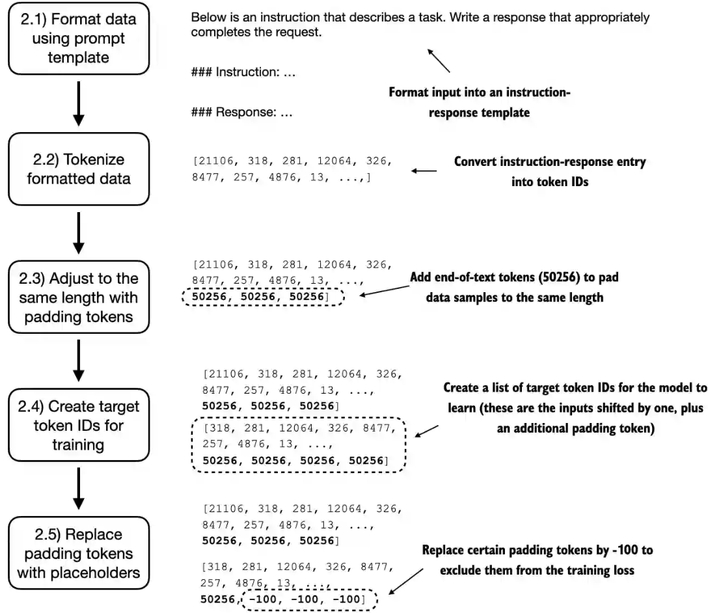
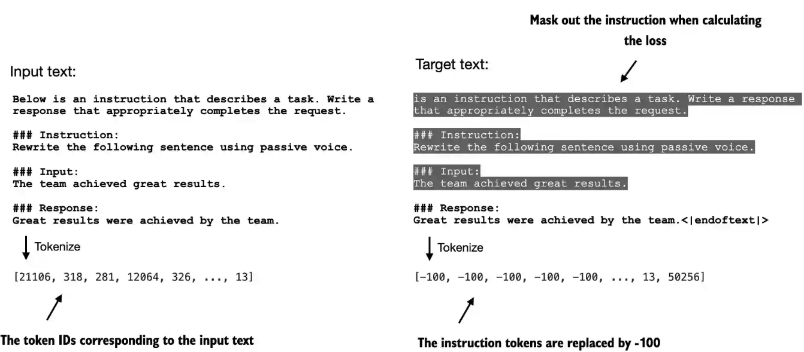

##  《从零构建大模型》

 [美]塞巴斯蒂安·拉施卡

书中资料 https://github.com/rasbt/LLMs-from-scratch

### 第七章  指令微调

 在开发用于聊天机器人应用程序、个人助理和其他对话任务的大语言模型时，指令微调是主要技术之一

指令微调的三阶段：第一阶段**准备数据集**，第二阶段专注于**模型配置和微调**，第三阶段涵盖**模型性能的评估**

#### 7.1 准备数据集

##### 为有监督指令微调准备数据集

为了方便演示，作者使用的指令数据集包含1100个指令-回复对。也可以在附录B中找到其他公开可用的指令数据集。这里使用的数据由json格式`instruction-data.json`存储，每一条记录由指令，输入和输出组成，部分记录没有输入。

```json
{
    "instruction": "Edit the following sentence for grammar.",
    "input": "He go to the park every day.",
    "output": "He goes to the park every day."
},
{
    "instruction": "Convert 45 kilometers to meters.",
    "input": "",
    "output": "45 kilometers is 45000 meters."
},
```

大语言模型指令微调可以使用不同提示词风格。Alpaca是最早公开详细说明其指令微调过程的大语言模型之一

Alpaca风格为指令、输入和回复定义了不同的小节，其采用的是结构化的形式，类似如下的格式：

```markdown
### Instruction:
Identify the correct spelling of the following word.

### Input:
Ocassion

### Response:
The correct spelling is 'Occasion.'
```

Phi-3风格则使用了更简单的形式，主要借助的是特殊词元<|user|>和<|assistant|>

```toml
<|user|>
Identify the correct spelling of the following word: 'Ocassion'
<|assistant|>
The correct spelling is 'Occasion.'
```

##### 将数据集转换为Alpaca提示词风格

```python
def format_input(entry):
    instruction_text = (
        f"Below is an instruction that describes a task. "
        f"Write a response that appropriately completes the request."
        f"\n\n### Instruction:\n{entry['instruction']}"
    )

    input_text = f"\n\n### Input:\n{entry['input']}" if entry["input"] else ""
    return instruction_text + input_text

def create_format_input():
    with open('instruction-data.json', "r", encoding="utf-8") as file:
        data = json.load(file)
	# 转换第50条数据记录
    model_input = format_input(data[50])
    desired_response = f"\n\n### Response:\n{data[50]['output']}"
    print(model_input + desired_response)
'''
Below is an instruction that describes a task. Write a response that appropriately completes the request.

### Instruction:
Identify the correct spelling of the following word.

### Input:
Ocassion

### Response:
The correct spelling is 'Occasion.'
'''    
```

有了格式话函数，就和对所有的数据集记录进行处理，得到数据集类

```python
class InstructionDataset(Dataset):
    def __init__(self, data, tokenizer):
        self.data = data

        # 每一个输入和输出都转换为词元id
        self.encoded_texts = []
        for entry in data:
            # 每一条记录转换为Alpaca提示词风格
            instruction_plus_input = format_input(entry)
            # 每一条记录的正确输出
            response_text = f"\n\n### Response:\n{entry['output']}"
            # 输入和输出合并起来
            full_text = instruction_plus_input + response_text
            self.encoded_texts.append(tokenizer.encode(full_text))

    def __getitem__(self, index):
        return self.encoded_texts[index]

    def __len__(self):
        return len(self.data)
```


##### 将数据组织成训练批次

在第6章中，训练批次是通过`PyTorch`的`DataLoader`类自动创建的，该类使用默认的**聚合(collate)**函数将样本列表组合成训练批次。聚合函数的作用是将单个数据样本列表合并为一个批次，以便模型在训练时能够高效地处理。这里需要创建一个自定义的聚合函数，以满足指令微调数据集的特定需求和格式。

这里实现批处理过程包括以下5个子步骤：

	1. 应用提示词模板；
	1. 使用前几章提到的词元化方法；
	1. 添加填充词元；
	1. 创建目标词元ID; 
	1. 在损失函数中用-100占位符词元来掩码填充词元


 


开发一个自定义聚合函数`custom_collate_fn`来传递给数据加载器。该函数可以将每个批次中的训练示例填充到相同长度，同时允许不同批次具有不同长度

 文本分类微调的方法类似，我们希望通过将多个训练示例聚合到一个批次中来加速训练，这就需要将所有输入填充到相似的长度。同样，我们仍使用<|endoftext|>作为填充词元。使用词元ID50256对批次中的训练样本进行填充，以确保同一个批次的长度一致。但不同的批次间的长度可能不同。

大语言模型指令微调过程中使用的输入词元和目标词元之间的对应关系：**对每个输入序列而言，首先将其向左移动一个词元的位置，然后将输入序列的第一个词元忽略，最后在尾部加入结束符词元即可得到其对应的目标序列**。根本原因是为了训练模型进行自回归（Autoregressive）的下一个词元预测。

大型语言模型（LLM）的本质是一个概率模型，其核心任务是：**给定一系列已经出现的词元（tokens），预测下一个最可能出现的词元是什么**。指令微调虽然是在教模型遵循指令，但其最基本的“语法”仍然是下一个词元预测。

**区分上下文与生成目标**：确保模型学习的是生成“回复”，而不是重复“指令”。输入是完整的上下文，模型的目标是预测接下来要说的内容，所以目标是输入之后的内容。 下图的例子中输入的开始为"Below is an instruction that..."，目标就是检测到输入Below后，预测后面的内容为“ is an instruction that...”

我们会为所有填充词元都分配一个-100占位符值。这个特殊值使我们能够在计算训练损失时排除填充词元的影响，从而确保只有有效的数据会影响模型的学习

值得注意的是，我们在目标列表中保留了一个结束符词元，ID为50256。保留此词元有助于大语言模型学会何时根据指令生成结束符词元，一般我们将其作为生成的回复已经完成的指示符。

在PyTorch中，交叉熵函数的默认设置为`cross_entropy(..., ignore_index=-100)`。这意味着它会忽略标记为`-100`的目标。我们利用这个`ignore_index`来忽略那些用于填充训练示例以使每个批次具有相同长度的额外结束符（填充）词元。然而，我们需要在目标中保留结束符词元ID50256，因为它有助于大语言模型学习生成结束符词元，从而在适当的时候结束回复。

通过掩码与指令对应的目标词元，交叉熵损失可以仅针对生成的回复目标词元进行计算。因此，模型的训练更专注于生成准确的回复，而非记住指令，这样可以帮助减少过拟合


 

对于大语言模型准备的目标文本，我们可以选择掩码其中的指令部分，即将其中指令相应的词元替换为损失的`ignore_index`值`-100`。 截至目前，研究人员对在指令微调过程中是否应掩码指令部分的损失仍存在分歧。例如，Shi等人在2024年发表的论文“Instruction Tuning With Loss Over Instructions”中指出，不掩码指令可以提升大语言模型的性能（详细信息参见附录B）。书中选择不掩码指令部分，并将掩码指令部分的实验作为一个可选的练习。

```python
def custom_collate_fn(batch, pad_token_id=50256, ignore_index=-100, allowed_max_length=None, device="cpu"):
    # 先找出这个批次的所有输入记录行的最大长度
    batch_max_length = max(len(item)+1 for item in batch)

    # Pad and prepare inputs and targets
    inputs_lst, targets_lst = [], []

    for item in batch:
        new_item = item.copy()
        # 先给一个记录增加一个结束标记词元id <|endoftext|> token
        new_item += [pad_token_id]
        # 再把剩下不够最大长度的空位补上空位词元id <|endoftext|>的id 50526
        padded = (
            new_item + [pad_token_id] *
            (batch_max_length - len(new_item))
        )
        # 去掉最后一个词元作为输入
        inputs = torch.tensor(padded[:-1])  # Truncate the last token for inputs
        # 向左移动一个位置作为目标输出
        targets = torch.tensor(padded[1:])  # Shift +1 to the right for targets

        # 把除了第一个50256 的剩下的50526都替换为ignore_index即-100
        mask = targets == pad_token_id
        indices = torch.nonzero(mask).squeeze()
        if indices.numel() > 1:
            targets[indices[1:]] = ignore_index

        # 确保输入的长度不会超过最大长度
        if allowed_max_length is not None:
            inputs = inputs[:allowed_max_length]
            targets = targets[:allowed_max_length]

        inputs_lst.append(inputs)
        targets_lst.append(targets)

    # 把输入和目标列表转换为张量，并放在cuda或cpu上
    inputs_tensor = torch.stack(inputs_lst).to(device)
    targets_tensor = torch.stack(targets_lst).to(device)

    return inputs_tensor, targets_tensor

def create_data_batch():
    inputs_1 = [0, 1, 2, 3, 4]
    inputs_2 = [5, 6]
    inputs_3 = [7, 8, 9]

    batch = (
        inputs_1,
        inputs_2,
        inputs_3
    )
    inputs, targets = custom_collate_fn(batch)
    print(inputs)
    '''
    tensor([[    0,     1,     2,     3,     4],
        [    5,     6, 50256, 50256, 50256],
        [    7,     8,     9, 50256, 50256]])
    '''
    print(targets) 
    '''
    目标张量中, 每行都是输入左移动了一个元素的位置，
    同时把除了用来标识结束标记的50256之外的补填的50256都替换为-100
    tensor([[    1,     2,     3,     4, 50256],
        [    6, 50256,  -100,  -100,  -100],
        [    8,     9, 50256,  -100,  -100]])
    '''
```

##### 创建指令数据集的数据加载器

在大语言模型的指令微调过程中，数据加载器将自动聚合并随机打乱用于迭代训练的数据。有了数据集类`InstructionDataset`和聚合函数`custom_collate_fn`就可以创建数据加载器。

在之前的代码中，我们是在模型训练循环时才将数据移动到目标设备（例如，当device="cuda"时，数据被移动到GPU内存）。现在，将这一过程写在聚合函数中带来了一些好处，因为它可以在训练循环之外的后台执行，从而避免在模型训练期间阻塞GPU。

使用Python的`functools`标准库中的`partial`函数创建`custom_collate_fn`函数的新版本并预先填充设备参数。此外，可以将`allowed_max_length`设置为1024，这样数据就会被截断到GPT-2模型支持的最大上下文长度。

从输出的训练集的结果可以看到训练集的第一个批次有8个样本记录，每个记录的最大长度为61个词元

```python
from functools import partial
def create_instruction_DataLoader():
    with open('instruction-data.json', "r", encoding="utf-8") as file:
        data = json.load(file)

    train_portion = int(len(data) * 0.85)  # 85% for training
    test_portion = int(len(data) * 0.1)    # 10% for testing
    val_portion = len(data) - train_portion - test_portion  # Remaining 5% for validation

    train_data = data[:train_portion]
    test_data = data[train_portion:train_portion + test_portion]
    val_data = data[train_portion + test_portion:]

    device = torch.device("cuda" if torch.cuda.is_available() else "cpu")
    customized_collate_fn = partial(
        custom_collate_fn,
        device=device,
        allowed_max_length=1024
    )

    num_workers = 0
    batch_size = 8

    torch.manual_seed(123)
    tokenizer = tiktoken.get_encoding("gpt2")

    train_dataset = InstructionDataset(train_data, tokenizer)
    train_loader = DataLoader(
        train_dataset,
        batch_size=batch_size,
        collate_fn=customized_collate_fn,
        shuffle=True,
        drop_last=True,
        num_workers=num_workers
    )
    print("Train loader:") # 输出每个批次的大小，每个批次都由8个记录构成，批次间最大长度不同
    for inputs, targets in train_loader:
        print(inputs.shape, targets.shape)
    '''
    Train loader:
    torch.Size([8, 61]) torch.Size([8, 61])
    torch.Size([8, 76]) torch.Size([8, 76])
    torch.Size([8, 73]) torch.Size([8, 73])
    '''

    val_dataset = InstructionDataset(val_data, tokenizer)
    val_loader = DataLoader(
        val_dataset,
        batch_size=batch_size,
        collate_fn=customized_collate_fn,
        shuffle=False,
        drop_last=False,
        num_workers=num_workers
    )

    test_dataset = InstructionDataset(test_data, tokenizer)
    test_loader = DataLoader(
        test_dataset,
        batch_size=batch_size,
        collate_fn=customized_collate_fn,
        shuffle=False,
        drop_last=False,
        num_workers=num_workers
    )

    return train_loader, val_loader, test_loader
```

#### 7.2 模型配置和微调

##### 加载预训练的大语言模型

这里使用了GPT2-355M的模型。也是7个文件，总大小为1.32 GB (1,421,728,377 bytes)

我们先花一些时间，通过将模型输出与预期的回复进行比较，来评估预训练的大语言模型在验证任务上的表现。这将为我们提供一个模型的基准性能指标，该指标反映了模型在未经微调的情况下在指令遵循任务中的表现情况，并能帮助我们更好地理解微调后的效果。

```python
def load_gpt2_335M():
    BASE_CONFIG = {
        "vocab_size": 50257,     # Vocabulary size
        "context_length": 1024,  # Context length
        "drop_rate": 0.0,        # Dropout rate
        "qkv_bias": True         # Query-key-value bias
    }

    model_configs = {
        "gpt2-small (124M)": {"emb_dim": 768, "n_layers": 12, "n_heads": 12},
        "gpt2-medium (355M)": {"emb_dim": 1024, "n_layers": 24, "n_heads": 16},
        "gpt2-large (774M)": {"emb_dim": 1280, "n_layers": 36, "n_heads": 20},
        "gpt2-xl (1558M)": {"emb_dim": 1600, "n_layers": 48, "n_heads": 25},
    }

    CHOOSE_MODEL = "gpt2-medium (355M)"
    BASE_CONFIG.update(model_configs[CHOOSE_MODEL])

    model_size = CHOOSE_MODEL.split(" ")[-1].lstrip("(").rstrip(")")
    settings, params = load_gpt_models(model_size=model_size, models_dir="gpt2")

    model = GPTModel(BASE_CONFIG)
    load_weights_into_gpt(model, params)
    model.eval()
    
    # set DISABLE_ADDMM_CUDA_LT=1
    device = torch.device("cuda" if torch.cuda.is_available() else "cpu")

    torch.manual_seed(123)
    tokenizer = tiktoken.get_encoding("gpt2")

    with open('instruction-data.json', "r", encoding="utf-8") as file:
        data = json.load(file)

    train_portion = int(len(data) * 0.85)  # 85% for training
    test_portion = int(len(data) * 0.1)    # 10% for testing
    val_data = data[train_portion + test_portion:]
    # 简单使用验证集的第一条数据确认模型加载成功
    input_text = format_input(val_data[0])
    print(input_text)

    token_ids = generate(
        model=model,
        idx=text_to_token_ids(input_text, tokenizer),
        max_new_tokens=35,
        context_size=BASE_CONFIG["context_length"],
        eos_id=50256,
        )
    generated_text = token_ids_to_text(token_ids, tokenizer)
    # 只保留应答部分内容
    response_text = (
        generated_text[len(input_text):]
        .replace("### Response:", "")
        .strip()
    )
    print(response_text) # 模型现在还不能正常回复
    '''
    The chef cooks the meal every day.
    ### Instruction:
    Convert the active sentence to passive: 'The chef cooks the
    '''
```

##### 在指令数据上微调大语言模型

开始训练之前，先计算一下模型在训练集和验证集上的初始损失，和前面一样，我们的目标是最小化损失

```python
torch.manual_seed(123)    
train_loader, val_loader, test_loader = create_instruction_DataLoader()

with torch.no_grad():
    train_loss = calc_loss_loader(train_loader, model, device, num_batches=5)
    val_loss = calc_loss_loader(val_loader, model, device, num_batches=5)

# 微调前的损失
print("Training loss:", train_loss) # 3.864677000045776
print("Validation loss:", val_loss) # 3.7619364738464354
```

下面的代码设置了训练过程，包括：**初始化优化器**、设定训练轮数、定义评估的频率和起始上下文`start_context`。在这里，起始上下文是指在训练过程中，评估大语言模型在第一个验证集指令`val_data[0]`上生成的回复

```python
def fine_tune_gpt2_335M():
    BASE_CONFIG = {
        "vocab_size": 50257,     # Vocabulary size
        "context_length": 1024,  # Context length
        "drop_rate": 0.0,        # Dropout rate
        "qkv_bias": True         # Query-key-value bias
    }

    model_configs = {
        "gpt2-small (124M)": {"emb_dim": 768, "n_layers": 12, "n_heads": 12},
        "gpt2-medium (355M)": {"emb_dim": 1024, "n_layers": 24, "n_heads": 16},
        "gpt2-large (774M)": {"emb_dim": 1280, "n_layers": 36, "n_heads": 20},
        "gpt2-xl (1558M)": {"emb_dim": 1600, "n_layers": 48, "n_heads": 25},
    }

    CHOOSE_MODEL = "gpt2-medium (355M)"
    BASE_CONFIG.update(model_configs[CHOOSE_MODEL])

    model_size = CHOOSE_MODEL.split(" ")[-1].lstrip("(").rstrip(")")
    settings, params = load_gpt_models(model_size=model_size, models_dir="gpt2")

    model = GPTModel(BASE_CONFIG)
    load_weights_into_gpt(model, params)
    model.eval()
    
    # set DISABLE_ADDMM_CUDA_LT=1
    device = torch.device("cuda" if torch.cuda.is_available() else "cpu")
    model.to(device)

    tokenizer = tiktoken.get_encoding("gpt2")

    torch.manual_seed(123)    
    train_loader, val_loader, test_loader = create_instruction_DataLoader()

    with torch.no_grad():
        train_loss = calc_loss_loader(train_loader, model, device, num_batches=5)
        val_loss = calc_loss_loader(val_loader, model, device, num_batches=5)

    # 微调前的损失
    print("Training loss:", train_loss) # 3.864677000045776
    print("Validation loss:", val_loss) # 3.7619364738464354

    with open('instruction-data.json', "r", encoding="utf-8") as file:
        data = json.load(file)

    train_portion = int(len(data) * 0.85)  # 85% for training
    test_portion = int(len(data) * 0.1)    # 10% for testing
    val_data = data[train_portion + test_portion:]

    import time

    # 微调模型
    start_time = time.time()
    torch.manual_seed(123)
	# 初始化优化器
    optimizer = torch.optim.AdamW(model.parameters(), lr=0.00005, weight_decay=0.1)
    # 使用第5章的函数训练2轮 
    num_epochs = 2 # 设定训练轮数
    train_losses, val_losses, tokens_seen = train_model_simple(
        model, train_loader, val_loader, optimizer, device,
        num_epochs=num_epochs, eval_freq=5, eval_iter=5,
        start_context=format_input(val_data[0]), tokenizer=tokenizer
    )

    end_time = time.time()
    execution_time_minutes = (end_time - start_time) / 60
    print(f"Training completed in {execution_time_minutes:.2f} minutes.")
	# Training completed in 6.17 minutes.
    import re

    # 保存模型
    file_name = f"{re.sub(r'[ ()]', '', CHOOSE_MODEL) }-sft.pth"
    torch.save(model.state_dict(), file_name)
    print(f"Model saved as {file_name}") # Model saved as gpt2-medium355M-sft.pth，保存的模型文件大小为1.6G

    # Load model via
    # model.load_state_dict(torch.load("gpt2-medium355M-sft.pth"))
```

训练使用了6分多钟，显卡的8G显存都用满了，保存的模型文件大小为1.6G。

第一轮完成后，使用验证集输出的内容如下：

```markdown
Below is an instruction that describes a task. Write a response that appropriately completes the request.  
### Instruction: Convert the active sentence to passive: 'The chef cooks the meal every day.'  
### Response: The meal is prepared every day by the chef.<|endoftext|>
The following is an instruction that describes a task. Write a response that appropriately completes the request.  
### Instruction: Convert the active sentence to passive:   
```

第二轮完成后，使用验证集输出的内容如下：

```python
Below is an instruction that describes a task. Write a response that appropriately completes the request.  
### Instruction: Convert the active sentence to passive: 'The chef cooks the meal every day.'  
### Response: The meal is cooked everyday by the chef.<|endoftext|>
The following is an instruction that describes a task. Write a response that appropriately completes the request.  
### Instruction: What is the capital of the United Kingdom  
```

训练输出日志表明模型正在快速学习，因为在两轮内训练集和验证集的损失值持续下降，这表明模型逐渐提高了理解和遵循所给指令的能力。（由于模型在两轮内的损失已经降到较低的水平，因此延长训练到第三轮或更多轮并无必要，甚至可能适得其反，导致过拟合加剧。）

```markdown
Ep 1 (Step 000000): Train loss 2.637, Val loss 2.626
Ep 1 (Step 000005): Train loss 1.174, Val loss 1.103
...
Ep 1 (Step 000110): Train loss 0.562, Val loss 0.669
Ep 1 (Step 000115): Train loss 0.518, Val loss 0.664
Ep 2 (Step 000120): Train loss 0.438, Val loss 0.671
Ep 2 (Step 000125): Train loss 0.453, Val loss 0.685
...
Ep 2 (Step 000225): Train loss 0.347, Val loss 0.662
Ep 2 (Step 000230): Train loss 0.298, Val loss 0.659
```

随着训练进入第二轮，损失虽然继续下降，但下降的速度有所放缓。这表明模型正在微调已经学习的特征，并逐渐收敛到一种稳定的解决方案

Alpaca数据集由斯坦福大学的研究人员开发，它是最早也是最受欢迎的指令数据集之一，包含52 002条样本。作为这里使用的`instruction-data.json`文件的替代品，请考虑在Alpaca数据集上微调一个大语言模型。

* 简单使用微调后的模型

```python
def extract_response(response_text, input_text):
    return response_text[len(input_text):].replace("### Response:", "").strip()

def test_data_on_finetuned_model():
    BASE_CONFIG = {
        "vocab_size": 50257,     # Vocabulary size
        "context_length": 1024,  # Context length
        "drop_rate": 0.0,        # Dropout rate
        "qkv_bias": True         # Query-key-value bias
    }

    model_configs = {
        "gpt2-small (124M)": {"emb_dim": 768, "n_layers": 12, "n_heads": 12},
        "gpt2-medium (355M)": {"emb_dim": 1024, "n_layers": 24, "n_heads": 16},
        "gpt2-large (774M)": {"emb_dim": 1280, "n_layers": 36, "n_heads": 20},
        "gpt2-xl (1558M)": {"emb_dim": 1600, "n_layers": 48, "n_heads": 25},
    }

    CHOOSE_MODEL = "gpt2-medium (355M)"
    BASE_CONFIG.update(model_configs[CHOOSE_MODEL])

    # set DISABLE_ADDMM_CUDA_LT=1
    device = torch.device("cuda" if torch.cuda.is_available() else "cpu")
    model = GPTModel(BASE_CONFIG)
    model.load_state_dict(torch.load(
        "gpt2-medium355M-sft.pth",
        map_location=device,
        weights_only=True
    ))
    model.eval()
	model.to(device)
    tokenizer = tiktoken.get_encoding("gpt2")
    prompt = """Below is an instruction that describes a task. Write a response 
    that appropriately completes the request.

    ### Instruction:
    Convert the active sentence to passive: 'The chef cooks the meal every day.'
    """

    torch.manual_seed(123)
    token_ids = generate(
        model=model,
        idx=text_to_token_ids(prompt, tokenizer),
        max_new_tokens=35,
        context_size=BASE_CONFIG["context_length"],
        eos_id=50256
    )

    response = token_ids_to_text(token_ids, tokenizer)
    response = extract_response(response, prompt)
    print(response) # The meal is cooked every day by the chef.
```

#### 7.3 模型性能的评估

现在要在模型未见过的测试集上评估模型的性能。首先，提取测试集中每个输入对应的模型生成的回复，并将这些回复收集起来进行人工分析。然后，对大语言模型进行评估以量化模型回复的质量。常用评估方法如下：

* 短答案和多项选择的基准测试，比如“Measuring Massive Multitask Language Understanding”(MMLU)，主要考查模型的综合知识。
* 与其他大语言模型进行人类偏好比较，比如LMSYS聊天机器人竞技场。
* 使用其他大语言模型（如GPT-4）来自动评估回复的对话基准，比如AlpacaEval。

在实际操作中，同时考虑这3种评估方法（多项选择问答、人类评估，以及衡量对话性能的自动化指标）是有必要的。

人类评估虽然能够提供宝贵的见解，但在处理大量回复时可能相对费时费力。例如，阅读并为所有1100个回复打分将需要花费大量的精力。

我们将实施一种类似于自动化对话基准的方法，利用另一个大语言模型来自动评估回复。通过这种方法，我们可以高效地评估生成的回复质量，而不需要大量人力参与，从而节省时间和资源，同时仍能获得有意义的性能指标。

加载微调后的模型，并对所有的测试集进行输出，将结果保存到`instruction-data-with-response.json`中，方便以后评估。例如其中一条记录为

```json
{
    "instruction": "Rewrite the sentence using a simile.",
    "input": "The car is very fast.",
    "output": "The car is as fast as lightning.",
    "model_response": "The car is as fast as a cheetah."
},
```

```python
from tqdm import tqdm
def test_data_on_finetuned_model():
    BASE_CONFIG = {
        "vocab_size": 50257,     # Vocabulary size
        "context_length": 1024,  # Context length
        "drop_rate": 0.0,        # Dropout rate
        "qkv_bias": True         # Query-key-value bias
    }

    model_configs = {
        "gpt2-small (124M)": {"emb_dim": 768, "n_layers": 12, "n_heads": 12},
        "gpt2-medium (355M)": {"emb_dim": 1024, "n_layers": 24, "n_heads": 16},
        "gpt2-large (774M)": {"emb_dim": 1280, "n_layers": 36, "n_heads": 20},
        "gpt2-xl (1558M)": {"emb_dim": 1600, "n_layers": 48, "n_heads": 25},
    }

    CHOOSE_MODEL = "gpt2-medium (355M)"
    BASE_CONFIG.update(model_configs[CHOOSE_MODEL])

    # set DISABLE_ADDMM_CUDA_LT=1
    device = torch.device("cuda" if torch.cuda.is_available() else "cpu")
    model = GPTModel(BASE_CONFIG)
    model.load_state_dict(torch.load(
        "gpt2-medium355M-sft.pth",
        map_location=device,
        weights_only=True
    ))
    model.eval()
    model.to(device)

    with open('instruction-data.json', "r", encoding="utf-8") as file:
        data = json.load(file)

    train_portion = int(len(data) * 0.85)  # 85% for training
    test_portion = int(len(data) * 0.1)    # 10% for testing
    test_data = data[train_portion:train_portion + test_portion]
    tokenizer = tiktoken.get_encoding("gpt2")
    for i, entry in tqdm(enumerate(test_data), total=len(test_data)):
        input_text = format_input(entry)
        token_ids = generate(
            model=model,
            idx=text_to_token_ids(input_text, tokenizer).to(device),
            max_new_tokens=256,
            context_size=BASE_CONFIG["context_length"],
            eos_id=50256
        )
        generated_text = token_ids_to_text(token_ids, tokenizer)
        response_text = generated_text[len(input_text):].replace("### Response:", "").strip()

        test_data[i]["model_response"] = response_text

    with open("instruction-data-with-response.json", "w") as file:
        json.dump(test_data, file, indent=4)  # "indent" for pretty-printing
```

##### 评估微调后的大语言模型

利用另一个更强大的模型自动评估微调后的大语言模型的回复，这里使用了Meta AI开发的现有的经过指令微调后参数量为80亿的Llama3模型

Ollama是一款高效的应用程序，专为在笔记本电脑上运行大语言模型而设计。作为开源llama.cpp库的包装器，它旨在用纯C/C++实现大语言模型，以最大限度提高效率。不过，Ollama仅用于生成文本（推理），不支持大语言模型的训练或微调。使用Ollama加载参数量为80亿的Llama模型，可以自动对微调模型在测试集上产生的回复进行评分，并提供一个平均分以量化性能。

可以使用Python通过REST API来与Ollama运行的模型进行交互。这里我用了本地之前安装的`DeepSeek R1 8B`，请求后，模型会输出很多内容。

```python
import urllib.request
def query_model(prompt, model="llama3",  url="http://localhost:11434/api/chat"):
    # Create the data payload as a dictionary
    data = {
        "model": model,
        "messages": [
            {"role": "user", "content": prompt}
        ],
        "options": {     # Settings below are required for deterministic responses
            "seed": 123,
            "temperature": 0,
            "num_ctx": 2048
        }
    }

    # Convert the dictionary to a JSON formatted string and encode it to bytes
    payload = json.dumps(data).encode("utf-8")

    # Create a request object, setting the method to POST and adding necessary headers
    request = urllib.request.Request(url, data=payload, method="POST")
    request.add_header("Content-Type", "application/json")

    # Send the request and capture the response
    response_data = ""
    with urllib.request.urlopen(request) as response:
        # Read and decode the response
        while True:
            line = response.readline().decode("utf-8")
            if not line:
                break
            response_json = json.loads(line)
            response_data += response_json["message"]["content"]

    return response_data

def test_ollama_score():
    model = "huihui_ai/deepseek-r1-abliterated:8b"
    result = query_model("What do Llamas eat?", model)
    print(result)

```

我们可以评估微调模型生成的回复。该函数通过将模型生成的回复与测试集中的预期回复进行对比，利用Llama 3模型为我们的微调模型的回复打分，评分范围为0到100。

```python
# 格式化给评分模型的提示词开始部分
def format_input_test(entry):
    instruction_text = (
        f"Below is an instruction that describes a task. "
        f"Write a response that appropriately completes the request."
        f"\n\n### Instruction:\n{entry['instruction']}"
    )

    input_text = f"\n\n### Input:\n{entry['input']}" if entry["input"] else ""
    return instruction_text + input_text
# 遍历每一个测试集结果，让评分模型给出分数
def generate_model_scores(json_data, json_key, model="llama3"):
    scores = []
    for entry in tqdm(json_data, desc="Scoring entries"):
        prompt = (
            f"Given the input `{format_input_test(entry)}` "
            f"and correct output `{entry['output']}`, "
            f"score the model response `{entry[json_key]}`"
            f" on a scale from 0 to 100, where 100 is the best score. "
            f"Respond with the integer number only."
        )
        score = query_model(prompt, model)
        print(score)
        try:
            scores.append(int(score))
        except ValueError:
            print(f"Could not convert score: {score}")
            continue           
    return scores

def get_model_respones_scores():
    with open("instruction-data-with-response.json", "r") as file:
        test_data = json.load(file)    
	# 使用DeepSeek 评分模型的输出
    scores = generate_model_scores(test_data, "model_response", "huihui_ai/deepseek-r1-abliterated:8b")
    print(f"Number of scores: {len(scores)} of {len(test_data)}")
    print(f"Average score: {sum(scores)/len(scores):.2f}\n")
```

其中第一个输出，由于`deepseek`的思考模式没有关闭，所以上面转换数字的代码会出错，需要调整。第一个测试集的输出是 "The car is as fast as a cheetah." 猎豹，`DeepSeek`只给了50分

```markdown
<think>
Okay, so I need to figure out how to score this response. The user wants me to rewrite the sentence using a simile. The original input was "The car is very fast." and the correct output given was "The car is as fast as lightning." Now, they're asking me to score the model's response, which was "The car is as fast as a cheetah."

First, I should understand what makes a good simile. A simile effectively compares two unlike things by drawing a parallel that makes sense. Lightning is often used because it's fast and sudden, so it fits well with describing speed. On the other hand, a cheetah is also very fast, but maybe not as commonly associated in everyday language.

I think about how natural each comparison feels. Lightning is a common example people use when talking about speed, making it more relatable. Cheetahs are indeed fast, but they might be less immediately recognizable to some 
as a speed reference. So, using lightning makes the simile more effective and easier for others to understand.

Also, considering the structure of the sentence, "as fast as lightning" flows smoothly and is concise. The cheetah version is correct grammatically, but it might not strike as vivid an image because lightning is something people often think of in terms of speed.

So, scoring-wise, I'd rate the model's response lower than the correct one because while it's correct, it doesn't use a simile that's as commonly understood or impactful. The correct output with lightning would likely be better received and more effective in conveying the intended meaning.
</think>

50
```

为了进一步提升模型的性能，也可以探索以下策略：

* 在微调过程中调整超参数，比如学习率、批次大小或训练轮数
* 增加训练数据集的规模或多样化的示例，以涵盖更广泛的话题和风格；
* 尝试不同的提示词或指令格式，以更有效地引导模型的回复；
* 使用更大的预训练模型，以便更好地捕捉复杂模式并生成更准确的回复

##### 更进一步

在指令微调后还有一个可选步骤：偏好微调。偏好微调非常适合定制模型，以便更好地满足特定用户的偏好

如果你想进一步了解这方面的内容，可以访问本书GitHub仓库中的`04_preference-tuning-with-dpo`文件夹

跟上最新进展的一种方式是浏览`arXiv`上的最新研究论文。此外，许多研究人员和从业者在社交媒体平台［如X（前Twitter）和Reddit］上非常活跃，经常分享和讨论最新的发展动态。特别是`r/LocalLLaMA`这个Reddit子版块，它是一个很好的资源，能够帮助你与社区建立联系，并随时了解最新的工具和趋势。我也会定期分享见解，并在我的博客上撰写关于大语言模型研究的最新内容

作者还推荐了解一些流行的工具，比如`Axolotl` ([https://github.com/OpenAccess-AI-Collective/axolotl](https://github.com/OpenAccess-AI-Collective/axolotl)) 或`LitGPT`([https://github.com/Lightning-AI/litgpt](https://github.com/Lightning-AI/litgpt))

#### 7.4 小结

指令微调的过程是将预训练的大语言模型调整为能够遵循人类的指令并生成所需的回复

 准备数据集的步骤包括下载指令-回复数据集、整理数据格式，以及将其拆分为训练集、验证集和测试集

训练批次是通过自定义聚合函数构建的，该函数负责填充序列、创建目标词元ID，并掩码填充词元

评估阶段包括从测试集中提取模型的回复并对其进行评分（例如，使用另一个大语言模型进行评分）

