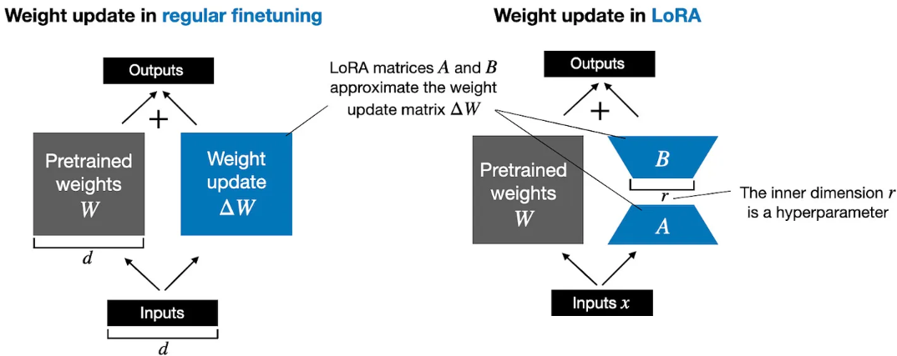
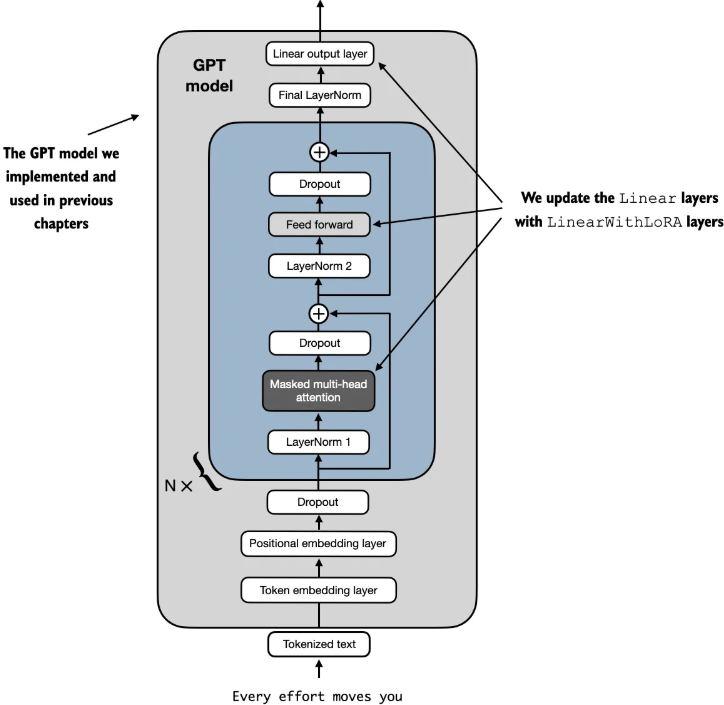

##  《从零构建大模型》

 [美]塞巴斯蒂安·拉施卡

书中资料 https://github.com/rasbt/LLMs-from-scratch

### 附录E  使用LoRA进行参数高效微调

LoRA（低秩自适应）是应用最广泛的参数高效微调技术之一。

#### LoRA简介

LoRA是一种通过仅调整模型权重参数的一小部分，使预训练模型更好地适应特定且通常较小的数据集的技术。“**低秩**”指的是将模型调整限制在总权重参数空间的较小维度子空间，从而有效捕获训练过程中对权重参数变化影响最大的方向。

对于模型的某一个层对应的巨大的权重矩阵$W$，在模型训练反向传播的过程中，通过计算最小化损失函数得到的更新权重参数矩阵$\Delta W$，最终更新后的权重为：

$$W_{\text{updated}} = W + \Delta W$$

 [Hu et al.](https://arxiv.org/abs/2106.09685) 提出的LoRA提供了一个更高效的计算权重更新 $\Delta W$ 方法，通过两个小的多子矩阵相乘得到$\Delta W \approx AB$，对于最终的权重就变为：

 $$W_{\text{updated}} = W + AB$$

由于矩阵乘法的分配律，它允许我们将原始权重与更新后的权重分开，而不是将它们组合在一起，即 $$x (W+\Delta W) = x W + x \Delta W$$

因此对于LoRA方法也就有：$$x (W+A B) = x W + x A B$$，可以从下图看到LoRA和全量训练的差异，同时将LoRA权重矩阵与原始模型权重分开的能力使LoRA在实践中更加有用。从而允许预训练的模型权重保持不变，并且在使用模型时可以动态地应用LoRA矩阵。这样模型定制变得更加灵活，无须存储多个完整版本的大语言模型。这降低了存储需求并提高了可扩展性，因为在为每个特定客户或应用程序进行定制时，只需调整和保存较小的LoRA矩阵即可。


 

#### 准备数据集

数据准备和第6章完全相同，将数据集分成3部分：70%用于训练，10%用于验证，20%用于测试。

```python
import pandas as pd
def create_balanced_dataset():
    # 需要删除原始文件中5082行内容开头的"，这一行只有一个"会导致直到下一个"行的内容都被当作一条短信
    df = pd.read_csv(".\\sms\\SMSSpamCollection.tsv", sep="\t", header=None, names=["Label", "Text"])
    print(df)   # [5574 rows x 2 columns] 
    print(df["Label"].value_counts())  # ham 4827 spam 747
    # 统计垃圾信息的条数 747
    num_spam = df[df["Label"] == "spam"].shape[0]
    
    # 对正常信息数据随机采样，使它的条数和垃圾信息的条数相同
    ham_subset = df[df["Label"] == "ham"].sample(num_spam, random_state=123)
    
    # 把两个数据集合并
    balanced_df = pd.concat([ham_subset, df[df["Label"] == "spam"]])
    # 把标签映射成数字0和1
    balanced_df["Label"] = balanced_df["Label"].map({"ham": 0, "spam": 1})

    train_frac = 0.7 # 训练集的比例为0.7
    validation_frac = 0.1 # 验证集的比例为0.1
    # 先打乱所有的数据集 两个标签各747条，一共1494条数据
    balanced_df = balanced_df.sample(frac=1, random_state=123).reset_index(drop=True)

    # 按训练集和验证集的比例把数据分组
    train_end = int(len(balanced_df) * train_frac)
    validation_end = train_end + int(len(balanced_df) * validation_frac)

    # Split the DataFrame
    train_df = balanced_df[:train_end]
    validation_df = balanced_df[train_end:validation_end]
    test_df = balanced_df[validation_end:]
    # 保存数据，不用每次都准备
    train_df.to_csv("train.csv", index=None)
    validation_df.to_csv("validation.csv", index=None)
    test_df.to_csv("test.csv", index=None)
```

三个数据集分别存储到一个文件中，以后可以复用。

##### 创建数据加载器

```python
from torch.utils.data import Dataset
class SpamDataset(Dataset):
    def __init__(self, csv_file, tokenizer, max_length=None, pad_token_id=50256):
        self.data = pd.read_csv(csv_file)

        # 处理每一行短信内容数据为词元id，这也是输入数据
        self.encoded_texts = [
            tokenizer.encode(text) for text in self.data["Text"]
        ]

        if max_length is None:
            self.max_length = self._longest_encoded_length()
        else:
            self.max_length = max_length
            # 如果文版长度大于输入参数的长度，把文本长度截断到最大长度
            self.encoded_texts = [
                encoded_text[:self.max_length]
                for encoded_text in self.encoded_texts
            ]

        # 长度不够的文本使用pad_token_id进行填充
        self.encoded_texts = [
            encoded_text + [pad_token_id] * (self.max_length - len(encoded_text))
            for encoded_text in self.encoded_texts
        ]

    def __getitem__(self, index):
        encoded = self.encoded_texts[index]
        # 目标数据是每一行对应的标签0或1
        label = self.data.iloc[index]["Label"]
        return (
            torch.tensor(encoded, dtype=torch.long),
            torch.tensor(label, dtype=torch.long)
        )

    def __len__(self):
        return len(self.data)
    
    # 找出数据集中最长的文本长度
    def _longest_encoded_length(self):
        return max(len(encoded_text) for encoded_text in self.encoded_texts)
    
def create_sms_data_loaders():
    tokenizer = tiktoken.get_encoding("gpt2")
    print(tokenizer.encode("<|endoftext|>", allowed_special={"<|endoftext|>"})) # [50256]

    num_workers = 0
    batch_size = 8
    torch.manual_seed(123)

    train_dataset = SpamDataset(
        csv_file="train.csv",
        max_length=None,
        tokenizer=tokenizer
    )
    
    val_dataset = SpamDataset(
        csv_file="validation.csv",
        max_length=train_dataset.max_length, # 验证集和测试集的长度和训练集一样
        tokenizer=tokenizer
    )

    test_dataset = SpamDataset(
        csv_file="test.csv",
        max_length=train_dataset.max_length, # 验证集和测试集的长度和训练集一样
        tokenizer=tokenizer
    )

    train_loader = DataLoader(
        dataset=train_dataset,
        batch_size=batch_size,
        shuffle=True,
        num_workers=num_workers,
        drop_last=True,
    )

    val_loader = DataLoader(
        dataset=val_dataset,
        batch_size=batch_size,
        num_workers=num_workers,
        drop_last=False,
    )

    test_loader = DataLoader(
        dataset=test_dataset,
        batch_size=batch_size,
        num_workers=num_workers,
        drop_last=False,
    )
```

#### 加载预训练模型

第5章一样加载预训练好的GPT2模型

```python
    BASE_CONFIG = {
        "vocab_size": 50257,     # Vocabulary size
        "emb_dim": 768,
        "n_layers": 12, 
        "n_heads": 12,
        "context_length": 1024,  # Context length
        "drop_rate": 0.0,        # Dropout rate
        "qkv_bias": True         # Query-key-value bias
    }

    settings, params = load_gpt_models(model_size='124M', models_dir="gpt2")
    model = GPTModel(BASE_CONFIG)
    load_weights_into_gpt(model, params)
    model.eval()
```

##### 设置模型进行分类

把模型的输出层替换为2维输出线性层，并输出训练前的准确率

```python
torch.manual_seed(123)
# set DISABLE_ADDMM_CUDA_LT=1
device = torch.device("cuda" if torch.cuda.is_available() else "cpu")
num_classes = 2 # 0表示非垃圾短信，1表示垃圾短信
# 重新定义输出层
model.out_head = torch.nn.Linear(in_features=768, out_features=num_classes).to(device)
model.to(device)

torch.manual_seed(123)
train_accuracy = calc_accuracy_loader(train_loader, model, device, num_batches=10)
val_accuracy = calc_accuracy_loader(val_loader, model, device, num_batches=10)
test_accuracy = calc_accuracy_loader(test_loader, model, device, num_batches=10)

print(f"Training accuracy: {train_accuracy*100:.2f}%") # 46.25%
print(f"Validation accuracy: {val_accuracy*100:.2f}%") # 45.00%
print(f"Test accuracy: {test_accuracy*100:.2f}%") # 48.75%
```

#### 替换模型中的线性层为LoRA

##### 定义LoRA层

它创建了矩阵$A$ 和$B$，并设置两个超参数alpha缩放因子和rank(($r$))。该层可以接受输入并计算相应的输出。

rank作为A和B两个矩阵内部的维度，大小决定了参数总数量。例如之前权重矩阵的大小为[1024,768]，它的值的个数`1024*768=786432`，把它用矩阵乘法分拆后为A[1024,8]乘B[8,768]，其中A和B总共的参数个数（两个矩阵中值的个数）为`1024*8+8*768=14336` ，Lora使用的参数数量是原来的0.018，大幅缩小了参数数量。如果rank值增加，参数量也会相应增大。

由于矩阵B的初始值被设置为0，所以初始状态下AB都是0，原来的权重和AB相加后还是之前的权重值，确保了不会改变原始权重

alpha作为低秩自适应输出的缩放因子，主要决定了适应层的输出对原始层输出的影响程度。这可以被视为调节低秩适应对层输出影响的一种方式

```python
import math
class LoRALayer(torch.nn.Module):
    ''' LoRA layer for low-rank adaptation '''
    def __init__(self, in_dim, out_dim, rank, alpha):
        super().__init__()
        # LoRA layer: in_dim=768, out_dim=768, rank=16, alpha=16
        # LoRA layer: in_dim=768, out_dim=3072, rank=16, alpha=16
        # LoRA layer: in_dim=3072, out_dim=768, rank=16, alpha=16
        self.A = torch.nn.Parameter(torch.empty(in_dim, rank)) # Low-rank matrix A
        torch.nn.init.kaiming_uniform_(self.A, a=math.sqrt(5))  # 把矩阵A初始化为Kaiming均匀分布
        self.B = torch.nn.Parameter(torch.zeros(rank, out_dim)) # Low-rank matrix B，初始值都为0
        self.alpha = alpha # 缩放系数

    def forward(self, x):
        x = self.alpha * (x @ self.A @ self.B) # LoRA前向传播多了一个缩放系数
        return x
```

##### 把模型中的线性层替换为LoRA层

为了整合原始线性层的权重，创建一个`LinearWithLoRA`层。该层利用之前实现的`LoRALayer`，替换神经网络中现有的线性层，比如`GPTModel`中的自注意力模块或前馈模块

```python
class LinearWithLoRA(torch.nn.Module):
    ''' Combine original linear layer with LoRA layer '''
    def __init__(self, linear, rank, alpha):
        super().__init__()
        self.linear = linear
        self.lora = LoRALayer(linear.in_features, linear.out_features, rank, alpha)

    def forward(self, x):
        # forward方法通过将原始线性层和LoRA层的结果相加来计算输出
        return self.linear(x) + self.lora(x)
    
def replace_linear_with_lora(model, rank, alpha):
    for name, module in model.named_children():
        if isinstance(module, torch.nn.Linear):
            # 把原来的线性层替换为LoRA层
            setattr(model, name, LinearWithLoRA(module, rank, alpha))
        else:
            # 递归的方式替换所有层
            replace_linear_with_lora(module, rank, alpha)
```


 

查看替换前后的模型参数数量变化，从124,441,346减少到2,666,528。可训练参数的数量减少到了原来的1/50。将rank和alpha设置为16是一个不错的默认选择，但增加rank参数也很常见，这反过来会增加可训练参数的数量。通常选择将alpha设置为rank的一半、两倍或等于rank的值。

```python
total_params = sum(p.numel() for p in model.parameters() if p.requires_grad)
print(f"Total trainable parameters before: {total_params:,}") # 124,441,346
# 把模型中所有参数设置为不训练
for param in model.parameters():
    param.requires_grad = False

total_params = sum(p.numel() for p in model.parameters() if p.requires_grad)
print(f"Total trainable parameters after: {total_params:,}") # 0
# 把模型中原来的线性层替换为LoRA
replace_linear_with_lora(model, rank=16, alpha=16)

total_params = sum(p.numel() for p in model.parameters() if p.requires_grad)
print(f"Total trainable LoRA parameters: {total_params:,}") # 2,666,528
```

#### 对模型微调完整流程

完整的流程这里分成了6步

```python
def train_sms_classify_lora():
    # 1. 加载数据集
    # 数据集分割为3个文件，分别是训练集train.csv、验证集validtaion.csv和测试集test.csv
    create_balanced_dataset()
    train_loader, val_loader, test_loader = create_sms_data_loaders()

    # 2. 加载预训练模型
    BASE_CONFIG = {
        "vocab_size": 50257,     # Vocabulary size
        "emb_dim": 768,
        "n_layers": 12, 
        "n_heads": 12,
        "context_length": 1024,  # Context length
        "drop_rate": 0.0,        # Dropout rate
        "qkv_bias": True         # Query-key-value bias
    }

    settings, params = load_gpt_models(model_size='124M', models_dir="gpt2")
    model = GPTModel(BASE_CONFIG)
    load_weights_into_gpt(model, params)
    model.eval()

    # 3. 计算微调前的准确率
    torch.manual_seed(123)
    # set DISABLE_ADDMM_CUDA_LT=1
    device = torch.device("cuda" if torch.cuda.is_available() else "cpu")
    num_classes = 2 # 0表示非垃圾短信，1表示垃圾短信
    # 重新定义输出层
    model.out_head = torch.nn.Linear(in_features=768, out_features=num_classes)
    model.to(device)

    torch.manual_seed(123)
    train_accuracy = calc_accuracy_loader(train_loader, model, device, num_batches=10)
    val_accuracy = calc_accuracy_loader(val_loader, model, device, num_batches=10)
    test_accuracy = calc_accuracy_loader(test_loader, model, device, num_batches=10)

    print(f"Training accuracy: {train_accuracy*100:.2f}%") # 46.25%
    print(f"Validation accuracy: {val_accuracy*100:.2f}%") # 45.00%
    print(f"Test accuracy: {test_accuracy*100:.2f}%") # 48.75%

    # 4. 使用LoRA微调模型
    total_params = sum(p.numel() for p in model.parameters() if p.requires_grad)
    print(f"Total trainable parameters before: {total_params:,}")
    # 把模型中所有参数设置为不训练
    for param in model.parameters():
        param.requires_grad = False

    total_params = sum(p.numel() for p in model.parameters() if p.requires_grad)
    print(f"Total trainable parameters after: {total_params:,}")
    # 把模型中原来的线性层替换为LoRA
    replace_linear_with_lora(model, rank=16, alpha=16)

    total_params = sum(p.numel() for p in model.parameters() if p.requires_grad)
    print(f"Total trainable LoRA parameters: {total_params:,}")
	# 原来的线性层被替换了，所以再把模型数据往运算设备上放一次
    model.to(device)
    #print(model)
    start_time = time.time()
    torch.manual_seed(123)
    optimizer = torch.optim.AdamW(model.parameters(), lr=5e-5, weight_decay=0.1)

    num_epochs = 5
    train_losses, val_losses, train_accs, val_accs, examples_seen = train_classifier_simple(
        model, train_loader, val_loader, optimizer, device,
        num_epochs=num_epochs, eval_freq=50, eval_iter=5,
    )

    end_time = time.time()
    execution_time_minutes = (end_time - start_time) / 60
    print(f"Training completed in {execution_time_minutes:.2f} minutes.")

    # 5. 评估模型
    epochs_tensor = torch.linspace(0, num_epochs, len(train_losses))
    examples_seen_tensor = torch.linspace(0, examples_seen, len(train_losses))
    plot_values(epochs_tensor, examples_seen_tensor, train_losses, val_losses, label="loss")

    # 6. 保存模型
    torch.save(model.state_dict(), "review_lora_classifier.pth")
```

最终输出：使用的时间1.3分钟比第六章全量训练的0.68分钟还要久，可能是因为其中的矩阵乘法耗时了，生成的`review_lora_classifier.pth`文件大小为533M

```markdown
Total trainable LoRA parameters: 2,666,528
Ep 1 (Step 000000): Train loss 3.757, Val loss 3.403
Ep 1 (Step 000050): Train loss 0.329, Val loss 0.317
Ep 1 (Step 000100): Train loss 0.170, Val loss 0.296
Training accuracy: 95.00% | Validation accuracy: 97.50%
Ep 2 (Step 000150): Train loss 0.181, Val loss 0.029
Ep 2 (Step 000200): Train loss 0.015, Val loss 0.084
Ep 2 (Step 000250): Train loss 0.045, Val loss 0.031
Training accuracy: 92.50% | Validation accuracy: 97.50%
Ep 3 (Step 000300): Train loss 0.025, Val loss 0.018
Ep 3 (Step 000350): Train loss 0.065, Val loss 0.083
Training accuracy: 100.00% | Validation accuracy: 100.00%
Ep 4 (Step 000400): Train loss 0.004, Val loss 0.046
Ep 4 (Step 000450): Train loss 0.279, Val loss 0.309
Ep 4 (Step 000500): Train loss 0.006, Val loss 0.013
Training accuracy: 100.00% | Validation accuracy: 100.00%
Ep 5 (Step 000550): Train loss 0.006, Val loss 0.001
Ep 5 (Step 000600): Train loss 0.000, Val loss 0.149
Training accuracy: 100.00% | Validation accuracy: 100.00%
Training completed in 1.30 minutes.
```

其中替换之后的一个transformer块内包含新的`LinearWithLoRA`层，这些层由设置为**不可训练的原始Linear层**和**新的LoRA层**组成

```python
GPTModel(
  (tok_emb): Embedding(50257, 768)
  (pos_emb): Embedding(1024, 768)
  (drop_emb): Dropout(p=0.0, inplace=False)
  (trf_blocks): Sequential(
    (0): TransformerBlock(
      (att): MultiHeadAttention(
        (W_query): LinearWithLoRA(
          (linear): Linear(in_features=768, out_features=768, bias=True)
          (lora): LoRALayer()
        )
        (W_key): LinearWithLoRA(
          (linear): Linear(in_features=768, out_features=768, bias=True)
          (lora): LoRALayer()
        )
        (W_value): LinearWithLoRA(
          (linear): Linear(in_features=768, out_features=768, bias=True)
          (lora): LoRALayer()
        )
        (out_proj): LinearWithLoRA(
          (linear): Linear(in_features=768, out_features=768, bias=True)
          (lora): LoRALayer()
        )
        (dropout): Dropout(p=0.0, inplace=False)
      )
      (ff): FeedForward(
        (layers): Sequential(
          (0): LinearWithLoRA(
            (linear): Linear(in_features=768, out_features=3072, bias=True)
            (lora): LoRALayer()
          )
          (1): GELU()
          (2): LinearWithLoRA(
            (linear): Linear(in_features=3072, out_features=768, bias=True)
            (lora): LoRALayer()
          )
        )
      )
      (norm1): LayerNorm()
      (norm2): LayerNorm()
      (drop_shortcut): Dropout(p=0.0, inplace=False)
    )
```

最后的归一化层和输出层为

```markdown
  (final_norm): LayerNorm()
  (out_head): LinearWithLoRA(
    (linear): Linear(in_features=768, out_features=2, bias=True)
    (lora): LoRALayer()
  )
```


