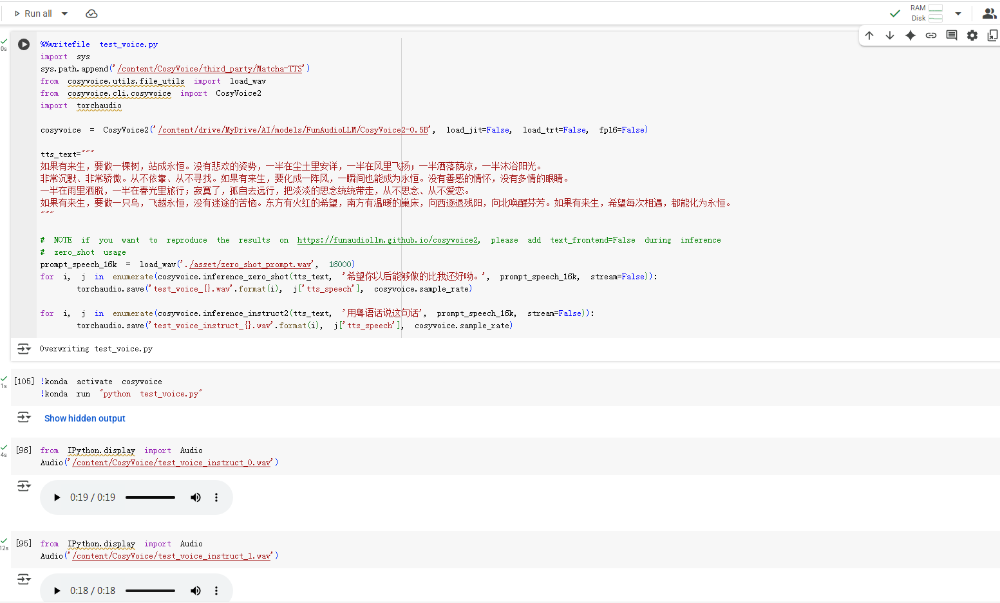

## Google Colab应用

 

### Colab 

https://colab.research.google.com/

Colab给每一个笔记一个运行的虚拟Linux环境；每一个代码段或文本段都是一个独立的Cell。

#### 基本使用

* 目录 当前的根目录为Content目录，可以通过左侧的文件列表来查看

* 查看当前服务器ip，运行时类型为T4 GPU时，ip地址为新加坡。Google AI Studio会判断如果Colab实例的区域不是支持的区域，也不能使用。

```shell
!curl ipinfo.io
```


#### Colab下载文件到Google Drive

Colab中左侧导航栏中正常挂载了Goolge Drive后

在Goolge Drive上先建立好目录`MyDrive/AI/models/FunAudioLLM/`，在Colab中新建一个代码段，执行以下，可以下载文件到当前切换的目录中

```
%%bash
cd /content/drive/MyDrive/AI/models/FunAudioLLM/
git clone https://www.modelscope.cn/iic/CosyVoice2-0.5B.git
```

使用以下命令可以创建目录

```
%%bash
cd /content/drive/MyDrive/
mkdir -p my_path
cd my_path
```

例如下载CosyVoice的代码

```
%%bash
cd /content/drive/MyDrive/AI/models/FunAudioLLM/
git clone --recursive https://github.com/FunAudioLLM/CosyVoice.git
```

输出为

```
Submodule path 'third_party/Matcha-TTS': checked out 'dd9105b34bf2be2230f4aa1e4769fb586a3c824e'
Cloning into 'CosyVoice'...
Submodule 'third_party/Matcha-TTS' (https://github.com/shivammehta25/Matcha-TTS.git) registered for path 'third_party/Matcha-TTS'
Cloning into '/content/drive/MyDrive/AI/models/FunAudioLLM/CosyVoice/third_party/Matcha-TTS'...
```

#### 运行CosyVoice2

主要参考这份笔记

https://colab.research.google.com/github/weedge/doraemon-nb/blob/main/CosyVoice.ipynb#scrollTo=v-kA3Nzc5-2E

我自己的笔记地址

https://colab.research.google.com/drive/10yTX97D8sj6qoXcxcZ8ebAmx_QDOhC51?authuser=1

1. 下载模型到Google Drive中

   ```bash
   %%bash
   cd /content/drive/MyDrive/AI/models/FunAudioLLM/
   git clone https://www.modelscope.cn/iic/CosyVoice2-0.5B.git
   ```

   下载完成后由错误提示信息，但是文件已经完全下载下来了，不影响使用，15G的空间用了9G多。

   **以下操作在同一个T4 GPU实例实例中执行**，下载的项目代码和依赖库都是在同一个实例中存在，如果切换实例，之前下载的东西都没了

2. 下载项目源码（自己克隆一份到自己的Github之后，下载自己的，方便以后修改）

   ```bash
   !git clone https://github.com/memorywalker/CosyVoice.git
   !cd /content/CosyVoice && git submodule update --init --recursive
   ```

   简单起见直接在根目录下载项目

3. 安装miniconda，创建虚拟环境

   因为当前Colab的默认Python是3.11版本，而CosyVoice直接使用会用库依赖错误，这一步费了不少时间。所以使用conda来安装CosyVoice使用的Python依赖。手动配置Conda环境有点麻烦，这里使用工具性的项目来安装和配置MiniConda

   ```bash
   !pip install konda
   import konda
   konda.install()
   !conda --version
   ```

   使用Conda必须先接受使用条款，不然在创建虚拟环境时会提示不能继续

   ```bash
   !conda tos accept --override-channels --channel https://repo.anaconda.com/pkgs/main
   !conda tos accept --override-channels --channel https://repo.anaconda.com/pkgs/r
   ```

   创建虚拟环境

   ```bash
   !konda create -n cosyvoice -y python=3.10
   ```

   Colab中的每一个Cell都是独立的运行环境，所以即使执行了`!konda activate cosyvoice`，在下一个Cell中还不是激活的虚拟环境。

   ```bash
   !source activate cosyvoice;which python
   ```

   `which python`放在激活虚拟环境的同一行，会显示使用虚拟环境的python，如果放在第二行就会是系统python，即使这两个语句都在同一个cell中。

   

4. 安装依赖

   切换到项目目录下，安装项目的依赖
   ```bash
   %cd CosyVoice/
   !konda run "pip install -r requirements.txt"
   ```

   参考CosyVoice项目指南安装另一个依赖

   ```bash
   !apt-get install sox libsox-dev 2>&1 > /dev/null
   ```

   

5. 运行测试脚本

   按照前面的测试只有在同一行的代码，才能使用同一个虚拟环境，所以只能把代码保存在一个文件中，通过`konda run`来在虚拟环境中执行python代码。

   代码中需要把依赖的第三方库加入到环境变量中，不然会提示`ModuleNotFoundError: No module named 'matcha'`

   ```python
   %%writefile my_voice.py
   # 配置依赖
   import sys
   sys.path.append('/content/CosyVoice/third_party/Matcha-TTS')
   
   from cosyvoice.utils.file_utils import load_wav
   import torchaudio
   from cosyvoice.cli.cosyvoice import CosyVoice2
   
   # 加载模型
   cosyvoice = CosyVoice2('/content/drive/MyDrive/AI/models/FunAudioLLM/CosyVoice2-0.5B', load_jit=False, load_trt=False, fp16=False)
   
   # NOTE if you want to reproduce the results on https://funaudiollm.github.io/cosyvoice2, please add text_frontend=False during inference
   # zero_shot usage
   prompt_speech_16k = load_wav('./asset/zero_shot_prompt.wav', 16000)
   for i, j in enumerate(cosyvoice.inference_zero_shot('收到好友从远方寄来的生日礼物，那份意外的惊喜与深深的祝福让我心中充满了甜蜜的快乐，笑容如花儿般绽放。', '希望你以后能够做的比我还好呦。', prompt_speech_16k, stream=False)):
       torchaudio.save('zero_shot_{}.wav'.format(i), j['tts_speech'], cosyvoice.sample_rate)
   
   # fine grained control, for supported control, check cosyvoice/tokenizer/tokenizer.py#L248
   for i, j in enumerate(cosyvoice.inference_cross_lingual('在他讲述那个荒诞故事的过程中，他突然[laughter]停下来，因为他自己也被逗笑了[laughter]。', prompt_speech_16k, stream=False)):
       torchaudio.save('fine_grained_control_{}.wav'.format(i), j['tts_speech'], cosyvoice.sample_rate)
   
   # instruct usage
   for i, j in enumerate(cosyvoice.inference_instruct2('收到好友从远方寄来的生日礼物，那份意外的惊喜与深深的祝福让我心中充满了甜蜜的快乐，笑容如花儿般绽放。', '用四川话说这句话', prompt_speech_16k, stream=False)):
       torchaudio.save('instruct_{}.wav'.format(i), j['tts_speech'], cosyvoice.sample_rate)
   ```

   这段代码会在当前目录中保存一个`my_voice.py`的文件，下面就可以在虚拟环境中执行

   ```bash
   !konda activate cosyvoice
   !konda run "python my_voice.py"
   ```

   执行完成后，会在当前目录下生成`zero_shot_0.wav`等音频文件，使用以下代码可以播放音频

   ```python
   from IPython.display import Audio
   Audio('/content/CosyVoice/zero_shot_0.wav')
   ```

   实际运行速度还能接受，长文本会被分割成18s左右的音频片段  
        
   
   


### 


