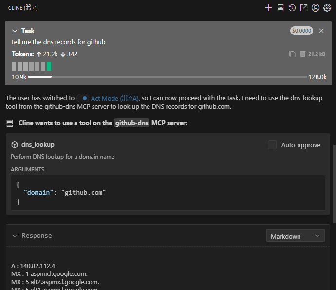

##  rust创建MCP Server


参考文档：

https://www.shuttle.dev/blog/2025/07/18/how-to-build-a-stdio-mcp-server-in-rust

https://mcpcat.io/guides/building-mcp-server-rust/

### MCP

https://modelcontextprotocol.io/overview

MCP(Model Context Protocol)定义了AI模型使用外部工具或资源方法的协议，这样可以扩展AI的应用场景。Cursor，Claude，VS Code的Cline插件，CherryStudio这些模型客户端都可以作为MCP客户端，通过MCP协议，从MCP Server获取资源，工具。

#### 传输类型

MCP协议目前的传输类型有：

* stdio (standard input/output)标准输入输出流，主要在本地使用，可以访问本地文件系统，执行命令，访问数据库等
* SSE (Server-Sent-Events) 服务发送事件，运行在云服务器上，通过websockets连接

##### 标准输入输出数据传输

通过stdin接收请求，通过stdout发送响应。这种模式在命令行工具、脚本集成和进程间通信（IPC）使用。

  *  **标准输入 (stdin)**: 程序读取输入数据的流（文件描述符0）
  *  **标准输出 (stdout)**: 程序写入输出数据的流（文件描述符1）
  *  **标准错误 (stderr)**: 程序写入错误信息的流（文件描述符2）

一个程序使用标准输入输出数据传输流程：

1. 服务程序启动后，以阻塞模式从stdin读取数据
2. 其他程序向服务程序的stdin写入数据，数据格式通常为JSON-RPC请求
3. 服务程序解析读取的json数据做对应的处理
4. 服务程序将应答封装为JSON-RPC数据，写入stdout

#### MCP Server基本工作流程

1. AI客户端根据MCP Server获取它所能提供的工具、资源、提示词信息
2. 模型根据上下文决定使用哪些工具或资源
3. MCP客户端根据AI模型决策的工具向MCP Server发送对应工具或资源请求
4. MCP Server处理请求
5. MCP Server返回结果给客户端
6. AI模型把返回的结果应用在上下文中

### 创建一个查询DNS的MCP Server

这个MCP Server因为是本地使用使用stdio传输就可以

#### 创建工程

1. `cargo new github-dns-mcp-server`，创建一个工程目录和默认的main.rs文件

2. 添加工程依赖

   ```toml
   [dependencies]
   tokio = { version = "1", features = ["full"] }
   rmcp = { version = "0.3", features = ["server", "transport-io"] }
   serde = { version = "1", features = ["derive"] }
   reqwest = "0.12"
   anyhow = "1.0"
   schemars = "1.0"
   ```

   - `tokio` 处理异步操作
   - `rmcp` MCP官方提供的[Rust Model Context Protocol SDK](https://github.com/modelcontextprotocol/rust-sdk)
   - `serde` 序列化和反序列化MCP协议传输的 JSON-RPC (JSON Remote Procedure Call) 数据
   - `reqwest` 创建给 DNS lookup API (HackerTarget)的HTTP请求
   - `anyhow` 用来错误处理
   - `schemars` 用来生成 JSON schema 

#### 实现服务功能

新建一个`dns_mcp.rs`文件实现主要逻辑功能，具体宏的[说明](https://github.com/modelcontextprotocol/rust-sdk/blob/main/crates/rmcp-macros/README.md)

```rust
use rmcp::{
    ServerHandler,
    handler::server::{router::tool::ToolRouter, tool::Parameters},
    model::{ErrorData as McpError, *},
    schemars, tool, tool_handler, tool_router,
};
use serde::Deserialize;
// 写时复制智能指针
use std::{borrow::Cow, future::Future};

#[derive(Debug, Clone)]
pub struct DnsService {
  	// ToolRouter中有一个map，它的key为str，value为ToolRoute<S>，这样就根据字串来找到对应的工具，也就是路由功能
    tool_router: ToolRouter<DnsService>,
}

// 定义请求结构体，只有一个参数即域名的字串
#[derive(Debug, Deserialize, schemars::JsonSchema)]
pub struct DnsLookupRequest {
    #[schemars(description = "The domain name to lookup")]
    pub domain: String,
}

// tool_router宏用来给impl代码段中的所有标记了#[rmcp::tool]的工具函数生成工具路由，它的new返回一个ToolRouter实例
// 自动收集所有 #[tool] 标记的方法，并注册到 ToolRouter 中
#[tool_router]
impl DnsService {
    pub fn new() -> Self {
        Self {
            tool_router: Self::tool_router(),
        }
    }
	// 定义一个工具名称为dns_lookup，默认情况下使用函数名作为工具的名称，也可以通过name字段指定别的名字
    //它接收一个 `Parameters<DnsLookupRequest>` 类型的参数，这个参数封装了请求数据
    // 返回一个 `Result`，成功时返回 `CallToolResult`，失败时返回 `McpError`
    // Parameters(request)：自动提取并反序列化请求参数
    #[tool(description = "Perform DNS lookup for a domain name")]
    async fn dns_lookup(
        &self,
        Parameters(request): Parameters<DnsLookupRequest>,
    ) -> Result<CallToolResult, McpError> {
        // 使用 `reqwest` 库向 `hackertarget.com` 的API发送HTTP GET请求，查询指定的域名
        let response = reqwest::get(format!(
            "https://api.hackertarget.com/dnslookup/?q={}",
            request.domain
        ))
        .await
        .map_err(|e| McpError {
            code: ErrorCode(-32603),
            message: Cow::from(format!("Request failed: {}", e)),
            data: None,
        })?;

        let text = response.text().await.map_err(|e| McpError {
            code: ErrorCode(-32603),
            message: Cow::from(format!("Failed to read response: {}", e)),
            data: None,
        })?;
		// 如果成功，把请求到的文本信息包装成CallToolResult::success
        Ok(CallToolResult::success(vec![Content::text(text)]))
    }
}
//  使用 #[tool_handler]属性宏为DnsService默认实现ServerHandler特性，包括list_tools和call_tool等
#[tool_handler]
impl ServerHandler for DnsService {
    // 实现 get_info 方法，返回服务器的信息
    fn get_info(&self) -> ServerInfo {
        ServerInfo {
            protocol_version: ProtocolVersion::V_2024_11_05,
            capabilities: ServerCapabilities::builder().enable_tools().build(),
            server_info: Implementation::from_build_env(),
            instructions: Some("A DNS lookup service that queries domain information using the HackerTarget API. Use the dns_lookup tool to perform DNS lookups for any domain name.".to_string()),
        }
    }
}
```

main.rs中启动服务

```rust
use anyhow::Result;
use dns_mcp::DnsService;
use rmcp::{ServiceExt, transport::stdio};

mod dns_mcp;

//自动将 main 函数转换为异步入口点， 在后台创建和管理 Tokio 运行时
#[tokio::main]
async fn main() -> Result<()> {
    // Create an instance of our DNS service
    let service = DnsService::new().serve(stdio()).await?;
    // waiting(): 阻塞当前任务直到服务终止
    service.waiting().await?;
    Ok(())
}
```


### 使用MCP Server

#### Cline中配置

vs code的Cline插件配置文件`C:\Users\xxx\AppData\Roaming\Code\User\globalStorage\saoudrizwan.claude-dev\settings\cline_mcp_settings.json`中配置MCP Server，因为就是普通的可执行程序，所以执行的命令就是编译生成的exe文件。

开发过程中直接用编译出来的路径，实际应用可以放在系统环境变量中，例如使用`cargo install --path .`工程会编译release版本，并把编译出来的exe文件拷贝到Cargo的bin目录中，这样系统任何地方都可以访问。

```json
{
  "mcpServers": {
    "github-dns": {
      "disabled": false,
      "timeout": 60,
      "type": "stdio",
      "command": "E:\\dev\\rust\\github-dns-mcp-server\\target\\debug\\github-dns-mcp-server.exe"
    }
  }
}
```

#### 实际应用

在Cline的聊天框中询问 “tell me the dns records for github”

目前我用的Qwen3-Coder模型会如下回答：

The user wants to find the DNS records for github. I can see from the environment details that there's a connected MCP server called "github-dns" that has a tool called "dns_lookup" which can perform DNS lookup for a domain name. This is exactly what I need.

The dns_lookup tool requires a "domain" parameter, and I can infer that "github" refers to "github.com" which is the standard domain for GitHub.

I'm currently in PLAN MODE, so I need to use the plan_mode_respond tool to acknowledge this request and explain my approach.

I can help you find the DNS records for GitHub using the available MCP tools. I see there's a connected DNS lookup tool that can perform this task.

My approach will be:
1. Use the dns_lookup tool from the github-dns MCP server to look up the DNS records for github.com
2. Present the results to you

Since you asked for DNS records for "github", I'll assume you mean "github.com" - is that correct? Or did you have a different GitHub-related domain in mind?

在点击了Act模式后，Cline会运行MCP Server配置的github-dns-mcp-server.exe。通过Process Explorer可以看到github-dns-mcp-server.exe的父进程是VS Code。

   
      

