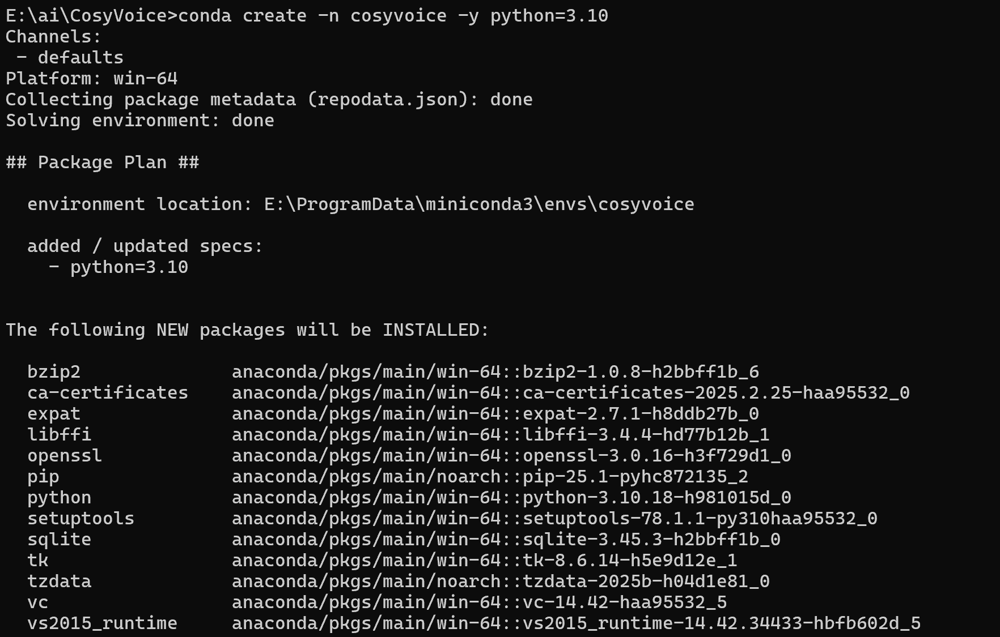
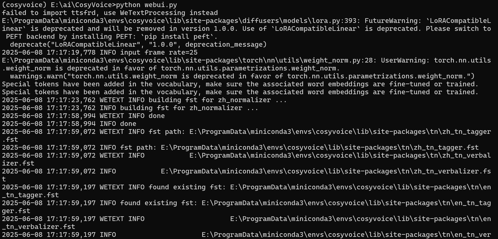
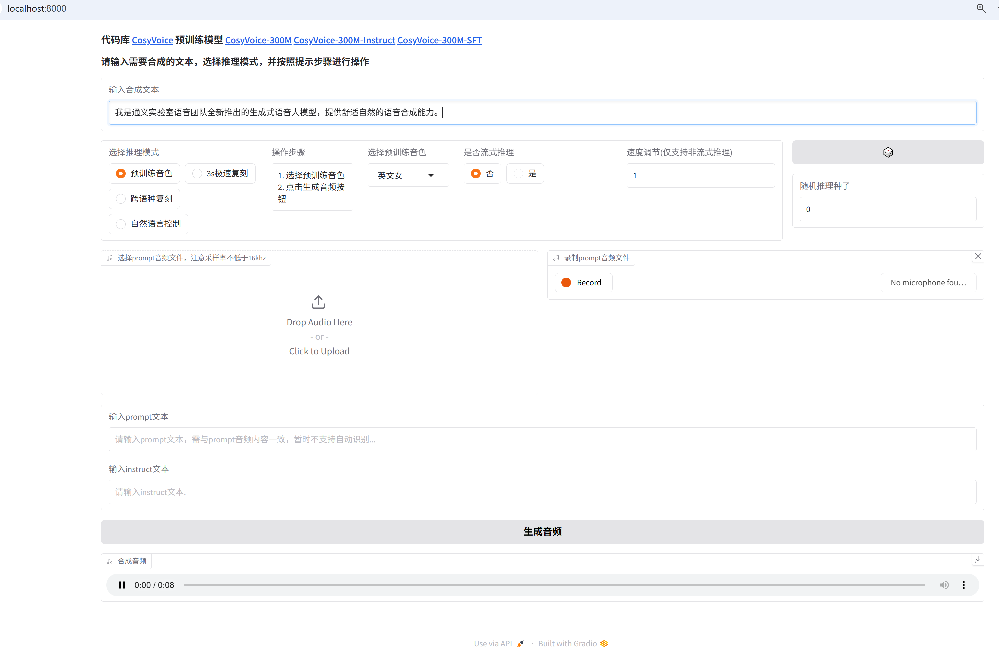

## Cosy Voice 声音克隆 

Cosy Voice V2是阿里开源的声音克隆模型，最少只需3秒原始音频，就可以克隆声音，支持中英文和中国部分地区方言。

### Miniconda环境安装

[Anaconda](https://www.anaconda.com/)提供python虚拟环境的功能，与pip不同的是它默认安装了常用的数据科学相关库，所以安装包比较大。除了python的库，它还提供了其他语言的预编译库。
Miniconda也是Anaconda这个组织提供的Anaconda的精简包，它没有图形化的管理界面，只有conda和python需要的基础包，所以安装包小，用户可以根据自己的需要安装合适的包。安装地址https://www.anaconda.com/download/success

#### 下载安装包

国内可以在这个清华镜像下载 [miniconda](https://mirror.tuna.tsinghua.edu.cn/anaconda/miniconda/) 目前最新的版本是**Miniconda3-py313_25.3.1-1-Windows-x86_64.exe**里面集成的是3.13版本的python，安装包的大小为87M，安装目录最好选择一个空间大的磁盘，以后虚拟空间会放在这个安装目录的envs目录中，初始安装完成后miniconda3的大小为350M。

安装完成后需要把conda目录添加到系统path环境变量中`E:\ProgramData\miniconda3\condabin`

#### 配置镜像源

清华大学开源镜像站有说明如何配置 https://mirrors.tuna.tsinghua.edu.cn/help/anaconda/

conda的配置文件在windows用户目录的中 `C:\Users\Edison\.condarc`，修改文件内如下

```yaml
channels:
  - defaults
show_channel_urls: true
default_channels:
  - https://mirrors.tuna.tsinghua.edu.cn/anaconda/pkgs/main
  - https://mirrors.tuna.tsinghua.edu.cn/anaconda/pkgs/r
  - https://mirrors.tuna.tsinghua.edu.cn/anaconda/pkgs/msys2
custom_channels:
  conda-forge: https://mirrors.tuna.tsinghua.edu.cn/anaconda/cloud
  pytorch: https://mirrors.tuna.tsinghua.edu.cn/anaconda/cloud
  bioconda: https://mirrors.tuna.tsinghua.edu.cn/anaconda/cloud
  menpo: https://mirrors.tuna.tsinghua.edu.cn/anaconda/cloud
  simpleitk: https://mirrors.tuna.tsinghua.edu.cn/anaconda/cloud
  deepmodeling: https://mirrors.tuna.tsinghua.edu.cn/anaconda/cloud/
```

#### 虚拟环境

conda自带python版本不重要，因为创建一个虚拟环境时还可以安装指定的python版本。

1. 创建虚拟环境 `conda create -n venv -y python=3.10` 创建一个名称为venv的虚拟环境，python的版本为3.10，默认虚拟环境的目录在conda的安装目录下envs目录中
2. 删除虚拟环境`conda remove --name venv --all`删除虚拟环境所有包和依赖

### Cosy Voice

项目地址 https://github.com/FunAudioLLM/CosyVoice，首页有安装说明。

#### 下载项目代码

在E:\ai目录中执行 `git clone --recursive https://github.com/FunAudioLLM/CosyVoice.git`

官方的安装说明中还指出如果由于网络问题导致安装submodule失败，可以进入CosyVoice的目录中再执行以下命令直到安装成功`git submodule update --init --recursive`.我是开了外网，不然第一步代码都下载不下来。

#### 配置虚拟环境

1. 创建一个虚拟环境，`conda create -n cosyvoice -y python=3.10` 官方指南用的3.10，避免折腾还是保持一致。这个语句在哪执行都可以，因为conda默认的虚拟环境都在miniconda3的安装目录下的envs目录中

   
   

2. 激活虚拟环境 `conda activate cosyvoice`


#### 安装依赖和模型

依赖环境的安装要全部在激活的虚拟环境中安装，保持独立的版本，执行目录为下载的cosy voice项目目录。

1. 虚拟环境中安装`(cosyvoice) E:\ai\CosyVoice>conda install -y -c conda-forge pynini==2.1.5`

2. 安装其他python依赖库 `(cosyvoice) E:\ai\CosyVoice>pip install -r requirements.txt -i https://mirrors.aliyun.com/pypi/simple/ --trusted-host=mirrors.aliyun.com`

   安装过程中可以看到依赖了pytorch2.3.1，一共是2.4G的大小 

   ```
   Collecting torch==2.3.1 (from -r requirements.txt (line 35))
     Downloading https://download.pytorch.org/whl/cu121/torch-2.3.1%2Bcu121-cp310-cp310-win_amd64.whl (2423.5 MB)
   ```

   这一步的安装时间比较长，可以先去干别的事情

3. 下载最新的模型`CosyVoice2-0.5B` ，先进入python解释器，执行官方说明的语句即可

   ```shell
   (cosyvoice) E:\ai\CosyVoice>python
   Python 3.10.18 | packaged by Anaconda, Inc. | (main, Jun  5 2025, 13:08:55) [MSC v.1929 64 bit (AMD64)] on win32
   Type "help", "copyright", "credits" or "license" for more information.
   >>> from modelscope import snapshot_download
   >>> snapshot_download('iic/CosyVoice2-0.5B', local_dir='pretrained_models/CosyVoice2-0.5B')
   Downloading Model to directory: C:\Users\Edison\.cache\modelscope\hub\iic/CosyVoice2-0.5B
   Downloading [campplus.onnx]: 100%|████████████████████████████████████████████████| 27.0M/27.0M [00:02<00:00, 10.3MB/s]
   Downloading [CosyVoice-BlankEN/config.json]: 100%|████████████████████████████████████| 659/659 [00:00<00:00, 1.59kB/s]
   Downloading [configuration.json]: 100%|███████████████████████████████████████████████| 47.0/47.0 [00:00<00:00, 169B/s]
   Downloading [cosyvoice2.yaml]: 100%|██████████████████████████████████████████████| 7.16k/7.16k [00:00<00:00, 10.6kB/s]
   Downloading [asset/dingding.png]: 100%|████████████████████████████████████████████| 94.1k/94.1k [00:00<00:00, 296kB/s]
   Downloading [flow.cache.pt]: 100%|██████████████████████████████████████████████████| 430M/430M [00:38<00:00, 11.7MB/s]
   Downloading [flow.decoder.estimator.fp32.onnx]: 100%|███████████████████████████████| 273M/273M [00:24<00:00, 11.6MB/s]
   Downloading [flow.encoder.fp16.zip]: 100%|██████████████████████████████████████████| 111M/111M [00:10<00:00, 11.5MB/s]
   Downloading [flow.encoder.fp32.zip]: 100%|██████████████████████████████████████████| 183M/183M [00:16<00:00, 11.6MB/s]
   Downloading [flow.pt]: 100%|████████████████████████████████████████████████████████| 430M/430M [00:38<00:00, 11.7MB/s]
   Downloading [CosyVoice-BlankEN/generation_config.json]: 100%|███████████████████████████| 242/242 [00:00<00:00, 695B/s]
   Downloading [hift.pt]: 100%|██████████████████████████████████████████████████████| 79.5M/79.5M [00:07<00:00, 11.2MB/s]
   Downloading [llm.pt]: 100%|███████████████████████████████████████████████████████| 1.88G/1.88G [02:51<00:00, 11.8MB/s]
   Downloading [CosyVoice-BlankEN/merges.txt]: 100%|█████████████████████████████████| 1.34M/1.34M [00:00<00:00, 3.19MB/s]
   Downloading [CosyVoice-BlankEN/model.safetensors]: 100%|████████████████████████████| 942M/942M [01:23<00:00, 11.8MB/s]
   Downloading [README.md]: 100%|████████████████████████████████████████████████████| 11.8k/11.8k [00:00<00:00, 40.0kB/s]
   Downloading [speech_tokenizer_v2.onnx]: 100%|███████████████████████████████████████| 473M/473M [00:43<00:00, 11.5MB/s]
   Downloading [CosyVoice-BlankEN/tokenizer_config.json]: 100%|██████████████████████| 1.26k/1.26k [00:00<00:00, 5.00kB/s]
   Downloading [CosyVoice-BlankEN/vocab.json]: 100%|█████████████████████████████████| 2.65M/2.65M [00:00<00:00, 5.30MB/s]
   2025-06-08 17:07:26,932 - modelscope - INFO - Creating symbolic link C:\Users\Edison\.cache\modelscope\hub\iic\iic/CosyVoice2-0___5B -> C:\Users\Edison\.cache\modelscope\hub\iic/CosyVoice2-0.5B.
   2025-06-08 17:07:26,932 - modelscope - WARNING - Failed to create symbolic link C:\Users\Edison\.cache\modelscope\hub\iic\iic/CosyVoice2-0___5B -> C:\Users\Edison\.cache\modelscope\hub\iic/CosyVoice2-0.5B: [WinError 3] The system cannot find the path specified: 'C:\\Users\\Edison\\.cache\\modelscope\\hub\\iic\\iic\\CosyVoice2-0___5B' -> 'C:\\Users\\Edison\\.cache\\modelscope\\hub\\iic/CosyVoice2-0.5B'
   'pretrained_models/CosyVoice2-0.5B'
   ```

   最后有个创建符号链接失败的错误信息，应该没有什么影响，下载下来的`CosyVoice2-0.5B`目录大小为4.76G。

#### 运行模型

* CosyVoice2-0.5B模型缺少文件，需要下载[spk2info.zip](https://github.com/user-attachments/files/18149385/spk2info.zip)这个压缩包，把压缩包中的spk2info.pt文件放入`CosyVoice\pretrained_models\CosyVoice2-0.5B`模型目录中
* 需要安装windows版本的ffmpeg，并把ffmpeg.exe添加到path环境变量中，生成最后一步需要调用ffmpeg进行格式转换，否则会报错

项目根目录的webui.py已经配置好了默认使用的模型`CosyVoice2-0.5B`，执行`python webui.py`就可以了,默认运行地址为127.0.0.1:8000。

##### 后台输出如下




##### webui界面

由于没有适配AMD的GPU，所以是CPU运行，8s的音频需要36s运行。




#### 遇到问题

点击生成音频后，后台报错

```shell
  File "E:\ProgramData\miniconda3\envs\cosyvoice\lib\subprocess.py", line 1456, in _execute_child
    hp, ht, pid, tid = _winapi.CreateProcess(executable, args,
FileNotFoundError: [WinError 2] The system cannot find the file specified
```

在官方issue中搜到了这个 [系统找不到指定的文件。](https://github.com/FunAudioLLM/CosyVoice/issues/872#top)，按照别人的解决方案从 https://github.com/BtbN/FFmpeg-Builds 下载ffmpeg-master-latest-win64-gpl-shared.zip 解压到任意目录，并把ffmpeg.exe所在的目录添加到系统环境变量path中，需要**关闭原来的命令提示窗口(否则新添加的环境变量没识别)重新运行webui.py**服务。

### 参考资料

[CosyVoice2-0.5B在Windows下本地完全部署、最小化部署](https://doupoa.site/archives/581)

