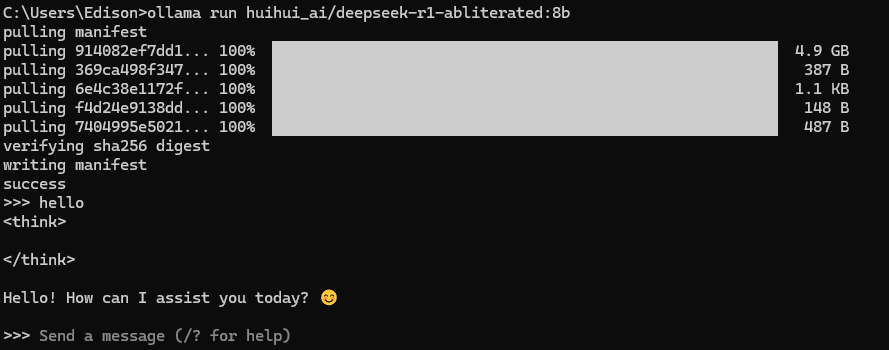
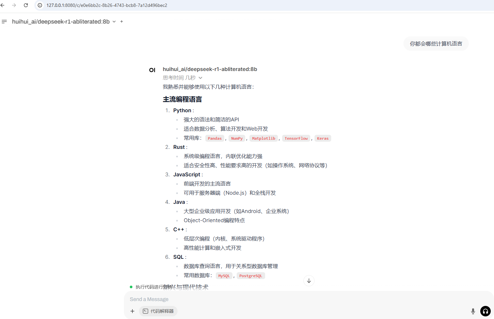

## 本地运行AI模型的最简单方法 

本地运行AI模型主要分两部分：

1. 运行AI模型的后端服务
2. 处理用户输入交互的前端界面

### Ollama运行AI模型

#### Ollama安装配置

2026-03-17 新版本Ollama与以前安装有差异

1. 在命令行执行 `OllamaSetup.exe /DIR="D:\Program\Ollama"`，后面的DIR参数用来指定Ollama的安装位置
2. 可以直接按窗口程序中设置模型的位置

#### AMD显卡配置

以我的电脑AMD 6650 XT 8G显卡为例：

1. 下载[ollama-windows-amd64.7z](https://github.com/likelovewant/ollama-for-amd/releases/download/v0.5.4/ollama-windows-amd64.7z)  ，并解压到`D:\Program Files\ollama-windows-amd64`
2. 由于Ollama默认不[支持](https://ollama.com/blog/amd-preview) 6650XT  ，所以需要使用对应显卡内核编译好的的库，例如6650的内核为gfx1032.可以从  https://rocm.docs.amd.com/projects/install-on-windows/en/develop/reference/system-requirements.html 查看
3. 在 https://github.com/likelovewant/ROCmLibs-for-gfx1103-AMD780M-APU/releases 下载适用于gfx1032的版本[rocm.gfx1032.for.hip.sdk.6.1.2.7z](https://github.com/likelovewant/ROCmLibs-for-gfx1103-AMD780M-APU/releases/download/v0.6.1.2/rocm.gfx1032.for.hip.sdk.6.1.2.7z) 也可以尝试最新版本
4. 下载AMD的HIP SDK https://www.amd.com/en/developer/resources/rocm-hub/hip-sdk.html ，之前下载的是6.1.2版本，所以SDK也要下载6.1.2版本. HIP SDK可以简单理解为AMD的CUDA平替
5. 安装HIP SDK后，把下载的rocm.gfx1032.for.hip.sdk.6.1.2中的文件覆盖 `C:\Program Files\AMD\ROCm\6.1\bin`目录中的`rocblas.dll`和`C:\Program Files\AMD\ROCm\6.1\bin\rocblas\library`目录
6. 使用rocm.gfx1032.for.hip.sdk.6.1.2的文件替换ollama安装目录的`rocblas.dll`和`D:\Program Files\ollama-windows-amd64\lib\ollama\rocblas\library`目录
7. 在Ollama目录中运行`ollama serve`，可以看到输出日志`msg="inference compute" id=0 library=rocm variant="" compute=gfx1032 driver=6.2 name="AMD Radeon RX 6650 XT" total="8.0 GiB" available="7.8 GiB"`说明可以以显卡来运行ollama中的模型
8. 配置ollama的模型默认安装位置（默认C盘用户目录下的`.ollama`）,新增环境变量`OLLAMA_MODELS`，值为想要放置模型的目录`D:\ollama`
9. 执行`ollama run huihui_ai/deepseek-r1-abliterated:8b` 安装`deepseek-r1-abliterated`的模型，也可以在ollama官网安装想用的其他模型，安装完成后，就可以在命令提示符中执行进行对话
  
  

### 对话交互UI

Ollama可以直接和[Open-webUI]( https://www.openwebui.com/ )配合使用，默认不需要任何配置。https://github.com/open-webui/open-webui

#### 安装open webUI

1. 安装python 3.11以上版本，我使用`Python 3.12.2 (tags/v3.12.2:6abddd9, Feb  6 2024, 21:26:36) [MSC v.1937 64 bit (AMD64)] on win32`也是可行的
2. 安装`pip install open-webui` 这个步骤持续时间很长
3. 运行`open-webui serve`
4. 浏览器中http://127.0.0.1:8080/ 访问时，提示注册一个本地用户，随便注册就行

