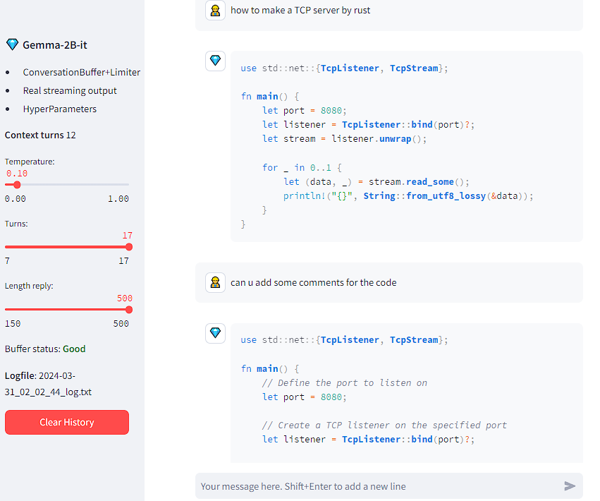
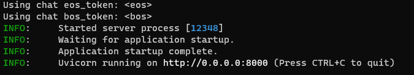
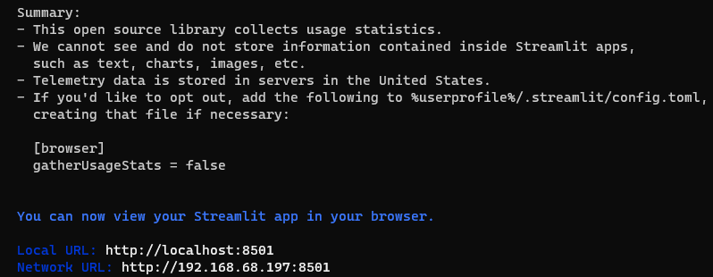
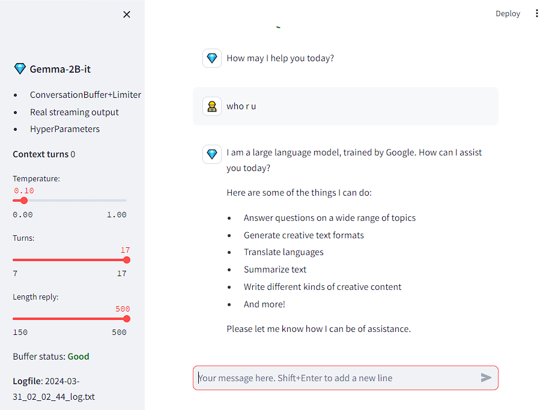
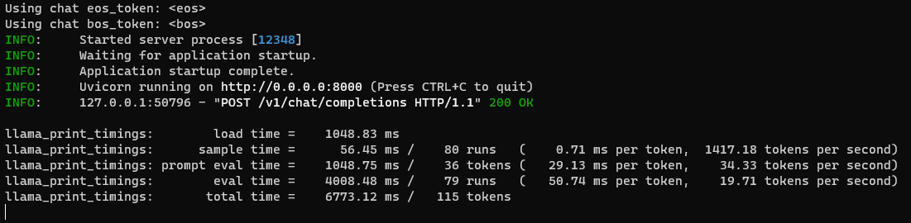

## Run Google Gemma 2B Locally 

### 安装运行环境

[llama-cpp-python](/https://llama-cpp-python.readthedocs.io/en/latest/) 是 [llama.cpp](https://github.com/ggerganov/llama.cpp) 库的python封装，后者是使用纯c++实现，目标是最高性能下简化模型使用，。

1. 安装Python 目前的最新版本是3.12
2. 安装VS2019 社区版本 至少是16.8之后的版本
3. 安装`pip install llama-cpp-python`

安装`llama-cpp-python`过程中如果出现编译错误，可能是CMake使用的VS编译器环境有问题，例如我原本安装的VS2019版本是16.4，就会提示编译错误，查资料说是只有16.8版本之后CMake才会自动添加c++11的选项，所以又更新VS2019到最新版本才成功安装。

编译错误

>  C:\Users\Edison\AppData\Local\Temp\pip-install-pqbiggng\llama-cpp-python_db29f2ffd8b54feba23475894b43e080\vendor\llama.cpp\ggml.h(2374,67): error C2146: syntax error: missing ')' before identifier 'x' [C:\Users\Edison\AppData\Local\Temp\tmpvodi10hs\build\vendor\llama.cpp\ggml.vcxproj]

### 下载模型

Google的开源Gemma模型有2B和7B两类，其中2B模型文件相对小且对性能要求也低。基本的对话和编程语言例子都可以提供回答。

https://huggingface.co/ 上有很多上传的GGUF格式的模型文件，直接搜**gemma-2b-it-GGUF**就有很多。我从huggingface的国内镜像站下载的，速度非常快。

https://hf-mirror.com/asedmammad/gemma-2b-it-GGUF/tree/main 这个目录下的`gemma-2b-it.Q5_K_M.gguf`这个模型，大小只有1.77G，相对其他模型小很多。

例如可以让AI回答如何写一个Tcp Server，第一次回答的代码没有注释，可以要求加上注释。不知道7B的效果是不是会更好。

### 模拟Chat

主要参考这个项目[**Gemma2B-ChatAssistant**](https://github.com/fabiomatricardi/Gemma2B-ChatAssistant)

使用`llama-cpp-python` 提供的OpenAI兼容的Server模式，只需要一个简单脚本就可以实现类似ChatGPT网页对话服务。

#### 安装使用的库

1. `pip install llama-cpp-python[server]` 需要额外安装支持服务的库
2. `pip install openai`
3. `pip install streamlit`

#### 运行服务

1. 新建目录AIChat
2. 在AIChat目录中新建名称为model的目录
3. 将下载的`gemma-2b-it.Q5_K_M.gguf`放在model目录中
4. 在AIChat目录中执行`python -m llama_cpp.server --host 0.0.0.0 --model model/gemma-2b-it.Q5_K_M.gguf --n_ctx 16384`，http://localhost:8000/docs 可以查看提供的API服务接口

5. 下载[Gemma2B-it-stChat_API.py](https://github.com/fabiomatricardi/Gemma2B-ChatAssistant/blob/main/Gemma2B-it-stChat_API.py),并修改其代码` {"role": "system", "content": "You are a helpful assistant.",},`中的system为user，否则收到请求时会报`ValueError: System role not supported`错误
6. 再新打开一个终端窗口，运行上一步的py脚本文件`streamlit run .\Gemma2B-it-stChat_API.py`

7. 浏览器中打开`http://localhost:8501/`就可以看到聊天界面，其中还可以做一些简单设置，例如设置字符数量。

8. llama server中可以看到处理消息

