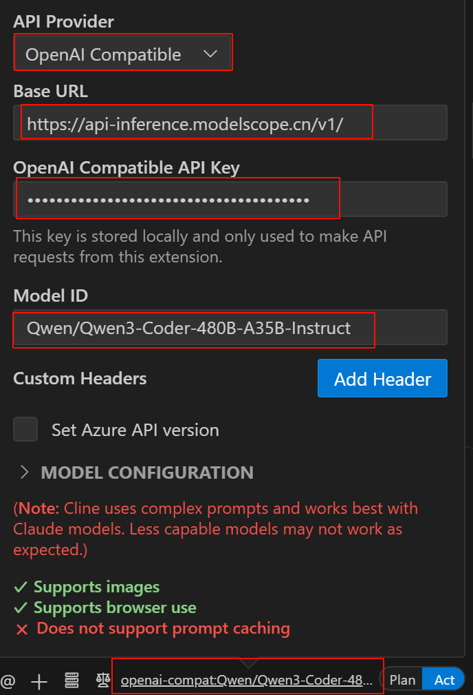
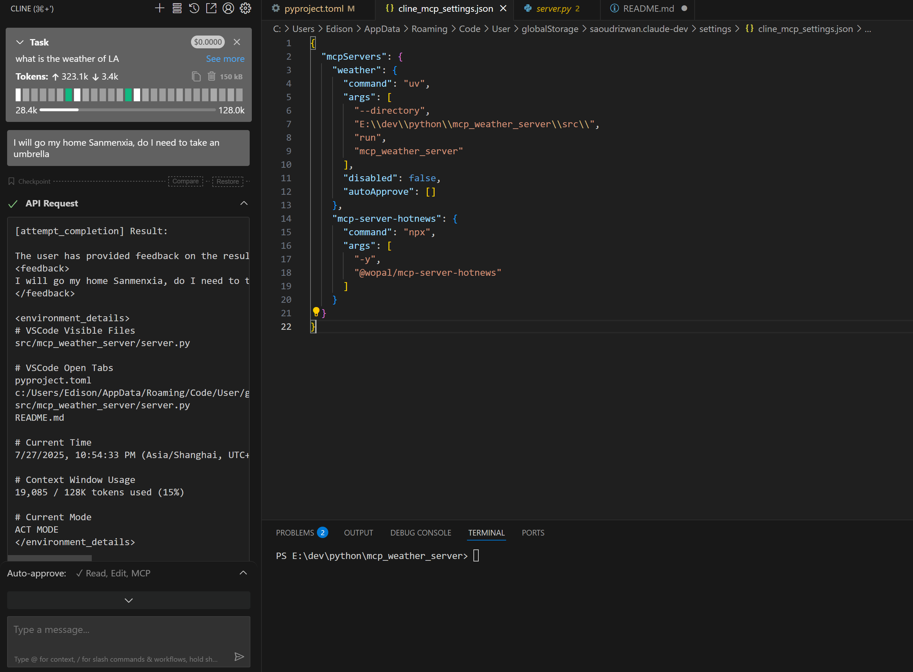
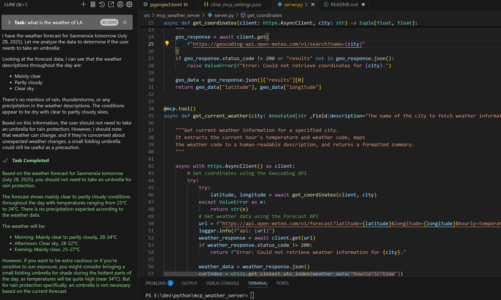

##  VS Code的Cline插件


Cline插件可以直接VS Code插件管理中搜索安装，目前使用效果最好的开源AI助手插件。

### 配置AI模型

#### Qwen3-Coder

1. 魔搭 https://www.modelscope.cn/ 网站注册账号，这个网站上每天可以免费2000次请求

2. 账号设置中绑定阿里的账号

3. 在网站上新建一个访问令牌，名字叫Qwen

4. 在模型库中找到**通义千问3-Coder-480B-A35B-Instruct**

5. 进入模型详细信息页面后，点击右侧的 查看代码范例，顶部选择创建的令牌`token-Qwen`，可以看到以下代码

   ```python
   client = OpenAI(
       base_url='https://api-inference.modelscope.cn/v1/',
       api_key='xxx-my--key', # ModelScope Token
   )

   response = client.chat.completions.create(
       model='Qwen/Qwen3-Coder-480B-A35B-Instruct', # ModelScope Model-Id
   ```

   ​

6. 在VS Code的cline插件中点击最底部的模型，配置一个OpenAI 兼容的模型，地址和key信息都填入上面代码，模型id要完全和代码中的相同 `Qwen/Qwen3-Coder-480B-A35B-Instruct`

   
      

7. 现在可以在对话框中提出需求AI可以自动完成任务，Plan模式只提供方案，要真正让AI实施，需要切换到Act。

### 配置MCP Server

按照Cline官网的说明，只需要对Cline说添加mcp server 后面跟mcp server的github地址即可。实际试了一下的确可以自动添加，并在当前目录下clone一份server的代码到本地，自动配置`cline_mcp_settings.json`文件。这个文件的位置在 `AppData\Roaming\Code\User\globalStorage\saoudrizwan.claude-dev\settings`目录下

MCP Server列表：

* Github上的MCP Server合集地址 https://github.com/modelcontextprotocol/servers
* mcpservers.org 
* mcp.so
* https://www.modelscope.cn/mcp

#### 天气MCP Server

以Github上的天气MCP Server为例，地址https://github.com/isdaniel/mcp_weather_server 。这个项目使用https://open-meteo.com/ 网站的两个API来查询天气。

1. 通过城市名称获取城市的经度和维度
2. 获取具体地理坐标位置的天气情况

##### 直接配置

通过在聊天窗口直接说添加这个mcp，默认生成的配置文件如下，但是无法正常运行。

```json
{
  "mcpServers": {
    "weather": {
      "command": "python",
      "args": [
        "-m",
        "mcp_weather_server"
      ],
      "disabled": false,
      "autoApprove": []
    }    
  }
}
```

参考项目官网说明，这个server可以直接通过`pip install mcp_weather_server`来安装到系统的python环境中，配置后就可以使用提供的3个工具。

在命令提示行下，直接运行`python -m mcp_weather_server`也会报错，这个项目默认使用的是python 3.13，我安装的python是3.12.

##### 本地运行Sever

项目代码下载下来后，发现是可以通过uv来管理的，把`pyproject.toml`中的依赖python 3.13修改为3.12. 在命令行中切换到src目录，执行

```shell
E:\dev\python\mcp_weather_server\src>uv run mcp_weather_server
```

可以正常执行，说明代码没有问题。

可以修改配置文件如下，指定uv在哪个目录下执行，使用uv可以自动激活项目的虚拟环境。

```json
{
  "mcpServers": {
    "weather": {
      "command": "uv",
      "args": [
        "--directory",
        "E:\\dev\\python\\mcp_weather_server\\src\\",
        "run",
        "mcp_weather_server"
      ],
      "disabled": false,
      "autoApprove": []
    },
    "mcp-server-hotnews": {
      "command": "npx",
      "args": [
        "-y",
        "@wopal/mcp-server-hotnews"
      ]
    }
  }
}
```

   配置没有出错后，就可以在聊天窗口中问有关天气相关的问题，例如明天去某个地方是否需要打伞？
      

LLM通过分析可以使用weather mcp来根据天气情况是否需要带伞，根据最后绿色文字的结论，它甚至提醒如果我对太阳暴晒比较敏感可以带一把折叠伞，因为明天晴天温度很高，但是雨伞不是必须的，因为明天预报没有雨。


   
      