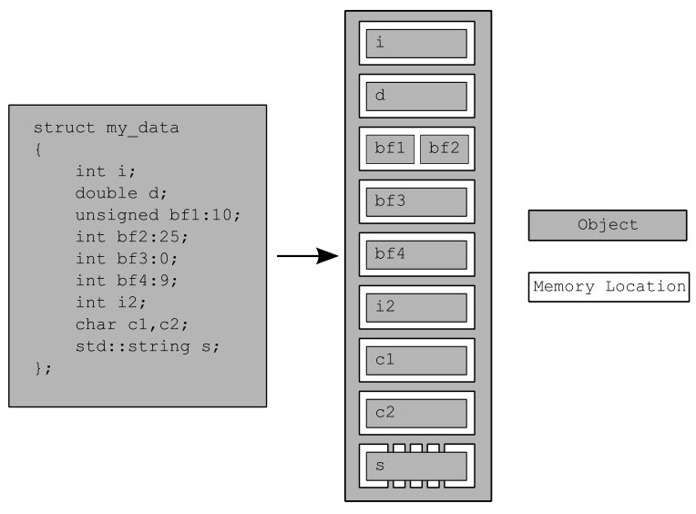
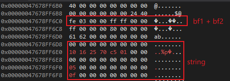

## C++并发编程-内存模型

 C++ Concurrency in Action 2nd **Chapter-5**

### 内存模型

只有了解了对象在内存中的布局方式，才能理解锁，互斥量这些的工作原理

#### 对象在内存中的布局

对象是一块内存区域，同时它还有一些属性，例如类型和生命周期。例如int类型的变量就是占用4字节连续内存的整型对象。

**内存位置**：无论什么样的类型都会存储在一个确定的位置上。**标量类型**或一段**bit field**类型都有自己的内存位置。虽然一个结构中的相邻bit field是不同的子对象，但是他们都在同一个内存位置上。

C++中的**标量类型**是指整型，浮点型，指针，枚举，成员指针以及空指针(std::nullptr_t)。https://cplusplus.com/reference/type_traits/is_scalar/

* 每一个变量都是一个对象
* 每个对象至少占用一个内存位置
* 基础数据类型无论大小，例如int或char各会占用一个内存位置，数组中的各个元素占用不同的位置。
* 相邻的bit位域是一个内存位置

，，基础数据类

```c++
struct my_data
{
    int i;
    double d;
    unsigned int bf1:10;
    int bf2:25;
    int    :0; // 用来分隔两个位域的内存位置
    int bf4:9;
    int i2;
    char c1, c2;
    std::string s;
};

my_data data;
memset(&data, 0, sizeof(my_data));
data.i = 64;
data.d = 10;
data.bf1 = 0x03FE;
data.bf2 = 0xFFFF;
data.bf4 = 0xFF;
data.i2 = 128;
data.c1 = 'a';
data.c2 = 'b';
data.s = "hello";
```

结构体中bf1和bf2有相同的内存位置，位域宽度为0时不能有名字，书中代码b3不能编译通过。这个结构体一共有9个内存位置，图中的白色框。




上面的例子中代码在vs2019 64位程序中的地址，8个字节对齐，第一行是第一个成员i的内存位置。第三行是bf1和bf2的内存位置。最后一段是string类型的内存位置共40字节。




#### 多线程访问内存位置

多个线程访问不同的内存位置是没有问题的。多个线程都是读取同一个内存位置，也没有问题。如果两个线程访问同一个内存地址没有强制的顺序，且其中一个或两个访问都不是原子的，并且其中一个或两个都是写操作，那么这就是数据竞争，会导致未定义的行为。

#### 并发修改对象内存

### 原子操作和类型

### 同步操作


