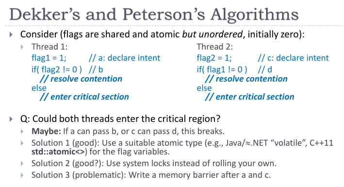
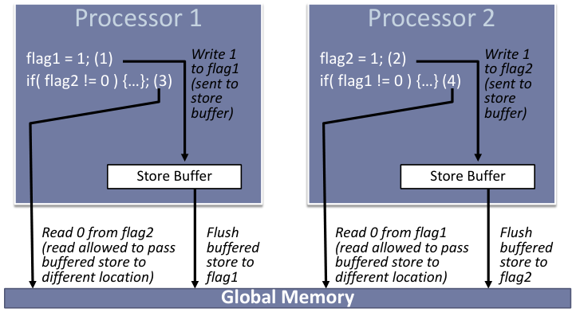

## C++并发编程-内存模型

 C++ Concurrency in Action 2nd **Chapter-5** 书的这一章讲解有点粗略。其实C++参考官网的说明就很不错[Memory model](https://en.cppreference.com/w/cpp/language/memory_model)

### 内存模型

c++11提供了多线程的机制，为了解决多线程数据竞争，标准定义了对象的内存模型，主要包括对象在内存位置，内存顺序，原子操作。这里的内存模型主要是针对多线程并发访问，而不是字节对齐。

#### 内存位置

对象是一块内存区域，同时它还有一些属性，例如类型和生命周期。例如int类型的变量就是占用4字节连续内存的整型对象。

字节是内存中有自己地址的最小单位，它可以是8bit或更多位数。一个字节的位数可以使用`std::numeric_limits<unsigned char>::digits`获取。

**内存位置**：无论什么样的类型变量都会存储在一个确定的位置上。**标量类型**对象或一段非0的**bit field**类型都有自己的内存位置。虽然一个结构中的相邻bit field是不同的子对象，但是他们都在同一个内存位置上。

C++中的**标量类型**是指整型，浮点型，指针，枚举，成员指针以及空指针(std::nullptr_t)。https://cplusplus.com/reference/type_traits/is_scalar/

* 每一个变量都是一个对象
* 每个对象至少占用一个内存位置
* 基础数据类型无论大小，例如int或char各会占用一个内存位置，数组中的各个元素占用不同的位置。
* 相邻的bit位域是一个内存位置

下面的结构体每一个基础类型都有一个自己的内存地址

```c++
struct my_data
{
    int i; // memory location #1
    double d; // memory location #2
    unsigned int bf1:10; // memory location #3
    int bf2:25; // memory location #3
    int    :0; // 用来分隔两个位域的内存位置
    int bf4:9; // memory location #4
    int i2; // memory location #5
    char c1, c2; // memory location #6,7
    std::string s; // memory location #8
}; // 整个结构体有8个独立的内存地址

my_data data;
memset(&data, 0, sizeof(my_data));
data.i = 64;
data.d = 10;
data.bf1 = 0x03FE;
data.bf2 = 0xFFFF;
data.bf4 = 0xFF;
data.i2 = 128;
data.c1 = 'a';
data.c2 = 'b';
data.s = "hello";
```

结构体中bf1和bf2有相同的内存位置，位域宽度为0时不能有名字，书中代码b3不能编译通过。这个结构体一共有9个内存位置，图中的白色框。


上面的例子中代码在vs2019 64位程序中的地址，8个字节对齐，第一行是第一个成员i的内存位置。第三行是bf1和bf2的内存位置。最后一段是string类型的内存位置共40字节。


#### 多线程访问内存位置

多个线程可以并发的访问不同的**内存位置**，并且不用考虑同步和相互干扰。多个线程都是读取同一个内存位置，也没有问题。

当一段程序代码(an expression)修改了一个内存位置，另一段程序会读取或修改这个相同的内存位置，这两个程序代码就存在冲突(conflict)。并且这两段代码会产生**数据竞争**，除非：

 * 这两段代码在同一个线程中或同一个信号句柄([signal handler](https://en.cppreference.com/w/cpp/utility/program/signal#Signal_handler))中
 * 这两段代码操作都是原子操作[std::atomic](https://en.cppreference.com/w/cpp/atomic/atomic)
 * 其中一段代码一定发生在另一段代码执行之前(happens-before)[std::memory_order](https://en.cppreference.com/w/cpp/atomic/memory_order)

即如果两个线程访问同一个内存地址没有强制的顺序，且他们的访问都不是原子的，并且其中一个或两个都是写操作，那么这就是数据竞争，会导致未定义的行为。

#### 原子操作

原子操作是不可再分的操作，不会看到这个操作只执行了一半的情况。要么做了，要么没做。

如果一个读取一个对象值的操作是原子的，所有对这个对象的修改也是原子的，那么都操作就能获取到这个对象修改后的值，而不是中间过程的随机值。

例如对一个整数执行++操作就不是原子的。

```c++
int g = 0;
void add(int num) {
    g++;
}
```

对应的汇编中执行了3步才完成，cpu可能在第3步前进行了线程切换，如果这时有其他线程把全局变量或内存变量g的值改为100了，等cpu恢复这个线程栈时，eax的值还是1，再执行第3步，又会把g的值改为1，而不是100。导致另一个线程的更改无效。

```asm
add(int):
        push    rbp
        mov     rbp, rsp
        mov     DWORD PTR [rbp-4], edi
        mov     eax, DWORD PTR g[rip] // 1. 把g的值放入eax
        add     eax, 1                // 2. eax值增加1
        mov     DWORD PTR g[rip], eax // 3. 把eax中的值给变量g
        nop
        pop     rbp
        ret
```

可以在这个网站实时生成汇编代码https://godbolt.org/。

使用atomic类型后

```c++
std::atomic<int> g(5);
void add(int num) {
    g++;
}
```

对应的汇编中对g的修改没有中间的拷贝到寄存器的过程，直接修改了值，所以这里的g++就是原子操作，当有多个线程执行这句代码，也不会产生数据竞争。

```asm
add(int):
        push    rbp
        mov     rbp, rsp
        sub     rsp, 16
        mov     DWORD PTR [rbp-4], edi
        mov     esi, 0
        mov     edi, OFFSET FLAT:g  // 把g的地址写入edi
        call    std::__atomic_base<int>::operator++(int) // 修改值在一步完成，要么没改，要么改了
        nop
        leave
        ret
```

#### Atomic和Mutex比较

Atomics：适用于对共享数据的操作比较简单，一般一条指令就能执行完成，例如累加，交换数据，更新一个标记。相对而言它更轻量级，负载更小，适合对性能关注的场景。

Mutex：提供了同步机制可以让同一个时刻只有一个线程有权访问共享数据。它适用于关键区中的代码比较复杂，不是一个原子操作就能完成的情况。它相对有更高的负载，因为有上下文切换，等待的线程要一直查询是否可以访问了。

#### 内存顺序

内存顺序主要定义了多个线程对同一个内存位置的访问顺序。`std::memory_order` 和标准库的原子操作配合使用。当多个线程同时读或写几个变量时，其中一个线程看到这些变量的值的变化顺序可能与修改这些变量的线程执行的顺序不同。默认情况下，标准库的所有原子操作都是顺序一致的(*sequentially consistent ordering*)，它是最严格的，所以存在一定的性能损失，所以标准库还提供了其他的内存顺序，一共有6种。

这里的一致可以理解为程序实际运行的顺序和代码内容的顺序一致，通过设置不同的内存顺序，要求编译器和硬件按我们要求的顺序修改共享内存资源。

《C++ Concurrency in Action》书里写了一堆很绕的话，c++每一个对象从它初始化开始，各个线程对它的修改都会定义一个顺序。程序的每次执行顺序可能都不同，但是在程序的一次运行内，所有的线程都必须遵循这个顺序。如果数据类型不是标准库的原子类型，还需要确保使用同步机制让所有线程都遵循相同的顺序更改来更改数据，如果不同的线程看到一个变量值更改的顺序是不同的，那就是数据竞争，会产生未定义行为。也可以看官方文档[memory_order](https://en.cppreference.com/w/cpp/atomic/memory_order)，其中有几种顺序的例子。

#### C++ 6种内存顺序

《C++ Concurrency in Action》把内存顺序放在了5.3同步操作里面详细介绍了。

##### Relaxed ordering

这种顺序只保证这个操作的原子性，但不保证并发内存访问的顺序。它主要用在累加计数器，例如智能指针中增加引用计数，因为这个场景只关心数据增加操作的原子性，不管有多少个线程同时增加这个变量，因为原子操作的不可分割性，它的值一定会增加完成，不会出现值在线程1被改了一半，保存上下文，切换到另一个线程2修改值，等线程1再切换回来 ，把线程1保存的值又给了变量，导致线程2的修改被冲掉了。但是智能指针减引用计数就不能用这个relaxed order，因为因为它需要和对象的析构进行同步，不能先执行析构，在修改计数的值，这样会导致多次析构调用，这种情况下需要用Acquire-Release order。

下面的例子中， 原子类型的x和y的初始值都为0，在两个线程都执行完后可能出现`r1 == r2 == 42` 的结果。因为虽然A在B之前执行，C在D之前执行，但是可能存在D在A之前执行，修改y的值为42，B又在C之前执行，修改x的值为42。当编译器重排执行顺序后，就可能存在D可能在C之前就已经执行完了。

```c++
// Thread 1:
r1 = y.load(std::memory_order_relaxed); // A
x.store(r1, std::memory_order_relaxed); // B
// Thread 2:
r2 = x.load(std::memory_order_relaxed); // C 
y.store(42, std::memory_order_relaxed); // D
```

例如下面的代码一定能保证多个线程并发累加数字的正确性，因为每一个线程的每一次加法操作都是原子的，线程之间也不需要关心执行顺序和同步。

```c++
std::atomic<int> cnt = { 0 };

void f()
{
    for (int n = 0; n < 1000; ++n)
        cnt.fetch_add(1, std::memory_order_relaxed);
}

int main()
{
    std::vector<std::thread> v;
    for (int n = 0; n < 10; ++n)
        v.emplace_back(f);
    for (auto& t : v)
        t.join();
    std::cout << "Final counter value is " << cnt << '\n';
}
```

### 同步操作


### Atomic Weapons: The C++ Memory Model and Modern Hardware

Herb Sutter在cppcon上讲的 [atomic Weapons: The C++ Memory Model and Modern Hardware](https://herbsutter.com/2013/02/11/atomic-weapons-the-c-memory-model-and-modern-hardware/) 非常值得一看，B站有搬运 [C++ and Beyond 2012: Herb Sutter - atomic Weapons](https://www.bilibili.com/video/BV1DL41117rr/) 演讲对应的slide的 [link](https://1drv.ms/b/s!Aq0V7yDPsIZOgcI0y2P8R-VifbnTtw)

#### 程序是否如你所写一样执行？

**Sequential consistency(SC)** 程序的执行如代码所写的顺序。

**Race condition** 一个内存位置被多个线程访问，并且至少有一个线程会写这个内存位置

我们都希望自己的程序按编写的顺序执行，但是处理器(prefetch, speculation, overlap writes, HTM )，缓存(store buffers, private shared caches)，以及编译器(subexpr elimination, reg allocation, STM)看到我们的程序，为了提高执行效率会有它的优化。

**Sequential consistency for data race free programs (SC-DRF)** 只要程序中没有数据竞争的情况，硬件就能保证按代码编写的顺序执行。 这个原则就像是硬件和软件程序之间的协议。

##### 硬件

CPU的速度比内存的速度快太多，所以它有多级缓存用来提高程序的执行效率，当CPU执行完一个计算后，会先把这个数据放入缓存中，立即执行后续的指令，对于单线程的程序没有问题，但是多线程的程序，可能出现实际的执行和预期不一致的情况。

例如两个线程中，分别有一个标记变量用来标识自己是否进入了关键区，当一个线程进入关键区时，先设置自己的标记，**然后**检查对方是否已经在关键区了，如果没有，就执行自己的代码。




这里特别强调了然后这个词，因为cpu在执行完给flag1赋值，会先把这个值送给缓存，因为内存操作太慢，它还可以执行其他事情，例如执行判断flag2是否被设置了。如果执行线程2的另一个处理器和它有相同的操作，此时flag2的值可能写入也可能没有写入内存中，这样这个条件就可能true也可能false，程序的顺序就不一致了。




##### 编译器

对于单线程情况下，很多编译器的优化都没有问题，因为最终执行的结果都是相同的。

例如

```c++
x = 1;
y = "universe";
x = 2;
```

因为x在被赋值2之前没有被使用，所以可以被优化为

```c++
y = "universe";
x = 2;
```

以下循环语句

```c++
for (size_t i = 0; i < count; i++)
{
    z += array[i];
}
```

局部变量z可以通过使用寄存器变量，减少内存访问次数，在循环结束后，再给z赋值

```c++
r1 = z;
for (size_t i = 0; i < count; i++)
{
    r1 += array[i];
}
z = r1;
```

再例如由于代码执行的上下文，z变量可能之前刚被使用过，所以编译器可以先执行z的赋值

```c++
x = "life";
y = "universe";
z = "everything";
// 改为按以下顺序执行
z = "everything";
x = "life";
y = "universe";
```

循环语句的优化会调整循环遍历的行和列的顺序

```c++
for (size_t i = 0; i < rows; i++)
    for (size_t j = 0; j < cols; j++)
        a[j*rows + i] += 42;

// 为了提高执行效率会被优化为，这里j*row的执行次数会少
for (size_t j = 0; j < cols; j++)
    for (size_t i = 0; i < rows; i++)    
        a[j*rows + i] += 42;
```

编译器只知道一个线程中内存位置的操作和变量的别名，它不知道哪些内存位置是可变的共享变量，这些共享变量可能被其他线程异步更改。所以需要我们告诉它哪些内存位置是可变的共享变量，例如使用mutex。

##### 事务

原子性：全部发生或没有发生，没有中间状态

一致性：读取出来的数据都是一致的

独立性：在同一个数据上其他事务也正确

##### 关键区

```c++
// mutex
{ lock_guard<mutex> hold(mut_x); // enter critical region (lock “acquire”)
	… read/write x …
}// exit critical region (lock “release”)

// Orderd atomics
while( whose_turn != me ) { } // enter critical region (atomic read “acquires” value)
… read/write x …
whose_turn = someone_else; // exit critical region (atomic write “release”)
```

lock acquire 和 lock release之间是关键区，关键区中的代码不能移出关键区，例如对x的读写不能移到保护的外面。

```c++
x = "life"
mut.lock(); // lock “acquire”
y = "universe";
mut.unlock(); // lock “release”
z = "everything";

// 可以把x和z的语句移入关键区
mut.lock(); // lock “acquire”
z = "everything";
y = "universe";
x = "life"
mut.unlock(); // lock “release”
```

但是不能把x放在关键区release之后，不能把z放在关键区acquire之前。另一个线程获取到锁后，访问y的时候可能会依赖于x已经被赋值了，同理z也不能移到关键区之前。

所以关键区形成了一个单向的屏障。A release store makes its prior accesses visible to a thread preforming an acquire load that sees that store.