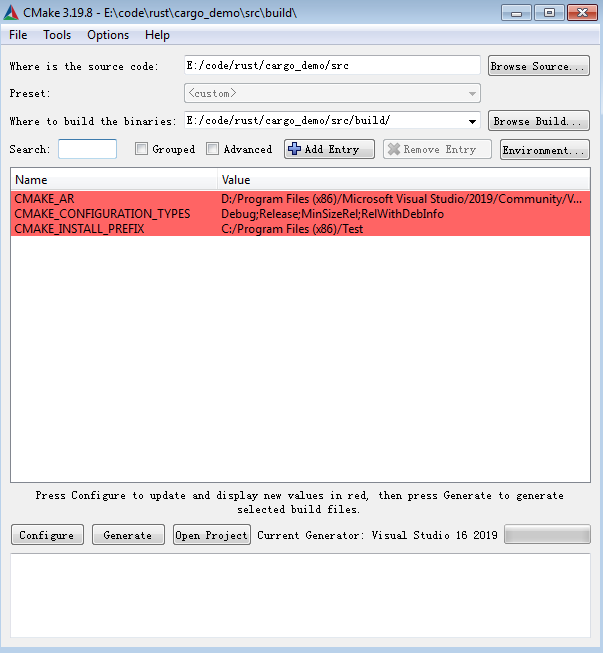

## CMake 基本使用 
[Mastering CMake](https://cmake.org/cmake/help/book/mastering-cmake/chapter/Getting%20Started.html) 这个也是官网文档，比官方教程内容更好理解。

CMakeLists.txt是cmake的工程配置文件，一般把CMakeLists.txt文件放在工程根目录，同时新建一个Build目录，所有生成的工程文件都放在Build目录中，清除工程文件时，直接删除Build目录中的内容。

### 基本步骤

1. 给工程定义一个或多个CMakeLists.txt文件
2. 使用cmake命令生成目标工程文件vcproject/makefile
3. 使用工程文件编译工程

#### CMakeLists.txt

`CMakeLists.txt`是cmake的主文件，其中定义兼容的最小版本，工程的基本信息.这个文件一般在工程根目录。

```cmake
# always first line
cmake_minimum_required (VERSION 3.19)

# Projcet name and version
project (Test)

# output and dependency
add_executable(Test main.cpp)
```

#### 生成目标工程

在工程的目录新建build目录，到build目录中执行`cmake ..`生成工程文件。前两步也可以使用cmake自带的gui工具，linux平台依赖Curses进程名为ccmake。生成的工程文件会在build目录中，如果要清理工程，只需要把build目录清空即可。

```powershell
PS E:\code\rust\cargo_demo\src\build> cmake ..
-- Building for: Visual Studio 16 2019
-- Selecting Windows SDK version 10.0.18362.0 to target Windows 6.1.7601.
-- The C compiler identification is MSVC 19.26.28806.0
-- The CXX compiler identification is MSVC 19.26.28806.0
-- Detecting C compiler ABI info
-- Detecting C compiler ABI info - done
-- Check for working C compiler: D:/Program Files (x86)/Microsoft Visual Studio/2019/Community/VC/Tools/MSVC/14.26.28801/bin/Hostx64/x64/cl.exe - skipped
-- Detecting C compile features
-- Detecting C compile features - done
-- Detecting CXX compiler ABI info
-- Detecting CXX compiler ABI info - done
-- Check for working CXX compiler: D:/Program Files (x86)/Microsoft Visual Studio/2019/Community/VC/Tools/MSVC/14.26.28801/bin/Hostx64/x64/cl.exe - skipped
-- Detecting CXX compile features
-- Detecting CXX compile features - done
-- Configuring done
-- Generating done
-- Build files have been written to: E:/code/rust/cargo_demo/src/build
```




#### 编译工程

在build目录中执行`cmake --build .`编译当前生成的工程。生成的目标程序默认在Debug目录

```powershell
PS E:\code\rust\cargo_demo\src\build> cmake --build .
Microsoft (R) Build Engine version 16.6.0+5ff7b0c9e for .NET Framework
Copyright (C) Microsoft Corporation. All rights reserved.

  Checking Build System
  Building Custom Rule E:/code/rust/cargo_demo/src/CMakeLists.txt
  main.cpp
  Test.vcxproj -> E:\code\rust\cargo_demo\src\build\Debug\Test.exe
  Building Custom Rule E:/code/rust/cargo_demo/src/CMakeLists.txt
```

### CMake配置

#### 编译器配置

编译器配置有三种方式，优先推荐Generator的方式

* 使用Generator
* 使用环境变量
* 使用cache entry

##### Generator

使用`cmake -G`可以查看当前cmake支持的Generator。cmake会根据不同的Generator遵循对应的编译惯例

##### 环境变量

`CMAKE_C_COMPILER`指定C的编译器

`CMAKE_CXX_COMPILER`指定C++的编译器

#### 交叉编译

cmake默认都是编译native的工程，交叉编译其他平台的程序时，需要额外信息告诉cmake编译器和运行库等。

交叉编译中，执行编译系统称为Host，运行程序的系统称为Target

##### 工具链配置

交叉编译需要指定交叉编译工具链，一般可以通过单独的一个toolchain文件说明目标程序的编译器，依赖库目录等。

例如创建一个`toolchain.cmake`文件用来编译运行在RaspberryPi的程序。

```cmake
# the name of the target operating system
set(CMAKE_SYSTEM_NAME linux)
# This variable is optional,当对不同的处理器需要配置不同的编译选项时，才需要配置
set(CMAKE_SYSTEM_PROCESSOR arm)

# which compilers to use for C and C++
set(CMAKE_C_COMPILER   "D:/SysGCC/raspberry/bin/arm-linux-gnueabihf-gcc.exe")
set(CMAKE_CXX_COMPILER "D:/SysGCC/raspberry/bin/arm-linux-gnueabihf-g++.exe")

# adjust the default behavior of the FIND_XXX() commands:
# search programs in the host environment
set(CMAKE_FIND_ROOT_PATH_MODE_PROGRAM NEVER)

# search headers and libraries in the target environment
set(CMAKE_FIND_ROOT_PATH_MODE_LIBRARY ONLY)
set(CMAKE_FIND_ROOT_PATH_MODE_INCLUDE ONLY)
```

指定编译器时最好用引号括起来，windows的目录需要使用`/`不能使用`\`会被解析为转义字符，这样这个工具链配置文件就固定生成给RaspberryPi使用的程序。工具链文件可以放在一个公共目录下，这样所有的工程都可以复用这个工具链配置

##### 生成工程文件 

```powershell
cmake -G"Unix Makefiles" -DCMAKE_TOOLCHAIN_FILE=../toolchain.cmake -DCMAKE_BUILD_TYPE=Debug ..
```

其中使用`-DCMAKE_TOOLCHAIN_FILE`指定工具链文件，`-G"Unix Makefiles"`说明生成makefile类型的工程

```powershell
E:\code\rust\cargo_demo\src\build_linux>cmake -G"Unix Makefiles" -DCMAKE_TOOLCHAIN_FILE=
../toolchain.cmake -DCMAKE_BUILD_TYPE=Debug ..
-- The C compiler identification is GNU 10.2.1
-- The CXX compiler identification is GNU 10.2.1
-- Detecting C compiler ABI info
-- Detecting C compiler ABI info - done
-- Check for working C compiler: D:/SysGCC/raspberry/bin/arm-linux-gnueabihf-gcc.exe - s
kipped
-- Detecting C compile features
-- Detecting C compile features - done
-- Detecting CXX compiler ABI info
-- Detecting CXX compiler ABI info - done
-- Check for working CXX compiler: D:/SysGCC/raspberry/bin/arm-linux-gnueabihf-g++.exe -
 skipped
-- Detecting CXX compile features
-- Detecting CXX compile features - done
-- Configuring done
-- Generating done
-- Build files have been written to: E:/code/rust/cargo_demo/src/build_linux
```

生成makefile文件之后，可以在build_linux目录中执行`cmake --build .`来生成最终的目标程序

```powershell
E:\code\rust\cargo_demo\src\build_linux>cmake --build .
Scanning dependencies of target Test
[ 50%] Building CXX object CMakeFiles/Test.dir/main.cpp.o
[100%] Linking CXX executable Test
[100%] Built target Test
```

把生成的Test程序传到之前的RaspberryPi的虚拟机中可以正常执行。

```shell
pi@raspberrypi:~ $ chmod +x Test
pi@raspberrypi:~ $ ./Test
The final price is: 8.4
```


