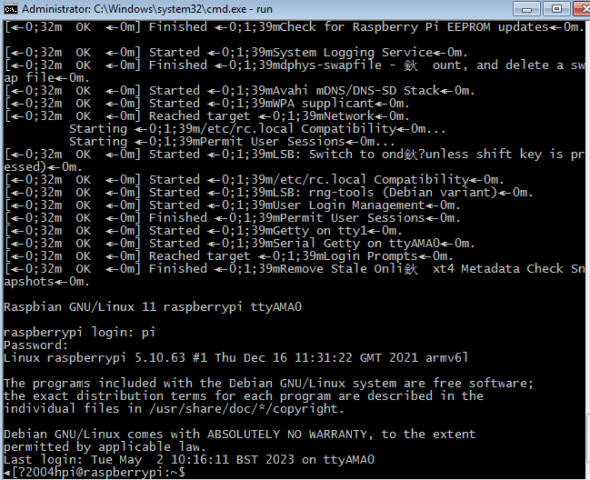
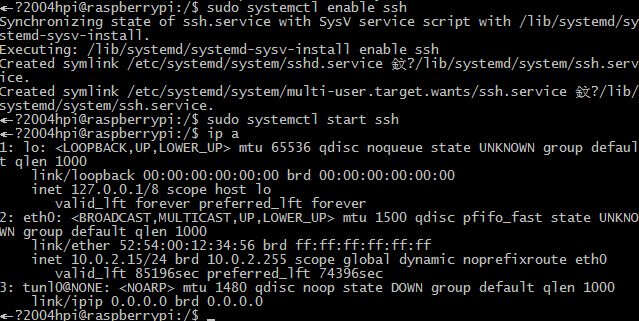
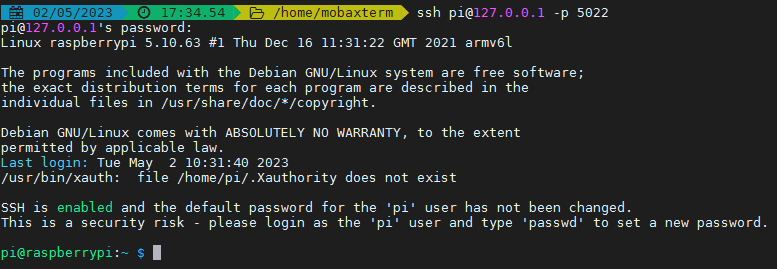
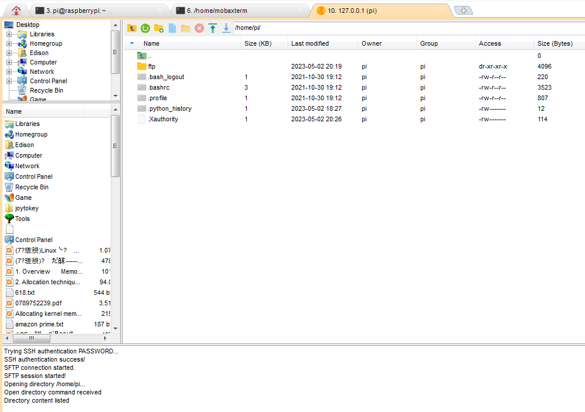

## Raspberry Pi on Windows

### Qemu on windows

#### install Qemu for windows
https://qemu.weilnetz.de/w64/ 下载打包好的[windows安装包](https://qemu.weilnetz.de/w64/qemu-w64-setup-20230424.exe)

下载的最新版本运行时提示`api-ms-win-core-path-l1-1-0.dll`错误!

网站上说从2022年开始的版本不支持windows7系统了，我的电脑还是2011年的win7系统

### Raspberry Pi 

#### 内核

https://github.com/dhruvvyas90/qemu-rpi-kernel 提供了编译好的内核，RaspberryPi的最新版本是bulleye，所以下载其中的[kernel-qemu-5.10.63-bullseye](https://github.com/dhruvvyas90/qemu-rpi-kernel/blob/master/kernel-qemu-5.10.63-bullseye)和[versatile-pb-bullseye-5.10.63.dtb](https://github.com/dhruvvyas90/qemu-rpi-kernel/blob/master/versatile-pb-bullseye-5.10.63.dtb)

https://github.com/dhruvvyas90/qemu-rpi-kernel/tree/master/native-emulation 给出了使用RaspBerryPi官方的image文件中提取内核的方法

https://github.com/dhruvvyas90/qemu-rpi-kernel/tree/master/tools 给出了自己编译内核的方法和配置脚本

#### 系统镜像

https://www.raspberrypi.com/software/operating-systems/

由于下载的内核文件是5.10.63版本，所以系统镜像文件不能是最新版本，最好是匹配的版本。

https://downloads.raspberrypi.org/raspios_lite_armhf/release_notes.txt 版本说明中2021-10-30的版本更新使用的内核是Linux kernel 5.10.63，所以下载对应内核没有桌面的版本 [Raspberry Pi OS Lite](https://downloads.raspberrypi.org/raspios_lite_armhf/images/raspios_lite_armhf-2021-11-08/2021-10-30-raspios-bullseye-armhf-lite.zip)，而不是最新版本。

压缩包只有463M，解压出来的`2021-10-30-raspios-bullseye-armhf-lite.img`大小有1.8G

### Run

windows上可以把命令写入批处理文件执行，不然太长了

```shell
qemu-system-arm -M versatilepb -cpu arm1176 -m 256 -drive "file=2021-10-30-raspios-bullseye-armhf-lite.img,if=none,index=0,media=disk,format=raw,id=disk0" -device "virtio-blk-pci,drive=disk0,disable-modern=on,disable-legacy=off" -net "user,hostfwd=tcp::5022-:22" -dtb versatile-pb-bullseye-5.10.63.dtb -kernel kernel-qemu-5.10.63-bullseye -serial stdio -net nic -append "root=/dev/vda2 panic=1" -no-reboot
```

`hostfwd=tcp::5022-:22`表示将host上的5022端口转发到22端口上，即ssh连接的端口

登录用户名为**pi**，密码为**raspberry**




#### 系统信息

```shell
pi@raspberrypi:~/ftp/code $ dmesg
[    0.000000] CPU: ARMv6-compatible processor [410fb767] revision 7 (ARMv7), cr=00c5387d
[    0.000000] CPU: VIPT aliasing data cache, unknown instruction cache
[    0.000000] OF: fdt: Machine model: ARM Versatile PB
[    0.000000] Memory policy: Data cache writeback
[    0.000000] Zone ranges:
[    0.000000]   Normal   [mem 0x0000000000000000-0x000000000fffffff]
[    0.000000] Movable zone start for each node
[    0.000000] Early memory node ranges
[    0.000000]   node   0: [mem 0x0000000000000000-0x000000000fffffff]
[    0.000000] Initmem setup node 0 [mem 0x0000000000000000-0x000000000fffffff]
[    0.000000] On node 0 totalpages: 65536
[    0.000000]   Normal zone: 576 pages used for memmap
[    0.000000]   Normal zone: 0 pages reserved
[    0.000000]   Normal zone: 65536 pages, LIFO batch:15
[    0.000000] pcpu-alloc: s0 r0 d32768 u32768 alloc=1*32768
[    0.000000] pcpu-alloc: [0] 0
[    0.000000] Built 1 zonelists, mobility grouping on.  Total pages: 64960
[    0.000000] Kernel command line: root=/dev/vda2 panic=1
[    0.000000] Dentry cache hash table entries: 32768 (order: 5, 131072 bytes, linear)
[    0.000000] Inode-cache hash table entries: 16384 (order: 4, 65536 bytes, linear)
[    0.000000] mem auto-init: stack:off, heap alloc:off, heap free:off
[    0.000000] Memory: 250548K/262144K available (6500K kernel code, 273K rwdata, 1608K rodata, 220K init, 171K bss, 11596K reserved, 0K cma-reserved)
[    0.000000] NR_IRQS: 16, nr_irqs: 16, preallocated irqs: 16
[    0.000000] VIC @(ptrval): id 0x00041190, vendor 0x41
[    0.000000] FPGA IRQ chip 0 "interrupt-controller" @ (ptrval), 20 irqs, parent IRQ: 47
[    0.000000] random: get_random_bytes called from start_kernel+0x2ac/0x4cc with crng_init=0
[    0.000000] clocksource: arm,sp804: mask: 0xffffffff max_cycles: 0xffffffff, max_idle_ns: 1911260446275 ns
[    0.000474] sched_clock: 32 bits at 1000kHz, resolution 1000ns, wraps every 2147483647500ns
[    0.001902] Failed to initialize '/amba/timer@101e3000': -22
[    0.002940] sched_clock: 32 bits at 24MHz, resolution 41ns, wraps every 89478484971ns
[    0.010300] Console: colour dummy device 80x30
[    0.016900] printk: console [tty0] enabled
```


### 问题

1. 窗口黑屏不显示内容

   https://github.com/dhruvvyas90/qemu-rpi-kernel/issues/141

   新版的内核和镜像无法在qemu窗口中显示，会提示`Guest has not initialized the display`的信息。所以只能通过`-serial stdio`把串口输出到标准控制台，进行基本的命令行操作。
   
2. 开启ssh服务

   * 执行 `sudo systemctl enable ssh`和`sudo systemctl start ssh`
    
    
   
   * 远程ssh登录到系统`ssh pi@127.0.0.1 -p 5022`
    
    
   
   * 有时候重启无法使用ssh连接上，可以在串口执行`systemctl status sshd`查看服务运行状态
   
    * sftp连接，不清楚为什么ssh可以连接，sftp始终无法连接
    最后通过执行`sudo raspi-config`，使用图形化界面再次打开ssh配置，目前测试只有使用这种方式打开的ssh可以使用sftp连接。
    
    
   
3. 网络连接
	
	qemu默认使用用户态的网络，限制了ICMP协议所以不能用ping命令，更新软件包还是可以的。
	
	对于虚拟机，外部host都通过10.0.2.2访问自己。
	
	完整的网络配置可以参考https://www.qemu.org/docs/master/system/devices/net.html 使用tap网卡的方式。