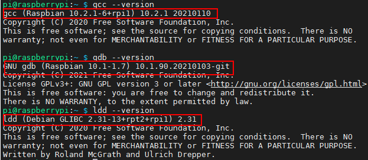
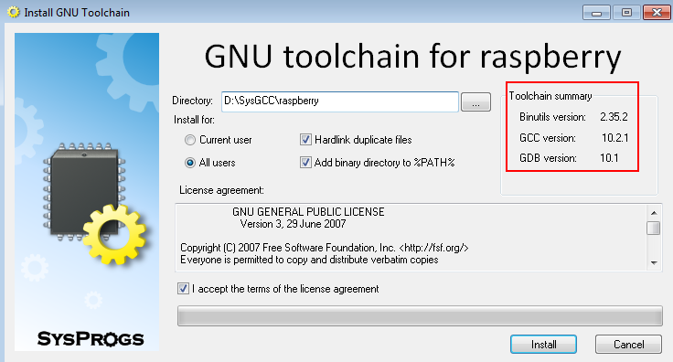
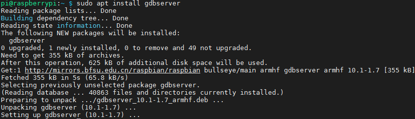
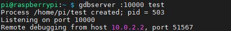
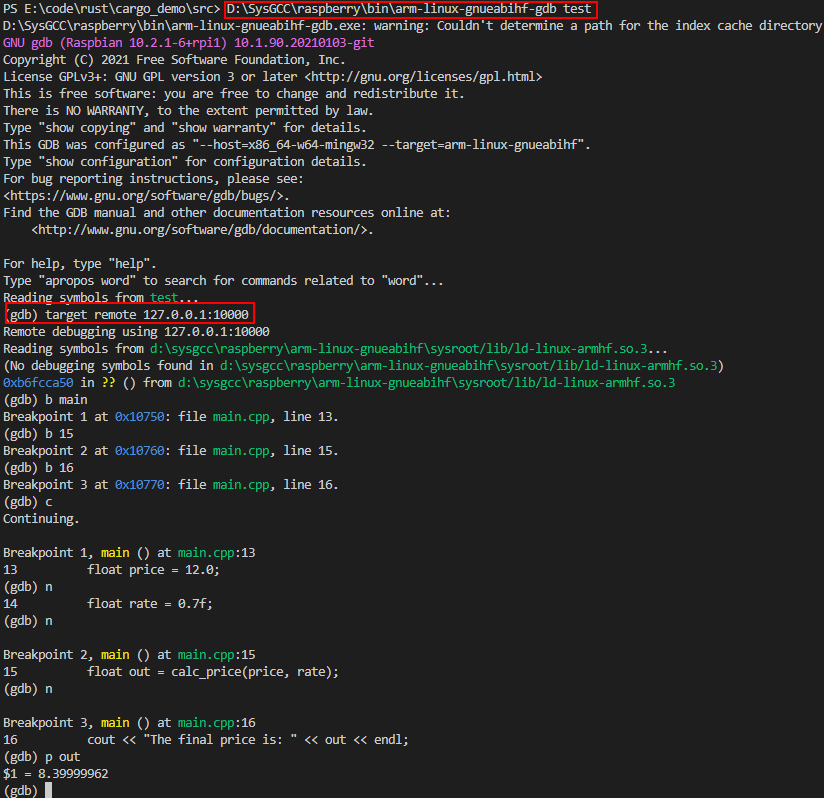

## Raspberry Pi on Windows

### Qemu on windows

#### install Qemu for windows
https://qemu.weilnetz.de/w64/ 下载打包好的[windows安装包](https://qemu.weilnetz.de/w64/qemu-w64-setup-20230424.exe)

下载的最新版本运行时提示`api-ms-win-core-path-l1-1-0.dll`错误!

网站上说从2022年开始的版本不支持windows7系统了，我的电脑还是2011年的win7系统

### Raspberry Pi 

#### 内核

https://github.com/dhruvvyas90/qemu-rpi-kernel 提供了编译好的内核，RaspberryPi的最新版本是bulleye，所以下载其中的[kernel-qemu-5.10.63-bullseye](https://github.com/dhruvvyas90/qemu-rpi-kernel/blob/master/kernel-qemu-5.10.63-bullseye)和[versatile-pb-bullseye-5.10.63.dtb](https://github.com/dhruvvyas90/qemu-rpi-kernel/blob/master/versatile-pb-bullseye-5.10.63.dtb)

https://github.com/dhruvvyas90/qemu-rpi-kernel/tree/master/native-emulation 给出了使用RaspBerryPi官方的image文件中提取内核的方法

https://github.com/dhruvvyas90/qemu-rpi-kernel/tree/master/tools 给出了自己编译内核的方法和配置脚本

#### 系统镜像

https://www.raspberrypi.com/software/operating-systems/

由于下载的内核文件是5.10.63版本，所以系统镜像文件不能是最新版本，最好是匹配的版本。

https://downloads.raspberrypi.org/raspios_lite_armhf/release_notes.txt 版本说明中2021-10-30的版本更新使用的内核是Linux kernel 5.10.63，所以下载对应内核没有桌面的版本 [Raspberry Pi OS Lite](https://downloads.raspberrypi.org/raspios_lite_armhf/images/raspios_lite_armhf-2021-11-08/2021-10-30-raspios-bullseye-armhf-lite.zip)，而不是最新版本。

压缩包只有463M，解压出来的`2021-10-30-raspios-bullseye-armhf-lite.img`大小有1.8G

### Run

windows上可以把命令写入批处理文件执行，不然太长了

```shell
qemu-system-arm -M versatilepb -cpu arm1176 -m 256 -drive "file=2021-10-30-raspios-bullseye-armhf-lite.img,if=none,index=0,media=disk,format=raw,id=disk0" -device "virtio-blk-pci,drive=disk0,disable-modern=on,disable-legacy=off" -net "user,hostfwd=tcp::5022-:22,hostfwd=tcp::10000-:10000" -dtb versatile-pb-bullseye-5.10.63.dtb -kernel kernel-qemu-5.10.63-bullseye -serial stdio -net nic -append "root=/dev/vda2 panic=1" -no-reboot
```

`hostfwd=tcp::5022-:22`表示将host上的5022端口转发到22端口上，即ssh连接的端口

登录用户名为**pi**，密码为**raspberry**


#### 系统信息

```shell
pi@raspberrypi:~ $ uname -a
Linux raspberrypi 5.10.63 #1 Thu Dec 16 11:31:22 GMT 2021 armv6l GNU/Linux
pi@raspberrypi:~ $ lsb_release -a
No LSB modules are available.
Distributor ID: Raspbian
Description:    Raspbian GNU/Linux 11 (bullseye)
Release:        11
Codename:       bullseye
pi@raspberrypi:~ $ getconf LONG_BIT
32
pi@raspberrypi:~ $ dpkg --print-architecture 
armhf
pi@raspberrypi:~/ftp/code $ dmesg
[    0.000000] CPU: ARMv6-compatible processor [410fb767] revision 7 (ARMv7), cr=00c5387d
[    0.000000] CPU: VIPT aliasing data cache, unknown instruction cache
[    0.000000] OF: fdt: Machine model: ARM Versatile PB
[    0.000000] Memory policy: Data cache writeback
```

### 交叉编译

RaspiberryPi中的编译工具版本




#### 编译工具

以前由Linaro维护的编译好的工具链现在都在arm的官网下载。

2022年之后的版本统一在一个页面下载

https://developer.arm.com/Tools%20and%20Software/GNU%20Toolchain

2022年之前的版本分为`A-Profile` [GNU Toolchain for A-profile processors](https://developer.arm.com/tools-and-software/open-source-software/developer-tools/gnu-toolchain/gnu-a/downloads) 和`R-Profile and M-Profile` [GNU Arm Embedded Toolchain](https://developer.arm.com/tools-and-software/open-source-software/developer-tools/gnu-toolchain/gnu-rm/downloads). 需要区分处理器类型分别下载。

A系列的地址 https://developer.arm.com/downloads/-/gnu-a

根据系统中现有的编译器版本为10.2.1，所以下载这个[gcc-arm-10.2-2020.11-mingw-w64-i686-arm-none-linux-gnueabihf.tar.xz](https://armkeil.blob.core.windows.net/developer/Files/downloads/gnu-a/10.2-2020.11/binrel/gcc-arm-10.2-2020.11-mingw-w64-i686-arm-none-linux-gnueabihf.tar.xz)，这个版本下面的release note有说明内部使用的是哪些库版本。

##### 安装配置

编译工具链包括Binutils，GCC和libc库，只需把下载好的编译工具链解压到`D:\armgcc\gcc-arm-10.2-2020.11-mingw-w64-i686-arm-none-linux-gnueabihf`，并把bin加入`path`环境变量`D:\armgcc\gcc-arm-10.2-2020.11-mingw-w64-i686-arm-none-linux-gnueabihf\bin\`，

##### 编译测试程序

https://github.com/BrianSidebotham/arm-tutorial-rpi/blob/master/part-1/readme.md 有说明不同版本的RaspberryPi应该使用什么编译选项。

```shell
arm-none-linux-gnueabihf-g++.exe -o test main.cpp -Ofast -mfpu=vfp -mfloat-abi=hard -march=armv6zk -mtune=arm1176jzf-s
```

由于arm1176使用的是armv6架构，所以编译选项需要配置`-march=armv6zk`

* 如何查看CPU信息 `cat /proc/cpuinfo`

```shell
pi@raspberrypi:~ $ cat /proc/cpuinfo
processor       : 0
model name      : ARMv6-compatible processor rev 7 (v6l)
BogoMIPS        : 577.53
Features        : half thumb fastmult vfp edsp java tls
CPU implementer : 0x41
CPU architecture: 7
CPU variant     : 0x0
CPU part        : 0xb76
CPU revision    : 7
Hardware        : ARM-Versatile (Device Tree Support)
Revision        : 0000
Serial          : 0000000000000000
Model           : ARM Versatile PB
pi@raspberrypi:~ $ uname -m
armv6l
```

但是编译器会报错

```shell
arm-none-linux-gnueabihf\libc\usr\include\wchar.h:318:1: sorry, unimplemented: Thumb-1 hard-float VFP ABI
```

原因是arm官网提供的编译工具链是使用`--with-arch=armv7-a`的所以他支持的最低版本是armv7，不能是armv6，如果把编译选项改为armv7就没有问题了。但是模拟的cpu是armv6的，编译出来的成员在guest环境中运行时，会提示非法的指令，不能执行。以下分别是pi的系统内部gcc的版本信息和下载arm编译工具链的信息。

```shell
pi@raspberrypi:~ $ gcc -v
Using built-in specs.
COLLECT_GCC=gcc
COLLECT_LTO_WRAPPER=/usr/lib/gcc/arm-linux-gnueabihf/10/lto-wrapper
Target: arm-linux-gnueabihf
Configured with: ../src/configure -v --with-pkgversion='Raspbian 10.2.1-6+rpi1' --with-bugurl=file:///usr/share/doc/gcc-10/README.Bugs --enable-languages=c,ada,c++,go,d,fortran,objc,obj-c++,m2 --prefix=/usr --with-gcc-major-version-only --program-suffix=-10 --program-prefix=arm-linux-gnueabihf- --enable-shared --enable-linker-build-id --libexecdir=/usr/lib --without-included-gettext --enable-threads=posix --libdir=/usr/lib --enable-nls --enable-bootstrap --enable-clocale=gnu --enable-libstdcxx-debug --enable-libstdcxx-time=yes --with-default-libstdcxx-abi=new --enable-gnu-unique-object --disable-libitm --disable-libquadmath --disable-libquadmath-support --enable-plugin --with-system-zlib --enable-libphobos-checking=release --with-target-system-zlib=auto --enable-objc-gc=auto --enable-multiarch --disable-sjlj-exceptions --with-arch=armv6 --with-fpu=vfp --with-float=hard --disable-werror --enable-checking=release --build=arm-linux-gnueabihf --host=arm-linux-gnueabihf --target=arm-linux-gnueabihf
Thread model: posix
Supported LTO compression algorithms: zlib zstd
gcc version 10.2.1 20210110 (Raspbian 10.2.1-6+rpi1)
```

```shell
Using built-in specs.
COLLECT_GCC=arm-none-linux-gnueabihf-gcc.exe
COLLECT_LTO_WRAPPER=d:/armgcc/gcc-arm-10.2-2020.11-mingw-w64-i686-arm-none-linux
-gnueabihf/bin/../libexec/gcc/arm-none-linux-gnueabihf/10.2.1/lto-wrapper.exe
Target: arm-none-linux-gnueabihf
Configured with: /tmp/dgboter/bbs/dsggnu-vm-1-x86_64--mingw32-i686/buildbot/ming
w32-i686--arm-none-linux-gnueabihf/build/src/gcc/configure --target=arm-none-lin
ux-gnueabihf --prefix= --with-sysroot=/arm-none-linux-gnueabihf/libc --with-buil
d-sysroot=/tmp/dgboter/bbs/dsggnu-vm-1-x86_64--mingw32-i686/buildbot/mingw32-i68
6--arm-none-linux-gnueabihf/build/build-mingw-arm-none-linux-gnueabihf/install//
arm-none-linux-gnueabihf/libc --with-bugurl=https://bugs.linaro.org/ --enable-gn
u-indirect-function --enable-shared --disable-libssp --disable-libmudflap --enab
le-checking=release --enable-languages=c,c++,fortran --with-gmp=/tmp/dgboter/bbs
/dsggnu-vm-1-x86_64--mingw32-i686/buildbot/mingw32-i686--arm-none-linux-gnueabih
f/build/build-mingw-arm-none-linux-gnueabihf/host-tools --with-mpfr=/tmp/dgboter
/bbs/dsggnu-vm-1-x86_64--mingw32-i686/buildbot/mingw32-i686--arm-none-linux-gnue
abihf/build/build-mingw-arm-none-linux-gnueabihf/host-tools --with-mpc=/tmp/dgbo
ter/bbs/dsggnu-vm-1-x86_64--mingw32-i686/buildbot/mingw32-i686--arm-none-linux-g
nueabihf/build/build-mingw-arm-none-linux-gnueabihf/host-tools --with-isl=/tmp/d
gboter/bbs/dsggnu-vm-1-x86_64--mingw32-i686/buildbot/mingw32-i686--arm-none-linu
x-gnueabihf/build/build-mingw-arm-none-linux-gnueabihf/host-tools --host=i686-w6
4-mingw32 --with-arch=armv7-a --with-fpu=neon --with-float=hard --with-mode=thum
b --with-arch=armv7-a --with-libiconv-prefix=/tmp/dgboter/bbs/dsggnu-vm-1-x86_64
--mingw32-i686/buildbot/mingw32-i686--arm-none-linux-gnueabihf/build/build-mingw
-arm-none-linux-gnueabihf/host-tools --with-pkgversion='GNU Toolchain for the A-
profile Architecture 10.2-2020.11 (arm-10.16)'
Thread model: posix
Supported LTO compression algorithms: zlib
gcc version 10.2.1 20201103 (GNU Toolchain for the A-profile Architecture 10.2-2
020.11 (arm-10.16))
```

##### 编译问题解决

可以自己从头编译一套交叉工具链配置架构是armv6，造轮子的事情还是少做吧。

https://gnutoolchains.com/raspberry/ 这个网站提供了许多不同平台的windows预编译工具链

[raspberry-gcc10.2.1.exe](https://sysprogs.com/getfile/1742/raspberry-gcc10.2.1.exe) (588 MB) 这个版本和安装的RaspberryPi的版本一致，安装后的大小有5G，因为它把整个根文件系统搞下来了`D:\SysGCC\raspberry\arm-linux-gnueabihf\sysroot\`，而之前arm官方工具链只是libc目录只有300MB。

   
   

由于编译工具链的前缀和arm官方的不同，所以环境变量中把两个工具链的bin目录都配置上不冲突。

```shell
arm-linux-gnueabihf-g++.exe -o test main.cpp -Ofast -mfpu=vfp -mfloat-abi=hard -march=armv6zk -mtune=arm1176jzf-s
```

这次编译后没有任何错误信息，把文件通过sftp上传到RaspberryPi中，修改可执行权限也可以正常执行。

```
pi@raspberrypi:~ $ chmod +x test
pi@raspberrypi:~ $ ./test
Hello
```

##### gdb调试

1. RaspberryPi安装gdbserver `sudo apt install gdbserver`   
	 
     

2. 系统启动增加gdbserver的端口映射，在ssh端口映射后增加10000端口映射，重新启动系统 
	```shell
	-net "user,hostfwd=tcp::5022-:22,hostfwd=tcp::10000-:10000"
	```
	
3. 重新编译程序，去掉了编译优化选项，否则断点位置是错误的
	
   ```shell
   arm-linux-gnueabihf-g++.exe -o test main.cpp -g -mfpu=vfp -mfloat-abi=hard -march=armv6zk -mtune=arm1176jzf-s
```
	
4. 在RaspberryPi中执行 `gdbserver :10000 test`
  
   

5. 在Host主机PC上执行`D:\SysGCC\raspberry\bin\arm-linux-gnueabihf-gdb test`
  
   

  source

  ```c++
  #include <iostream>
  
  using namespace std;
  
  float calc_price(float org, float rate) 
  {
      float out = org * rate;
      return out;
  }
  
  int main()
  {
      float price = 12.0;
      float rate = 0.7f;
      float out = calc_price(price, rate);
      cout << "The final price is: " << out << endl;
      
      return 0;
  }
  ```

  


### 问题

1. 窗口黑屏不显示内容

   https://github.com/dhruvvyas90/qemu-rpi-kernel/issues/141

   新版的内核和镜像无法在qemu窗口中显示，会提示`Guest has not initialized the display`的信息。所以只能通过`-serial stdio`把串口输出到标准控制台，进行基本的命令行操作。
   
2. 开启ssh服务

   * 执行 `sudo systemctl enable ssh`和`sudo systemctl start ssh`
    
    
   
   * 远程ssh登录到系统`ssh pi@127.0.0.1 -p 5022`
    
    
   
   * 有时候重启无法使用ssh连接上，可以在串口执行`systemctl status sshd`查看服务运行状态
   
    * sftp连接，不清楚为什么ssh可以连接，sftp始终无法连接
    最后通过执行`sudo raspi-config`，使用图形化界面再次打开ssh配置，目前测试只有使用这种方式打开的ssh可以使用sftp连接。
    
    
   
3. 网络连接
	
	qemu默认使用用户态的网络，限制了ICMP协议所以不能用ping命令，更新软件包还是可以的。
	
	对于虚拟机，外部host都通过10.0.2.2访问自己。
	
	完整的网络配置可以参考https://www.qemu.org/docs/master/system/devices/net.html 使用tap网卡的方式。

