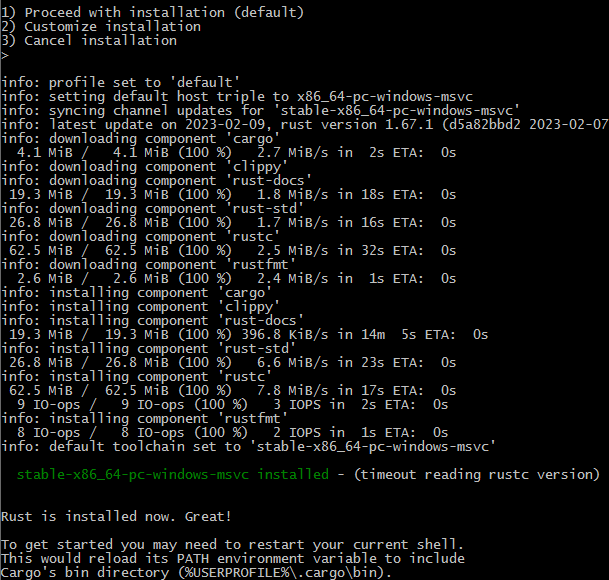

## RUST 

[Rust 程序设计语言 - Rust 程序设计语言 简体中文版 (kaisery.github.io)](https://kaisery.github.io/trpl-zh-cn/title-page.html)

### Install

rustup 是一个管理 Rust 版本和相关工具的命令行工具



环境变量


更新 `$rustup update`

安装状态 `$rustc --version`  输出 `rustc 1.67.1 (d5a82bbd2 2023-02-07)`

查看文档 `rustup doc`会自动使用默认浏览器打开安装的离线文档页面

### Basic

* 缩进使用4个空格，而不是一个tab
* 调用的宏时，名字后有`!`，例如`println!("hi human");`
* rust中的模块被称为crates

#### 编译

rust和c++一样是预编译静态类型语言

`rustc .\main.rs`

#### Cargo

Cargo是rust的构建系统和包管理器，可以自动下载依赖库，在使用rustup安装时一并安装到系统中。

创建一个项目执行

​	 `$cargo new cargo_demo`

会自动创建一个src目录，一个.gitignore文件和Cargo.toml文件

Cargo使用TOML (Tom’s Obvious, Minimal Language) 格式作为项目配置文件

`[package]`以[]开始的是一个片段

* 编译工程 在工程目录下执行`cargo build`,编译时间很长，生成的文件在target的debug目录下
* `cargo run`编译并直接运行
* `cargo check`代码检查
* `cargo build --release`编译release版本

##### 依赖

在Cargo.toml的[dependencies]添加依赖库**crate**，添加一个生成随机数的rand库，版本为0.8.5

```toml
[package]
name = "cargo_demo"
version = "0.1.0"
edition = "2021"

[dependencies]
rand = "0.8.5"
```

再次执行build后，会下载所有依赖的库，包括rand依赖的库

##### Cargo.lock

工程中的`Cargo.lock`文件记录了第一次构建时，所有符合要求的依赖库版本，以后再次构建不会再去找依赖库的版本，方便今后“可重复构建”

如果没有修改工程配置，使用`cargo update`可以强制更新当前配置文件设置的最新库版本，例如更新到配置文件中指定的最新版本

如果修改了toml的配置文件，执行build时，就会下载最新的库文件。

##### 文档

执行`cargo doc --open`可以构建本地依赖库的文档，并在浏览器中打开


##### 示例程序

```rust
use rand::Rng;
use std::cmp::Ordering;
use std::io;

fn main() {
    println!("Guess my age!");

    let my_age = rand::thread_rng().gen_range(1..=100);
    loop {
        println!("Input your guess: {my_age}");

        let mut guess = String::new();  // mut 可变变量
        io::stdin()
            .read_line(&mut guess)
            .expect("Failed to read line");

        let guess: u32 = match guess.trim().parse() {
            Ok(num) => num,
            Err(_) => continue, // -是一个通配符，匹配所有Err值，如果不能转换为数字，进入下次循环
        };

        println!("You guessed: {guess}"); // {}占位符，可以打印变量或表达式结果

        match guess.cmp(&my_age) {
            Ordering::Less => println!("Small"),
            Ordering::Greater => println!("Big"),
            Ordering::Equal => {
                println!("Right");
                break;
            }
        }
    }    
}
```

### 基本语法

match表达式

由多个分支组成，类似switch语句。每个分支包含一个模式和表达式开头的值进行 匹配。

隐藏（shadowing）

循环（loop）

