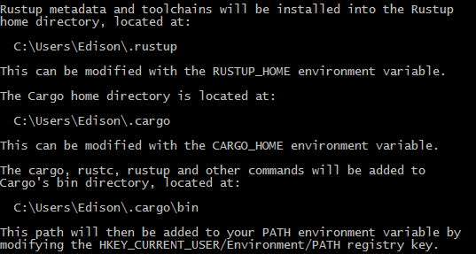
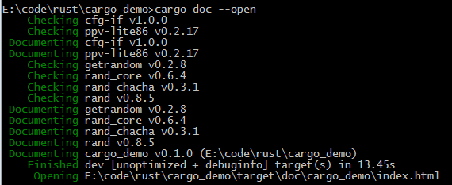
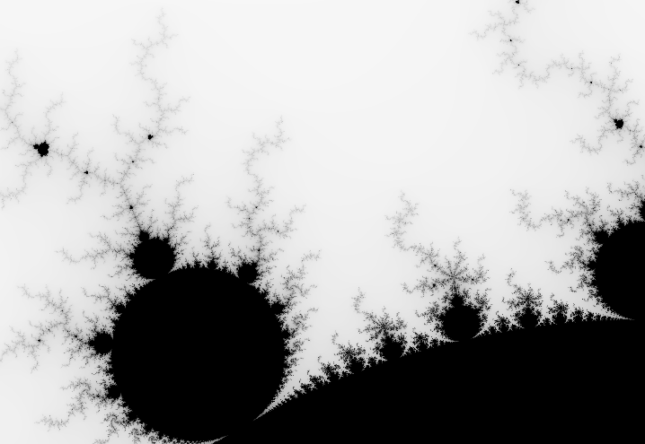

## RUST Basic 

[Rust 程序设计语言 - Rust 程序设计语言 简体中文版 (kaisery.github.io)](https://kaisery.github.io/trpl-zh-cn/title-page.html)

### Install

rustup 是一个管理 Rust 版本和相关工具的命令行工具


环境变量




更新 `$rustup update`

安装状态 `$rustc --version`  输出 `rustc 1.67.1 (d5a82bbd2 2023-02-07)`

查看文档 `rustup doc`会自动使用默认浏览器打开安装的离线文档页面

### Basic

* 缩进使用4个空格，而不是一个tab
* 调用的宏时，名字后有`!`，例如`println!("hi human");`
* rust中的模块被称为crates
* 使用snake case编程风格，所有字母小写并使用下划线分隔单词

#### 编译

rust和c++一样是预编译静态类型语言

`rustc .\main.rs`

#### Cargo

Cargo是rust的构建系统和包管理器，可以自动下载依赖库，在使用rustup安装时一并安装到系统中。

创建一个项目执行

​	 `$cargo new cargo_demo`

会自动创建一个src目录，一个.gitignore文件和Cargo.toml文件

Cargo使用TOML (Tom’s Obvious, Minimal Language) 格式作为项目配置文件

`[package]`以[]开始的是一个片段

* 编译工程 在工程目录下执行`cargo build`,编译时间很长，生成的文件在target的debug目录下
* `cargo run`编译并直接运行
* `cargo check`代码检查
* `cargo build --release`编译release版本

##### 依赖

在Cargo.toml的[dependencies]添加依赖库**crate**，添加一个生成随机数的rand库，版本为0.8.5

```toml
[package]
name = "cargo_demo"
version = "0.1.0"
edition = "2021"

[dependencies]
rand = "0.8.5"
```

再次执行build后，会下载所有依赖的库，包括rand依赖的库

##### Cargo.lock

工程中的`Cargo.lock`文件记录了第一次构建时，所有符合要求的依赖库版本，以后再次构建不会再去找依赖库的版本，方便今后“可重复构建”

如果没有修改工程配置，使用`cargo update`可以强制更新当前配置文件设置的最新库版本，例如更新到配置文件中指定的最新版本

如果修改了toml的配置文件，执行build时，就会下载最新的库文件。

##### 依赖库离线打包

在工程设置好cargo.toml文件后，在工程的根目录执行`cargo vendor`，可以把当前工程的依赖库下载到工程根目录下的vendor目录中。

在工程的根目录中新建`.cargo`目录，并在其中新建`config`配置文件，配置以下内容让工程使用指定目录的依赖库程序

```toml
[source.crates-io]
replace-with = "vendored-sources"

[source.vendored-sources]
directory = "vendor"
```

把当前工程的整个目录拷贝到其他不能联网的机器，就会使用下载好的依赖库文件，同时也可以提高编译效率，不用每次都重新下载依赖库了。

##### 文档

执行`rustup doc --std`可以在浏览器中打开本地离线的rust标准库文档

执行`cargo doc --open`可以构建本地依赖库的文档，并在浏览器中打开




##### 示例程序1

```rust
use rand::Rng;
use std::cmp::Ordering;
use std::io;

fn main() {
    println!("Guess my age!");

    let my_age = rand::thread_rng().gen_range(1..=100);
    loop {
        println!("Input your guess: {my_age}");

        let mut guess = String::new();  // mut 可变变量
        io::stdin()
            .read_line(&mut guess)
            .expect("Failed to read line");

        let guess: u32 = match guess.trim().parse() {
            Ok(num) => num,
            Err(_) => continue, // -是一个通配符，匹配所有Err值，如果不能转换为数字，进入下次循环
        };

        println!("You guessed: {guess}"); // {}占位符，可以打印变量或表达式结果

        match guess.cmp(&my_age) {
            Ordering::Less => println!("Small"),
            Ordering::Greater => println!("Big"),
            Ordering::Equal => {
                println!("Right");
                break;
            }
        }
    }    
}
```

##### 示例程序2 - web server

Programming Rust 中的示例程序，使用最新的库使用异步方式，不能用书中的源代码

```rust
use actix_web::{web, App, HttpResponse, HttpServer};
use serde::Deserialize;

#[derive(Deserialize)]
struct GCDParameters {
    a: u64,
    b: u64,
}

fn gcd(a: u64, b: u64) -> u64 {
    if b == 0 {
        a
    } else {
        gcd(b, a % b)
    }
}

async fn post_gcd(form: web::Form<GCDParameters>) -> HttpResponse {
    if form.a == 0 || form.b == 0 {
        return HttpResponse::BadRequest()
            .content_type("text/html")
            .body("Computeing the GCD error");
    }

    let response = format!("The result is <b>{} </b>\n", gcd(form.a, form.b));
    HttpResponse::Ok().content_type("text/html").body(response)
}

#[actix_web::main]
async fn main() {
    print!("start run");
    let server = HttpServer::new(|| {
        App::new()
            .route("/", web::get().to(get_index))
            .route("/gcd", web::post().to(post_gcd))
    });

    println!("Serving on http://localhost:3000");
    server
        .bind("127.0.0.1:3000")
        .expect("error binding server to address")
        .run()
        .await
        .expect("error running server");
}

async fn get_index() -> HttpResponse {
    HttpResponse::Ok().content_type("text/html").body(
        r##"
                <title>GCD Calculator</title>
                <h1>GCD Calculator</h1>
                <form action="/gcd" method="post">
                    <label for="number1">Number 1:</label>
                    <input type="number" id="number1" name="a" required>
                    <label for="number2">Number 2:</label>
                    <input type="number" id="number2" name="b" required>
                    <button type="submit">Calculate</button>
                </form>
            "##,
    )
}
```

对应的依赖

```toml
[dependencies]
actix-web = "4.9.0"
serde = { version = "1.0.228", features = ["derive"] }
```

##### 示例程序3 - Mandelbrot Set

依赖

```toml
num = "0.4.0"
image = "0.25.0"
```

这个例子程序以图片中的像素点作为复数平面的点，其中实部为横坐标，虚部为纵坐标，计算每一个像素对应的复数是否在Mandelbrot集合中，如果在集合中这个像素点为纯黑色。

```rust
use num::Complex;

/// Try to determine if `c` is in the Mandelbrot set, using at most `limit`
/// iterations to decide.
///
/// If `c` is not a member, return `Some(i)`, where `i` is the number of
/// iterations it took for `c` to leave the circle of radius 2 centered on the
/// origin. If `c` seems to be a member (more precisely, if we reached the
/// iteration limit without being able to prove that `c` is not a member),
/// return `None`.
fn escape_time(c: Complex<f64>, limit: usize) -> Option<usize> {
    let mut z = Complex { re: 0.0, im: 0.0 };
    for i in 0..limit {
        // z距离原点的平方大于4
        if z.norm_sqr() > 4.0 {
            // 迭代了多少次这个复数出了集合，以这个次数会灰度绘图，例如超过了255次还在集合内，就绘制黑色
            return Some(i); 
        }
        z = z * z + c;
    }

    None
}

use std::str::FromStr;

/// Parse the string `s` as a coordinate pair, like `"400x600"` or `"1.0,0.5"`.
/// 分割命令行参数中的组合参数
/// Specifically, `s` should have the form <left><sep><right>, where <sep> is
/// the character given by the `separator` argument, and <left> and <right> are
/// both strings that can be parsed by `T::from_str`. `separator` must be an
/// ASCII character.
///
/// If `s` has the proper form, return `Some<(x, y)>`. If it doesn't parse
/// correctly, return `None`.
fn parse_pair<T: FromStr>(s: &str, separator: char) -> Option<(T, T)> {
    match s.find(separator) {
        None => None,
        Some(index) => {
            // match 的参数类型可以是元组类型
            match (T::from_str(&s[..index]), T::from_str(&s[index + 1..])) {
                (Ok(l), Ok(r)) => Some((l, r)),
                _ => None,
            }
        }
    }
}

#[test]
fn test_parse_pair() {
    assert_eq!(parse_pair::<i32>("", ','), None);
    assert_eq!(parse_pair::<i32>("10,", ','), None);
    assert_eq!(parse_pair::<i32>(",10", ','), None);
    assert_eq!(parse_pair::<i32>("10,20", ','), Some((10, 20)));
    assert_eq!(parse_pair::<i32>("10,20xy", ','), None);
    assert_eq!(parse_pair::<f64>("0.5x", 'x'), None);
    assert_eq!(parse_pair::<f64>("0.5x1.5", 'x'), Some((0.5, 1.5)));
}

/// Parse a pair of floating-point numbers separated by a comma as a complex
/// number.
fn parse_complex(s: &str) -> Option<Complex<f64>> {
    match parse_pair(s, ',') {
        Some((re, im)) => Some(Complex { re, im }),
        None => None,
    }
}

#[test]
fn test_parse_complex() {
    assert_eq!(
        parse_complex("1.25,-0.0625"),
        Some(Complex {
            re: 1.25,
            im: -0.0625
        }),
    );
    assert_eq!(parse_complex(",-0.0625"), None);
}

/// Given the row and column of a pixel in the output image, return the
/// corresponding point on the complex plane.
/// 把一副图片中的一个像素点转换为复数
/// `bounds` is a pair giving the width and height of the image in pixels.
/// `pixel` is a (column, row) pair indicating a particular pixel in that image.
/// The `upper_left` and `lower_right` parameters are points on the complex
/// plane designating the area our image covers.
fn pixel_to_point(
    bounds: (usize, usize),
    pixel: (usize, usize),
    upper_left: Complex<f64>,
    lower_right: Complex<f64>,
) -> Complex<f64> {
    let (width, height) = (
        lower_right.re - upper_left.re,
        upper_left.im - lower_right.im,
    );
    Complex {
        re: upper_left.re + pixel.0 as f64 * width / bounds.0 as f64,
        im: upper_left.im - pixel.1 as f64 * height / bounds.1 as f64,
        // Why subtraction here? pixel.1 increases as we go down,
        // but the imaginary component increases as we go up.
    }
}

#[test]
fn test_pixel_to_point() {
    assert_eq!(
        pixel_to_point(
            (100, 200),
            (25, 175),
            Complex { re: -1.0, im: 1.0 },
            Complex { re: 1.0, im: -1.0 },
        ),
        Complex {
            re: -0.5,
            im: -0.75
        },
    );
}

/// Render a rectangle of the Mandelbrot set into a buffer of pixels.
///
/// The `bounds` argument gives the width and height of the buffer `pixels`,
/// which holds one grayscale pixel per byte. The `upper_left` and `lower_right`
/// arguments specify points on the complex plane corresponding to the upper-
/// left and lower-right corners of the pixel buffer.
fn render(
    pixels: &mut [u8],
    bounds: (usize, usize),
    upper_left: Complex<f64>,
    lower_right: Complex<f64>,
) {
    assert!(pixels.len() == bounds.0 * bounds.1);

    for row in 0..bounds.1 {
        for column in 0..bounds.0 {
            // 逐行计算每一个像素点在多少次计算后不在集合中
            let point = pixel_to_point(bounds, (column, row), upper_left, lower_right);
            pixels[row * bounds.0 + column] = match escape_time(point, 255) {
                None => 0,
                Some(count) => 255 - count as u8, // 如果255轮计算后还在集合，就为黑色，黑色的值为0
            };
        }
    }
}

use image::codecs::png::PngEncoder;
use image::{ExtendedColorType, ImageEncoder, ImageError};
use std::fs::File;

/// Write the buffer `pixels`, whose dimensions are given by `bounds`, to the
/// file named `filename`.
fn write_image(filename: &str, pixels: &[u8], bounds: (usize, usize)) -> Result<(), ImageError> {
    let output = File::create(filename)?;

    let encoder = PngEncoder::new(output);
    encoder.write_image(
        pixels,
        bounds.0 as u32,
        bounds.1 as u32,
        // 灰度图像
        ExtendedColorType::L8,
    )?;
    Ok(())
}
use std::env;
use std::time::Instant;

fn main() {
    // 可以使用PowerShell的measure-command计算程序执行时间
    // On Windowsin PowerShell: measure-command {.\target\debug\cargo_demo.exe mandel.png 4000x3000 -1.20,0.35 -1,0.20 true}.
    let args: Vec<String> = env::args().collect();

    if args.len() != 6 {
        let program = &args[0];
        eprintln!("Usage: {program} FILE PIXELS LEFT,TOP RIGHT,BOTTOM USE_THREADS");
        eprintln!("Example: {program} mandel.png 1000x750 -1.20,0.35 -1,0.20 true");
        std::process::exit(1);
    }

    let start = Instant::now();
    let bounds: (usize, usize) = parse_pair(&args[2], 'x').expect("error parsing image dimensions");
    let upper_left = parse_complex(&args[3]).expect("error parsing upper left corner point");
    let lower_right = parse_complex(&args[4]).expect("error parsing lower right corner point");

    let mut pixels = vec![0; bounds.0 * bounds.1];
    let b_use_threads = args[5].parse::<bool>().unwrap_or(false);
    println!("use threads {}", b_use_threads); // 我的5600 CPU是12个线程
    if !b_use_threads {
        render(&mut pixels, bounds, upper_left, lower_right);
    } else {
        let threads = std::thread::available_parallelism()
            .expect("error querying CPU count")
            .get();
        println!("threads count is {}", threads);
        let rows_per_band = bounds.1.div_ceil(threads);

        let bands = pixels.chunks_mut(rows_per_band * bounds.0);
        std::thread::scope(|spawner| {
            for (i, band) in bands.enumerate() {
                let top = rows_per_band * i;
                let height = band.len() / bounds.0;
                let band_bounds = (bounds.0, height);
                let band_upper_left = pixel_to_point(bounds, (0, top), upper_left, lower_right);
                let band_lower_right =
                    pixel_to_point(bounds, (bounds.0, top + height), upper_left, lower_right);
                // 每个线程处理图片的250行，并发进行，充分利用CPU资源
                println!("thread {} start and band top {}.", i, top);
                spawner.spawn(move || {
                    render(band, band_bounds, band_upper_left, band_lower_right);
                });
            }
        });
    }

    write_image(&args[1], &pixels, bounds).expect("error writing PNG file");

    let duration = start.elapsed();
    println!("Time elapsed in seconds: {}", duration.as_secs());
    println!("Time elapsed in milliseconds: {}", duration.as_millis());
    println!("Time elapsed in nanoseconds: {}", duration.as_nanos());
}
```

多线程使用时间为9s，不使用多线程需要41s。生成图片如下，这个图片局部放大后的形状都是相似的葫芦形，数学的魅力。




### 基本语法

#### 变量

变量默认是不可改变的immutable，一旦一个值绑定到了一个变量上，就不能改变这个变量的值。

如果修改一个不可变变量的值，会有这个错误：error[E0384]: cannot assign twice to immutable variable `game`
 不可变变量的好处：

* 并发程序在编译时避免多线程问题？

定义可变变量需要使用`mut`关键字，虽然可以修改变量的值，但是不能更改变量的数据类型

```rust
let mut game = "cod";
```

#### 常量

常量是固定不可变的，使用`const`关键字，常量可以在任何作用域声明，必须是表达式，不能在运行时计算出值。

```rust
const SECONDS_OF_DAY: u32 = 24*60*60;
```

#### 隐藏（shadowing）

可以定义一个和之前变量同名的新变量，前一个变量会被隐藏，当第二个变量退出自己的作用域后，变量会恢复第一个变量的值。隐藏是新建了一个变量，并不是改变原来变量的值，和mut完全不同。

```rust
    let game = "cod";
    {
        let game = "halo";
        println!("The best FPS is {game}"); //halo
    }    
    println!("The best FPS is {game}"); // cod
```

#### 数据类型

##### **标量(scalar)**

表示单独的一个数值

* 整型：u8, i8(-128~127), u16, i16, u128, i128, usize, isize和程序架构绑定。变量赋值时，可以使用数据类型来指定类型，例如`56u8`指定数据类型为`u8`，数字之间可以使用下划线`_`分隔方便读数，如`5_600`表示5600. 
* 数字类型表示：十六进制(hex) 0xFF; 八进制(Octal) 0o77; 二进制(binary) 0b1111_0000; 字节(仅能用于u8) b'A'
* 整数溢出：例如给一个u8类型变量赋值256时，debug版本会出现panic错误，release版本会给变量赋值为 0，257赋值为1进行回绕。标准库提供了检查溢出的方法例如`overflowing_*`
* 浮点型：f32, f64，默认为f64。使用`IEEE-754标准`
* 布尔型：bool 两个值`true`，`false`
* 字符类型：char **占4个字节，代表一个Unicode标量值**。范围`U+0000~U+7DFF`和`U+E000~U+10FFFF`在内的值。

##### **复合类型(Compound types)**

将多个值组合成一个类型

###### 元组类型

元组长度固定，一旦声明，长度不能改变。元组中的每一个位置的数据类型可以是不同的。可以使用模式匹配来解构(destructure)元组值。也可以使用元组变量名加`.索引`的方式获取值。

```rust
let tup: (i32, f64, u8) = (500, 3.6, 1);
let (x, y, z) = tup; // destructuring
let x = tup.0;
println!("The value of x is : {x}");
println!("The value of y is : {y}");
```

没有任何值的元组称作**单元(unit)**，表示空值或空的返回类型。

###### 数组类型

数组中每个元素的数据类型相同，且长度固定。

```rust
    let food = ["breakfast", "lunch", "supper"];
    let data:[i32; 3] = [1, 2, 3];
    let data = [6, 3]; // [6, 6, 6]
    let num = data[0];
```

#### 函数

函数声明使用`fn`关键字开始，每个参数必须声明类型，在函数参数列表后使用`->`指明函数的返回类型

```rust
fn cal_price(val: f64, fac: f64) -> f64  {
    let price = val*fac;
    println!("The deal price is {price}");
    price   // return a expression as return value
}

let price = cal_price(21.5, 1.25);
```

rust的编译器只会推断函数体内变量的类型，函数的参数和返回值的类型必须要声明写出来。

rust的典型函数实现中会用表达式返回函数的返回值，return只在需要在函数体内提前返回值的情况。

#### 表达式

**语句(statements)**是执行一些操作但不返回值的指令

**表达式(Expressions)**计算并产生一个值，**表达式结尾没有分号**。

在C++中表达式和语句有明确区分，`if`或`switch`这种代码段称为语句， 这样的`5*(f-32)/9`称为表达式，表达式有值，而语句不会产生值，也不能放在表达式中间。

rust是表达式语言。它的`if`和`match`表达式都会产生值。例如可以使用match作为参数

```rust
let length = 100;
println!(
    "Use match expression value {}",
    match length {
        100 => "hello world",
        _ => "",
    }
);
```

所以rust中不需要c++里面的三元运算符`(expr1 ? expr2:expr3)`，rust里面直接使用`let`表达式就行了。

代码块表达式block expression：对于使用`{ }`包围的代码块，它的最后一个表达式就是这个代码块的最终值。如果一个代码块的最后一行代码以`;`结束，它的值为`()`

#### 控制流

##### 条件表达式

if后跟一个条件，和其他语言类似，这个条件必须返回bool类型的值。if表达式可以给let赋值。如果if语句没有else，那么它必须返回`()`即最后一行语句要以`;`结束。否则rust编译器会提示``if` expressions without `else` evaluate to `()``

```rust
    let number = 255;
    if number > 255 {
        println!("greater than 255");
    } else if number == 0 {
        println!("nonsense");
    } else {
        println!("less than 255 except 0");
    }
	// 这种情况下的所有分支返回的数据类型必须相同，否则编译器无法确定num的类型
	// 每一个分支中都是一个表达式，数字后面没有分号结束。
	let num = if number > 50 { 100 } else { 0 };
```

##### 循环

###### loop

无条件的循环执行，除非执行了break或程序中断。可以在loop循环的break语句中返回值。

```rust
    let mut counter = 0;
    let result = loop {
        counter += 1;
        if counter >= 10 {
            break counter * 5;
        }
    };
    println!("The last counter is {result}");
```

###### 循环标签

循环标签可以给一个循环指定一个名字，默认情况下break和continue作用于此时最内层的循环，使用标签可以让他们作用于指定的循环。标签使用**'**单引号作为开始.

```rust
    let mut counter = 0;
    'count_up: loop {
        counter += 1;
        println!("counter = {counter}");

        let mut remain = 10;

        loop {
            println!("remain = {remain}");
            if remain < 5 {
                break;  // 只跳出remain的循环
            }
            if counter == 10 {
                break 'count_up; // 跳出外层循环
            }
            remain -= 1;
        }         
    };
    println!("The last counter is {counter}"); 
```

###### while

while和其他语言相同，条件为true执行循环

```rust
    while counter < 10 {
        counter += 1;
        println!("counter = {counter}"); 
    }
```


###### for

使用`for x in seq`的方式遍历数组

```rust
    let food = ["breakfast", "lunch", "supper"];
    for meal in food {
        println!("Eat at {meal}");
    }

    for number in (1..3).rev() { // 左闭右开，rev()反转序列
        println!("Eat time {number}");
    }
```


##### 匹配

###### match表达式

由多个分支组成，类似switch语句。每个分支包含一个模式和表达式，表达式以`,`结尾。

match的每个分支的表达式就是match的返回值，所以分支表达式的数据类型需要相兼容。

match必须用分支覆盖所有的情况，否则会编译错误，可以使用通配符匹配所有其他情况，这个通配符可以看作一个变量名，它匹配所有的其他相同类型的值，我们可以在这个分支的表达式中使用这个匹配变量，也可以使用`_`匹配任意值，但是我们不会引用它的值，可以看作是default。

模式的匹配是按编写顺序执行，所以不能把通配符分支放在前面，这样后面的分支无法被匹配。

```rust
match value {
	patten1 => expression1,
	patten2 => expression2,
	patten3 => expression3,
}
```

在匹配的分支中可以使用模式的部分值。

```rust
#[derive(Debug)]
enum Message {
    Quit,
    Move { x: i32, y: i32},
    Write(String),
    ChangeColor(i32, i32, i32),
}
fn handle_message(msg: Message) {
    println!("match start");
    match msg {
        Message::Quit => println!("Quit"),
        Message::Write(val) => {
            println!("write {}", val);            
        }
        Message::Move { x, y } => {
            println!("move pos {},{}", x, y);            
        }
        Message::ChangeColor(r, g, b) => {
            println!("change color {},{},{}", r,g,b);            
        }
    }
    println!("match end");
}

let move_msg = Message::Move { x: 15, y: 20 };
handle_message(move_msg);

fn plus_one(x: Option<i32>) -> Option<i32> {
    match x {
        None => None,
        Some(i) => Some(i+1),
    }
}

let roll = 100;
match roll {
    5 => println!("luck num:{roll}"),
    10 => println!("bad num:{roll}"),
    left => println!("norm num:{left}"),// left是通配符
}

let config_max = Some(3u8);
match config_max {
    Some(max) => println!("The max is {max}"),
    _ => (), // 匹配所有其他值，但是不需要引用，这样没有编译警告，写法简单
}
```

###### if let表达式

如果只关系一种匹配的情况，而忽略其他match的分支时，可以使用`if let`简化match的写法。

```rust
let config_max = Some(3u8);
let config_none: Option<u8> = None;
if let Some(max) = config_max { // Some(max)等同于match中的模式
    println!("The max is {max}"); // The max is 3
} else {
    println!("None is input");
}
```


