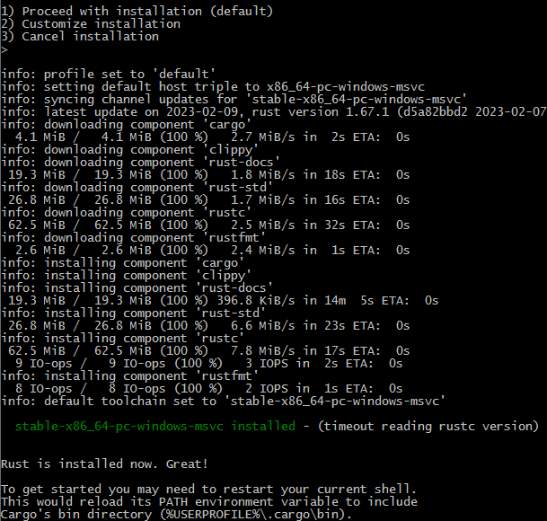
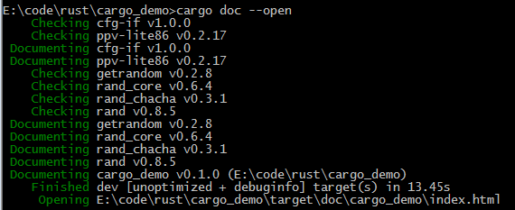

## RUST Basic 

[Rust 程序设计语言 - Rust 程序设计语言 简体中文版 (kaisery.github.io)](https://kaisery.github.io/trpl-zh-cn/title-page.html)

### Install

rustup 是一个管理 Rust 版本和相关工具的命令行工具




环境变量


更新 `$rustup update`

安装状态 `$rustc --version`  输出 `rustc 1.67.1 (d5a82bbd2 2023-02-07)`

查看文档 `rustup doc`会自动使用默认浏览器打开安装的离线文档页面

### Basic

* 缩进使用4个空格，而不是一个tab
* 调用的宏时，名字后有`!`，例如`println!("hi human");`
* rust中的模块被称为crates
* 使用snake case编程风格，所有字母小写并使用下划线分隔单词

#### 编译

rust和c++一样是预编译静态类型语言

`rustc .\main.rs`

#### Cargo

Cargo是rust的构建系统和包管理器，可以自动下载依赖库，在使用rustup安装时一并安装到系统中。

创建一个项目执行

​	 `$cargo new cargo_demo`

会自动创建一个src目录，一个.gitignore文件和Cargo.toml文件

Cargo使用TOML (Tom’s Obvious, Minimal Language) 格式作为项目配置文件

`[package]`以[]开始的是一个片段

* 编译工程 在工程目录下执行`cargo build`,编译时间很长，生成的文件在target的debug目录下
* `cargo run`编译并直接运行
* `cargo check`代码检查
* `cargo build --release`编译release版本

##### 依赖

在Cargo.toml的[dependencies]添加依赖库**crate**，添加一个生成随机数的rand库，版本为0.8.5

```toml
[package]
name = "cargo_demo"
version = "0.1.0"
edition = "2021"

[dependencies]
rand = "0.8.5"
```

再次执行build后，会下载所有依赖的库，包括rand依赖的库

##### Cargo.lock

工程中的`Cargo.lock`文件记录了第一次构建时，所有符合要求的依赖库版本，以后再次构建不会再去找依赖库的版本，方便今后“可重复构建”

如果没有修改工程配置，使用`cargo update`可以强制更新当前配置文件设置的最新库版本，例如更新到配置文件中指定的最新版本

如果修改了toml的配置文件，执行build时，就会下载最新的库文件。

##### 文档

执行`cargo doc --open`可以构建本地依赖库的文档，并在浏览器中打开




##### 示例程序

```rust
use rand::Rng;
use std::cmp::Ordering;
use std::io;

fn main() {
    println!("Guess my age!");

    let my_age = rand::thread_rng().gen_range(1..=100);
    loop {
        println!("Input your guess: {my_age}");

        let mut guess = String::new();  // mut 可变变量
        io::stdin()
            .read_line(&mut guess)
            .expect("Failed to read line");

        let guess: u32 = match guess.trim().parse() {
            Ok(num) => num,
            Err(_) => continue, // -是一个通配符，匹配所有Err值，如果不能转换为数字，进入下次循环
        };

        println!("You guessed: {guess}"); // {}占位符，可以打印变量或表达式结果

        match guess.cmp(&my_age) {
            Ordering::Less => println!("Small"),
            Ordering::Greater => println!("Big"),
            Ordering::Equal => {
                println!("Right");
                break;
            }
        }
    }    
}
```

### 基本语法

#### 变量

变量默认是不可改变的immutable，一旦一个值绑定到了一个变量上，就不能改变这个变量的值。

如果修改一个不可变变量的值，会有这个错误：error[E0384]: cannot assign twice to immutable variable `game`
 不可变变量的好处：

* 并发程序在编译时避免多线程问题？

定义可变变量需要使用`mut`关键字，虽然可以修改变量的值，但是不能更改变量的数据类型

```rust
let mut game = "cod";
```

#### 常量

常量是固定不可变的，使用`const`关键字，常量可以在任何作用域声明，必须是表达式，不能在运行时计算出值。

```rust
const SECONDS_OF_DAY: u32 = 24*60*60;
```

#### 隐藏（shadowing）

可以定义一个和之前变量同名的新变量，前一个变量会被隐藏，当第二个变量退出自己的作用域后，变量会恢复第一个变量的值。隐藏是新建了一个变量，并不是改变原来变量的值，和mut完全不同。

```rust
    let game = "cod";
    {
        let game = "halo";
        println!("The best FPS is {game}"); //halo
    }    
    println!("The best FPS is {game}"); // cod
```

#### 数据类型

##### **标量(scalar)**

表示单独的一个数值

* 整型：u8, i8(-128~127), u16, i16, u128, i128, usize, isize和程序架构绑定。变量赋值时，可以使用数据类型来指定类型，例如`56u8`指定数据类型为`u8`，数字之间可以使用下划线`_`分隔方便读数，如`5_600`表示5600. 
* 数字类型表示：十六进制(hex) 0xFF; 八进制(Octal) 0o77; 二进制(binary) 0b1111_0000; 字节(仅能用于u8) b'A'
* 整数溢出：例如给一个u8类型变量赋值256时，debug版本会出现panic错误，release版本会给变量赋值为 0，257赋值为1进行回绕。标准库提供了检查溢出的方法例如`overflowing_*`
* 浮点型：f32, f64，默认为f64。使用`IEEE-754标准`
* 布尔型：bool 两个值`true`，`false`
* 字符类型：char **占4个字节，代表一个Unicode标量值**。范围`U+0000~U+7DFF`和`U+E000~U+10FFFF`在内的值。

##### **复合类型(Compound types)**

将多个值组合成一个类型

###### 元组类型

元组长度固定，一旦声明，长度不能改变。元组中的每一个位置的数据类型可以是不同的。可以使用模式匹配来解构(destructure)元组值。也可以使用元组变量名加`.索引`的方式获取值。

```rust
let tup: (i32, f64, u8) = (500, 3.6, 1);
let (x, y, z) = tup; // destructuring
let x = tup.0;
println!("The value of x is : {x}");
println!("The value of y is : {y}");
```

没有任何值的元组称作**单元(unit)**，表示空值或空的返回类型。

###### 数组类型

数组中每个元素的数据类型相同，且长度固定。

```rust
    let food = ["breakfast", "lunch", "supper"];
    let data:[i32; 3] = [1, 2, 3];
    let data = [6, 3]; // [6, 6, 6]
    let num = data[0];
```

#### 函数

函数声明使用`fn`关键字开始，每个参数必须声明类型，在函数参数列表后使用`->`指明函数的返回类型

```rust
fn cal_price(val: f64, fac: f64) -> f64  {
    let price = val*fac;
    println!("The deal price is {price}");
    price   // return a expression as return value
}

let price = cal_price(21.5, 1.25);
```

**语句(statements)**是执行一些操作但不返回值的指令

**表达式(Expressions)**计算并产生一个值，**表达式结尾没有分号**。

#### 控制流

##### 条件表达式

if后跟一个条件，和其他语言类似，这个条件必须返回bool类型的值。if表达式可以给let赋值。

```rust
    let number = 255;
    if number > 255 {
        println!("greater than 255");
    } else if number == 0 {
        println!("nonsense");
    } else {
        println!("less than 255 except 0");
    }
	// 这种情况下的所有分支返回的数据类型必须相同，否则编译器无法确定num的类型
	// 每一个分支中都是一个表达式，数字后面没有分号结束。
	let num = if number > 50 { 100 } else { 0 };
```

##### 循环

###### loop

无条件的循环执行，除非执行了break或程序中断。可以在loop循环的break语句中返回值。

```rust
    let mut counter = 0;
    let result = loop {
        counter += 1;
        if counter >= 10 {
            break counter * 5;
        }
    };
    println!("The last counter is {result}");
```

###### 循环标签

循环标签可以给一个循环指定一个名字，默认情况下break和continue作用于此时最内层的循环，使用标签可以让他们作用于指定的循环。标签使用**'**单引号作为开始.

```rust
    let mut counter = 0;
    'count_up: loop {
        counter += 1;
        println!("counter = {counter}");

        let mut remain = 10;

        loop {
            println!("remain = {remain}");
            if remain < 5 {
                break;  // 只跳出remain的循环
            }
            if counter == 10 {
                break 'count_up; // 跳出外层循环
            }
            remain -= 1;
        }         
    };
    println!("The last counter is {counter}"); 
```

###### while

while和其他语言相同，条件为true执行循环

```rust
    while counter < 10 {
        counter += 1;
        println!("counter = {counter}"); 
    }
```


###### for

使用`for x in seq`的方式遍历数组

```rust
    let food = ["breakfast", "lunch", "supper"];
    for meal in food {
        println!("Eat at {meal}");
    }

    for number in (1..3).rev() { // 左闭右开，rev()反转序列
        println!("Eat time {number}");
    }
```


##### 匹配

###### match表达式

由多个分支组成，类似switch语句。每个分支包含一个模式和表达式，表达式以`,`结尾。

match的每个分支的表达式就是match的返回值，所以分支表达式的数据类型需要相兼容。

match必须用分支覆盖所有的情况，否则会编译错误，可以使用通配符匹配所有其他情况，这个通配符可以看作一个变量名，它匹配所有的其他相同类型的值，我们可以在这个分支的表达式中使用这个匹配变量，也可以使用`_`匹配任意值，但是我们不会引用它的值，可以看作是default。

模式的匹配是按编写顺序执行，所以不能把通配符分支放在前面，这样后面的分支无法被匹配。

```rust
match value {
	patten1 => expression1,
	patten2 => expression2,
	patten3 => expression3,
}
```

在匹配的分支中可以使用模式的部分值。

```rust
#[derive(Debug)]
enum Message {
    Quit,
    Move { x: i32, y: i32},
    Write(String),
    ChangeColor(i32, i32, i32),
}
fn handle_message(msg: Message) {
    println!("match start");
    match msg {
        Message::Quit => println!("Quit"),
        Message::Write(val) => {
            println!("write {}", val);            
        }
        Message::Move { x, y } => {
            println!("move pos {},{}", x, y);            
        }
        Message::ChangeColor(r, g, b) => {
            println!("change color {},{},{}", r,g,b);            
        }
    }
    println!("match end");
}

let move_msg = Message::Move { x: 15, y: 20 };
handle_message(move_msg);

fn plus_one(x: Option<i32>) -> Option<i32> {
    match x {
        None => None,
        Some(i) => Some(i+1),
    }
}

let roll = 100;
match roll {
    5 => println!("luck num:{roll}"),
    10 => println!("bad num:{roll}"),
    left => println!("norm num:{left}"),// left是通配符
}

let config_max = Some(3u8);
match config_max {
    Some(max) => println!("The max is {max}"),
    _ => (), // 匹配所有其他值，但是不需要引用，这样没有编译警告，写法简单
}
```

###### if let表达式

如果只关系一种匹配的情况，而忽略其他match的分支时，可以使用`if let`简化match的写法。

```rust
let config_max = Some(3u8);
let config_none: Option<u8> = None;
if let Some(max) = config_max { // Some(max)等同于match中的模式
    println!("The max is {max}"); // The max is 3
} else {
    println!("None is input");
}
```


