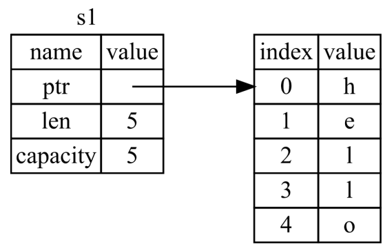

## RUST Learning Owner Struct and Enum

[Rust 程序设计语言 - Rust 程序设计语言 简体中文版 (kaisery.github.io)](https://kaisery.github.io/trpl-zh-cn/title-page.html)


### 所有权(Ownership)


#### 规则

1. 每一个值都有一个所有者(owner)
2. 值在任何时刻只能有一个所有者
3. 当所有者(变量)离开作用域，这个值就被释放

rust中的作用域和C的一样。

#### 资源释放

以String类型为例，一个String类型变量值存储在栈上，但是它实际指向的字符串数据内存在堆上。




```rust
    {
        let s = String::from("Flower");
    } // s drop
```

当变量s离开作用域，rust会调用drop函数来释放内存。这个机制类似C++中的Resource Acquisition Is Initialization(RAII)，一个对象在生命周期结束时，自己释放拥有的资源。

##### 移动

变量的所有权规则：将值赋给另一个变量时移动它，当持有堆中的数据的变量离开作用域时，其值通过drop被清理掉，除非数据被移动为另一个变量所有。

```rust
    {
        let x = 5;
        let y = x;
        println!("x is {x} y is {y}");
        let s1 = String::from("Flower");
        let s2 = s1;
        println!("s2 is {s2} s1 is {s1}"); // error: borrow of moved value: `s1`
    } 
```

对于复杂的数据类型，变量之间在赋值时，相当于把前一个变量s1**移动**到了s2，这样避免了s1和s2都还指向子串的实际内容，退出作用域时，s1和s2都会对内存资源进行释放导致double free。对于普通的数据类型，rust给x和y在栈上各提供了一个5作为值。


##### 克隆

rust永远不会自动创建数据的深拷贝。

如果需要深度复制String在堆上的数据，可以使用clone函数。clone出现的地方说明有额外的代码执行可能会很耗资源。

```rust
let s1 = String::from("Flower");
let s2 = s1.clone();
println!("s2 is {s2} s1 is {s1}");
```

Rust有个Copy trait的特殊注解，如果一个类型实现了Copy trait，那么一个旧的变量将其赋给其他变量后仍然可用。基本的整数类型，bool类型，浮点类型，字符类型，以及只包含实现了Copy元素的元组类型都是Copy类型。

Rust禁止自身或其任何部分实现了Drop trait的类型使用Copy trait。

##### 函数参数

对于不支持Copy的类型作为参数，会把传入参数的变量移动到函数内，除非把这个变量通过函数返回出来，否则之前的变量由于被移动走，无法使用。

```rust
fn take_owner(str: String) {
    println!("func string: {}", str);
} // str 退出作用域调用drop，把字串占用的内存资源释放

fn make_copy(value: i32) {
    println!("func integer: {}", value);
} 

let s1 = String::from("Flower");
take_owner(s1); // s1 moved into function
// s1 is not valid here
let x = 5; 
make_copy(x);  // copy for i32 type
println!("integer: {}", x);  // x is still valid   
```

##### 函数返回值

函数的返回值可以把函数内的变量的所有权移动给函数外的变量。

```rust
fn give_owner() -> String {
    let game = String::from("call of duty");
    game  // 注意这里没有语句结束；所以作为一个表达式返回变量game
}
let fps = give_owner(); // 变量的所有权现在归fps
```

##### 引用

如果一个变量作为参数把值的所有权移动到了函数体内，函数执行后还需要使用这个变量的地方就不能使用这个变量了，如果每次把参数再作为返回值把所有权移动出来也会很麻烦。此时可以使用引用作为函数的参数。

引用像一个指针，它是一个地址，我们可以由此访问存储于该地址属于其他变量的数据。引用需要确保它指向了某个特定类型的有效值。

创建一个引用的行为称为借用(borrowing)

```rust
fn cal_str_len(s: &String) -> usize {
    s.len() // 引用使用值，但不获取所有全，但是默认不能修改值
}
let s1 = String::from("Flower");
let len = cal_str_len(&s1); //使用引用作为参数
println!("string {} len is {}", s1, len);  // s1还有所有权 string Flower len is 6
```

###### 可变引用

通过使用mut关键字可以声明一个引用是可修改的。

```rust
fn change_ref(str: &mut String) {
    str.push_str(" is beautiful"); // 修改一个引用
}
let mut s1 = String::from("Flower"); // 定一个可变字符串
change_ref(&mut s1);  // 可变引用参数
println!("string {}", s1);
```

一个引用的生命周期从这个引用定义开始，到这个引用的最后一次使用终止。

如果已经有一个对变量的可变引用，在这个引用的生命周期内，不能对被引用的变量再次引用，这样会导致多个引用修改或访问同一个变量，引发多线程的数据竞争问题。同样，不可变引用和可变引用也不能同时存在。

```rust
let mut s1 = String::from("Flower");
let r1 = &mut s1;
let r2 = &mut s1; // 编译器会提示 ^^^^^^^ second mutable borrow occurs here
println!("{} {} ", r1, r2); // -- first borrow later used here
```

如果对一个变量的引用都是不可变的，那么不存在数据竞争访问问题，是可以使用的。

Rust的编译器会保证一个引用不会变成**悬垂引用(Dangling Reference)**.

```rust
fn dangle_ref() -> &String { // 返回一个字符串引用
    let s = String::from("Flower");
    &s // 返回引用
} // s 退出作用域，内存资源被释放
编译器提示：
this function's return type contains a borrowed value, but there is no value for it to be borrowed from
```

总结：

* 要么只能有一个可变引用，要么只有多个不可变引用
* 引用必须总是有效的

##### Slice类型

slice是一种引用，所以它没有所有权。可以引用集合中一段连续的元素序列，是一个部分不可变引用。

```rust
let poem = String::from("best way to find a secret");
let key = &poem[0..4];  // best
```

`[start..end]`表示从start开始，end-start长度的子集。当start为0时，可以不写，end为最后一个字符时也可以省略。

字符串slice的类型声明为`&str`

```rust
fn fisrt_word(s: &String) -> &str { // 返回一个String的slice
    let bytes = s.as_bytes(); // 转换为字符数组
    for (i, &item) in bytes.iter().enumerate() { // 数组迭代器
        if item == b' ' { // 找到第一个空格的位置
            return &s[0..i]; // 截取第一个空格之前的字符为第一个字
        }
    }
    &s[..]  // 没有空格
}

```

`let s = "book a ticket";`中s的类型是`&str`，他是指向一个二进制程序特定位置的slice，由于他是一个不可变引用，所以值不可改变。

对于一个整型数的数组他的slice数据类型为`&[i32]`

#### 结构体

结构体和C++中的类似，包含不同类型的字段。

声明一个结构体

```rust
struct Game {
    game_name: String,
    game_type: i32,
    rate: f32,
}
```

初始化一个结构体变量

```rust
let mut cod = Game {
    game_name: String::from("Call of duty"),
    game_type:1,
    rate:8.2,
};
cod.rate = 7.5;
```

结构体作为返回值

```rust
fn build_game(name: String) -> Game {
    Game {
        game_name:name,
        rate:0.0,
        game_type:0,
    }
}
let mut bf5 = build_game(String::from("Battle Field 5"));
```

* 字段初始化简写语法，函数的参数名称和结构体字段名称相同

```rust
fn build_game(game_name: String) -> Game {
    Game {
        game_name,
        rate:0.0,
        game_type:0,
    }
}
```

* 结构体更新语法 `..`语法指定结构体中剩余没有设置的字段使用给定实例对应字段相同的值，相当于逐个=，这个语法必须放在**最后**。

```rust
let halo = Game {
    game_name: String::from("HALO"),
    ..cod
};
println!("The value is {}, {}", halo.game_name, halo.rate);
```

这里需要**注意**当自动赋值的字段中有不可Copy的数据类型时，前一个变量不能被使用了，因为他已经被移动了。

```rust
let halo = Game {
    game_type: 2,
    ..cod
}; //编译会提示 borrow of moved value: `cod.game_name`

let my_name = cod.game_name;
println!("info of struct value {:?}", cod); // borrow of partially moved value: `cod`
```

##### 元组结构体

使用元组的方式定义结构体，可以不用给每个字段定一个名字。

```rust
struct Color(i32, i32, i32);
let black = Color(0, 0, 0);
```

##### 单元结构体

没有任何字段的结构体，在某个类型上实现trait但又不需要存储数据。

##### 派生trait增加功能

通过给结构体增加外部属性`#[derive(Debug)]`，结构体就可以输出调试信息

```rust
#[derive(Debug)]
struct Game {
    game_name: String,
    game_type: i32,
    rate: f32,
}
println!("info of struct value {:?}", cod);
// info of struct value Game { game_name: "Call of duty", game_type: 1, rate: 7.5 }
println!("info of struct value {:#?}", cod);  // 格式化打印
//info of struct value Game {
//    game_name: "Call of duty",
//    game_type: 1,
//    rate: 7.5,
//}
```

###### dbg!宏

println!宏接受变量的引用，dbg!宏接收变量的所有权，可以打印执行宏所在的文件和行号，表达式计算结果并把结果的所有权返回。

```rust
let halo_rate = 8.0;
let halo = Game {
    game_name:String::from("HALO"),
    game_type:1,
    rate: dbg!(halo_rate*0.9)  // 执行这一行会输出：[src\main.rs:195] halo_rate * 0.9 = 7.2
};
dbg!(&halo);
```

##### 方法

方法是定义在结构体，枚举上下文中的，他的第一个参数一定是self，表示调用该方法结构体实例。使用impl关键字开始的一个代码块来定义结构体关联的方法。

```rust
impl Game {
    fn description(&self) {
        println!("Game {} rate is {}", self.game_name, self.rate);
    }
}
```

第一个参数`&self`是`self: &Self`的缩写，在impl中，`Self`是块的类型的别名。`self`的传递参数时可以选择获取`self`的所有权也可以选择借用(引用)`&self`，或者可变的借用`&mut self`。

如果想要在方法中改变调用方法的实例，需要将第一个参数改为 &mut self。通过仅仅使用 self 作为第一个参数来使方法获取实例的所有权是很少见的；这种技术通常用在当方法将 self 转换成别的实例的时，我们想要防止调用者在转换之后使用原始的实例。

方法名称可以和字段名称相同，编译器根据方法名称后有`()`就知道是调用方法，而不是获取字段。这样可以实现getter方法。

##### 关联函数

定义在impl块中的不以self作为第一个参数函数称为结构的关联函数，因为它不作用于一个结构的实例，所以不是方法。例如`String::from`，一般这样的关联函数用来返回一个结构的实例的构造函数，类似new的作用，但是new不是rust的关键字。

```rust
impl Game {
    fn new_game(name: String) -> Self {
        Self { //Self关键字在关联函数的返回值中表示impl中的类型Game。
            game_name:name,
            game_type:0,
            rate:0.0,
        }
    }
}
let halo = Game::new_game(String::from("HALO"));
println!("info of struct value {:?}", halo);
```

#### 枚举

枚举定一个了一种数据类型，可以让你列举出其中的每一个成员(variants)

```rust
#[derive(Debug)]
enum GameType {
    FPS,
    RPG,
    Sport,
}
#[derive(Debug)]
struct Game {
    game_name: String,
    game_type: GameType,
    rate: f32,
}
```

可以将数据直接附加到枚举成员上，并且每个枚举成员可以处理不同类型和数量的数据。

枚举也可以定义方法，self的作用和结构的相同，也表示调用方法的值。

```rust
#[derive(Debug)]
enum Message {
    Quit,
    Move { x: i32, y: i32},
    Write(String),
    ChangeColor(i32, i32, i32),
}
struct WriteMessage(String); //元组结构体
struct MoveMessage {
    x:i32,
    y:i32,
}

impl Message {
    fn call(&self) {
        println!("{:?}", self);
    }
}
let m = Message::Write(String::from("best game is"));
m.call(); // Write("best game is")
let move_msg = Message::Move { x: 15, y: 20 };
move_msg.call(); // Move { x: 15, y: 20 }
```

我们可以使用不同的结构体来定义上面Message枚举选项中的各个数据类型，但是对于struct由于他们是不同的类型，无法定义一个函数就可以处理所有这些结构体类型，但是枚举是同一个数据类型。

##### Option枚举

对于rust没有null关键字，因为程序中会出现因为没有判断null导致的bug。rust使用Option表示是否有值。`Option<T>`和`T`是不同的数据类型，所以他们之间不能直接运算，这样就能避免对没有值时的异常调用。所有的计算都需要先将`Option<T>`转换为`T`类型后才能执行。所以只要一个值类型不是Option类型，就可认为他的值不会为空，增加代码安全性。

```rust
enum Option<T> {
    None,
    Some(T),
}
let x : i8 = 5;
let y: Option<i8> = Some(5);
let null_num: Option<i32> = None;

let sum = x + y; // error no implementation for `i8 + Option<i8>`
```

