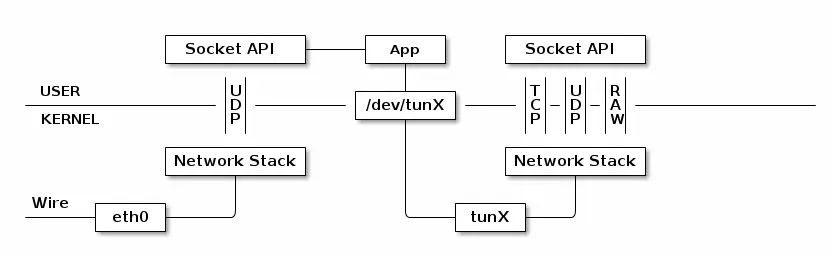
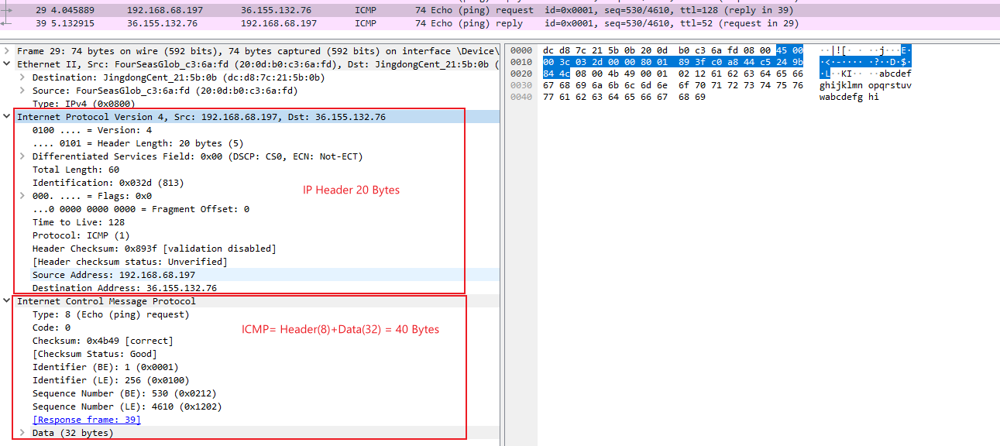

## RUST Network - Tun 

一直想了解加速器的工作原理，看到很多都会提到普通的代理只能提供Tcp的代理，而游戏是走UDP的，一般用Tap设备虚拟网卡和修改路由表的方式来转发游戏的数据到加速服务器

### 网络协议

开发时经常提到：

* 二层协议指数据链路层，主要是以太协议，物理链路算是第一层
* 三层协议就是指网络层，主要是IP协议
* 四层协议是指传输层，主要是TCP和UDP协议
* 应用层协议就是一般的应用程序基于TCP或UDP实现的特殊应用功能的协议

|         | 层次                                  | 作用和协议                                    |
| ------- | ----------------------------------- | ---------------------------------------- |
| Layer 5 | **应用层**application layer            | 例如[HTTP](https://zh.wikipedia.org/wiki/%E8%B6%85%E6%96%87%E6%9C%AC%E4%BC%A0%E8%BE%93%E5%8D%8F%E8%AE%AE)、[FTP](https://zh.wikipedia.org/wiki/%E6%96%87%E4%BB%B6%E4%BC%A0%E8%BE%93%E5%8D%8F%E8%AE%AE)、[DNS](https://zh.wikipedia.org/wiki/DNS)（如[BGP](https://zh.wikipedia.org/wiki/%E8%BE%B9%E7%95%8C%E7%BD%91%E5%85%B3%E5%8D%8F%E8%AE%AE)和[RIP](https://zh.wikipedia.org/wiki/%E8%B7%AF%E7%94%B1%E4%BF%A1%E6%81%AF%E5%8D%8F%E8%AE%AE)这样的路由协议，尽管由于各种各样的原因它们分别运行在TCP和UDP上，仍然可以将它们看作网络层的一部分） |
| Layer 4 | **传输层**transport layer              | 例如[TCP](https://zh.wikipedia.org/wiki/%E4%BC%A0%E8%BE%93%E6%8E%A7%E5%88%B6%E5%8D%8F%E8%AE%AE)、[UDP](https://zh.wikipedia.org/wiki/%E7%94%A8%E6%88%B7%E6%95%B0%E6%8D%AE%E6%8A%A5%E5%8D%8F%E8%AE%AE)、[RTP](https://zh.wikipedia.org/wiki/RTP)、[SCTP](https://zh.wikipedia.org/wiki/SCTP)（如[OSPF](https://zh.wikipedia.org/wiki/OSPF)这样的路由协议，尽管运行在IP上也可以看作是网络层的一部分） |
| Layer 3 | **网络互连层**internet layer             | 对于TCP/IP来说这是[因特网协议](https://zh.wikipedia.org/wiki/%E5%9B%A0%E7%89%B9%E7%BD%91%E5%8D%8F%E8%AE%AE)（IP）（如[ICMP](https://zh.wikipedia.org/wiki/%E4%BA%92%E8%81%94%E7%BD%91%E6%8E%A7%E5%88%B6%E6%B6%88%E6%81%AF%E5%8D%8F%E8%AE%AE)和[IGMP](https://zh.wikipedia.org/wiki/%E5%9B%A0%E7%89%B9%E7%BD%91%E7%BB%84%E7%AE%A1%E7%90%86%E5%8D%8F%E8%AE%AE)这样的必须协议尽管运行在IP上，也仍然可以看作是网络互连层的一部分；[ARP](https://zh.wikipedia.org/wiki/%E5%9C%B0%E5%9D%80%E8%A7%A3%E6%9E%90%E5%8D%8F%E8%AE%AE)不运行在IP上） |
| Layer 2 | **网络链路层**Network Access(link) layer | 例如[以太网](https://zh.wikipedia.org/wiki/%E4%BB%A5%E5%A4%AA%E7%BD%91)、[Wi-Fi](https://zh.wikipedia.org/wiki/Wi-Fi)、[MPLS](https://zh.wikipedia.org/wiki/%E5%A4%9A%E5%8D%8F%E8%AE%AE%E6%A0%87%E7%AD%BE%E4%BA%A4%E6%8D%A2)等。 |

低层协议头包在高层协议外层，例如收到到数据为

```shell
[链路层以太协议包头][IP包头][TCP包头][应用协议包头][应用数据]
```

#### TCP

[RFC793](https://datatracker.ietf.org/doc/html/rfc793) 定义了TCP的详细内容

TCP协议头

```shell
 TCP Header Format( Note that one tick mark represents one bit position)
    0                   1                   2                   3
    0 1 2 3 4 5 6 7 8 9 0 1 2 3 4 5 6 7 8 9 0 1 2 3 4 5 6 7 8 9 0 1
   +-+-+-+-+-+-+-+-+-+-+-+-+-+-+-+-+-+-+-+-+-+-+-+-+-+-+-+-+-+-+-+-+
   |          Source Port          |       Destination Port        |
   +-+-+-+-+-+-+-+-+-+-+-+-+-+-+-+-+-+-+-+-+-+-+-+-+-+-+-+-+-+-+-+-+
   |                        Sequence Number                        |
   +-+-+-+-+-+-+-+-+-+-+-+-+-+-+-+-+-+-+-+-+-+-+-+-+-+-+-+-+-+-+-+-+
   |                    Acknowledgment Number                      |
   +-+-+-+-+-+-+-+-+-+-+-+-+-+-+-+-+-+-+-+-+-+-+-+-+-+-+-+-+-+-+-+-+
   |  Data |           |U|A|P|R|S|F|                               |
   | Offset| Reserved  |R|C|S|S|Y|I|            Window             |
   |       |           |G|K|H|T|N|N|                               |
   +-+-+-+-+-+-+-+-+-+-+-+-+-+-+-+-+-+-+-+-+-+-+-+-+-+-+-+-+-+-+-+-+
   |           Checksum            |         Urgent Pointer        |
   +-+-+-+-+-+-+-+-+-+-+-+-+-+-+-+-+-+-+-+-+-+-+-+-+-+-+-+-+-+-+-+-+
   |                    Options                    |    Padding    |
   +-+-+-+-+-+-+-+-+-+-+-+-+-+-+-+-+-+-+-+-+-+-+-+-+-+-+-+-+-+-+-+-+
   |                             data                              |
   +-+-+-+-+-+-+-+-+-+-+-+-+-+-+-+-+-+-+-+-+-+-+-+-+-+-+-+-+-+-+-+-+  
```

#### UDP

[RFC768](https://datatracker.ietf.org/doc/html/rfc768)定义了UDP协议，很短一份文档

UDP包头

```shell

     0      7 8     15 16    23 24    31
    +--------+--------+--------+--------+
    |     Source      |   Destination   |
    |      Port       |      Port       |
    +--------+--------+--------+--------+
    |                 |                 |
    |     Length      |    Checksum     |
    +--------+--------+--------+--------+
    |
    |          data octets ...
    +---------------- ...
```

#### IP

IP协议分为IPv4 [RFC791](https://datatracker.ietf.org/doc/html/rfc791) 和IPv6 [RFC8200](https://datatracker.ietf.org/doc/html/rfc8200) 

IPv4包头为20字节

```shell
  0                   1                   2                   3
  0 1 2 3 4 5 6 7 8 9 0 1 2 3 4 5 6 7 8 9 0 1 2 3 4 5 6 7 8 9 0 1
 +-+-+-+-+-+-+-+-+-+-+-+-+-+-+-+-+-+-+-+-+-+-+-+-+-+-+-+-+-+-+-+-+
 |Version|  IHL  |Type of Service|          Total Length         |
 +-+-+-+-+-+-+-+-+-+-+-+-+-+-+-+-+-+-+-+-+-+-+-+-+-+-+-+-+-+-+-+-+
 |         Identification        |Flags|      Fragment Offset    |
 +-+-+-+-+-+-+-+-+-+-+-+-+-+-+-+-+-+-+-+-+-+-+-+-+-+-+-+-+-+-+-+-+
 |  Time to Live |    Protocol   |         Header Checksum       |
 +-+-+-+-+-+-+-+-+-+-+-+-+-+-+-+-+-+-+-+-+-+-+-+-+-+-+-+-+-+-+-+-+
 |                       Source Address                          |
 +-+-+-+-+-+-+-+-+-+-+-+-+-+-+-+-+-+-+-+-+-+-+-+-+-+-+-+-+-+-+-+-+
 |                    Destination Address                        |
 +-+-+-+-+-+-+-+-+-+-+-+-+-+-+-+-+-+-+-+-+-+-+-+-+-+-+-+-+-+-+-+-+
 |                    Options                    |    Padding    |
 +-+-+-+-+-+-+-+-+-+-+-+-+-+-+-+-+-+-+-+-+-+-+-+-+-+-+-+-+-+-+-+-+
```

#### ICMP

[RFC 792](https://datatracker.ietf.org/doc/html/rfc792)定义了ICMP

ping命令的协议格式如下

```shell
Echo or Echo Reply Message
    0                   1                   2                   3
    0 1 2 3 4 5 6 7 8 9 0 1 2 3 4 5 6 7 8 9 0 1 2 3 4 5 6 7 8 9 0 1
   +-+-+-+-+-+-+-+-+-+-+-+-+-+-+-+-+-+-+-+-+-+-+-+-+-+-+-+-+-+-+-+-+
   |     Type      |     Code      |          Checksum             |
   +-+-+-+-+-+-+-+-+-+-+-+-+-+-+-+-+-+-+-+-+-+-+-+-+-+-+-+-+-+-+-+-+
   |           Identifier          |        Sequence Number        |
   +-+-+-+-+-+-+-+-+-+-+-+-+-+-+-+-+-+-+-+-+-+-+-+-+-+-+-+-+-+-+-+-+
   |     Data ...
   +-+-+-+-+-
```

### Raw Packet编程

#### Socket

网络应用程序通信时会使用socket来建立主机间的点对点连接，[RFC3493](https://datatracker.ietf.org/doc/html/rfc3493) 对它有一些扩展描述。一般可以认为socket是在传输层和应用层之间的会话层，因为它建立了两个设备之间会话连接。普通的应用程序使用socket编程时，会设置socket的类型为`SOCK_STREAM`表示TCP数据传输或`SOCK_DGRAM`表示UDP数据传输。当然对于抓包应用程序，还可以设置类型为`SOCK_RAW`，这样获取到数据不会被内核的TCP/IP协议栈处理掉对应的TCP或IP的包头。socket编程学习可以参考https://w3.cs.jmu.edu/kirkpams/OpenCSF/Books/csf/html/Sockets.html

一般应用程序不会使用raw类型的socket，因为原始包中的TCP或IP包头没有被处理，就需要应用程序来处理这些包头，这些不是应用程序关心的协议，所以很少会用`SOCK_RAW`类型。

如果是为了学习网络协议，特别是底层协议，就需要获取到网卡传给内核的原始数据包。由于应用程序在用户空间无法获取到内核空间的数据，应用程序拿到的网络数据一般（除了`SOCK_RAW`）都是经过内核的协议栈处理过的TCP或UDP协议上的数据，这些数据的TCP或UDP的包头已经被内核处理掉了，应用直接拿到的就是数据而不包括协议头。

### 虚拟网络设备

linux类的系统中提供了[Tap/Tun](https://www.kernel.org/doc/html/v5.8/networking/tuntap.html)虚拟网卡设备，它可以在**用户空间**接收和传输原始数据包，可以看作是一个简单的从物理介质上收发数据的点对点或以太设备。




使用虚拟网卡的基本步骤：

1. 创建虚拟网卡设备，一般网卡名称为Tap0或Tun0
2. 给虚拟网卡配置ip地址，掩码，网关信息，可能还需要路由信息，让指定ip的访问都通过这个网卡传输
3. 网络应用程序中打开这个虚拟网卡，得到对应的设备描述符，通过描述符读写数据
4. 例如主机A的浏览器需要从服务器B下载文件，但是主机A不能直接访问到服务器B，通过配置路由表，让对服务器B的访问都通过虚拟网卡Tun0传输，此时浏览器像B地址的请求，内核会发送给虚拟网卡Tun0
5. 网络应用程序收到内核给Tun0发来的IP数据包，并将IP数据包数据包加密压缩处理后发送给代理服务器P
6. 代理服务器P收到数据包，解压解密后，向服务器B发送请求，并得到B的应答
7. 代理服务器P将服务器B的应答压缩加密后，发送回网络应用程序
8. 网络应用程序通过Tun0网卡把解压和解密后数据发送给浏览器

整个过程中内核会把tun0当作真实的物理网卡

#### Tap和Tun区别

Tap工作在2层网络，它的数据包从以太帧开始

Tun工作在3层网络，它的数据包从IP包开始

因此，如果想要自己实现TCP或UDP协议，使用tun就足够了，如果想实现ARP协议，需要Tap设备，参看[编写网络协议栈之Ethernet & ARP Protocol](https://www.cnblogs.com/kaleidopink/p/13961730.html)

#### wintun

linux内核默认支持了tun/tap虚拟网卡，windows可以通过wintun来创建tun网卡。

[wintun](https://www.wintun.net/)是WireGuard软件中使用的为windows内核实现的tun虚拟网卡设备，使用方法和linux的tun相同。

#### rust使用wintun

crate [wintun](https://github.com/nulldotblack/wintun) 是对wintun动态库的rust封装，项目中有使用这个crate的例子程序

```toml
[dependencies]
wintun = "0.4.0"
```

### ICMP by Rust

ICMP虽然和IP在同一层，但是它也是由IP包头里面打包的。ping命令就是ICMP的一个重要功能。

`[IP Header][ICMP Header][ICMP Data]`

通过使用socket的`SOCK_RAW`类型也可以实现ping命令，参看[Linux下实现ping程序](https://www.cnblogs.com/kaleidopink/p/12589362.html)。

为了学习tun和rust参考[Implementing ICMP in Rust](https://dev.to/xphoniex/i-implementing-icmp-in-rust-296o)和[study-udp](https://github.com/pysrc/study-udp) 来实现ICMP的ping命令应答。

下图为`ping -4 www.baidu.com`执行后的数据包，可以看到IP包包头20字节，ICMP的 Echo包共40字节




工程依赖使用wintun和etherparse，后者用来解析ip包

```toml
[dependencies]
wintun = "0.4.0"
etherparse = "0.13.0"
```

下载wintun的压缩包，解压后wintun目录放在项目的根目录中

```rust
use std::sync::{atomic::{AtomicBool, Ordering}, Arc};
// 根据平台获取dll位置
pub fn get_wintun_bin_relative_path() -> Result<std::path::PathBuf, Box<dyn std::error::Error>> {
    let dll_path = if cfg!(target_arch = "x86") {
        "wintun/bin/x86/wintun.dll"
    } else if cfg!(target_arch = "x86_64") {
        "wintun/bin/amd64/wintun.dll"
    } else if cfg!(target_arch = "arm") {
        "wintun/bin/arm/wintun.dll"
    } else if cfg!(target_arch = "aarch64") {
        "wintun/bin/arm64/wintun.dll"
    } else {
        return Err("Unsupported architecture".into());
    };
    Ok(dll_path.into())
}

// 初始化Tun网适配器
fn init_tun_nic() -> Arc<wintun::Adapter> {
    let dll_path = get_wintun_bin_relative_path().unwrap();
    let wintun = unsafe { wintun::load_from_path(dll_path).expect("load dll failed") };
	// 打开虚拟网卡
    let adapter = match wintun::Adapter::open(&wintun, "NetProto") {
        Ok(a) => a,
        Err(_) => wintun::Adapter::create(&wintun, "NetProto", "Work", None).expect("Create tun adapter failed"),
    };

    let version = wintun::get_running_driver_version(&wintun).unwrap();
    println!("Using wintun version: {:?}", version);

    // set the address for the tun nic
    let index = adapter.get_adapter_index().unwrap();
    let set_metric = format!("netsh interface ip set interface {} metric=255", index);
    let set_gateway = format!(
        "netsh interface ip set address {} static 172.250.68.50/24 gateway=172.250.68.1", index);
    println!("{}", set_gateway);

    // 添加路由表，让172.250.68.50/24子网下的流量都走172.250.68.1虚拟网卡
    let set_route = format!("netsh interface ip add route 172.250.68.50/24 {} 172.250.68.1",  index);

    // execute the command
    std::process::Command::new("cmd")
        .arg("/C")
        .arg(set_metric)
        .output()
        .unwrap();
    std::process::Command::new("cmd")
        .arg("/C")
        .arg(set_gateway)
        .output()
        .unwrap();
    // 执行添加路由命令
    std::process::Command::new("cmd")
        .arg("/C")
        .arg(set_route)
        .output()
        .unwrap();

    adapter    
}

// 计算校验和
fn calculate_checksum(data: &mut [u8]) {
    let mut f = 0;
    let mut chk: u32 = 0;
    while f + 2 <= data.len() {
        chk += u16::from_le_bytes(data[f..f+2].try_into().unwrap()) as u32;        
        f += 2;
    }
    //chk &= 0xffffffff; // unneccesary
    while chk > 0xffff {
        chk = (chk & 0xffff) + (chk >> 2*8);
    }
    let mut chk = chk as u16;
    chk = !chk & 0xffff;
    // endianness
    //chk = chk >> 8 | ((chk & 0xff) << 8);
    data[3] = (chk >> 8) as u8;
    data[2] = (chk & 0xff) as u8;
}

const ICMP_ECHO_REQUEST : u8 = 8;
const ICMP_ECHO_REPLY   : u8 = 0;

// ICMP数据包
pub struct ICMPPacket <'a> {
    ip: etherparse::Ipv4Header,
    icmp_id: u16,
    seq_no: u16,
    data: &'a [u8],
}

impl<'a> ICMPPacket <'a> {
    pub fn start(iph: etherparse::Ipv4HeaderSlice, data: &'a [u8]) -> std::io::Result<Option<Self>> {
        let mut packet = ICMPPacket {
            ip: etherparse::Ipv4Header::new(
                0,
                64,
                etherparse::IpNumber::Icmp as u8,
                [ // 应答的源和目的地址要对调
                    iph.destination()[0],
                    iph.destination()[1],
                    iph.destination()[2],
                    iph.destination()[3],
                ],
                [
                    iph.source()[0],
                    iph.source()[1],
                    iph.source()[2],
                    iph.source()[3],
                ],
            ),
            icmp_id: u16::from_be_bytes(data[4..6].try_into().unwrap()),
            seq_no: u16::from_be_bytes(data[6..8].try_into().unwrap()),
            data: data,
        };
        Ok(Some(packet))
    }

    pub fn build_response(&mut self, buf: &mut [u8]) -> std::io::Result<usize> {
        use std::io::Write;
        // IP header
        self.ip.set_payload_len(self.data.len());        
        let mut unwritten = &mut buf[..];
        self.ip.write(&mut unwritten);
        // 实际测试，IP头20字节，ICMP头8字节，数据32字节，共40字节
        let mut icmp_reply = [0u8; 40];
        icmp_reply[0] = ICMP_ECHO_REPLY;                                // type
        icmp_reply[1] = 0;			                        // code - always 0?

        icmp_reply[2] = 0x00;                                           // checksum = 2 & 3, empty for now 
        icmp_reply[3] = 0x00;                                           // 
        icmp_reply[4] = ((self.icmp_id >> 8) & 0xff) as u8;             // id = 4 & 5 
        icmp_reply[5] = (self.icmp_id & 0xff) as u8;
        icmp_reply[6] = ((self.seq_no >> 8) & 0xff) as u8;              // seq_no = 6 & 7
        icmp_reply[7] = (self.seq_no & 0xff) as u8;
        icmp_reply[8..self.data.len()].clone_from_slice(&self.data[8..]);

        // finally we substitute the checksum 
        calculate_checksum(&mut icmp_reply);
        unwritten.write(&icmp_reply);
        Ok(unwritten.len())
    }
}

static RUNNING: AtomicBool = AtomicBool::new(true);

fn main_loop(adapter: Arc<wintun::Adapter>) {
    let session = Arc::new(adapter.start_session(wintun::MAX_RING_CAPACITY).expect("new session failed"));

    let reader_session = session.clone();
    let writer_session = session.clone();  

    let reader = std::thread::spawn(move || {
        while RUNNING.load(Ordering::Relaxed) {
            let packet = reader_session.receive_blocking();
            if let Err(err) = packet {
                println!("Error reading packet: {:?}", err);
                break;
            }
            let packet = packet?;
            let bytes = packet.bytes();
            let len = bytes.len();
            match etherparse::Ipv4HeaderSlice::from_slice(&bytes[..len]) {
                Ok(iph) => {
                    let src = iph.source_addr();
                    let dst = iph.destination_addr();
                    let proto = iph.protocol();
                    // 只处理ICMP
                    if proto != etherparse::IpNumber::Icmp as u8 {
                        continue;
                    }
                    println!("Read packet size {} bytes. Source: {:?}, Destination: {:?}, Protocol: {:?}", len, src, dst, proto);
                    let data = &bytes[0..];
                    let hex_string = data.iter().map(|byte| format!("{:02x}", byte)).collect::<Vec<String>>().join(" ");
                    println!("Read packet size {} bytes. Header data: {:?}", len, hex_string);
                    //Read packet size 60 bytes. Header data: "45 00 00 3c b3 be 00 00 80 01 a4 77 ac fa 44 32 ac fa 44 64 08 00 4b 4d 00 01 02 0e 61 62 63 64 65 66 67 68 69 6a 6b 6c 6d 6e 6f 70 71 72 73 74 
                    //75 76 77 61 62 63 64 65 66 67 68 69" 
                    let iph_len = iph.slice().len() as u16;                   
                    println!("ip header len: {}", iph_len); //ip header len: 20
                    let data_buf = &bytes[iph.slice().len()..len];

                    // 应答数据
                    if let Some(mut packet) = ICMPPacket::start(
                        iph,
                        data_buf,// ping要求原包应答
                    ).unwrap() {
                        let resp_len = iph_len + data_buf.len() as u16;
                        let mut write_pack = writer_session.allocate_send_packet(resp_len).unwrap();
                        let mut buf = write_pack.bytes_mut();
                        packet.build_response(&mut buf).unwrap();
                        writer_session.send_packet(write_pack);
                        println!("responded to type# {} packet from {} data len {}", proto, src, resp_len);
                    }
                }
                Err(e) => {
                    // 其他网络包 ignoring weird packet Ipv4UnexpectedVersion(6)
                    //eprintln!("ignoring weird packet {:?}", e);
                }
            }            
        }
        Ok::<(), wintun::Error>(())
    });    

    println!("Press enter to stop session");
    let mut line = String::new();
    let _ = std::io::stdin().read_line(&mut line);
    println!("Shutting down session");

    RUNNING.store(false, Ordering::Relaxed);
    session.shutdown().unwrap();
    let _ = reader.join().map_err(|err| wintun::Error::from(format!("{:?}", err))).unwrap();

    println!("Shutdown complete");
}

fn main() {
    let adapter = init_tun_nic();
    main_loop(adapter);
}
```


