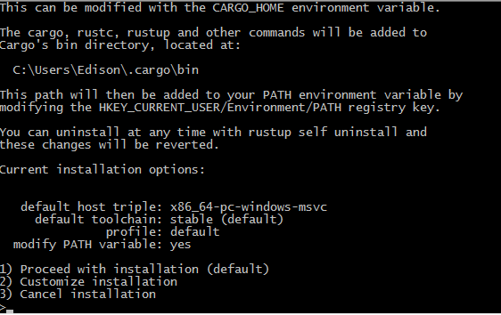
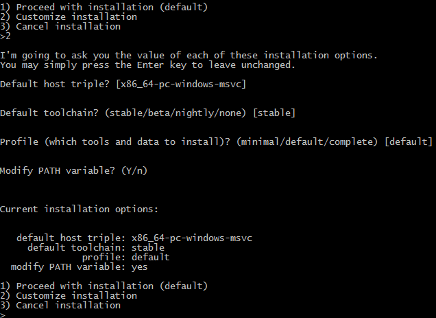
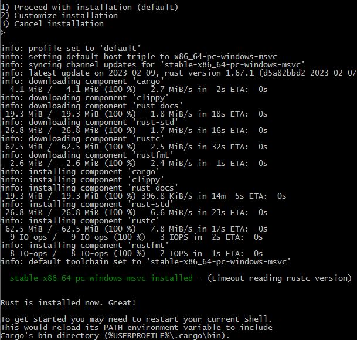
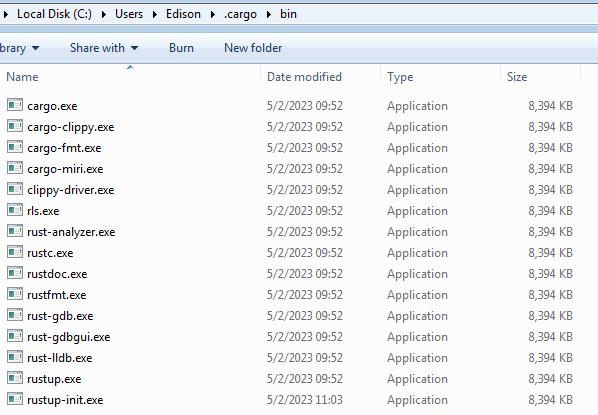
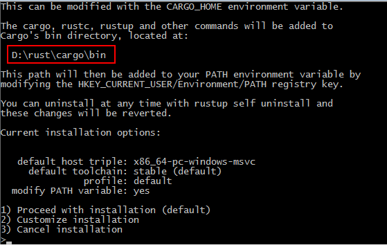
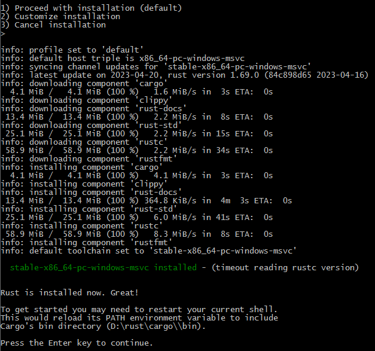

## RUSTUP 

https://rust-lang.github.io/rustup/index.html

rustup 是一个管理 Rust 版本和相关工具的命令行工具，官方推荐使用rustup来安装和管理rust的版本和工具链。

对于rust开发，rustup不是必须安装的，对于离线安装或使用系统自带的包管理器情况，可以直接安装自己需要的版本。https://forge.rust-lang.org/infra/other-installation-methods.html提供了离线安装包。离线安装包中不包含rustup，所以对于交叉编译的场景不是很方便。

对于一般Windows平台开发下载`x86_64-pc-windows-msvc`的64位版本，rust会使用msvc的库，而`x86_64-pc-windows-gnu`的版本则会使用gnu提供的c/c++库。需要根据自己的应用程序环境决定使用哪个版本的安装包。

如果选择了MSVC版本，由于rust需要使用VC的链接器和库，因此还需要安装Visual Studio，至少是2013版本之后。[详情](https://rust-lang.github.io/rustup/installation/windows-msvc.html)

### rustup安装rust

Windows上运行`rustup-init.exe`后，会议命令行交互提示的方式提示当前的安装选项

通过选择2后，可以配置自己修改安装的设置

继续回车后，rustup会逐个下载组件进行安装

rustup会把rustc，cargo, rustup等工具程序安装在`.cargo\bin\`目录中。

**更新** `$rustup update`

**安装状态** `$rustc --version`  输出 `rustc 1.67.1 (d5a82bbd2 2023-02-07)`

**查看文档** `rustup doc`会自动使用默认浏览器打开安装的离线文档页面

#### 自定义安装目录

rustup的默认安装目录是用户目录下的`.cargo\`和`.rustup\`，这两个目录在首次安装完差不多要用1G多空间，可以把这两个目录调整到其他磁盘节省C盘占用。

先配置好`CARGO_HOME`和`RUSTUP_HOME`两个环境变量，再执行`rustup-init.exe`，此时交互提示中的目录会变化环境变量指定的目录。

在`RUSTUP_HOME`目录中会自动创建downloads和tmp目录，以及`settings.toml`文件。

rustup的安装程序会自动下载每一个组件，并在最后把cargo的bin目录加入系统path中

现在所有的程序都安装到了新目录下，不用担心C盘空间。

`D:\rust\cargo\registry`目录中是当前系统中已经安装过的包。

