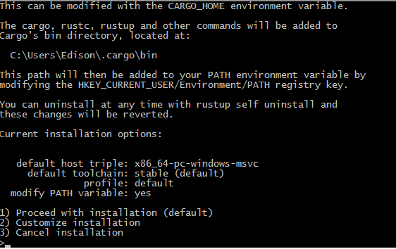
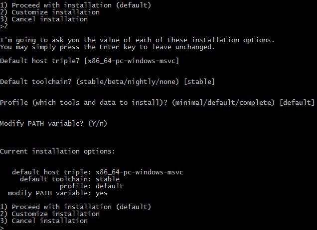
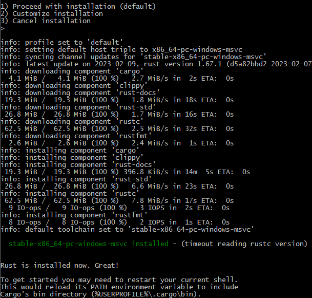
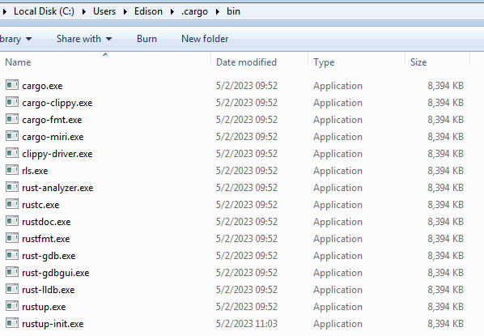
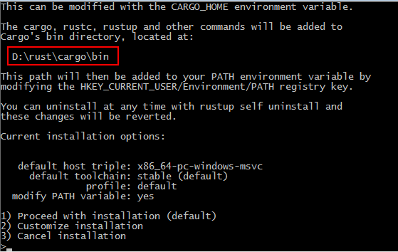
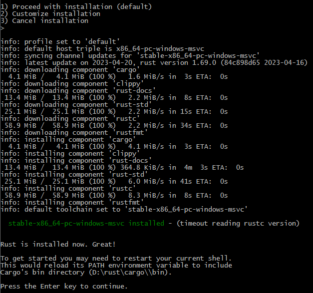

## RUSTUP 

https://rust-lang.github.io/rustup/index.html

rustup 是一个管理 Rust 版本和相关工具的命令行工具，官方推荐使用rustup来安装和管理rust的版本和工具链。

对于rust开发，rustup不是必须安装的，对于离线安装或使用系统自带的包管理器情况，可以直接安装自己需要的版本。https://forge.rust-lang.org/infra/other-installation-methods.html提供了离线安装包。离线安装包中不包含rustup，所以对于交叉编译的场景不是很方便。

对于一般Windows平台开发下载`x86_64-pc-windows-msvc`的64位版本，rust会使用msvc的库，而`x86_64-pc-windows-gnu`的版本则会使用gnu提供的c/c++库。需要根据自己的应用程序环境决定使用哪个版本的安装包。

如果选择了MSVC版本，由于rust需要使用VC的链接器和库，因此还需要安装Visual Studio，至少是2013版本之后。[详情](https://rust-lang.github.io/rustup/installation/windows-msvc.html)

### rustup安装rust

Windows上运行`rustup-init.exe`后，会议命令行交互提示的方式提示当前的安装选项




通过选择2后，可以配置自己修改安装的设置




继续回车后，rustup会逐个下载组件进行安装




rustup会把rustc，cargo, rustup等工具程序安装在`.cargo\bin\`目录中。




**更新** `$rustup update`

**安装状态** `$rustc --version`  输出 `rustc 1.67.1 (d5a82bbd2 2023-02-07)`

**查看文档** `rustup doc`会自动使用默认浏览器打开安装的离线文档页面

#### 自定义安装目录

rustup的默认安装目录是用户目录下的`.cargo\`和`.rustup\`，这两个目录在首次安装完差不多要用1G多空间，可以把这两个目录调整到其他磁盘节省C盘占用。

先配置好`CARGO_HOME`和`RUSTUP_HOME`两个环境变量，再执行`rustup-init.exe`，此时交互提示中的目录会变化环境变量指定的目录。




在`RUSTUP_HOME`目录中会自动创建downloads和tmp目录，以及`settings.toml`文件。

rustup的安装程序会自动下载每一个组件，并在最后把cargo的bin目录加入系统path中




现在所有的程序都安装到了新目录下，不用担心C盘空间。

`D:\rust\cargo\registry`目录中是当前系统中已经安装过的包。

#### 配置rust库的安装源

windows系统添加以下两个环境变量可以使用国内的镜像站更新rustup


~~RUSTUP_DIST_SERVER=https://mirrors.ustc.edu.cn/rust-static~~
~~RUSTUP_UPDATE_ROOT=https://mirrors.ustc.edu.cn/rust-static/rustup~~

中科大的访问现在有问题，改为用aliyun的镜像

```shell
RUSTUP_UPDATE_ROOT=https://mirrors.aliyun.com/rustup/rustup
RUSTUP_DIST_SERVER=https://mirrors.aliyun.com/rustup
```

rustup使用`https://rsproxy.cn/`的源可以正常下载指定的rust版本，而aliyun镜像源索引文件地址错误，总是在错误的目录中找版本文件，只有最新版本的索引地址时正确的。下面的命令在使用zsh终端时，临时配置源的地址为https://rsproxy.cn。

```Bash
export RUSTUP_DIST_SERVER="https://rsproxy.cn"
export RUSTUP_UPDATE_ROOT="https://rsproxy.cn/rustup"
```

Cargo下载依赖库的镜像配置，在` $CARGO_HOME` 目录下新建一个`config.toml`文件，内容如下

```ini
[source.crates-io]
registry = "https://github.com/rust-lang/crates.io-index"
replace-with = 'aliyun'

[source.aliyun]
registry = "sparse+https://mirrors.aliyun.com/crates.io-index/"
```

中科大的不能用改为阿里云 [使用说明](https://developer.aliyun.com/mirror/rustup) 

 [Rust Crates 源使用帮助 — USTC Mirror Help 文档](https://mirrors.ustc.edu.cn/help/crates.io-index.html) 

### 交叉编译

rust种使用的编译平台的命名规则`<arch><sub>-<vendor>-<sys>-<env>`，例如`x86_64-unknown-linux-gnu` `x86_64-pc-windows-msvc` `armv7-linux-androideabi`

1. 安装目标库

   `rustup target add armv7-unknown-linux-gnueabi`

   `rustup target add aarch64-unknown-linux-gnu` 

   安装后的库目录为

   `.\rustup\toolchains\stable-x86_64-pc-windows-msvc\lib\rustlib\armv7-unknown-linux-gnueabi`

   使用`rustup show`可以看到当前安装过的环境

2. 配置目标的链接器

   因为rust要使用目标的链接器生成二进制文件，所以如果没有配置目标链接器，会提示`error: linker `cc` not found`错误

3. 交叉编译

   `cargo build --target=armv7-unknown-linux-gnueabi`

### 开发工具

#### VS Code插件

[参考来源](https://github.com/tyr-rust-bootcamp/template)

1. GitLens ：Git增强，可以在代码行中显示文本编辑的时间和修改人
2. Dependi ：检查依赖库是否安全，支持多种语言
3. Indent-Rainbow ：缩进优化显示
4. Indent-Rainbow ：rust语法分析和api提示
5. Rust Test Explorer：侧边栏显示rust单元测试
6. TODO Highlight：高亮显示TODO注释
7. Error Lens：错误信息优化显示
#### 其他工具

1. [pre-commit](https://pre-commit.com/)：git commit之前会自动执行一些批处理，需要结合`.pre-commit-config.yaml`文件一起使用
	1. 安装`pip install pre-commit`
	2. 在工程目录下执行`pre-commit install`
	3. 在下一次执行`git commit`前会检查项目是否有错误，没有错误后，就会弹出默认编辑器用来输入commit的信息。
2. cargo deny：检查依赖的安全性，例如依赖一些库不是MIT的就会提示 `cargo install --locked cargo-deny`，之后执行`cargo deny check`检查项目是否存在问题。
3. typos：拼写检查工具`cargo install typos-cli`
4. git cliff：生成CHANGELOG的工具`cargo install git-cliff`
5. cargo nextest：单元测试更快的执行`cargo install cargo-nextest --locked`
6. tokei：统计一个目录下的代码信息`cargo install tokei` https://github.com/XAMPPRocky/tokei


