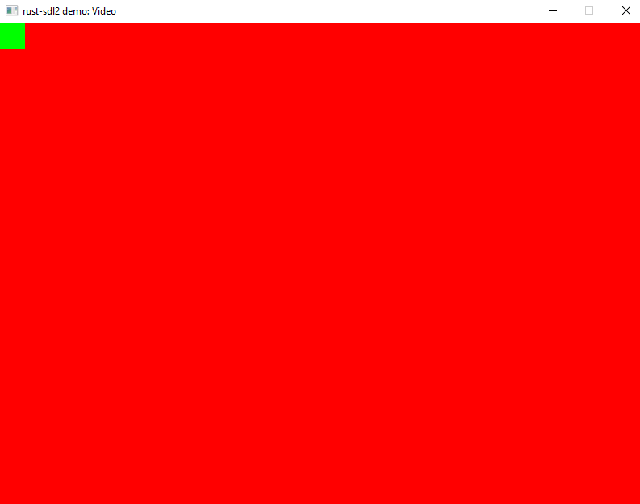
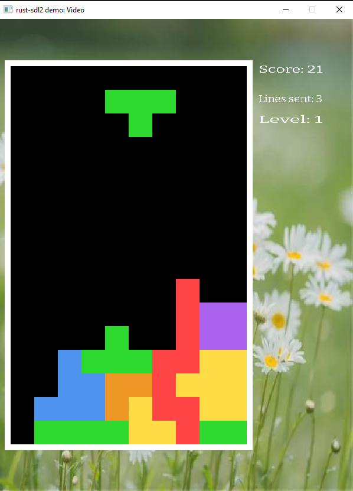

## RUST SDL2 Develop 

>  Rust Programming by Example . Chapter 2-3-4


相关代码 https://github.com/memorywalker/rtetris

### SDL2开发环境

#### 配置SDL

SDL2的官方https://www.libsdl.org/下载最新库文件 https://github.com/libsdl-org/SDL/releases/tag/release-2.30.0

SDL2的各个子项目地址 https://www.libsdl.org/projects/

对于windows下载[SDL2-devel-2.30.0-VC.zip](https://github.com/libsdl-org/SDL/releases/download/release-2.30.0/SDL2-devel-2.30.0-VC.zip)，下载github上文件时，可以加上http://ghproxy.com/前缀，使用代理更快下载文件。

`https://ghproxy.com/https://github.com/libsdl-org/SDL/releases/download/release-2.30.0/SDL2-devel-2.30.0-VC.zip`

SDL2库是由C语言实现的跨平台库，为了能在rust使用可以使用https://github.com/Rust-SDL2/rust-sdl2. 这个rust对SDL2封装，就能直接使用rust语言来开发。

安装`Rust-SDL2 ` https://github.com/Rust-SDL2/rust-sdl2. 在页面有详细的不同平台安装流程，对于Window MSVC环境：

1. 把下载的SDL2-devel-2.30.0-VC.zip中`SDL2-2.30.0\lib\x64\`的所有文件拷贝到rustup的库目录中`.rustup\toolchains\stable-x86_64-pc-windows-msvc\lib\rustlib\x86_64-pc-windows-msvc\lib\`

2. 使用`cargo new rtetris`创建一个工程名为`rtetris`的应用程序工程

3. 工程的`Cargo.toml`文件中增加以下依赖代码

   ```toml
   [dependencies]
   sdl2 = "0.36"
   ```

4. 把`SDL2.dll`文件拷贝到rust开发工程的根目录（和`Cargo.toml`相同目录）

#### 语义化版本(semantic version)

Semantic Versioning的版本有三个部分`[major].[minor].[patch]`

**major**: 重大修改且有不兼容的API变化

**minor**:增加新的功能，但不会破坏版本兼容性

**patch**: 修改bug的小更改

#### SDL特性设置

要使用sdl2的特性扩展，需要修改toml文件，不再使用之前的依赖写法，而针对sdl2单独写使用哪些特性

```toml
[dependencies.sdl2]
version = "0.36"
default-features = false
features = ["image"]
```

### 简单窗口程序

以下代码是一个简单的窗口程序，可以用测试程序是否可以正常编译

```rust
extern crate sdl2;

use sdl2::pixels::Color;
use sdl2::event::Event;
use sdl2::keyboard::Keycode;
use sdl2::rect::Rect;
use sdl2::render::{Texture, TextureCreator};

use std::time::Duration;
use std::thread::sleep;

const TEXTURE_SIZE : u32 = 32;

fn main() {
    // 初始化sdl
    let sdl_context = sdl2::init().expect("SDL Init failed");
    // 获取视频系统
    let video_subsystem = sdl_context.video().expect("Couldn't get sdl video subsystem");
    // 获取窗口，并设置窗口的属性，整个屏幕居中，使用opengl渲染
    let window = video_subsystem.window("rust-sdl2 demo: Video", 800, 600)
                    .position_centered()
                    .opengl()
                    .build()
                    .expect("Failed to create window");
    // 获取窗口画布，支持垂直同步
    let mut canvas = window.into_canvas()
                    .target_texture()
                    .present_vsync()
                    .build()
                    .expect("Failed to convert window into canvas");
    // 获取画布的纹理创建者
    let texture_creator: TextureCreator<_> = canvas.texture_creator();
    // 创建一个正方形纹理
    let mut square_texture: Texture = texture_creator.create_texture_target(None, TEXTURE_SIZE, TEXTURE_SIZE)
                .expect("Failed to create a texture");
    // 使用画布绘制纹理
    canvas.with_texture_canvas(&mut square_texture, |texture| {
        texture.set_draw_color(Color::RGB(0, 255, 0));
        texture.clear(); // 填充背景色
    }).expect("Failed to color a texture");

    // 事件句柄
    let mut event_pump = sdl_context.event_pump().expect("Failed to get SDL event pump");

    'running: loop {
        // 事件处理循环
        for event in event_pump.poll_iter() {
            match event {
                Event::Quit { .. } | 
                Event::KeyDown { keycode: Some(Keycode::Escape), ..} => 
                {
                    break 'running // 如果收到esc或关闭，退出这个事件循环
                },
                _=> {}
            }
        }
        // 绘制窗口的背景色
        canvas.set_draw_color(Color::RGB(255, 0, 0));
        canvas.clear();
        // 把纹理拷贝到窗口中的指定位置
        canvas.copy(&square_texture, None, Rect::new(0, 0, TEXTURE_SIZE, TEXTURE_SIZE))
                    .expect("Failed to copy texture into window");
        // 更新窗口显示
        canvas.present();

        // 每1秒60帧执行这个循环，所以要没1/60秒就sleep一下
        sleep(Duration::new(0, 1_000_000_000u32/60));
    }
}
```

执行`cargo run`只会的程序如下




### 外部资源使用

#### 图片资源

##### 配置SDL的Image扩展库

SDL的图片插件地址为https://github.com/libsdl-org/SDL_image

把下载的[SDL2_image-devel-2.8.2-VC.zip](https://github.com/libsdl-org/SDL_image/releases/download/release-2.8.2/SDL2_image-devel-2.8.2-VC.zip)和SDL库一样配置。把其中的x64目录中的所有库文件放在rustup的库目录，把动态库文件也在工程目录中放一份。

##### 图片加载代码

书中代码编译不过，参考https://github.com/Rust-SDL2/rust-sdl2/blob/master/examples/image-demo.rs例子调整引用和初始化

```rust
use sdl2::image::{LoadTexture, InitFlag};
// 初始化图像上下文
let _image_context = sdl2::image::init(InitFlag::PNG | InitFlag::JPG).expect("Failed to initialize the image context");
// 创建一个图像纹理用来显示    
let image_texture = texture_creator.load_texture("res/images/flower.jpeg").expect("Failed to load image");
...
// 把图像纹理拷贝到窗口中
canvas.copy(&image_texture, None, None).expect("Failed to copy image to window");
```

其中图片资源放在工程根目录的`/res/images/`目录下

#### 读写文件

新建一个score_file.rs文件用来存取分数和行数。迭代器的next()在collect()调用的时候才会被执行。

```rust
use std::fs::File;
use std::io::{self, Read, Write};

fn write_into_file(content: &str, file_name: &str) -> io::Result<()> {
    let mut f = File::create(file_name)?;
    f.write_all(content.as_bytes())
}

fn read_from_file(file_name: &str) -> io::Result<String> {
    let mut f = File::open(file_name)?;
    let mut content = String::new();
    f.read_to_string(&mut content)?;
    Ok(content)
}

// 把数组中的每一个值转换为string类型，最后再把Vec<String>的每一个string用空格连接起来
fn slice_to_string(slice: &[u32]) -> String {
    slice.iter().map(|highscores| highscores.to_string())
                        .collect::<Vec<String>>().join(" ")
}
// 文件有两行，第一行存储分数列表，第二行存储函数列表
pub fn save_highscores_and_lines(highscores: &[u32], number_of_lines: &[u32]) -> bool {
    let s_highscores = slice_to_string(highscores);
    let s_num_of_lines = slice_to_string(number_of_lines);
    write_into_file(format!("{}\n{}\n", s_highscores, s_num_of_lines).as_str(),"save.txt").is_ok()
}

// 把一行文本中的字符用空格分割，并将每一个字串转换为u32类型的数字，最后返回一个vec
fn line_to_slice(line: &str) -> Vec<u32> {
    line.split(" ").filter_map(
        |nb| nb.parse::<u32>().ok())
        .collect()
}

// 分别读取两行文本，并把每一行的文本解析成数字的vec
pub fn load_highscores_and_lines() -> Option<(Vec<u32>, Vec<u32>)> {
    if let Ok(constent) = read_from_file("save.txt") {
        let mut lines = constent.splitn(2, "\n").map(
            |line| line_to_slice(line)).collect::<Vec<_>>();
        if lines.len() == 2 {
            let (number_lines, highscores) = (lines.pop().unwrap(), lines.pop().unwrap());
            Some((highscores, number_lines))
        } else {
            None
        }
    } else {
        None
    }
}
```

在main.rs文件中

```rust
mod score_file;

fn main() {
    let scores:[u32; 2] = [10, 20];
    let lines: [u32; 2] = [500,600];
    score_file::save_highscores_and_lines(&scores, &lines);
    if let Some(values) = score_file::load_highscores_and_lines() {
        println!("scores:{:?}, lines:{:?}", values.0, values.1); // scores:[10, 20], lines:[500]
    } else {
        println!("None data");
    }
}
```

#### 使用字体

https://github.com/libsdl-org/SDL_ttf

http://ghproxy.com/https://github.com/libsdl-org/SDL_ttf/releases/download/release-2.22.0/SDL2_ttf-devel-2.22.0-VC.zip

同其他功能一样把`SDL2_ttf.dll`拷贝到rustup的lib目录和当前工程目录。把下载的字体文件放在工程的`/res/font/xxx.ttf`

##### 加载字体

```rust
let ttf_context = sdl2::ttf::init().expect("SDL TTF initialization failed");
let mut font = ttf_context.load_font("res/font/Bitter-Regular.ttf", 60).expect("Couldn't load the font");  
font.set_style(sdl2::ttf::FontStyle::NORMAL);
```

##### 使用字体

```rust
fn create_texture_from_text<'a>(texture_creator: &'a TextureCreator<WindowContext>,
       font: &sdl2::ttf::Font,
       text: &str,
       r: u8, g: u8, b: u8) -> Option<Texture<'a>> {
    if let Ok(surface) = font.render(text).blended(Color::RGB(r, g, b)) {
        texture_creator.create_texture_from_surface(&surface).ok()
    } else {
        None
    }
}
let score_text = format!("Score: {}", 100);
let score = create_texture_from_text(&texture_creator, &font, &score_text, 255, 255, 255)
canvas.copy(&score, None, Some(Rect::new(width as i32 - 40, 0, 40, 30))).expect("Couldn't copy text");
```

### 俄罗斯方块游戏




#### 数据定义

##### 方块结构

俄罗斯方块的每一个掉落块都有四个格子组成，一共有7种方块，分别用T I L J O S Z来表示。使用4*4的二维数组表示一个方块，因为最长的I有4个格子，所以宽和高至少为4。

```rust
type Piece = Vec<Vec<u8>>; // 表示一种二维图形
type States = Vec<Piece>;

pub struct Tetrimino {
    pub states: States,
    pub x: isize, // 方块的坐标位置
    pub y: usize,
    pub current_state: u8, // 当前是哪一种状态，例如长条I有两种
}
每一个方块是个4*4的图像
****
****
****
****
```

每一个方块由于旋转，又可以有不同的状态。例如S有两种状态，分别为水平方向和垂直方向。

```rust
struct TetriminoS;

impl TetriminoGenerator for TetriminoS {
    fn new() -> Tetrimino {
        Tetrimino {
            states: vec![vec![vec![0, 5, 5, 0],
                              vec![5, 5, 0, 0],
                              vec![0, 0, 0, 0],
                              vec![0, 0, 0, 0]],
                         vec![vec![0, 5, 0, 0],
                              vec![0, 5, 5, 0],
                              vec![0, 0, 5, 0],
                              vec![0, 0, 0, 0]]],
            x: 4, // 初始的位置放在中间
            y: 0,
            current_state: 0,
        }
    }
}
```

##### 游戏主体结构

游戏主体可以看作一个16*10的网格，它有16行高，每一行有10个格子。下落的方块在这个网格中不停的移动。网格初始状态下全是0，当一行全部都不为0时，这一行就消除

```rust
pub struct Tetris {
    pub game_map: Vec<Vec<u8>>, // 16*10的网格
    pub current_level: u32,
    pub score: u32,
    pub nb_lines: u32, // 消除的总行数
    pub current_piece: Option<Tetrimino>, // 当前下落的方块
} 
```

#### 方块的行为

方块可以旋转，移动，还要判断这个方块是否和网格中的边界冲突

```rust
impl Tetrimino {
    fn rotate(&mut self, game_map: &[Vec<u8>]) {
        // 旋转就认为时状态的变化
        let mut tmp_state = self.current_state + 1;
        // 状态不能超过最大情况
        if tmp_state as usize >= self.states.len() {
            tmp_state = 0;
        }
        // 在水平方向尝试能不能找到合适的文位置，简化游戏
        let x_pos = [0, -1, 1, -2, 2, -3];
        for x in x_pos.iter() {
            if self.test_position(game_map, tmp_state as usize,
                                  self.x + x, self.y) == true {
                self.current_state = tmp_state; // 如果不冲突，就可以切换为这个形状
                self.x += *x;
                break
            }
        }
    }
    // 检测与网格中的其他元素是否冲突
    fn test_position(&self, game_map: &[Vec<u8>],
                     tmp_state: usize, x: isize, y: usize) -> bool {
        for shift_y in 0..4 {
            for shift_x in 0..4 {
                // 遍历方块当前状态的每一个点
                let x = x + shift_x;
                if self.states[tmp_state][shift_y][shift_x as usize] != 0 && // 方块中这个格子不为0
                    (y + shift_y >= game_map.len() || // y 方向没有超过网格的高度
                     x < 0 ||
                     x as usize >= game_map[y + shift_y].len() || // 没有超过行的最大宽度10
                     game_map[y + shift_y][x as usize] != 0) { // 和地图网格的当前位置的格子不冲突
                    return false;
                }
            }
        }
        return true;
    }
    
    // 移动方块的位置，下落，移动后每次都要检测是否冲突
    fn change_position(&mut self, game_map: &[Vec<u8>], new_x: isize, new_y: usize) -> bool {
        if self.test_position(game_map, self.current_state as usize, new_x, new_y) == true {
            self.x = new_x as isize;
            self.y = new_y;
            true
        } else {
            false
        }
    }
}
```

#### 游戏主体行为

游戏的主体对象创建一个16*10的网格，随机创建一个当前要下落的方块，每一次移动方块后，把当前下落的方块和网格合并，并可以消除填满的一行。

```rust
impl Tetris {
    pub fn new() -> Tetris {
        // 地图大小为16行，每行10个格子
        let mut game_map = Vec::new();
        for _ in 0..16 {
            game_map.push(vec![0, 0, 0, 0, 0, 0, 0, 0, 0, 0]);
        }
        Tetris {
            game_map: game_map,
            current_level: 1,
            score: 0,
            nb_lines: 0,
            current_piece: None,
        }
    }

    // 随机生成一个形状
    fn create_new_tetrimino(&self) -> Tetrimino {
        static mut PREV: u8 = 7; // 和C++中的静态变量作用相同
        let mut rand_nb = rand::random::<u8>() % 7;
        // 避免生成两个相同的，因为静态变量存在多线程同时访问的问题，所以是不安全的
        if unsafe { PREV } == rand_nb {
            rand_nb = rand::random::<u8>() % 7;
        }
        unsafe { PREV = rand_nb; }

        match rand_nb {
            0 => TetriminoI::new(),
            1 => TetriminoJ::new(),
            2 => TetriminoL::new(),
            3 => TetriminoO::new(),
            4 => TetriminoS::new(),
            5 => TetriminoZ::new(),
            6 => TetriminoT::new(),
            _ => unreachable!(),
        }
    }

    fn update_score(&mut self, to_add: u32) {
        self.score += to_add;
    }

    fn increase_level(&mut self) {
        self.current_level += 1;
    }
    // 消除的行数超过当前级别的行数要求后，级别增加一级
    fn increase_line(&mut self) {
        self.nb_lines += 1;
        if self.nb_lines > LEVEL_LINES[self.current_level as usize - 1] {
            self.increase_level();
        }
    }

    // 把一个块合并地图网格中
    fn make_permanent(&mut self) {
        let mut to_add = 0;
        if let Some(ref mut piece) = self.current_piece {
            let mut shift_y = 0;
            // 遍历当前块的y轴，并且当前位置的y不会超过地图的高度
            while shift_y < piece.states[piece.current_state as usize].len() &&
                  piece.y + shift_y < self.game_map.len() { 
                let mut shift_x = 0;
                // 遍历当前块的每一个x轴的格子不会超过地图的宽度
                while shift_x < piece.states[piece.current_state as usize][shift_y].len() &&
                      (piece.x + shift_x as isize) < self.game_map[piece.y + shift_y].len() as isize {
                    //如果块的当前格子不为0，需要把地图的这个格子也设置为块的格子的相同值，表示颜色
                    if piece.states[piece.current_state as usize][shift_y][shift_x] != 0 {
                        let x = piece.x + shift_x as isize;
                        self.game_map[piece.y + shift_y][x as usize] =
                            piece.states[piece.current_state as usize][shift_y][shift_x];
                    }
                    shift_x += 1;
                }
                shift_y += 1;
            }
            // 合并一个块后增加分数
            to_add += self.current_level;
        }
        self.update_score(to_add);
        // 检查是否有可以删除的行
        self.check_lines();
        // 当前块已经被处理过了，所以设置为None
        self.current_piece = None;
    }

    fn check_lines(&mut self) {
        let mut remove_num = 0;
        let mut y = 0;
        let mut score_add = 0;
        // 遍历网格的每一行
        while y < self.game_map.len() {
            let mut complete = true;
            // 一行中有一个格子是0，说明不能消除
            for x in &self.game_map[y] {
                if *x == 0 {
                    complete = false;
                    break
                }
            }
            // 如果这一行可以消除
            if complete == true {
                score_add += self.current_level;
                self.game_map.remove(y);
                remove_num += 1;
                y -= 1;
            }
            y += 1;
        }
        // 连消4行
        if remove_num == 4 {
            // A "tetris"!
            score_add += 1000;
        }
        self.update_score(score_add);
        while self.game_map.len() < 16 {
            self.increase_line();
            // 补上消除的行，保证网格还是16*10
            self.game_map.insert(0, vec![0, 0, 0, 0, 0, 0, 0, 0, 0, 0]);
        }
    }    
}
```

#### 键盘事件处理

```rust
pub fn handle_events(tetris: &mut Tetris, quit: &mut bool, timer: &mut SystemTime,
                event_pump: &mut sdl2::EventPump) -> bool {
    // 一个块正在下落
    let mut make_permanent = false;
    if let Some(ref mut piece) = tetris.current_piece {
        let mut tmp_x = piece.x;
        let mut tmp_y = piece.y;

        for event in event_pump.poll_iter() {
            match event {
                Event::Quit { .. } |
                Event::KeyDown { keycode: Some(Keycode::Escape), .. } => {
                    *quit = true;
                    break
                }
                Event::KeyDown { keycode: Some(Keycode::Down), .. } => {
                    *timer = SystemTime::now();// 更新下落的计时器
                    tmp_y += 1;
                }
                Event::KeyDown { keycode: Some(Keycode::Right), .. } => {
                    tmp_x += 1;
                }
                Event::KeyDown { keycode: Some(Keycode::Left), .. } => {
                    tmp_x -= 1;
                }
                Event::KeyDown { keycode: Some(Keycode::Up), .. } => {
                    piece.rotate(&tetris.game_map);
                }
                Event::KeyDown { keycode: Some(Keycode::Space), .. } => {
                    let x = piece.x;
                    let mut y = piece.y;
                    // 手动快速下降到底部或有冲突不能移动
                    while piece.change_position(&tetris.game_map, x, y + 1) == true {
                        y += 1;
                    }
                    // 不能移动了，所以标记为需要合并到网格地图
                    make_permanent = true;
                }
                _ => {}
            }
        }
        // 根据按键后的坐标位置移动方块
        if !make_permanent {
            // 如果不能移动，且当前y的值也没有变化，说明已经移动到最下面了，需要合并方块到网格
            if piece.change_position(&tetris.game_map, tmp_x, tmp_y) == false && tmp_y != piece.y {
                make_permanent = true;
            }
        }
    }
    if make_permanent {
        // 合并方块后，更新计时器
        tetris.make_permanent();
        *timer = SystemTime::now();
    }
    make_permanent
}
```

#### 定时下落处理

在程序的主循环中调用下落函数，其中判断当前的时间间隔是否超过了当前级别的时间阈值，如果超过，就开始让当前块的y增加1，如果不能移动当前块，就把当前合并块到网格

```rust
pub fn falling(tetris: & mut Tetris, timer: &mut SystemTime) {
    if is_time_over(&tetris, &timer) {
        let mut make_permanent = false;
        if let Some(ref mut piece) = tetris.current_piece {
          let x = piece.x;
          let y = piece.y + 1;
          make_permanent = !piece.change_position(&tetris.game_map, x, y);
        }
        if make_permanent {
          tetris.make_permanent();
        }        
        *timer = SystemTime::now();
    }
}

// 判断是否需要处理下落的时间到了
fn is_time_over(tetris: &Tetris, timer: &SystemTime) -> bool {
    match timer.elapsed() {
        Ok(elapsed) => {
            // 得到毫秒值
            let millis = elapsed.as_secs() as u32 * 1000 + elapsed.subsec_nanos() / 1_000_000;
            millis > LEVEL_TIMES[tetris.current_level as usize - 1]
        }
        Err(_) => false,
    }
}
// 创建一个新的方块开始下落
pub fn update_tetris(tetris: & mut Tetris) -> bool {
    let mut ret = true;
    if tetris.current_piece.is_none() {
        let current_piece = tetris.create_new_tetrimino();
        if !current_piece.test_current_position(&tetris.game_map) {            
            ret = false; // 新创建的方块就已经冲突了，说明游戏结束了
        } else {
            tetris.current_piece = Some(current_piece);
            ret = true;
        }       
    }
    ret
}
```

#### 程序主体循环

```rust
loop {
        // 处理下落逻辑数据
        tetris::falling(&mut tetris, &mut timer);

        // 游戏区域的黑色背景，用来擦除刷新
        canvas.copy(&grid,
            None,
            Rect::new(20,(height - TETRIS_HEIGHT as u32 * 16) as i32 / 2,TETRIS_HEIGHT as u32 * 10, TETRIS_HEIGHT as u32 * 16))
                 .expect("Couldn't copy texture into window");
        // 如果当前块已经被合并了，创建新一个新的方块开始下落
        if !update_tetris(&mut tetris) {
            break
        }

        let mut quit = false;
        // 处理按键事件，如果按键事件导致方块合并到了网格地图中，就不需要绘制下落的方块了，否则还需要绘制下落的方块
        if !tetris::handle_events(&mut tetris, &mut quit, &mut timer, &mut event_pump) {
            if let Some(ref mut piece) = tetris.current_piece {
                for (line_nb, line) in piece.states[piece.current_state as usize].iter().enumerate() {
                    for (case_nb, case) in line.iter().enumerate() {
                        // 如果块的状态的格子为0，说明是空的，不用绘制
                        if *case == 0 {
                            continue
                        }
                        // 绘制当前移动的块的一个格子，case为块中的数字，用来选择用那种颜色
                        canvas.copy(&textures[*case as usize - 1],
                                None,
                                Rect::new(grid_x + (piece.x + case_nb as isize) as i32 * TETRIS_HEIGHT as i32,
                                             grid_y + (piece.y + line_nb) as i32 * TETRIS_HEIGHT as i32,
                                         TETRIS_HEIGHT as u32, 
                                                TETRIS_HEIGHT as u32)
                                    ).expect("Couldn't copy texture into window");
                    }
                }
            }
        }

        if quit {            
            break
        }

        // 绘制地图中所有非0的格子，即已经合并过的，这里面没有正在移动的块，正在移动的块还没合并到地图里面
        for (line_nb, line) in tetris.game_map.iter().enumerate() {
            for (case_nb, case) in line.iter().enumerate() {
               if *case == 0 {
                  continue
               }
               canvas.copy(&textures[*case as usize - 1],
                  None,
                  Rect::new(grid_x + case_nb as i32 * TETRIS_HEIGHT as i32,
                  grid_y + line_nb as i32 * TETRIS_HEIGHT as i32,
                  TETRIS_HEIGHT as u32, TETRIS_HEIGHT as u32))
                  .expect("Couldn't copy texture into window");
            }
        }
                
        // 更新窗口显示
        canvas.present();

        // 每1秒60帧执行这个循环，所以要没1/60秒就sleep一下
        sleep(Duration::new(0, 1_000_000_000u32/60));
}
```

#### 其他关键代码

在给网格或方块填充纹理时，根据格子中的数字来填充对应的纹理。因为有7种类型的方块，每一种方块有一种固定的颜色，所以创建7个不同颜色的方块纹理。这里代码使用了宏来简化代码。

```rust
// 一个用来创建正方形纹理的函数
fn create_texture_rect<'a>(canvas: &mut Canvas<Window>, 
    texture_creator: &'a TextureCreator<WindowContext>,
    r: u8, g: u8, b: u8,
    size: u32
    ) -> Option<Texture<'a>> {
    if let Ok(mut square_texture) = 
        texture_creator.create_texture_target(None, size, size) {
            canvas.with_texture_canvas(&mut square_texture, |texture| {
                texture.set_draw_color(Color::RGB(r, g, b));
                texture.clear(); // fill the color
                }).expect("Failed to color a texture");
        Some(square_texture)
    } else {
        None
    }
}

	// 使用宏简化代码
    macro_rules! texture {
        ($r:expr, $g:expr, $b:expr) => (
            create_texture_rect(&mut canvas, &texture_creator, 
                $r, $g, $b, TETRIS_HEIGHT as u32).unwrap()
        )
    }
    // 7种纹理方块，对应每个块的颜色
    let textures = [texture!(255, 69, 69), texture!(255, 220, 69), texture!(237, 150, 37), 
                                        texture!(171, 99, 237), texture!(77, 149, 239), 
                                        texture!(39, 218, 225), texture!(45, 216, 47)];
```


