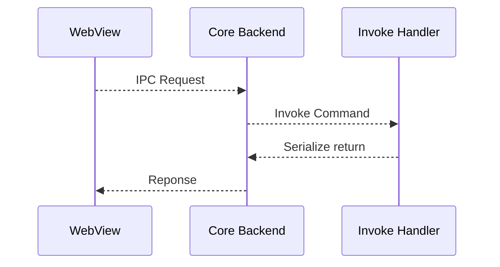

## 使用Tauri开发简单桌面程序

Tauri 可以开发主流桌面和移动平台应用程序。使用任何可编译为 HTML、JavaScript 和 CSS 的前端框架来构前端，使用 Rust、Swift 和 Kotlin 等语言进行后端逻辑开发。

https://tauri.app/zh-cn/start/

### 基本架构
#### 核心组件


* **TAO**用于跨平台创建应用程序窗口，使用rust实现，是winit的分支。
* **WRY**跨平台WebView渲染库，使用rust实现，作为抽象层决定使用哪个WebView以及如何交互
* **tauri-runtime**，tauri与底层WebView库之间的粘合层
* **tauri-runtime-wry**，为WRY提供系统级交互，例如打印、显示器检测等
* **tauri-macros**，使用`tauri-codegen`为上下文、处理程序和命令创建宏
#### 进程模型

每个 Tauri 应用程序都有一个核心进程和多个WebView进程。

##### 核心进程

* 应用程序的入口点，并且是唯一一个拥有完全操作系统访问权限的组件
* 创建和协调应用程序窗口、系统托盘菜单或通知
* 路由所有进程间通信，允许你在一个中心位置拦截、过滤和操作 IPC 消息
* 负责管理全局状态，例如设置或数据库连接
##### WebView进程

* 利用操作系统的WevView库
* 相当于一个浏览器，执行前端HTML、JavaScript代码
* 可以通过检查页面元素调试前端页面
##### 进程间通信

Tauri使用异步消息传递进行进程间通信，通信消息有两种：
* **事件**：一次性、单向IPC消息，可以由WebView或核心进程发出
* **命令**：允许前端通过`invoke` API调用rust的函数并获取返回数据，命令消息使用类似JSON-RPC协议来序列化请求和响应，所有参数和返回数据必须能序列化为json。




### 开发环境

Windows 10（从版本 1803 开始）系统默认支持了WebView2

1.  安装rust
2. 安装nodejs
3. 安装pnpm，使用npm的方式安装`npx pnpm@latest-10 dlx @pnpm/exe@latest-10 setup`
4.  使用cargo安装`create-tauri-app`，这个脚手架工具可以用来引导创建工程`cargo install create-tauri-app --locked`
5. 使用工具创建工程`cargo create-tauri-app`
6. 根据提示选择工程名称，标识，前端语言，框架等
```bash
➜  /e/dev/rust cargo create-tauri-app
✔ Project name · memory-store
✔ Identifier · memorywalker
✔ Choose which language to use for your frontend · TypeScript / JavaScript - (pnpm, yarn, npm, deno, bun)
✔ Choose your package manager · pnpm
✔ Choose your UI template · Vue - (https://vuejs.org/)
✔ Choose your UI flavor · TypeScript
```
7. 进入新创建的工程目录，执行`pnpm install`
8. 执行`pnpm tauri dev`运行程序

### 工程结构

默认创建的工程目录如下
```
  ├── .gitignore        
  ├── index.html        
  ├── package.json      
  ├── README.md
  ├── tsconfig.json     
  ├── tsconfig.node.json
  └── vite.config.ts    
  ├── .vscode
  ├── public
  ├── src
    ├── App.vue
    ├── main.ts
    └── vite-env.d.ts
    └── assets
  └── src-tauri
    ├── .gitignore
    ├── build.rs
    ├── Cargo.lock
    ├── Cargo.toml
    └── tauri.conf.json
    ├── capabilities
    ├── gen
    ├── icons
    └── src
      ├── lib.rs
      └── main.rs
```

- `tauri.conf.json` 是Tauri的主要的配置文件cli工具也会依赖它的位置来找Rust工程目录
- `capabilities/` directory is the default folder Tauri reads [capability files](https://v2.tauri.app/security/capabilities/) from (in short, you need to allow commands here to use them in your JavaScript code), to learn more about it, see [Security](https://v2.tauri.app/security/)
- `icons/` 在 `tauri.conf.json > bundle > icon` 下引用，作为应用的图标
- `build.rs`  tauri编译程序
- `src/lib.rs` 包含Rust 代码和移动端程序入口点`#[cfg_attr(mobile, tauri::mobile_entry_point)]`), 移动平台上rust代码会编译为库，再被框架使用。
- `src/main.rs` 桌面程序的入口点，它的main函数中调用lib.rs中的 `app_lib::run()` 从而实现和移动端相同的调用流程，后续的代码实现都放在lib.rs中，而不是这个文件。

#### 前端配置

tauri可以看作是一个静态网页服务器，所以需要告诉tauri这些静态网页资源的信息。官方推荐使用vite作为前端框架。
对于根目录中的`package.json`，确认前端开发和编译配置如下：
```json
  "scripts": {
    "dev": "vite",
    "build": "vue-tsc --noEmit && vite build",
    "preview": "vite preview",
    "tauri": "tauri"
  },
```

`tauri.conf.json`中编译字段的内容配置如下，前端静态资源最终目录为`../dist`
```json
  "build": {
    "beforeDevCommand": "pnpm dev",
    "devUrl": "http://localhost:1420",
    "beforeBuildCommand": "pnpm build",
    "frontendDist": "../dist"
  },
```
确保`vite.config.ts`中的配置服务端口和`tauri.conf.json`中的端口相同。

### 模板代码说明

#### 前端调用后端

前端`App.vue`中，通过输入框调用js的`function greet()`函数，这个函数通过调用`@tauri-apps/api/core`的**invoke**方法给后端发送命令，第一个参数是命令的名称，第二个参数是命令的参数，这里就是输入框中的值。后端函数异步调用返回的结果字串给变量`greetMsg`，最后页面显示这个结果字串。

```html
<script setup lang="ts">
import { ref } from "vue";
import { invoke } from "@tauri-apps/api/core";  

const greetMsg = ref("");
const name = ref(""); 
async function greet() {
  // Learn more about Tauri commands at https://tauri.app/develop/calling-rust/
  greetMsg.value = await invoke("greet", { name: name.value });
}
</script>
... other html code
    <form class="row" @submit.prevent="greet">
      <input id="greet-input" v-model="name" placeholder="Enter a name..." />
      <button type="submit">Greet</button>
    </form>
    <p>{{ greetMsg }}</p>
```

后端`capabilities\default.json`中**permissions**字段设置了`"core:default"`允许前端使用tauri的基本命令。

`lib.rs`中定义名称为`greet`的函数，这个函数使用`#[tauri::command]`属性宏告诉tauri框架这是一个命令处理函数，它接收输入的参数，并返回一个字串结果。在run函数的`.invoke_handler`中需要把这个greet函数注册，从而让前端的invoke可以调用。

```rust
// Learn more about Tauri commands at https://tauri.app/develop/calling-rust/
#[tauri::command]
fn greet(name: &str) -> String {
    format!("Hello, {}! You've been greeted from Rust!", name)
}  

#[cfg_attr(mobile, tauri::mobile_entry_point)]
pub fn run() {
    tauri::Builder::default()
        .plugin(tauri_plugin_opener::init())
        .invoke_handler(tauri::generate_handler![greet])
        .run(tauri::generate_context!())
        .expect("error while running tauri application");
}
```

### 实现一个汇率换算程序

#### 前端更改

src目录下新增一个components目录，其中新建`Converter.vue`组件

```ts
<script setup lang="ts">
import { ref, defineProps, watch } from 'vue';
import { invoke } from '@tauri-apps/api/core';

const props = defineProps<{
  availableCurrencies: string[]
}>();

const amount = ref('');
const convertedAmount = ref('');
const conversionError = ref('');
const fromCurrency = ref(props.availableCurrencies?.[2] ?? 'UAH');
const toCurrency = ref(props.availableCurrencies?.[3] ?? 'CNY');
const isConverting = ref(false);

function swapCurrencies() {
  if (isConverting.value) return;
  const tmp = fromCurrency.value;
  fromCurrency.value = toCurrency.value;
  toCurrency.value = tmp;
  convertedAmount.value = '';
  conversionError.value = '';
}

async function convertCurrency() {
  conversionError.value = '';
  convertedAmount.value = '';
  isConverting.value = true;
  try {
    const amountValue = parseFloat(amount.value);
    if (isNaN(amountValue)) {
      conversionError.value = 'Please enter a valid number';
      return;
    }

    const result = await invoke('convert_currency', {
      amount: amountValue,
      from: fromCurrency.value,
      to: toCurrency.value,
    });

    convertedAmount.value = (result as number).toFixed(2);
  } catch (error) {
    conversionError.value = typeof error === 'string' ? error : JSON.stringify(error);
    convertedAmount.value = '';
  } finally {
    isConverting.value = false;
  }
}

// Clear result/error when currencies change
watch(fromCurrency, () => {
  convertedAmount.value = '';
  conversionError.value = '';
});

watch(toCurrency, () => {
  convertedAmount.value = '';
  conversionError.value = '';
});
</script>

<template>
  <section>
    <form class="row compact-row" @submit.prevent="convertCurrency">
      <input class="compact-input" v-model="amount" placeholder="Amount" />

      <select class="compact-select" v-model="fromCurrency">
        <option v-for="c in availableCurrencies" :key="c" :value="c">{{ c }}</option>
      </select>

      <button type="button" class="icon-button" @click="swapCurrencies" :disabled="isConverting">⇄</button>

      <select class="compact-select" v-model="toCurrency">
        <option v-for="c in availableCurrencies" :key="c" :value="c">{{ c }}</option>
      </select>

      <button type="submit" class="compact-btn" :disabled="isConverting">{{ isConverting ? '...' : 'Convert' }}</button>

      <span v-if="convertedAmount" class="result-badge">{{ convertedAmount }} <span class="result-currency">{{ toCurrency }}</span></span>
    </form>

    <div style="margin-top: 0.5rem">
      <div v-if="conversionError" style="color:crimson">{{ conversionError }}</div>
    </div>
  </section>
</template>

<style scoped>
.row { display: flex; justify-content: center; }
.compact-row { gap: 0.4rem; align-items: center; }
.compact-input { width: 6rem; padding: 0.35em 0.5em; font-size: 0.9em; }
.compact-select { padding: 0.35em 0.5em; font-size: 0.9em; }
.compact-btn { padding: 0.35em 0.6em; font-size: 0.9em; }
.icon-button { padding: 0.35em 0.5em; font-size: 0.9em; }
.link-btn { margin-left: 0.4rem; background: transparent; border: none; color: #646cff; cursor: pointer; text-decoration: underline; }
.result-badge { display: inline-flex; align-items: center; margin-left: 0.6rem; background: linear-gradient(90deg, #e6f0ff, #dce8ff); color: #0b3a8c; padding: 0.35em 0.6em; border-radius: 999px; font-weight: 600; box-shadow: 0 2px 6px rgba(13, 30, 80, 0.08); }
.result-currency { margin-left: 0.4rem; opacity: 0.8; font-weight: 500; }
</style>
```

App.vue中引用新增的组件
```ts
<script setup lang="ts">
import { ref } from "vue";
import Converter from "./components/Converter.vue";

// available currencies for the Converter component
const availableCurrencies = ref(["USD", "EUR", "UAH", "CNY", "GBP", "JPY"]);
</script>

<template>
  <main class="container">
    <section style="margin-top: 2rem">
      <h2>Currency Converter</h2>
      <Converter :available-currencies="availableCurrencies" />
    </section>
  </main>
</template>
```
#### 后端更改

1. 新建`src-tauri\src\commands`目录，并在其中新建`convert.rs`程序用来处理汇率换算
```rust
use serde_json::Value;

#[tauri::command]
pub async fn convert_currency(amount: f64, from: String, to: String) -> Result<f64, String> {
    // We'll fetch rates using exchangerate-api with base set to `from`
    let url = format!("https://api.exchangerate-api.com/v4/latest/{}", from);

    // Send GET request
    let response = reqwest::get(&url)
        .await
        .map_err(|e| format!("Failed to fetch exchange rates: {}", e))?;

    // Check if response is successful
    if !response.status().is_success() {
        return Err(format!("Failed to fetch exchange rates. Status: {}", response.status()));
    }

    // Parse JSON response
    let json: Value = response
        .json()
        .await
        .map_err(|e| format!("Failed to parse exchange rates: {}", e))?;

    // Use helper to extract rate and compute conversion
    compute_converted_amount_from_json(amount, &json, &to)
}

/// Helper: given the parsed JSON (from the exchangerate API) extract the target rate
/// and compute converted amount. This is pure and easy to unit test.
pub fn compute_converted_amount_from_json(
    amount: f64,
    json: &Value,
    to: &str,
) -> Result<f64, String> {
    json["rates"][to]
        .as_f64()
        .map(|rate| amount * rate)
        .ok_or_else(|| format!("Failed to extract {} rate from response", to))
}

#[cfg(test)]
mod tests {
    use super::*;
    use serde_json::json;

    #[test]
    fn compute_conversion_success() {
        let json = json!({
            "rates": {
                "USD": 2.0,
                "CNY": 0.5
            }
        });

        let res = compute_converted_amount_from_json(10.0, &json, "USD").unwrap();
        assert!((res - 20.0).abs() < 1e-9);
    }

    #[test]
    fn compute_conversion_missing_rate() {
        let json = json!({
            "rates": {
                "CNY": 0.5
            }
        });

        let err = compute_converted_amount_from_json(10.0, &json, "USD").unwrap_err();
        assert!(err.contains("Failed to extract USD"));
    }
}
```

2. `lib.rs`中使用新增的模块`src-tauri\src\`目录中新增`commands.rs`文件，声明commands目录下的子模块
```rust
pub mod convert;
// Re-export commonly used items
pub use convert::convert_currency;
```
3. `lib.rs`中注册新添加的命令
```rust
pub mod commands;
use commands::{convert_currency, greet};

#[cfg_attr(mobile, tauri::mobile_entry_point)]
pub fn run() {
    tauri::Builder::default()
        .plugin(tauri_plugin_opener::init())
        .invoke_handler(tauri::generate_handler![greet, convert_currency])
        .run(tauri::generate_context!())
        .expect("error while running tauri application");
}
```

新增文件目录结构如下
```
  ├── src
    ├── App.vue
    └── components
      └── Converter.vue
  ├── src-tauri
    └── src
      ├── commands.rs
      ├── lib.rs
      └── main.rs
      └── commands
        ├── convert.rs
        └── greet.rs
```

程序运行


### 程序打包

执行`pnpm tauri build`会编译release版本程序，并使用工具打包。

应用程序编译生成可执行程序后，tauri的工具会自动使用wix314和nsis去制作安装包，但是由于这两个工具需要从github下载，会卡住，因此可以提前配置好这两个工具。

分别使用GitHub代理下载 [WixTools314](https://gh.catmak.name/https://github.com/wixtoolset/wix3/releases/download/wix3141rtm/wix314-binaries.zip)和[NSIS](https://gh.catmak.name/https://github.com/tauri-apps/binary-releases/releases/download/nsis-3/nsis-3.zip)并将压缩包的内容解压到`C:\Users\Edison\AppData\Local\tauri\WixTools314`和`C:\Users\Edison\AppData\Local\tauri\NSIS`目录下。
下载 [nsis_tauri_utils.dll](https://github.com/tauri-apps/nsis-tauri-utils/releases/download/nsis_tauri_utils-v0.5.2/nsis_tauri_utils.dll)到`C:\Users\Edison\AppData\Local\tauri\NSIS\Plugins\x86-unicode\additional`目录下
这样再执行build就可以直接使用下载好的工具打包，生成的安装包在 `\src-tauri\target\release\bundle\`目录下，分别是msi和nsis安装包。
