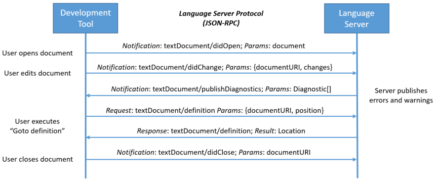
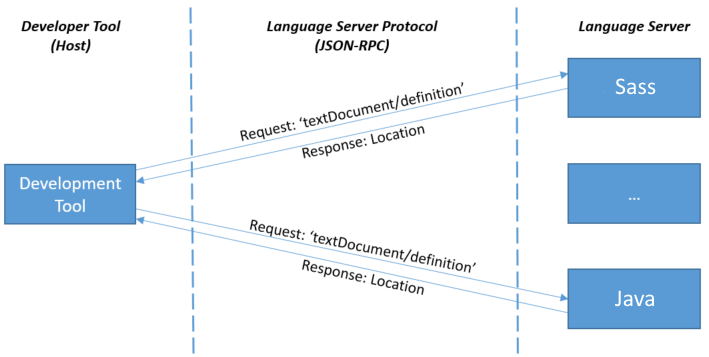
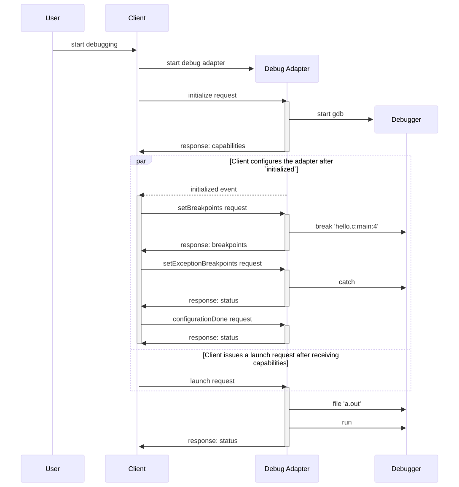

## VS Code工具

### Language Server Protocol 

https://microsoft.github.io/language-server-protocol/overviews/lsp/overview/

代码编辑器中常用的自动补全，转到定义，浮动相关显示文档的功能，每个编辑工具对每种语言都有一套自己的实现，这是很大的重复工作。

通过对每种语言提供一个这个语言规范话的服务端，编辑工具通过与这个服务端进程间通信实现常见的功能。*Language Server Protocol (LSP)* 定义服务与开发工具的通信协议规范，这样服务端可以被多个不同的编辑工具服用。

#### 工作流程

语言服务器作为一个独立的进程运行，开发工具根据语言协议通过JSON-RPC与语言服务器通信。

下面是开发工具和语言服务之间简单的交互过程，包括了打开文档，编辑文档，转到定义以及关闭文档。交互中使用的数据只是文本文档的URI和文档中的位置信息，这些数据是编程语言无关的，所以更容易标准化。

   
      

* 当开发工具通知了语言服务打开文档后，这份文档的内容在开发工具的管理的内存中维护，同时确保它和语言服务是同步更新的。
* 用户编辑了文档后，开发工具通知语言服务文档变化信息，语言服务通过分析变化的代码返回诊断信息，例如编译警告或错误
* 转到定义点击后，开发工具给语言服务发送转到定义请求，并附带当前文档的URI和‘Go to Definition’ 所点击的文本位置给语言服务，语言服务再把函数定义的文档URI和函数定义的文本位置返回给开发工具
* 当关闭文件后，开发工具通知语言服务这个文档已经不在内存中了，磁盘文件系统中的文件就是最新的文件。

这个开发工具转到定义的请求

```json
{
    "jsonrpc": "2.0",
    "id" : 1,
    "method": "textDocument/definition",
    "params": {
        "textDocument": {
            "uri": "file:///p%3A/mseng/VSCode/Playgrounds/cpp/use.cpp"
        },
        "position": {
            "line": 3,
            "character": 12
        }
    }
}
```

语言服务应答信息为

```json
{
    "jsonrpc": "2.0",
    "id": 1,
    "result": {
        "uri": "file:///p%3A/mseng/VSCode/Playgrounds/cpp/provide.cpp",
        "range": {
            "start": {
                "line": 0,
                "character": 4
            },
            "end": {
                "line": 0,
                "character": 11
            }
        }
    }
}
```

#### 语言服务

当开发工具中打开了多种编程语言的文件，开发工具会给每一种语言启动一个语言服务，所以VS Code中打开的语言类型越多，越耗费资源。

语言服务如何集成在开发工具中由开发工具来决定。微软提供了如何实现一个语言Server的指南

https://code.visualstudio.com/api/language-extensions/language-server-extension-guide

   
      

### Debug Adapter Protocol

https://microsoft.github.io/debug-adapter-protocol/overview

开发工具在实现每一种编程语言的调试功能时，都需要使用自己的接口，针对性的开发这个语言的Debugger，这是很大的重复工作。

DAP定义了开发工具和具体语言调试器之间的协议，现有的不同的开发工具和调试器不可能都去按这个协议去实现，所以在开发工具和调试器之间增加一个Debug Adapter的中间件，开发工具实现一个通用的调试功能，具体语言的Debug Adapter的中间件可以被不同的开发工具复用。

标准化使用协议而不是API或客户端库方式定义，这样中间件可以使用最适合调试器或者开发工具的语言来实现。因为开发工具调试时看到的信息主要也是字符串，所以DAP主要使用字符串的格式的数据结构来与调试器的API交互。

#### 基本协议

协议包括消息头和内容，类似Http消息，这两个部分通过`\r\n`来分隔。

##### 头部信息

每一个头部字段由key和value组成，它们之间使用`:`分隔，每个字段以`\r\n`结束。

目前头部字段只有一个，它的key是Content-Length表示内容部分的字节数量。

一个next请求的消息举例：

```json
Content-Length: 119\r\n
\r\n
{
    "seq": 153,
    "type": "request",
    "command": "next",
    "arguments": {
        "threadId": 3
    }
}
```


##### 内容部分

内容部分使用json格式描述请求，应答和事件，内容部分使用utf-8编码。

#### 工作过程

1. 调试开始时，开发工具需要把Debug Adapter运行起来，有两种方式：
   * 单会话模式：Debug Adapter作为一个单独的进程，开发工具和它通过标准输入和输出通信，调试结束，这个进程也会终止，对于并发的多个调试，开发工具需运行多个Debug Adapter。
   * 多会话模式：开发工具不启动Debug Adapter，它假设Debug Adapter已经在运行监听连接，开发工具每一次调试会话与Debug Adapter建立一个网络连接，有多少个调试会话，就有多少个连接。
2. 开发工具给Debug Adapter发送初始请求， [**InitializeRequestArguments**](https://microsoft.github.io/debug-adapter-protocol/specification#Types_InitializeRequestArguments)请求参数中包括开发工具的名称，开发工具支持的特性；Debug Adapter应答 [**InitializeResponse**](https://microsoft.github.io/debug-adapter-protocol/specification#Types_InitializeResponse) 中通过 [**Capabilities**](https://microsoft.github.io/debug-adapter-protocol/specification#Types_Capabilities) 告诉开发工具它支持的特性。一旦开发工具收到Debug Adapter应答的特性后，开发工具就可以发送一个Launch或Attach请求。
   - Launch请求：Debug Adapter启动被调式的程序，并与之通信，通常被调试程序作为Debug Adapter的子进程，程序的debug输出通过output事件连接到Debug Adapter。更好的方式是在终端中运行程序，Debug Adapter可以通过[**runInTerminal**](https://microsoft.github.io/debug-adapter-protocol/specification#Reverse_Requests_RunInTerminal)请求要求开发工具在终端中启动被调试程序，这个终端可以是集成在开发工具或者可以被开发工具配置和管理的外部终端。
   - attach请求：Debug Adapter直接连接一个已经运行起来的程序
3. 配置断点和异常行为：Debug Adapter准备好接收配置信息后，它会给开发工具发送[**initialized**](https://microsoft.github.io/debug-adapter-protocol/specification#Events_Initialized) 事件，开发工具这时才可以给Debug Adapter发送断点等配置信息，当所有的配置信息都发送完成后，开发工具要发送一个[**configurationDoneRequest**](https://microsoft.github.io/debug-adapter-protocol/specification#Requests_ConfigurationDone)请求，告诉Debug Adapter配置信息发送完成了
4. 在Debug Adapter收到配置完成请求后，它可以开始响应之前的启动(Launch)或挂载(Attach)请求，然后调试过程就开始了。
5. 当触发断点或异常程序停止时，Debug Adapter会给开发工具发送 [**stopped**](https://microsoft.github.io/debug-adapter-protocol/specification#Events_Stopped)事件，开发工具在向Debug Adapter请求停止事件中的线程的栈帧信息和变量信息
6. 结束调试，开发工具给Debug Adapter发送 [**terminate**](https://microsoft.github.io/debug-adapter-protocol/specification#Requests_Terminate)请求，被调试程序可以正常终止，也可以发送[**disconnect**](https://microsoft.github.io/debug-adapter-protocol/specification#Requests_Disconnect) 强制结束被调试程序，对于Attached的程序，[**disconnect**](https://microsoft.github.io/debug-adapter-protocol/specification#Requests_Disconnect) 请求只是会断开调试器，被调试的程序还可以正常继续运行。


客户端和Debug Adapter交互流程   
      