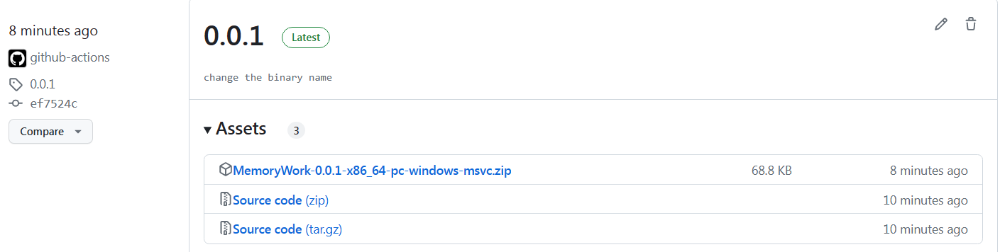
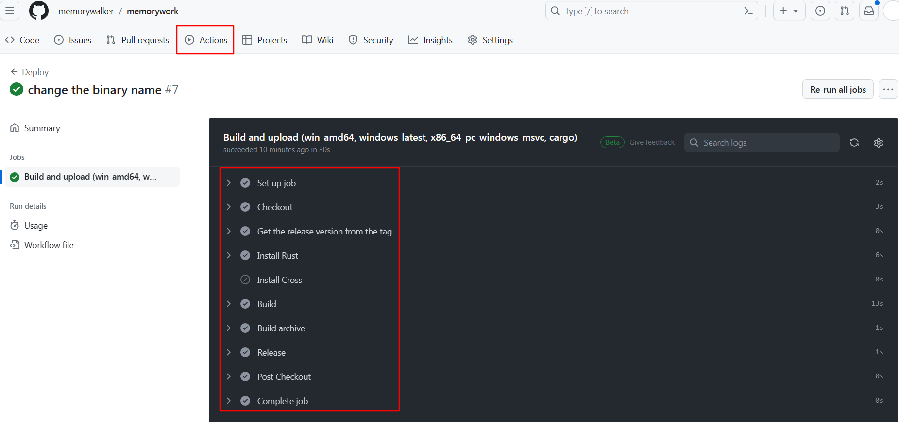

## GitHub Actions 

家里的老电脑还是windows7 系统，只能安装gnu版本的rust，安装步骤还挺复杂，使用rust playground无法编译出二进制文件出来，只是临时学习，用github的持续集成服务应该够用了。

在网上看到两个教程

 [使用 GitHub Actions 部署跨平台 Rust 二进制文件 - MyEdgeTech](https://myedgetech.com/deploy-rust-cross-platform-github-actions/) 

 [Rust Cross-Compilation With GitHub Actions (reemus.dev)](https://reemus.dev/tldr/rust-cross-compilation-github-actions) 

### Rust编译

1. 建立一个rust模版工程 [memorywalker/memorywork (github.com)](https://github.com/memorywalker/memorywork) 

2. 在工程的Actions页面下新建一个工作流，修改文件名为rust.yml

3. 在给工程打tag的时候触发自动编译版本

   ```yml
   on:
     push:
       tags:
         # Regex for a version number such as 0.2.1
         - "[0-9]+.[0-9]+.[0-9]+"
   ```

4. 一个workflow是一个yml文件，由多个job组成，每个job有多个step，每个step可以有不同的action

5. action可以作为一个公共行为的定义，uses表示使用已经定义好的action，github上提供了action的marketplace

6. 整体的流程和本地开发一样：下载代码，配置编译环境，编译，测试，打包。

7. 普通的rust编译可以直接使用cargo命令，多平台的交叉编译可以使用`Cross`这个action

8. 实际使用Cross总会出现`Error: The process 'cross' failed with exit code 125`，所以这里直接使用了Cargo命令，也能节省一些时间

在执行git tag命令后，github会自动执行workflow目录下的`rust.yml`中的jobs

```shell
$ git tag 0.0.1
$ git push origin 0.0.1
```

workflow执行完成后在github的 [Releases](https://github.com/memorywalker/memorywork/releases) 下就有如下程序包




代码`rust.yml`执行过程如下，其中每一行对应了一个step的名字，由于没有使用Cross，所以安装cross没有执行。




```yml
name: Deploy

on:
  push:
    tags:
      - "[0-9]+.[0-9]+.[0-9]+"

permissions:
  contents: write

jobs:
  build-and-upload: # 开始定义一个job
    name: Build and upload #job的名称
    runs-on: ${{ matrix.os }} #job的运行环境

    strategy:
      matrix:
        # 设置不同的编译版本
        include:
          - name: win-amd64
            os: windows-latest
            target: x86_64-pc-windows-msvc
            command: cargo
          # Android config
          #- name: android-arm
          #  os: ubuntu-latest
          #  target: aarch64-linux-android
          #  command: cross            

    steps: # 一个job的多个step
      - name: Checkout
        uses: actions/checkout@v3 #使用官方的checkout action，版本为@之后的v3版

      - name: Get the release version from the tag
        shell: bash
        run: echo "VERSION=${GITHUB_REF#refs/tags/}" >> $GITHUB_ENV

      - name: Install Rust
        # Or @nightly if you want
        uses: dtolnay/rust-toolchain@stable # 使用安装rust的action，版本为稳定版
        # Arguments to pass in
        with:
          # Make Rust compile to our target (defined in the matrix)
          targets: ${{ matrix.target }}

      # 如果有用到cross就安装cross
      - name: Install Cross
        if: matrix.command == 'cross'
        shell: bash
        run: |
          curl -L --proto '=https' --tlsv1.2 -sSf https://raw.githubusercontent.com/cargo-bins/cargo-binstall/main/install-from-binstall-release.sh | bash
          cargo binstall --no-confirm cross

      - name: Build # 执行编译
        run: ${{ matrix.command }} build --verbose --release --target ${{ matrix.target }}

      - name: Build archive # 打包编译好的程序文件
        shell: bash
        run: |
          # Crago的toml文件中的应用程序名称
          binary_name="MemoryWork"

          dirname="$binary_name-${{ env.VERSION }}-${{ matrix.target }}"
          mkdir "$dirname"
          if [ "${{ matrix.os }}" = "windows-latest" ]; then
            mv "target/${{ matrix.target }}/release/$binary_name.exe" "$dirname"
          else
            mv "target/${{ matrix.target }}/release/$binary_name" "$dirname"
          fi

          if [ "${{ matrix.os }}" = "windows-latest" ]; then
            7z a "$dirname.zip" "$dirname"
            echo "ASSET=$dirname.zip" >> $GITHUB_ENV
          else
            tar -czf "$dirname.tar.gz" "$dirname"
            echo "ASSET=$dirname.tar.gz" >> $GITHUB_ENV
          fi

      - name: Release # 使用一个action发布版本
        uses: softprops/action-gh-release@v1
        with:
          files: |
            ${{ env.ASSET }}
```

