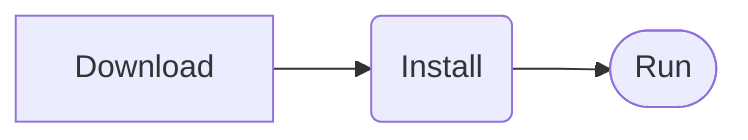

### 基本语法

[LinkText](http://www.google.com) 使用`[LinkText](URL)`创建仓库外的链接

==高亮文本== 使用`==内容==`来让内容高亮显示

~~删除线内容~~ 使用`~~删除内容~~`来使用删除线

- [ ]  To Do is Done 使用`-[ ]`创建一个复选框
- [x] 如果把括号中空格换成x，表示勾选 `-[x]`

[[obsidian-usage]] 使用`[[]]` 来创建双向链接

[[markdown-study]] 链接到名称为markdown-study的笔记，点击链接名称就可以跳转。通过点击右上角的链接图标，可以打开链接侧边面板，查看当前文档的所有链接。

#### tag

#study    #Game/RPG

输入`#study`可以定义一个名称为study的tag。点击右上角的tag图标，可以列出当前仓库的所有tag。
`#Game/RPG` 创建一个多层tag，这里RPG是Game下的子tag

#### 属性

使用`---`可以创建文档的属性，属性必须在文件的第一行开始。
右键属性名称左侧的图标，可以设置属性的类型，有文本，日期，列表等

#### bookmark

* 左上角的工具按钮选择书签后，可以新增一个书签，把一个笔记作为书签，多个不同的书签可以放在同一个书签组中。
* 加入书签的笔记在右上角会有一个书签的图标。 
* 搜索结果也可以作为书签保存，点击搜索结果右侧的三个点图标，弹出的菜单会有个收藏按钮，把这次搜索结果加入书签

#### 关系图谱

* 打开左侧工具栏的关系图谱图后，显示当前仓库的所有文件的关系图
* 通过右上角的设置，可以对关系图显示的内容进行过滤和配置
* 可以对某一个tag创建一个分组，这样这个tag相关的节点颜色一致，更好区分
* 播放动画可以按笔记创建顺序显示所有节点生成过程，可以发现我的rust相关的笔记集中创建出来了

### 设置

* 编辑器->笔记属性：打开后，可以在文件开始显示笔记的名称，tag等信息
* 文件与链接 -> 始终更新内部链接：打开后，如果修改一个笔记的标题，所有对他的链接都可以更新名字
* 文件与链接 -> 内部链接类型：选择默认的最短链接即可，如果是相对路径，链接中会显示路径信息类似这样 `[[_posts/tech/markdown-study|markdown-study]]`
* 文件与链接 -> 忽略文件：添加到这里的文件或文件夹中的文件在快速搜索或建立链接时不会被索引到。例如建立的obsidian的模板文件可以统一放在一个模板目录下，这些模板文件不需要被快速索引
* 外观 -> 主题：可以从社区下载主题，主题的默认目录在仓库的`.obsidian\themes`目录下
* 外观 -> 代码字体：可以单独为文档中的代码设置单独的字体

#### 自定义样式

1. 外观 -> CSS代码片段，点击文件夹图标，在打开的目录中新建`custom.css`文件
2. 文件设置需要的样式，如修改行内代码的颜色
3. 在CSS代码片段下打开`custom`文件的的开关，再点刷新按钮就立即生效了

修改行内代码颜色css如下

```css
.cm-s-obsidian .cm-inline-code:not(.cm-formatting),
.markdown-rendered :not(pre)>code {
    color: rgb(247, 50, 132);
}
```

### Templates

打卡核心插件中的模板插件后，在核心插件列表的模板插件中配置模板文件所在的目录。
例如可以在仓库的根目录下创建templates目录，之后所有的模板文件放在这个目录下面。

每个模板也是一个笔记，模板笔记的名称就后面搜索模板使用的名字，模板正文就是插入的内容

* 新增笔记的模板，文件开头有标题，时间，分类和tag属性。这个模板只能在文件最开头插入使用。
```markdown
	---
	title:
	date:
	categories:
	tags:
	---
	## 文章标题
	```

*  对于普通模板，可以在笔记的任何地方插入定义好的模板，例如插入图片

```markdown


```


### Canvas

Canvas是个无限大的画布，其中可以添加白板，仓库中已有的笔记，多媒体文件，外部网页链接等。

每个元素之间可以通过线连接起来，做出来破案时用的线索白板，或者人物关系图。

多个元素可以组合在一起构成一个组

### mermaid

自带了mermaid支持



### 插件

