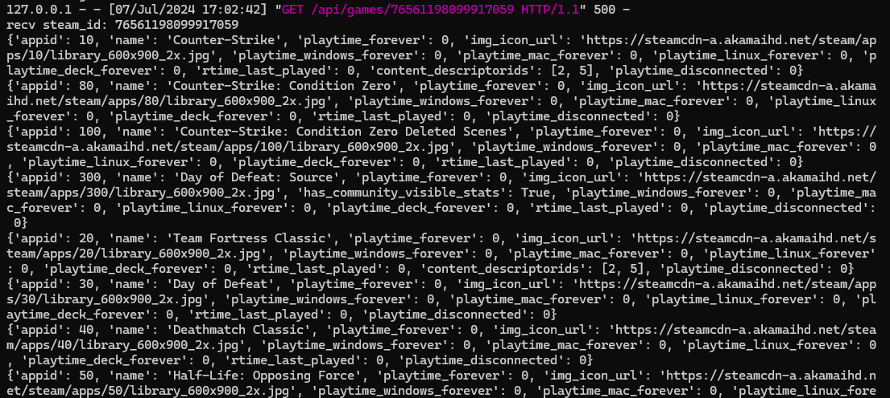
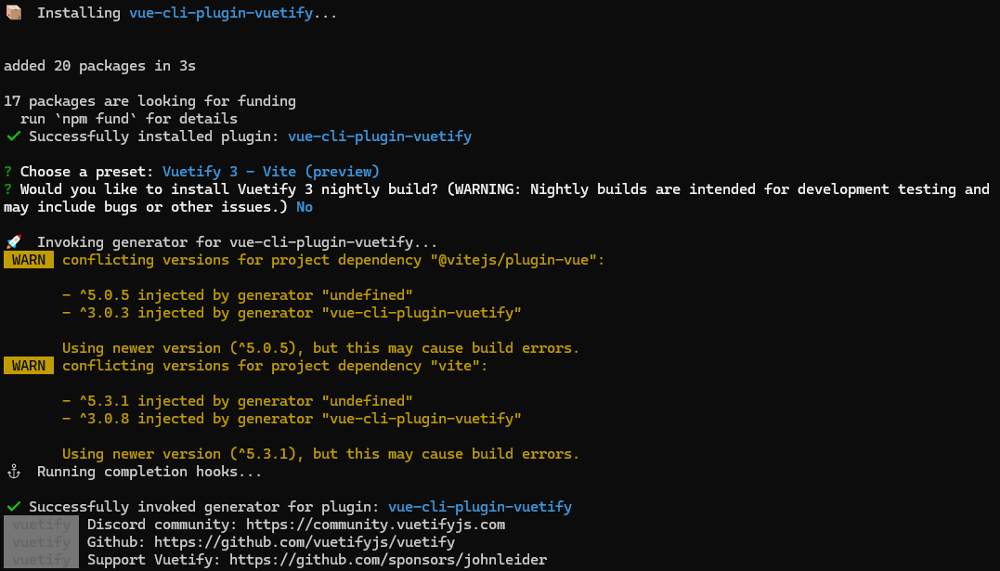
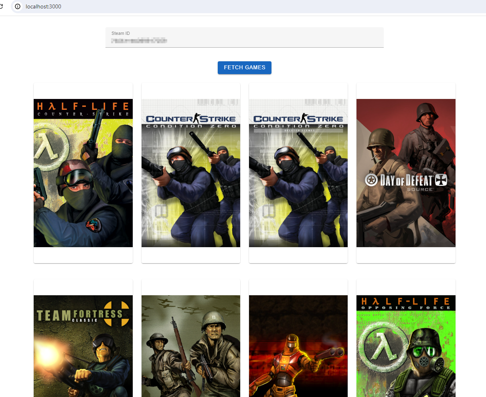

## Flask+Vue3 展示Steam拥有的游戏

steam夏促来了，今年打折的比较给力，但是自己在很多平台都有购买游戏（游戏我都买了，还要玩吗），需要把各个平台游戏汇总一下，先从steam开始，它的web api最完善。以下内容主要是**ChatGPT**的帮助下完成，效率的确很高，解释的很详细。

### Flask后端

使用Flask提供后端http服务，requests请求steam的web API

#### 安装环境

```shell
> mkdir GameStore
> python -m venv venv
> venv\Scripts\activate
> pip install Flask requests
```

#### 后端服务程序

查看并测试steam的API可以用这个网站`https://steamapi.xpaw.me/#IPlayerService/GetOwnedGames`

steam的web API key 在登录steam账号后，这个网址`https://steamcommunity.com/dev/apikey`可以看到

在GameStore目录中新建一个`app.py`文件，作为flask的主程序，目前只有最简单处理一个查询列表的请求，以后有了本地数据库，就从本地获取数据。

为了显示游戏的封面，把游戏的icon的信息替换为了steam游戏的图片，只需要appid信息，并把游戏的信息返回给客户端。

```python
from flask import Flask, jsonify, request
import requests

app = Flask(__name__)

#https://steamcommunity.com/dev/apikey
STEAM_API_KEY = 'xxxxxx'

@app.route('/api/games/<steam_id>', methods=['GET'])
def get_games(steam_id):
    print("recv steam_id:", steam_id)
    url = f'https://api.steampowered.com/IPlayerService/GetOwnedGames/v1/?key={STEAM_API_KEY}&steamid={steam_id}&format=json&include_appinfo=true'    
    response = requests.get(url)
    data = response.json()
    for game in data['response']['games']:
        appid = game['appid']   
        game['img_icon_url'] = f"https://steamcdn-a.akamaihd.net/steam/apps/{appid}/library_600x900_2x.jpg"
        
    return jsonify(data)

#76561198099917059
if __name__ == '__main__':
    app.run(debug=True)
```

* Flask运行 在项目根目录GameStore下执行flask run

  下面是flask收到来自vue的请求后，向steam请求数据收到的应答




### Vue3前端

使用了vuetify自带的样式和组件可以快速创建一个效果还不错页面。ChatGPT提到UI框架可以选择`Vuetify`, `BootstrapVue`或`Ant Design Vue`。它给的例子用的是Vuetify，说它是一个material design的组件框架。

#### 安装运行环境

```powershell
npx @vue/cli create frontend
cd frontend
npm install axios
vue add vuetify
```

vue创建的工程都用默认选项就可以

其中Vuetify安装过程中会提示选择一个配置，我选择了`Vuetify 3 - Vite`，其他选项没试，看名字应该选择这个，毕竟是Vue3+Vite创建的工程。安装Vuetify插件会修改App.vue，main.js,vite.config.js这三个文件，所以如果自己对这些文件有修改要先备份一下再安装Vuetify插件。




#### Vue主程序

* App.vue

```js
<script>
import axios from 'axios';

export default {
  data() {
    return {
      steamId: '',
      games: null,
      loading:false,
      error: '',
    };
  },
  methods: {
    async fetchGames() {
      this.loading = true;
      this.error = '';
      try {
        const response = await axios.get(`/api/games/${this.steamId}`);
        this.games = response.data.response.games;
      }
      catch ( error ) {
        this.error = 'Error fetching games. Please try again later.';
      } 
      finally {
        this.loading = false;
      }
    },
  },
};

</script>

<template>
  <v-app>
    <v-container>
      <v-row justify="center">
        <v-col cols="12" md="8">
          <v-text-field v-model="steamId" label="Steam ID" outlined></v-text-field>
          <v-btn  @click="fetchGames" color="primary" class="mt-4">Fetch Games</v-btn>
        </v-col>
      </v-row>
      <v-row>
        <v-col v-if="error" cols="12">
          <v-alert  type="error" dismissible>{{ error }}</v-alert>
        </v-col>
        <v-col v-if="loading" cols="12" class="text-center">
          <v-progress-circular indeterminate color="primary"></v-progress-circular>
        </v-col>
        <v-col v-for="game in games" :key="game.appid" cols="12" sm="6" md="4" lg="3">
          <v-card class="game-cover">
            <v-img :src="game.img_icon_url" alt="Game Cover" aspect-ratio="0.5"></v-img>
            <v-card-title class="game-title">{{ game.name }}</v-card-title>
            <v-card-subtitle class="game-details">Playtime:{{ game.playtime_forever }} hours</v-card-subtitle>
          </v-card>
        </v-col>
      </v-row>
    </v-container>
  </v-app>  
</template>

<style >
#app {
  font-family: Avenir, Helvetica, Arial, sans-serif;
  text-align: center;
  color: #2c3e50;
  margin-top: 60px;
}

.game-card {
  margin-bottom: 20px;
  border-radius: 8px;
  overflow: hidden;
  box-shadow: 0 4px 8px rgba(0,0,0,.14);
  transition: transform 0.2s;
}

.game-cover {
  height: 500px;
  object-fit: cover;
}

.game-title {
  font-size: 18px;
  font-weight: bold;
}
.game-details {
  font-size: 14px;
  color:gray;
}

.v-card {
  margin-bottom: 20px;
}
</style>

```

#### Vue配置

1. 配置plugins使用`vuetify`
2. 配置proxy，解决本地CORS请求处理

```js
import { fileURLToPath, URL } from 'node:url'

import { defineConfig } from 'vite'
import vue from '@vitejs/plugin-vue'

// https://github.com/vuetifyjs/vuetify-loader/tree/next/packages/vite-plugin
import vuetify from 'vite-plugin-vuetify'

// https://vitejs.dev/config/
export default defineConfig({
  plugins: [
    vue(),
    vuetify({
      autoImport: true,
    }),
  ],
  resolve: {
    alias: {
      '@': fileURLToPath(new URL('./src', import.meta.url))
    }
  },
  server: {
    port: 3000,
    open: false, 
    proxy: { // 通过代理实现跨域
      '/api': {
        target: 'http://localhost:5000/api', // flask后端服务地址
        changeOrigin: true, //开启代理
        rewrite: (path) => path.replace(/^\/api/, '')
      }
    }
  },
})
```

### 最终效果

输入steam Id后，就可以在下方列出所拥有游戏的列表




