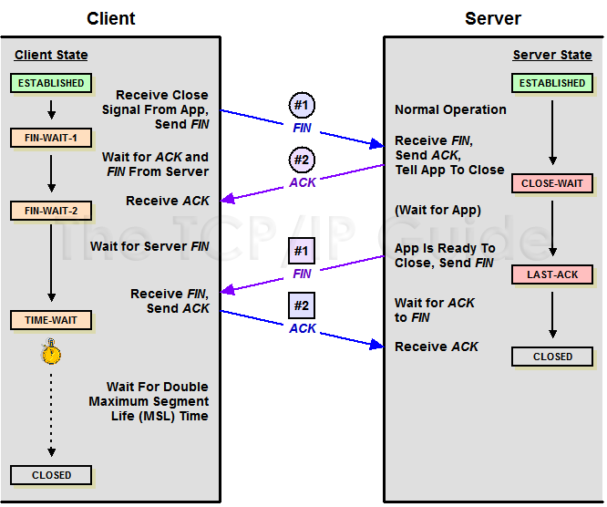

### Wireshark基本使用

一个包称为帧更准确

主界面分为4个区域：Display Filter, Packet List, Packet Detail, Packet bytes


#### 减小包的大小

为了减小抓包的数据大小，可以对抓包进行设置

1. 只抓包头。一般能抓到包的大小为1514字节，启用了Jumbo Frame之后可达9000字节以上。大多数情况只需要IP或TCP的头就足够了，具体应用数据都是加密的，一般不需要。`Capture-->Options `中设置`Limit each packet to `为80字节，这样TCP、网络层、数据链路层的信息都有了。如果还要看应用层的信息，可以适当调大到200字节

   新版本的wireshark中可以在`Capture-->Input`中的对应网络接口上设置Snaplen(B)的大小

   使用Tcpdump抓eth0上的每个包的前80个字节，并把结果保存到tcpdump.cap文件中`tcpdump -i eth0 -s 80 -w /tmp/tcpdump.cap` 

2. 只抓必要的包。让wireshark在**抓包时过滤**掉不需要的包。在`Capture-->Options-->Input`的Capture Filter中输入过滤条件。例如只查看ip为192.168.43.101的包可以输入`host 192.168.43.1`

   `tcpdump -i eth0 host 192.168.43.1 -w /tmp/tcpdump.cap`

   需要注意如果自己关注的包可能被过滤掉，例如NAT设备把关注的ip地址改掉了

#### 显示过滤 Display Filter

显示过滤可以在主界面上直接输入过滤条件

1. 协议过滤 

   已经定义好的协议直接输入协议名称即可。对与nfs挂载失败可以使用`portmap || mount`进行过滤

2. 地址过滤

   `ip.addr == 192.168.1.104 && tcp.port == 443`

   选择一个包后，可以右键选择follow，再选择一个这个包的协议，可以自动过滤出相关的包。

3. 使用系统右键功能 

   选择一个关注的数据包后，可以右键后，选择`Prepare as filter`,系统会自动提示当前提取的过滤条件，选择select之后，就会填入过滤条件输入框中。`Apply as filter`则是直接应用这个过滤

   右键列表中还有其他的filter可以使用

4. 对过滤后的包保存

   `File -> Export Specified Packets`，在对话框中可以选择勾选当前显示的包

#### 技巧

1. 标记数据包，在每个关注的操作之前发一个指定数据长度的ping命令，这样知道这个操作的数据包的范围，只需要找到这些ping的特殊的ip地址和对应的数据段的大小，就把所有的数据包分割开了

   ```shell
   ping 192.168.43.1 -n 1 -l 1
   操作1执行
   ping 192.168.43.1 -n 1 -l 2
   操作2执行
   ping 192.168.43.1 -n 1 -l 3
   ```

   

1. 设置时间格式

   可以通过`View-->Time display format->Date time of Day`把时间显示为当前系统的时间，而不出相对的时间

   如果分析其他时区的包文件，需要把本机的时区改为和当地的时区一致，这样不用再去进行时区换算 

1. 设置某种类型包的颜色

   可以通过`View-->Coloring Rules`设置每一种包的颜色，方便一下找到，例如默认的icmp的颜色为粉色

1. 自动分析

   `Analyze->Expert Information`可以看连接建立、重传、reset的统计信息，分析网络性能和连接问题时有用

   `Statistics->Service Response Time`可以查看某种协议的响应时间，检测服务器性能时有用

   `Statistics->TCP Stream Graphs`可以查看TCP数据传输统计，在`Time Sequence`中可以查看哪段时间sequence没有变化(水平直线)，说明没有数据传输

1. 查找

    `Ctrl+F`后可以在搜索条件中选项查找的范围，数据类型，关键字。例如要查找baidu相关的，数据类型选择string，输入baidu查找

1. 其他

### 网络基础

应用层：应用协议

传输层：TCP

网络层：IP

数据链路层：MAC

MTU：最大传输单元，大多数的网络MTU是1500字节，除非启用了巨帧(Jumbo Frame)达到9000字节。因此TCP不能一次把5000字节的数据之间给网络层传输，否则因为切分导致只能发送1500字节，会认为发送失败要求重传。

TCP建立连接进行三次握手时，双方会把自己的MSS(Max Segment Size)告诉对方，MSS加上TCP头和IP头的长度，就得到MTU的值。

TCP和IP头的长度都是20字节，客户端给服务端发送的MSS为1460，服务端应答的MSS为1400，因此通信的最小MTU为1400+20+20为1440


实际数据传输中网络层的数据大小为1440字节


### TCP

TCP提供可靠有序的数据传输，因此每个数据都有序号，这样接收端可以对数据排序。


TCP中连接的双方各自维护自己的Seq和Ack编号，数据包中的Len的值不包括Tcp包头的长度

seq的规则：对于一个连接，`seq(n) = seq(n-1)+Len(n-1)`，即上次的seq+上次的Len。例如102发出的17号，seq为102发出的上一个包16号的seq 1 加上 Len 224 所以为225，而102发出的下一个20号包的seq为 17号的seq 225 + Len 1448 = 1673。这样可以知道102一共发送了多少数据，只需要看最后一次的seq+len

ack规则：收到对端的seq+Len。这样可以告诉对端自己一共收到了多少数据。例如18号包应答为16号的seq+16号的Len，即225，19号包应答为17号的seq+17号的Len，即1673，当收到19号包的时候已经**累积**收了1673字节的数据

* 对收到的数据包按照seq进行排序，并比较相邻的seq和len就知道少了哪些包

例如接收端抓包获取的seq 和len 分别为 

| 包号 | 1    | 2    | 3    |
| ---- | ---- | ---- | ---- |
| seq  | 101  | 301  | 401  |
| len  | 100  | 100  | 100  |

对于第二个包的seq为301，而它的上一个包的seq+len为101+100=201，说明201这个包没有收到，需要回复ack:201通知对端把seq为201的包再发送一次

#### TCP的标志

SYN：发起连接请求，由于是双向连接，需要双方都发一次SYN

FIN：请求终止连接，也需要双方都发一次FIN

RST：重置一个连接，或拒绝一个无效请求，一般有这个标志都是有问题

ACK：确认是否有效

PSH： 接收端应用程序需要从TCP缓冲区把数据读走 


### DNS

* 使用nslookup默认的UDP查询域名


对应抓包为


网络环境为两级路由器，主路由器地址为192.168.0.x，次级路由器的ip地址为192.168.1.x，本机ip为192.168.1.102，连接在次级路由器上

由于没有指定服务器的地址，所以会到主路由器上查询，可以看到DNS的传输层为UDP协议

* 使用TCP的DNS


指定`-vc`选项使用TCP协议，并通过`114.114.114.114`进行查询

对应抓包为


其中215-217是TCP握手过程，220-221对应于查询和应答，223/225为断开连接

#### TCP 三次握手


上面的抓包中，

1. 330号包客户端102发起连接**SYN**( Synchronize Sequence Numbers )，seq为0 (X)，客户端进入**SYN_SEND**状态

2. 331号包服务器1向客户端发**SYN**，并对客户端应答**ACK**，应答ack=1 (X+1),自己的序号seq为0 (Y)，服务端进入**SYN_RECV**状态

3. 332号包客户端102向服务端确认ACK，seq为1(X+1)，ack为1(Y+1)，客户端和服务端进入**ESTABLISHED**状态

实际的seq并不是从0开始的，只是wireshark为了方便查看包序号，默认设置了一次连接的相对序号功能。这个功能默认是打开的，可以在`Edit->Preference->Protocol->TCP `勾选`Relative Sequence Number`


##### 为什么要三次握手

1. 确认双方准备好，如果只有两次握手，服务端收到SYN之后，并给客户端发送SYN就认为连接建立了，但如果这次服务端发送的SYN失败了，它还是认为成功的，直接发送数据D给客户端，而客户端收到数据后，发现seq不匹配,认为连接没有建立，认为数据无效而丢掉数据D，服务端则会认为发送数据一直失败，不断重发数据D
2. 明确对端的seq号，才能有序传输

如果客户端发送了一次SYN服务端一直没有应答SYN，此时客户端又发了一次SYN给服务端，而现在服务给第二次应答后，客户端可以依据第二次的服务的应答给服务端应答，从而建立一次正确的连接。如果此时收到服务端应答的第一次SYN，客户端此时的X已经是第二次的X值了，所以判断是一个无效的SYN就可以拒绝服务端对第一次SYN的回复，从而避免错误的连接。

#### 四次挥手



 http://www.tcpipguide.com/free/t_TCPConnectionTermination-2.htm 

抓包的例子中，是服务端主动发起端口连接，与上图不同


1. 338号包服务端1发起终止连接**FIN**，seq为162+369=531 (X)，ack为对端的seq+len = 621服务端进入**FIN_WAIT1**状态

2. 339号包客户端102向服务端应答**ACK**，告诉对端收到了结束连接的请求，应答ack=532 (X+1),自己的序号seq为334号包的Seq+Len= 621(Y)，其实也等于服务端应答的ack的值，客户端进入**CLOSE WAIT**状态，之所以这里没有发**FIN**是因为此时102可能还有数据给1要发，要等数据发完之后，才能发**FIN**给1。而服务端收到**ACK**后进入**FIN_WAIT2**状态
3. 340号包客户端现在没有要发的数据了，此时给服务端1发送FIN和ACK，这里由于没有数据交互了seq和ack的值没有变化(如果中间102还有给1发过数据，那么这次的seq根据上一个包的seq按照seq的计算规则计算)，客户端进入**LAST ACK**状态
4. 341号包服务端1收到客户端102的**FIN**之后，说明数据发送完了，可以断开了进入**TIME WAIT**状态，并给对端应答ACK，seq=X+1 = 532, ack = 对端FIN的seq+1 = 621+1 = 622
5. 客户端102收到**ACK**后，最终进入**CLOSED**状态
6. 服务端1在等待2倍**MSL**( 一个片段在网络中最大的存活时间 )时间后，才进入**CLOSED**状态

##### 计算规则

* 对**FIN**的应答**ACK**的ack的值为对端的**FIN**请求的seq+1，即339和341的ack为发送FIN的338和340的seq+1

* 一次FIN占用1个seq号，因此发送了一次FIN之后，下一包的seq为X+1，即341的seq为338的seq+1

##### 为什么断开连接要四次

在断开连接的发起端发送FIN后，接收端可能还有数据要发送，因此接收端需要先把FIN应答一下，等自己的数据发送完，再给对端发送一个FIN，标识现在可以断开了。因此当一端发送断开连接请求后，没有接收完的数据还是会接收完才会真正断开

##### 为什么要等2MSL

最后一个ACK发出后，对端可能没有收到，从而可能还会发FIN过来，如果直接断开，就不会应答，导致对端一直重复发FIN过来。而2MSL是一个发送和应答的时间，如果等了这么久没有消息，说明对端收到了ACK，就可以断开了。

### TLS

 https://wiki.wireshark.org/TLS 

在页面的Example capture file章节有一个TLS的例子可以下载

  [SampleCaptures#SSL_with_decryption_keys](https://wiki.wireshark.org/SampleCaptures#SSL_with_decryption_keys) 下载 **[snakeoil2_070531.tgz](https://wiki.wireshark.org/SampleCaptures?action=AttachFile&do=get&target=snakeoil2_070531.tgz)** 这个文件

1. 使用wireshark打开其中的cap文件，可以看到443端口的通信

2. 第19个包的info显示为Application Data，在包详细信息中显示数据是加密数据

3. 选择要解密的包，右键`Protocol Preference->Open Transport Layer Security Preferences  `打开RSA key list，编辑加入新的一条解码信息 ip 127.0.0.1, port 443, protocol http, key file选择下载的key文件

   也可以在`Edit->Prefernces->Protocol->TLS`中编辑

   

4. 此时19号包显示为HTTP协议，里面的原始数据可以看到


### 参考资料

* Wireshark网络分析就是这么简单


